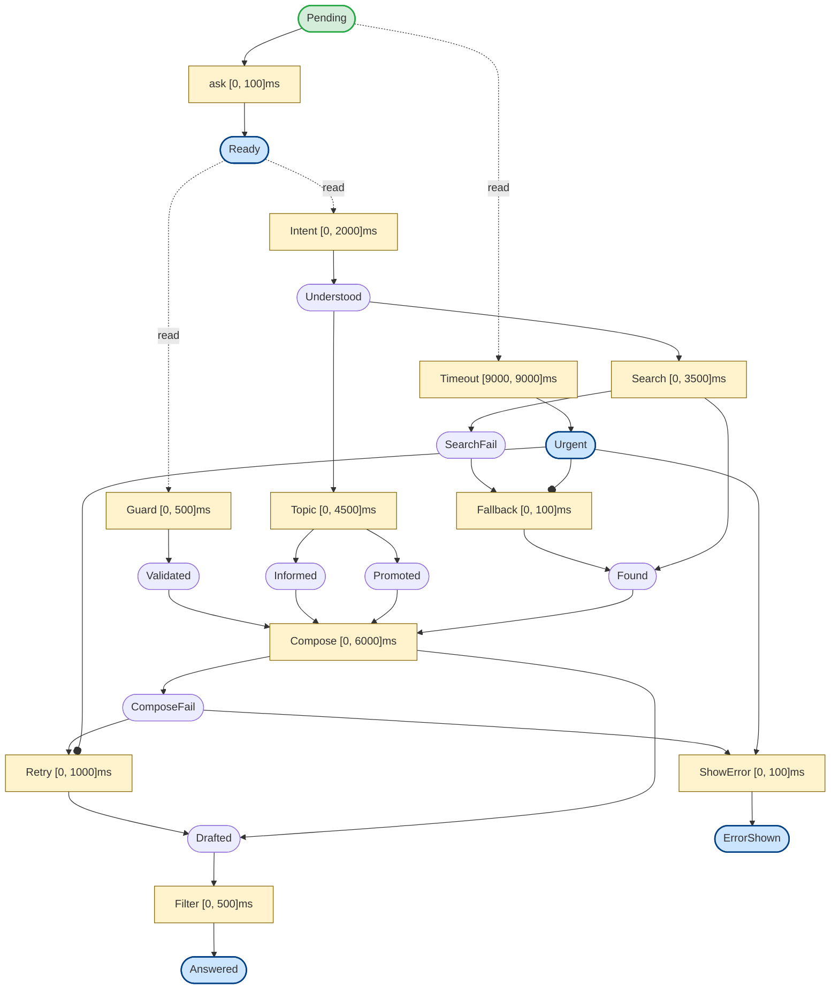

# libpetri

**Executable Coloured Time Petri Nets with formal verification** — model concurrent workflows with typed data, real-time constraints, and mathematically proven safety properties.

| Implementation | Language | Runtime | Status |
|---|---|---|---|
| [**libpetri-java**](java/) | Java 25 | Virtual threads | Production |
| [**libpetri-ts**](typescript/) | TypeScript 5.7 | Promises / event loop | Production |

> Rust implementation planned — see [`spec/`](spec/) for the language-agnostic contract all implementations follow.

[Website](https://libpetri.org) ·
[Specification](spec/00-index.md) ·
[Paper](https://libpetri.org/paper)

---

## Why libpetri

- **Executable formal models** — Petri nets that actually run: typed tokens flow through places, transitions fire with real-time deadlines, and async actions execute concurrently. Not a simulator — a production workflow engine.
- **Two implementations, one spec** — Java and TypeScript share [145 language-agnostic requirements](spec/00-index.md) covering every arc type, timing variant, and execution phase. Same behavior, verified independently.
- **Research-backed** — Based on the paper *"Apply Time Petri Nets with Colored Tokens to Model and Verify Agentic Systems"*. The Extended TPN example below comes directly from the paper's agentic customer-support workflow.

---

## Core Capabilities

| Capability | Details |
|---|---|
| **Arc types** | Input, Output, Inhibitor, Read (non-consuming), Reset (clear all) |
| **Input cardinality** | `one`, `exactly(n)`, `all` (drain), `atLeast(n)` — with optional guard predicates |
| **Output routing** | `place` (single), `and` (fork), `xor` (choice), `timeout`, `forwardInput` |
| **Timing** | Immediate, Deadline, Delayed, Window, Exact — with urgent deadline enforcement |
| **Executor** | Bitmap-based O(W) enablement, dirty-set optimization, priority + FIFO scheduling |
| **Concurrency** | Single-threaded orchestrator, concurrent async actions (virtual threads / promises) |
| **Environment places** | External event injection for long-running, event-driven workflows |
| **Events** | 13 event types, pluggable stores (in-memory, noop, logging, debug) |
| **Formal verification** | SMT/IC3 via Z3 — deadlock freedom, mutual exclusion, place bounds, unreachability |
| **Structural analysis** | P-invariants (Farkas), siphon/trap pre-checks, XOR branch analysis |
| **State class graph** | Berthomieu-Diaz algorithm for timed reachability (Java) |
| **Export** | DOT/Graphviz (primary), Mermaid (deprecated) |

---

## Quick Start

### Java

```java
import org.libpetri.core.*;
import org.libpetri.runtime.NetExecutor;
import java.time.Duration;
import java.util.*;
import java.util.concurrent.CompletableFuture;

var request  = Place.of("Request", String.class);
var response = Place.of("Response", String.class);

var process = Transition.builder("Process")
    .inputs(In.one(request))
    .outputs(Out.place(response))
    .timing(Timing.deadline(Duration.ofSeconds(5)))
    .action(ctx -> {
        String req = ctx.input(request);
        ctx.output(response, "Processed: " + req);
        return CompletableFuture.completedFuture(null);
    })
    .build();

var net = PetriNet.builder("Example")
    .transitions(process)
    .build();

try (var executor = NetExecutor.create(net, Map.of(
        request, List.of(Token.of("hello"))))) {
    Marking result = executor.run();
    System.out.println(result.peekFirst(response).value());
    // → "Processed: hello"
}
```

```bash
cd java && ./mvnw verify
```

### TypeScript

```typescript
import {
  place, tokenOf, one, outPlace, deadline,
  Transition, PetriNet, BitmapNetExecutor
} from 'libpetri';

const request  = place<string>('Request');
const response = place<string>('Response');

const process = Transition.builder('Process')
  .inputs(one(request))
  .outputs(outPlace(response))
  .timing(deadline(5000))
  .action(async (ctx) => {
    const req = ctx.input(request);
    ctx.output(response, `Processed: ${req}`);
  })
  .build();

const net = PetriNet.builder('Example')
  .transitions(process)
  .build();

const executor = new BitmapNetExecutor(net, new Map([
  [request, [tokenOf('hello')]],
]));
const result = await executor.run();
console.log(result.peekFirst(response)?.value);
// → "Processed: hello"
```

```bash
cd typescript && npm install && npm test
```

---

## Real-World Example: Agentic Customer Support

This is the **Extended TPN** from the research paper — an agentic customer-support workflow with parallel branches, fallback paths, retry logic, and a global timeout.



**Patterns at work:**

| Pattern | Where | How |
|---|---|---|
| **Parallel split** | `ask` → Guard + Intent | Read arcs let both transitions consume Ready without conflict |
| **AND-join** | Compose | Waits for all four inputs: Validated, Informed, Promoted, Found |
| **XOR routing** | Search, Compose | Produces to exactly one of two output places (success / failure) |
| **Inhibitor arc** | Fallback, Retry | Blocked when Urgent has a token — no retries after timeout |
| **Exact timing** | Timeout | Fires at precisely 9000ms, depositing the Urgent token |
| **Graceful degradation** | ShowError | Consumes ComposeFail + Urgent → shows error instead of retrying |

<details>
<summary><strong>Java code (from PaperNetworks.java)</strong></summary>

```java
var pending      = Place.of("Pending", String.class);
var ready        = Place.of("Ready", String.class);
var validated    = Place.of("Validated", String.class);
var understood   = Place.of("Understood", String.class);
var informed     = Place.of("Informed", String.class);
var promoted     = Place.of("Promoted", String.class);
var found        = Place.of("Found", String.class);
var drafted      = Place.of("Drafted", String.class);
var answered     = Place.of("Answered", String.class);
var urgent       = Place.of("Urgent", String.class);
var searchFail   = Place.of("SearchFail", String.class);
var composeFail  = Place.of("ComposeFail", String.class);
var errorShown   = Place.of("ErrorShown", String.class);

var ask = Transition.builder("ask")
    .inputs(In.one(pending))
    .outputs(Out.place(ready))
    .timing(Timing.deadline(Duration.ofMillis(100)))
    .build();

var guard = Transition.builder("Guard")
    .read(ready)
    .outputs(Out.place(validated))
    .timing(Timing.deadline(Duration.ofMillis(500)))
    .build();

var intent = Transition.builder("Intent")
    .read(ready)
    .outputs(Out.place(understood))
    .timing(Timing.deadline(Duration.ofMillis(2000)))
    .build();

var topic = Transition.builder("Topic")
    .inputs(In.one(understood))
    .outputs(Out.and(informed, promoted))       // AND-fork
    .timing(Timing.deadline(Duration.ofMillis(4500)))
    .build();

var search = Transition.builder("Search")
    .inputs(In.one(understood))
    .outputs(Out.xor(found, searchFail))        // XOR-choice
    .timing(Timing.deadline(Duration.ofMillis(3500)))
    .build();

var fallback = Transition.builder("Fallback")
    .inputs(In.one(searchFail))
    .outputs(Out.place(found))
    .inhibitor(urgent)                          // blocked after timeout
    .timing(Timing.deadline(Duration.ofMillis(100)))
    .build();

var compose = Transition.builder("Compose")
    .inputs(In.one(validated), In.one(informed), In.one(promoted), In.one(found))
    .outputs(Out.xor(drafted, composeFail))
    .timing(Timing.deadline(Duration.ofMillis(6000)))
    .build();

var retry = Transition.builder("Retry")
    .inputs(In.one(composeFail))
    .outputs(Out.place(drafted))
    .inhibitor(urgent)
    .timing(Timing.deadline(Duration.ofMillis(1000)))
    .build();

var showError = Transition.builder("ShowError")
    .inputs(In.one(composeFail), In.one(urgent))
    .outputs(Out.place(errorShown))
    .timing(Timing.deadline(Duration.ofMillis(100)))
    .build();

var filter = Transition.builder("Filter")
    .inputs(In.one(drafted))
    .outputs(Out.place(answered))
    .timing(Timing.deadline(Duration.ofMillis(500)))
    .build();

var timeout = Transition.builder("Timeout")
    .read(pending)
    .outputs(Out.place(urgent))
    .timing(Timing.exact(Duration.ofMillis(9000))) // fires at exactly 9s
    .build();

return PetriNet.builder("ExtendedTPN-Paper")
    .transitions(ask, guard, intent, topic, search, fallback,
                 compose, retry, showError, filter, timeout)
    .build();
```

</details>

---

## API at a Glance

<details>
<summary><strong>Arc types</strong></summary>

| Arc | Semantics | Java | TypeScript |
|---|---|---|---|
| **Input** | Consume token(s) from place | `In.one(p)` | `one(p)` |
| **Output** | Deposit token into place | `Out.place(p)` | `outPlace(p)` |
| **Inhibitor** | Block when place has tokens | `.inhibitor(p)` | `.inhibitor(p)` |
| **Read** | Test without consuming | `.read(p)` | `.read(p)` |
| **Reset** | Clear all tokens from place | `.reset(p)` | `.reset(p)` |

</details>

<details>
<summary><strong>Input cardinality</strong></summary>

| Cardinality | Semantics | Java | TypeScript |
|---|---|---|---|
| **One** | Consume exactly 1 token | `In.one(p)` | `one(p)` |
| **Exactly(n)** | Consume exactly n tokens | `In.exactly(n, p)` | `exactly(n, p)` |
| **All** | Drain all tokens (at least 1) | `In.all(p)` | `all(p)` |
| **AtLeast(n)** | Consume all, require >= n | `In.atLeast(n, p)` | `atLeast(n, p)` |

All input specs support optional guard predicates to filter tokens.

</details>

<details>
<summary><strong>Output routing</strong></summary>

| Routing | Semantics | Java | TypeScript |
|---|---|---|---|
| **Place** | Deposit to a single place | `Out.place(p)` | `outPlace(p)` |
| **And** | Fork to all children | `Out.and(p1, p2)` | `and(outPlace(p1), outPlace(p2))` |
| **Xor** | Route to exactly one child | `Out.xor(p1, p2)` | `xor(outPlace(p1), outPlace(p2))` |
| **Timeout** | Fallback output after delay | `Out.timeout(Duration, p)` | `timeout(ms, outPlace(p))` |
| **ForwardInput** | Pass consumed token through | `Out.forwardInput(from, to)` | `forwardInput(from, to)` |

</details>

<details>
<summary><strong>Timing variants</strong></summary>

| Variant | Interval | Behavior | Java | TypeScript |
|---|---|---|---|---|
| **Immediate** | [0, inf) | Fire as soon as enabled, no deadline | `Timing.immediate()` | `immediate()` |
| **Deadline** | [0, d] | Fire anytime before deadline | `Timing.deadline(Duration)` | `deadline(ms)` |
| **Delayed** | [d, +inf) | Wait at least d, then fire | `Timing.delayed(Duration)` | `delayed(ms)` |
| **Window** | [a, b] | Fire between a and b | `Timing.window(Duration, Duration)` | `window(a, b)` |
| **Exact** | [t, t] | Fire at precisely t | `Timing.exact(Duration)` | `exact(ms)` |

Transitions are force-disabled past their deadline (urgent semantics).

</details>

---

## Formal Verification

Both implementations include SMT-based verification via Z3 using the IC3/PDR algorithm, with structural pre-checks for fast results.

| Property | Description |
|---|---|
| **Deadlock freedom** | No reachable state where all transitions are disabled |
| **Mutual exclusion** | Two places never hold tokens simultaneously |
| **Place bound** | A place never exceeds *k* tokens |
| **Unreachability** | A set of places never all hold tokens simultaneously |

**Pipeline:** structural siphon/trap analysis → P-invariant computation (Farkas) → XOR branch analysis → SMT encoding → IC3/PDR solving

### Java

```java
import org.libpetri.smt.*;

var result = SmtVerifier.forNet(net)
    .initialMarking(m -> m.tokens(pending, 1))
    .property(SmtProperty.deadlockFree())
    .timeout(Duration.ofSeconds(60))
    .verify();

System.out.println(result.verdict());  // Proven, Violated, or Unknown
```

### TypeScript

```typescript
import { SmtVerifier, deadlockFree } from 'libpetri/verification';

const result = await SmtVerifier.forNet(net)
  .initialMarking(m => m.tokens(pending, 1))
  .property(deadlockFree())
  .timeout(30_000)
  .verify();

console.log(result.verdict.type);  // 'proven' | 'violated' | 'unknown'
```

---

## Architecture

### Execution Loop

The executor runs a single-threaded orchestration loop with five phases per cycle:

1. **Process completions** — collect outputs from finished async actions
2. **Process events** — inject tokens from environment places
3. **Update enablement** — re-evaluate only dirty transitions via bitmap masks
4. **Fire transitions** — select by priority, then FIFO by enablement time
5. **Await work** — sleep until an action completes, a timer fires, or an event arrives

### Module Structure

| Module | Java | TypeScript |
|---|---|---|
| Core model | `org.libpetri.core` | `libpetri` (core exports) |
| Runtime | `org.libpetri.runtime` | `libpetri` (runtime exports) |
| Events | `org.libpetri.event` | `libpetri` (event exports) |
| Verification | `org.libpetri.smt` | `libpetri/verification` |
| Export | `org.libpetri.export` | `libpetri/export` |

Both share the same architecture: immutable net definitions, builder-pattern construction, bitmap-based enablement with dirty-set optimization, and a single-threaded orchestrator dispatching async actions to a separate task pool.

---

## Specification

The [`spec/`](spec/) directory defines the complete engine contract — **145 requirements** across 10 files.

| File | Prefix | Scope | Count |
|---|---|---|---|
| [01-core-model.md](spec/01-core-model.md) | CORE | Places, tokens, transitions, arcs, net construction | 33 |
| [02-input-output-specs.md](spec/02-input-output-specs.md) | IO | Input cardinality, output routing, validation | 15 |
| [03-timing.md](spec/03-timing.md) | TIME | Firing intervals, clock semantics, deadlines | 11 |
| [04-execution-model.md](spec/04-execution-model.md) | EXEC | Orchestrator loop, scheduling, quiescence | 15 |
| [05-concurrency.md](spec/05-concurrency.md) | CONC | Bitmap executor, async actions, wake-up | 11 |
| [06-environment-places.md](spec/06-environment-places.md) | ENV | External event injection, long-running mode | 9 |
| [07-verification.md](spec/07-verification.md) | VER | SMT/IC3, state class graph, structural analysis | 10 |
| [08-events-observability.md](spec/08-events-observability.md) | EVT | Event types, event store, log capture | 20 |
| [09-export.md](spec/09-export.md) | EXP | Graph export, formal interchange | 10 |
| [10-performance.md](spec/10-performance.md) | PERF | Scaling, benchmarks, memory efficiency | 11 |
| **Total** | | | **145** |

**Priority:** 110 MUST · 29 SHOULD · 6 MAY

See [spec/00-index.md](spec/00-index.md) for the full cross-reference index and coverage matrix.

---

## Build & Test

### Java

```bash
cd java
./mvnw verify                                          # Full build + tests
./mvnw test                                            # Run all tests
./mvnw test -Dtest="org.libpetri.core.PetriNetTest"    # Single test class
./mvnw test -Dtest="*BitmapNetExecutor*"               # Wildcard match
./mvnw test-compile exec:exec -Pjmh                    # Run JMH benchmarks
./mvnw javadoc:javadoc                                 # Generate Javadocs
```

Java 25 with preview features enabled. Uses Maven 3.9.x via wrapper.

### TypeScript

```bash
cd typescript
npm install              # Install dependencies
npm run build            # Build with tsup
npm run check            # Type-check (tsc --noEmit)
npm test                 # Run vitest
npm run test:watch       # Watch mode
npm test -- core         # Run tests matching "core"
```

TypeScript 5.7, ESM-only, strict mode. Built with tsup, tested with vitest.

---

## License

[Apache License 2.0](LICENSE)

---

[libpetri.org](https://libpetri.org) · [Specification](spec/00-index.md)
