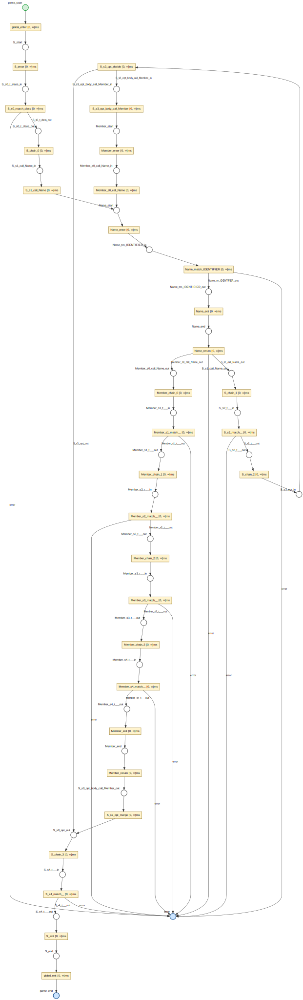

# libpetri

**A high-performance Coloured Time Petri Net runtime** — a Turing-complete execution engine where typed tokens flow through places, transitions fire under real-time constraints, and async actions execute concurrently. Formal verification proves safety properties via SMT/IC3.

| Implementation | Language | Runtime | Status |
|---|---|---|---|
| [**libpetri-java**](java/) | Java 25 | Virtual threads | Production |
| [**libpetri-ts**](typescript/) | TypeScript 5.7 | Promises / event loop | Production |
| [**libpetri-rust**](rust/) | Rust 2024 | Tokio async tasks | Prerelease |

> See [`spec/`](spec/) for the language-agnostic contract all implementations follow.

[Specification](spec/00-index.md)

---

## Why libpetri

- **Executable formal models** — Not a simulator. A production runtime where Petri nets are the program: typed tokens are data, transitions are instructions, timing constraints are deadlines, and the executor is a scheduler. Suitable for agent orchestration, workflow automation, protocol modeling, game logic, UI state machines, and anything with concurrency.
- **Three implementations, one spec** — Java, TypeScript, and Rust share [145 language-agnostic requirements](spec/00-index.md) covering every arc type, timing variant, and execution phase. Same behavior, verified independently.
- **Turing-complete** — Coloured Petri Nets with inhibitor arcs can simulate any Turing machine. libpetri's nets can model arbitrary computation, not just finite-state workflows.

---

## Core Capabilities

| Capability | Details |
|---|---|
| **Arc types** | Input, Output, Inhibitor, Read (non-consuming), Reset (clear all) |
| **Input cardinality** | `one`, `exactly(n)`, `all` (drain), `atLeast(n)` — with optional guard predicates |
| **Output routing** | `place` (single), `and` (fork), `xor` (choice), `timeout`, `forwardInput` |
| **Timing** | Immediate, Deadline, Delayed, Window, Exact — with urgent deadline enforcement |
| **Executor** | Bitmap-based O(W) enablement, dirty-set optimization, priority + FIFO scheduling. Precompiled flat-array executor with 2–4x speedup (Java, Rust). |
| **Concurrency** | Single-threaded orchestrator, concurrent async actions (virtual threads / promises / Tokio tasks) |
| **Environment places** | External event injection for long-running, event-driven workflows |
| **Events** | 13 event types, pluggable stores (in-memory, noop, logging, debug) |
| **Formal verification** | SMT/IC3 via Z3 — deadlock freedom, mutual exclusion, place bounds, unreachability |
| **Structural analysis** | P-invariants (Farkas), siphon/trap pre-checks, XOR branch analysis |
| **State class graph** | Berthomieu-Diaz algorithm for timed reachability (Java, TypeScript, Rust) |
| **Export** | DOT/Graphviz |

---

## Quick Start

### Java

```java
import org.libpetri.core.*;
import org.libpetri.runtime.BitmapNetExecutor;
import java.time.Duration;
import java.util.*;
import java.util.concurrent.*;

var request  = Place.of("Request", String.class);
var response = Place.of("Response", String.class);

var process = Transition.builder("Process")
    .inputs(In.one(request))
    .outputs(Out.place(response))
    .timing(Timing.deadline(Duration.ofSeconds(5)))
    .action(ctx -> {
        String req = ctx.input(request);
        ctx.output(response, "Processed: " + req);
        return CompletableFuture.completedFuture(null);
    })
    .build();

var net = PetriNet.builder("Example")
    .transitions(process)
    .build();

try (var executor = BitmapNetExecutor.builder(net, Map.of(
            request, List.of(Token.of("hello"))))
        .executor(Executors.newVirtualThreadPerTaskExecutor())
        .build()) {
    Marking result = executor.run();
    System.out.println(result.peekFirst(response).value());
    // → "Processed: hello"
}
```

```bash
cd java && ./mvnw verify
```

### TypeScript

```typescript
import {
  place, tokenOf, one, outPlace, deadline,
  Transition, PetriNet, BitmapNetExecutor
} from 'libpetri';

const request  = place<string>('Request');
const response = place<string>('Response');

const process = Transition.builder('Process')
  .inputs(one(request))
  .outputs(outPlace(response))
  .timing(deadline(5000))
  .action(async (ctx) => {
    const req = ctx.input(request);
    ctx.output(response, `Processed: ${req}`);
  })
  .build();

const net = PetriNet.builder('Example')
  .transitions(process)
  .build();

const executor = new BitmapNetExecutor(net, new Map([
  [request, [tokenOf('hello')]],
]));
const result = await executor.run();
console.log(result.peekFirst(response)?.value);
// → "Processed: hello"
```

```bash
cd typescript && npm install && npm test
```

### Rust

```rust
use libpetri::*;
use libpetri::runtime::environment::ExternalEvent;

let request  = Place::<String>::new("Request");
let response = Place::<String>::new("Response");

let process = Transition::builder("Process")
    .input(one(&request))
    .output(out_place(&response))
    .timing(deadline(5000))
    .action(async_action(|mut ctx| async move {
        let req: std::sync::Arc<String> = ctx.input("Request")?;
        ctx.output("Response", format!("Processed: {req}"))?;
        Ok(ctx)
    }))
    .build();

let net = PetriNet::builder("Example").transition(process).build();

let mut marking = Marking::new();
marking.add(&request, Token::at("hello".to_string(), 0));

let mut executor = BitmapNetExecutor::<NoopEventStore>::new(
    &net, marking, ExecutorOptions::default(),
);
let (_tx, rx) = tokio::sync::mpsc::unbounded_channel::<ExternalEvent>();
executor.run_async(rx).await;
// → "Processed: hello"
```

```bash
cd rust && cargo test
```

---

## Showcase: Debug UI — A Petri Net That Debugs Petri Nets

The libpetri debug UI is itself a Coloured Time Petri Net — 53 transitions, 51 places (including 30 environment places). The entire UI lifecycle (WebSocket connection, session management, message dispatch, diagram rendering, replay playback, live debugging, breakpoints, search, session archives) is modeled and executed as a CTPN.

<p align="center">
  
</p>

**Subnet breakdown:**

| Subnet | Transitions | Pattern |
|---|---|---|
| **Connection** | 5 | State machine: idle → connecting → connected / waitReconnect, with 2s delayed reconnect |
| **Session** | 3 | Subscribe, unsubscribe-and-switch, receive session data with DOT diagram |
| **Message Dispatch** | 12 | Guard predicates on input arcs filter WebSocket messages by type |
| **Diagram** | 1 | Async DOT→SVG rendering via Graphviz WASM |
| **UI Fan-Out** | 4 | Single `stateDirty` token AND-forks to 3 parallel updates (highlighting, event-log, marking) |
| **Replay Playback** | 8 | Play/pause/auto-step/step-fwd/step-back/seek/restart/run-to-end with checkpoint-based random access |
| **Live Mode** | 4 | Pause/resume/step-forward/step-back via WebSocket commands |
| **Inspector** | 1 | Place click → token inspection |
| **Modal** | 2 | Open/close with mutual exclusion (modalClosed ↔ modalOpen) |
| **Breakpoints** | 2 | Set/clear with list state as a resource place |
| **Filter/Search** | 4 | Apply filter, search, search-next, search-prev |
| **Speed** | 1 | Playback speed adjustment |
| **Archives** | 6 | Browse/list/import/upload archives, net-name filtering |

**Patterns at work:**

- **Environment places** — WebSocket open/close/message events, DOM user interactions (clicks, slider, form submissions), and `requestAnimationFrame` ticks are injected as external events
- **Dirty-flag fan-out** — A single `stateDirty` token AND-forks into three independent UI update channels, each gated by a `rafTick` environment place for frame-rate throttling
- **Resource places** — `uiState`, `breakpoints`, `filterState`, `searchState` are consumed and re-produced by their transitions, ensuring mutual exclusion on state updates
- **Timing** — `delayed(2000)` for reconnect backoff; all other transitions are `immediate()`
- **Guard predicates** — Message dispatch transitions use typed guards (`msg.type === 'event'`, etc.) on the `wsMessage` environment place to route messages to the correct handler

<details>
<summary><strong>TypeScript code (from debug-ui/src/net/definition.ts)</strong></summary>

```typescript
// Connection transitions
const t_connect = Transition.builder('t_connect')
  .inputs(one(idle))
  .outputs(outPlace(connecting))
  .timing(immediate())
  .action(async (ctx) => { /* createWebSocket, setConnecting */ })
  .build();

const t_on_open = Transition.builder('t_on_open')
  .inputs(one(connecting), one(wsOpenSignal.place))
  .outputs(outPlace(connected))
  .timing(immediate())
  .action(async (ctx) => { /* setConnected, refreshSessions */ })
  .build();

const t_reconnect = Transition.builder('t_reconnect')
  .inputs(one(waitReconnect))
  .outputs(outPlace(idle))
  .timing(delayed(2000))  // 2s backoff
  .action(async (ctx) => { ctx.output(idle, undefined); })
  .build();

// Message dispatch with guard predicates
const t_on_event = Transition.builder('t_on_event')
  .inputs(one(uiState), one(wsMessage.place, (msg) => msg.type === 'event'))
  .outputs(and(outPlace(uiState), outPlace(stateDirty)))
  .timing(immediate())
  .action(async (ctx) => { /* applyEventToState, updateTimeline */ })
  .build();

// UI fan-out: stateDirty → 3 parallel updates
const t_fan_out_dirty = Transition.builder('t_fan_out_dirty')
  .inputs(one(stateDirty))
  .outputs(and(outPlace(highlightDirty), outPlace(logDirty), outPlace(markingDirty)))
  .timing(immediate())
  .build();

// Frame-rate gated UI updates
const t_update_highlighting = Transition.builder('t_update_highlighting')
  .inputs(one(highlightDirty), one(rafTick.place))
  .reads(svgReady, uiState)
  .timing(immediate())
  .action(async (ctx) => { /* updateDiagramHighlighting */ })
  .build();

// ... 53 transitions total
const net = PetriNet.builder('DebugUI')
  .transitions(t_connect, t_on_open, /* ... */)
  .build();
```

</details>

---

## Example: Java 25 Parser — Pushing Petri Nets to the Limit

The [`examples/java-parser/`](examples/java-parser/) module implements a **complete Java 25 parser as a Coloured Time Petri Net** — 167 grammar productions compiled into 2,335 places and 2,326 transitions. This is a stress test demonstrating that Petri net execution overhead is acceptable even under extreme workloads, not a competitor to javac's hand-tuned recursive descent parser.

**Grammar fragment** — 3 productions compiled to a 33-place, 31-transition net, showing the hierarchical structure of compiled grammar rules:

<p align="center">
  
</p>

**Full parser net** — all 167 productions, 2,335 places, 2,326 transitions:

<p align="center">
  
</p>

**How it works:**

- **Coloured tokens** — A single `ParseState` token carries position, call stack, and AST through the net. No global mutable state.
- **Grammar-to-net compilation** — Each grammar element (terminal, sequence, choice, repetition, optional, non-terminal call/return) maps to a specific net pattern. The compiler produces a `PetriNet` from an EBNF-like `Grammar` definition.
- **Structural sharing** — Non-terminal calls push a return-site ID onto the token's call stack; a shared return-dispatch transition routes the token back to the correct call site via XOR guards.
- **PrecompiledNetExecutor** — The flat-array executor with `skipOutputValidation` handles the 2,300+ transitions efficiently. Standard `BitmapNetExecutor` works too, but the precompiled path is faster at this scale.

**Self-parse results:** Parses all 85 libpetri core Java source files (17,395 lines) in ~500ms (~34,000 lines/sec). The overhead is measurable compared to javac, but the fact that a general-purpose Petri net runtime can parse a full programming language at all — and do so correctly across 85 real-world files — proves CTPN execution scales far beyond typical workflow orchestration.

---

## API at a Glance

<details>
<summary><strong>Arc types</strong></summary>

| Arc | Semantics | Java | TypeScript | Rust |
|---|---|---|---|---|
| **Input** | Consume token(s) from place | `In.one(p)` | `one(p)` | `one(&p)` |
| **Output** | Deposit token into place | `Out.place(p)` | `outPlace(p)` | `out_place(&p)` |
| **Inhibitor** | Block when place has tokens | `.inhibitor(p)` | `.inhibitor(p)` | `.inhibitor(inhibitor(&p))` |
| **Read** | Test without consuming | `.read(p)` | `.read(p)` | `.read(read(&p))` |
| **Reset** | Clear all tokens from place | `.reset(p)` | `.reset(p)` | `.reset(reset(&p))` |

</details>

<details>
<summary><strong>Input cardinality</strong></summary>

| Cardinality | Semantics | Java | TypeScript | Rust |
|---|---|---|---|---|
| **One** | Consume exactly 1 token | `In.one(p)` | `one(p)` | `one(&p)` |
| **Exactly(n)** | Consume exactly n tokens | `In.exactly(n, p)` | `exactly(n, p)` | `exactly(n, &p)` |
| **All** | Drain all tokens (at least 1) | `In.all(p)` | `all(p)` | `all(&p)` |
| **AtLeast(n)** | Consume all, require >= n | `In.atLeast(n, p)` | `atLeast(n, p)` | `at_least(n, &p)` |

All input specs support optional guard predicates to filter tokens.

</details>

<details>
<summary><strong>Output routing</strong></summary>

| Routing | Semantics | Java | TypeScript | Rust |
|---|---|---|---|---|
| **Place** | Deposit to a single place | `Out.place(p)` | `outPlace(p)` | `out_place(&p)` |
| **And** | Fork to all children | `Out.and(p1, p2)` | `and(outPlace(p1), outPlace(p2))` | `and(vec![out_place(&p1), out_place(&p2)])` |
| **Xor** | Route to exactly one child | `Out.xor(p1, p2)` | `xor(outPlace(p1), outPlace(p2))` | `xor(vec![out_place(&p1), out_place(&p2)])` |
| **Timeout** | Fallback output after delay | `Out.timeout(Duration, p)` | `timeout(ms, outPlace(p))` | `timeout(ms, out_place(&p))` |
| **ForwardInput** | Pass consumed token through | `Out.forwardInput(from, to)` | `forwardInput(from, to)` | `forward_input(&from, &to)` |

</details>

<details>
<summary><strong>Timing variants</strong></summary>

| Variant | Interval | Behavior | Java | TypeScript | Rust |
|---|---|---|---|---|---|
| **Immediate** | [0, inf) | Fire as soon as enabled, no deadline | `Timing.immediate()` | `immediate()` | `immediate()` |
| **Deadline** | [0, d] | Fire anytime before deadline | `Timing.deadline(Duration)` | `deadline(ms)` | `deadline(ms)` |
| **Delayed** | [d, +inf) | Wait at least d, then fire | `Timing.delayed(Duration)` | `delayed(ms)` | `delayed(ms)` |
| **Window** | [a, b] | Fire between a and b | `Timing.window(Duration, Duration)` | `window(a, b)` | `window(a, b)` |
| **Exact** | [t, t] | Fire at precisely t | `Timing.exact(Duration)` | `exact(ms)` | `exact(ms)` |

Transitions are force-disabled past their deadline (urgent semantics).

</details>

---

## Formal Verification

All three implementations include structural verification (P-invariants, siphon/trap analysis, state class graphs). Java and TypeScript additionally support SMT-based verification via Z3 using the IC3/PDR algorithm. Rust has Z3 SMT feature-gated but not yet wired.

| Property | Description |
|---|---|
| **Deadlock freedom** | No reachable state where all transitions are disabled |
| **Mutual exclusion** | Two places never hold tokens simultaneously |
| **Place bound** | A place never exceeds *k* tokens |
| **Unreachability** | A set of places never all hold tokens simultaneously |

**Pipeline:** structural siphon/trap analysis → P-invariant computation (Farkas) → XOR branch analysis → SMT encoding → IC3/PDR solving

### Java

Prove that a circular token-passing net is deadlock-free — proven structurally via Commoner's theorem without invoking the SMT solver:

```java
import org.libpetri.core.*;
import org.libpetri.smt.*;
import java.time.Duration;

var pA = Place.of("A", Void.class);
var pB = Place.of("B", Void.class);

var net = PetriNet.builder("TokenRing")
    .transitions(
        Transition.builder("AtoB").inputs(In.one(pA)).outputs(Out.place(pB)).build(),
        Transition.builder("BtoA").inputs(In.one(pB)).outputs(Out.place(pA)).build())
    .build();

var result = SmtVerifier.forNet(net)
    .initialMarking(m -> m.tokens(pA, 1))
    .property(SmtProperty.deadlockFree())
    .timeout(Duration.ofSeconds(30))
    .verify();

System.out.println(result.verdict());  // Proven[method=structural, ...]
```

### TypeScript

Prove that a circular token-passing net is deadlock-free — proven structurally via Commoner's theorem without invoking the SMT solver:

```typescript
import { SmtVerifier, deadlockFree } from 'libpetri/verification';

const pA = place('A');
const pB = place('B');
const net = PetriNet.builder('TokenRing')
  .transitions(
    Transition.builder('AtoB').inputs(one(pA)).outputs(outPlace(pB)).build(),
    Transition.builder('BtoA').inputs(one(pB)).outputs(outPlace(pA)).build(),
  )
  .build();

const result = await SmtVerifier.forNet(net)
  .initialMarking(m => m.tokens(pA, 1))
  .property(deadlockFree())
  .timeout(30_000)
  .verify();

console.log(result.verdict.type);   // 'proven'
console.log(result.verdict.method); // 'structural' (Commoner's theorem)
```

---

## Architecture

### Execution Loop

The executor runs a single-threaded orchestration loop with six phases per cycle:

1. **Process completions** — collect outputs from finished async actions
2. **Process events** — inject tokens from environment places
3. **Update enablement** — re-evaluate only dirty transitions via bitmap masks
4. **Enforce deadlines** — force-disable transitions past their deadline (urgent semantics)
5. **Fire transitions** — select by priority, then FIFO by enablement time
6. **Await work** — sleep until an action completes, a timer fires, or an event arrives

### Module Structure

| Module | Java | TypeScript | Rust |
|---|---|---|---|
| Core model | `org.libpetri.core` | `libpetri` (core exports) | `libpetri-core` |
| Runtime | `org.libpetri.runtime` | `libpetri` (runtime exports) | `libpetri-runtime` |
| Events | `org.libpetri.event` | `libpetri` (event exports) | `libpetri-event` |
| Verification | `org.libpetri.smt` | `libpetri/verification` | `libpetri-verification` |
| Export | `org.libpetri.export` | `libpetri/export` | `libpetri-export` |
| Analysis | `org.libpetri.analysis` | `libpetri/verification` (analysis exports) | `libpetri-verification` |
| Debug | `org.libpetri.debug` | `libpetri/debug` | `libpetri-debug` |
| Doclet | `org.libpetri.doclet` | `libpetri/doclet` | `build.rs` (Rustdoc SVGs) |

All three share the same architecture: immutable net definitions, builder-pattern construction, bitmap-based enablement with dirty-set optimization, and a single-threaded orchestrator dispatching async actions to a separate task pool. Rust uses a `tokio` feature flag for async execution and a `debug` feature flag for the debug protocol.

### PrecompiledNetExecutor — Flat-Array Executor (Java, Rust)

The `BitmapNetExecutor` interprets the net definition on every firing: it pattern-matches on sealed arc types, looks up tokens in HashMaps, and sorts enabled transitions by priority. The `PrecompiledNetExecutor` eliminates all of this by precompiling the net into flat arrays and operation sequences for direct execution.

**Compilation.** `PrecompiledNet.compile(net)` transforms a `PetriNet` into flat arrays and operation sequences. Each transition's input and reset arcs become a sequence of integer opcodes:

```
CONSUME_ONE(0)      placeId
CONSUME_N(1)        placeId  count
CONSUME_ALL(2)      placeId
CONSUME_ATLEAST(3)  placeId  minimum
RESET(4)            placeId
```

Timing constraints are precomputed to milliseconds. Priority levels are pre-sorted and indexed. Output specs are analyzed so that the common case (single output place) is a direct array lookup. The compiled `PrecompiledNet` is immutable and can be reused across executor instances — in Rust, the executor borrows `&PrecompiledNet` for zero-cost reuse.

**Execution.** The precompiled executor replaces every abstraction on the hot path with flat-array operations:

| BitmapNetExecutor | PrecompiledNetExecutor |
|---|---|
| `Map<Place, ArrayDeque<Token>>` | Ring buffers indexed by place ID — O(1) add/remove/peek, no hashing |
| Sealed-type pattern matching per arc | `switch` on int opcodes in a flat `int[]` operation sequence |
| `TreeMap` sort of enabled transitions per cycle | Priority-partitioned circular queues — O(1) next-to-fire |
| `new TransitionContext()` per firing | Pooled context/input/output objects — zero allocation on sync path |
| Per-place `Map.get()` for token access | Direct array index: `tokenPool[placeOffset[pid] + localIndex]` |

Additional Rust-specific optimizations: precomputed `Arc<str>` name arrays indexed by place/transition ID, reusable HashMap buffers reclaimed between firings, sparse enablement masks (Empty/Single/Multi variants), and two-level summary bitmaps for dirty-set and enabled-set iteration.

The execution loop has the same six phases as `BitmapNetExecutor` and produces identical results. In Java it passes the same 141-test suite via abstract base class inheritance; in Rust it has its own 25-test suite. The concurrency model is also identical: single orchestrator thread with concurrent async actions (virtual threads in Java, Tokio tasks in Rust).

**Where the speedup comes from.** On pure-sync chains, the compiled path does almost no allocation and touches only contiguous arrays, giving 2–4x speedup that grows with scale. On async-dominated workloads the thread scheduling cost dominates both executors equally, so the speedup converges to ~1x for small chains and emerges only at scale. Mixed workloads (the common real-world pattern) see 1.6–3.3x.

---

## Performance

Measured with noop event store. Java uses JMH (1 fork, 2 warmup, 3 measurement iterations); TypeScript uses vitest bench; Rust uses Criterion. All times in microseconds (µs/op, lower is better). Java and Rust columns show both the standard `BitmapNetExecutor` and the `PrecompiledNetExecutor` (a precompiled flat-array executor that compiles nets to operation sequences).

**Scaling note:** Thanks to dirty-set optimization, the executor only re-evaluates transitions whose input places changed. The times below therefore reflect cost per transition that is enabled and fires — adding more transitions to a net does not increase per-cycle cost unless they actually fire.

**Concurrency model note:** In Java the orchestrator runs on its own virtual thread and dispatches each action to a separate virtual thread, so no action can ever block the runtime loop. This gives true multicore parallelism for CPU-bound actions. In TypeScript the orchestrator and all actions share a single-core event loop with zero scheduling overhead but no parallelism. In Rust the sync executor is single-threaded with no runtime overhead; the async executor uses Tokio's multi-threaded task pool for true parallelism. In these benchmarks all actions are trivial, so Java's per-thread scheduling cost is visible while its multicore advantage is not. For real workloads with CPU-bound actions Java and Rust scale across cores while TypeScript remains single-threaded.

### Sync Linear Chains

All transitions use synchronous (passthrough) actions.

| Transitions | Java Bitmap (µs) | Java Precompiled (µs) | Speedup | TypeScript (µs) | Rust Bitmap (µs) | Rust Precompiled (µs) | Speedup | Target (PERF-021) |
|---|---|---|---|---|---|---|---|---|
| 10 | 8.7 | 3.8 | 2.3x | 31.7 | 12.8 | 5.0 | 2.6x | < 100 |
| 20 | 17.3 | 7.2 | 2.4x | 59.0 | 26.8 | 9.3 | 2.9x | |
| 50 | 41.7 | 16.9 | 2.5x | 104.9 | 66.7 | 21.3 | 3.1x | < 500 |
| 100 | 83.5 | 35.7 | 2.3x | 139.6 | 135.6 | 41.1 | 3.3x | |
| 200 | 174.8 | 71.1 | 2.5x | 206.0 | 286.7 | 83.3 | 3.4x | |
| 500 | 552.0 | 185.4 | 3.0x | 442.0 | 783.2 | 206.6 | 3.8x | |
| 1000 | 1432.6 | 394.0 | 3.6x | — | — | — | | |
| 2000 | 3128.8 | 875.8 | 3.6x | — | — | — | | |
| 5000 | 10402.3 | 2578.4 | 4.0x | — | — | — | | |
| 10000 | 30473.9 | 7077.7 | 4.3x | — | — | — | | |

### Async Linear Chains

All transitions dispatch to a virtual thread / microtask / Tokio task.

| Transitions | Java Bitmap (µs) | Java Precompiled (µs) | Speedup | TypeScript (µs) | Rust Bitmap (µs) | Rust Precompiled (µs) | Speedup |
|---|---|---|---|---|---|---|---|
| 5 | 19.3 | 19.5 | 1.0x | 29.7 | 8.1 | 4.4 | 1.8x |
| 10 | 38.4 | 37.5 | 1.0x | 56.0 | 15.3 | 7.9 | 1.9x |
| 20 | 79.1 | 78.7 | 1.0x | 108.2 | 31.2 | 15.2 | 2.1x |
| 50 | 189.5 | 194.1 | 1.0x | 191.3 | 80.9 | 34.3 | 2.4x |
| 100 | 413.6 | 352.2 | 1.2x | 254.7 | 160.4 | 65.5 | 2.4x |
| 200 | 804.7 | 308.0 | 2.6x | 299.3 | 328.7 | 129.1 | 2.5x |
| 500 | 1719.9 | 712.3 | 2.4x | 562.8 | 890.6 | 335.0 | 2.7x |

### Mixed Linear Chains (2 async)

Two transitions are async, the rest synchronous — the common real-world pattern.

| Transitions | Java Bitmap (µs) | Java Precompiled (µs) | Speedup | TypeScript (µs) | Rust Bitmap (µs) | Rust Precompiled (µs) | Speedup |
|---|---|---|---|---|---|---|---|
| 10 | 17.3 | 11.1 | 1.6x | 36.5 | 7.3 | 2.5 | 2.9x |
| 20 | 27.3 | 15.8 | 1.7x | 62.5 | 13.8 | 2.7 | 5.1x |
| 50 | 52.9 | 27.0 | 2.0x | 105.8 | 33.5 | 3.3 | 10.2x |
| 100 | 98.9 | 44.5 | 2.2x | 142.9 | 66.0 | 4.5 | 14.7x |
| 200 | 196.0 | 80.7 | 2.4x | 217.1 | 125.1 | 7.0 | 17.9x |
| 500 | 634.7 | 191.3 | 3.3x | 481.5 | 322.3 | 13.7 | 23.5x |

### Parallel Fan-Out

One dispatch transition fans out to N parallel async branches, then joins.

| Branches | Java Bitmap (µs) | Java Precompiled (µs) | Speedup | TypeScript (µs) | Rust Bitmap (µs) | Rust Precompiled (µs) | Speedup |
|---|---|---|---|---|---|---|---|
| 5 | 24.9 | 19.7 | 1.3x | 39.1 | 11.7 | 5.3 | 2.2x |
| 10 | 33.1 | 24.0 | 1.4x | 70.0 | 23.1 | 9.2 | 2.5x |
| 20 | 46.7 | 31.9 | 1.5x | 151.3 | 47.0 | 17.7 | 2.7x |

### Complex Workflows

| Scenario | Java Bitmap (µs) | Java Precompiled (µs) | Speedup | TypeScript (µs) | Rust Bitmap (µs) | Rust Precompiled (µs) | Speedup |
|---|---|---|---|---|---|---|---|
| Order pipeline (8t, 13p) | 19.0 | 9.7 | 2.0x | 33.4 | 10.9 | 4.1 | 2.7x |
| Large workflow (16t, 17p) | 35.9 | 25.8 | 1.4x | — | — | — | |

### Event Store Overhead (Java BitmapNetExecutor)

Impact of different event store implementations on the complex workflow:

| Event Store | µs/op | Overhead vs noop |
|---|---|---|
| noop | 19.2 | — |
| inMemory | 20.7 | +8% |
| debug | 20.5 | +7% |
| debugAware | 21.7 | +13% |
| debug + LogCapture | 22.1 | +15% |

### Event Store Overhead (Java PrecompiledNetExecutor)

| Event Store | µs/op | Overhead vs noop |
|---|---|---|
| noop | 8.9 | — |
| inMemory | 8.3 | −7%* |
| debug | 11.8 | +33% |
| debugAware | 14.0 | +57% |

*inMemory appearing faster than noop is within measurement noise.

### Compilation

Time to compile a PetriNet into a CompiledNet / PrecompiledNet (bitmap masks, reverse indexes, opcode sequences).

| Places | TypeScript (µs) | Rust CompiledNet (µs) | Rust PrecompiledNet (µs) |
|---|---|---|---|
| 10 | 10.9 | 5.9 | 13.8 |
| 50 | 47.9 | 32.1 | 69.3 |
| 100 | 66.3 | 63.0 | 132.0 |
| 500 | 348.2 | 314.3 | 689.4 |

### Event Store Overhead (TypeScript)

| Event Store | µs/op | Overhead vs noop |
|---|---|---|
| noop | 34.0 | — |
| inMemory | 34.3 | +0.9% |

### Event Store Overhead (Rust)

| Event Store | µs/op | Overhead vs noop |
|---|---|---|
| noop | 12.9 | — |
| inMemory | 16.0 | +24% |

### Running Benchmarks

```bash
cd java && ./mvnw test-compile exec:exec -Pjmh    # JMH → benchmark-results.json
cd typescript && npm run bench                      # vitest bench → stdout
cd rust && cargo bench                              # Criterion → target/criterion/
```

---

## Specification

The [`spec/`](spec/) directory defines the complete engine contract — **145 requirements** across 10 files.

| File | Prefix | Scope | Count |
|---|---|---|---|
| [01-core-model.md](spec/01-core-model.md) | CORE | Places, tokens, transitions, arcs, net construction | 33 |
| [02-input-output-specs.md](spec/02-input-output-specs.md) | IO | Input cardinality, output routing, validation | 15 |
| [03-timing.md](spec/03-timing.md) | TIME | Firing intervals, clock semantics, deadlines | 11 |
| [04-execution-model.md](spec/04-execution-model.md) | EXEC | Orchestrator loop, scheduling, quiescence | 15 |
| [05-concurrency.md](spec/05-concurrency.md) | CONC | Bitmap executor, async actions, wake-up | 11 |
| [06-environment-places.md](spec/06-environment-places.md) | ENV | External event injection, long-running mode | 9 |
| [07-verification.md](spec/07-verification.md) | VER | SMT/IC3, state class graph, structural analysis | 10 |
| [08-events-observability.md](spec/08-events-observability.md) | EVT | Event types, event store, log capture | 20 |
| [09-export.md](spec/09-export.md) | EXP | Graph export, formal interchange | 10 |
| [10-performance.md](spec/10-performance.md) | PERF | Scaling, benchmarks, memory efficiency | 11 |
| **Total** | | | **145** |

**Priority:** 110 MUST · 29 SHOULD · 6 MAY

See [spec/00-index.md](spec/00-index.md) for the full cross-reference index and coverage matrix.

---

## Build & Test

### Java

```bash
cd java
./mvnw verify                                          # Full build + tests
./mvnw test                                            # Run all tests
./mvnw test -Dtest="org.libpetri.core.PetriNetTest"    # Single test class
./mvnw test -Dtest="*BitmapNetExecutor*"               # Wildcard match
./mvnw test-compile exec:exec -Pjmh                    # Run JMH benchmarks
./mvnw javadoc:javadoc                                 # Generate Javadocs
```

Java 25 (no preview features — all used features are finalized). Uses Maven 3.9.x via wrapper.

### TypeScript

```bash
cd typescript
npm install              # Install dependencies
npm run build            # Build with tsup
npm run check            # Type-check (tsc --noEmit)
npm test                 # Run vitest
npm run test:watch       # Watch mode
npm test -- core         # Run tests matching "core"
```

TypeScript 5.7, ESM-only, strict mode. Built with tsup, tested with vitest.

### Rust

```bash
cd rust
cargo build                       # Build all crates
cargo test                        # Run all tests (256 pass, 2 ignored)
cargo test -p libpetri-core       # Single crate
cargo bench                       # Criterion benchmarks
```

Rust 2024 edition, workspace with 6 crates. Feature flags: `tokio` (async executor), `z3` (SMT verification, not yet wired).

---

## License

[Apache License 2.0](LICENSE)

---

[Specification](spec/00-index.md)
