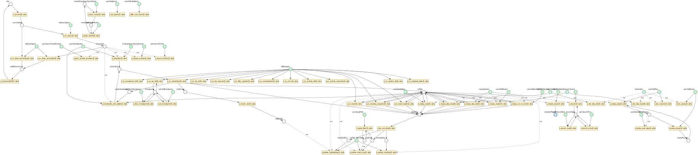

# libpetri

**A high-performance Coloured Time Petri Net runtime** — a Turing-complete execution engine where typed tokens flow through places, transitions fire under real-time constraints, and async actions execute concurrently. Formal verification proves safety properties via SMT/IC3.

| Implementation | Language | Runtime | Status |
|---|---|---|---|
| [**libpetri-java**](java/) | Java 25 | Virtual threads | Production |
| [**libpetri-ts**](typescript/) | TypeScript 5.7 | Promises / event loop | Production |

> Rust implementation planned — see [`spec/`](spec/) for the language-agnostic contract all implementations follow.

[Specification](spec/00-index.md)

---

## Why libpetri

- **Executable formal models** — Not a simulator. A production VM where Petri nets are the program: typed tokens are data, transitions are instructions, timing constraints are deadlines, and the executor is a scheduler. Suitable for agent orchestration, workflow automation, protocol modeling, game logic, UI state machines, and anything with concurrency.
- **Two implementations, one spec** — Java and TypeScript share [145 language-agnostic requirements](spec/00-index.md) covering every arc type, timing variant, and execution phase. Same behavior, verified independently.
- **Turing-complete** — Coloured Petri Nets with inhibitor arcs can simulate any Turing machine. libpetri's nets can model arbitrary computation, not just finite-state workflows.

---

## Core Capabilities

| Capability | Details |
|---|---|
| **Arc types** | Input, Output, Inhibitor, Read (non-consuming), Reset (clear all) |
| **Input cardinality** | `one`, `exactly(n)`, `all` (drain), `atLeast(n)` — with optional guard predicates |
| **Output routing** | `place` (single), `and` (fork), `xor` (choice), `timeout`, `forwardInput` |
| **Timing** | Immediate, Deadline, Delayed, Window, Exact — with urgent deadline enforcement |
| **Executor** | Bitmap-based O(W) enablement, dirty-set optimization, priority + FIFO scheduling |
| **Concurrency** | Single-threaded orchestrator, concurrent async actions (virtual threads / promises) |
| **Environment places** | External event injection for long-running, event-driven workflows |
| **Events** | 13 event types, pluggable stores (in-memory, noop, logging, debug) |
| **Formal verification** | SMT/IC3 via Z3 — deadlock freedom, mutual exclusion, place bounds, unreachability |
| **Structural analysis** | P-invariants (Farkas), siphon/trap pre-checks, XOR branch analysis |
| **State class graph** | Berthomieu-Diaz algorithm for timed reachability (Java, TypeScript) |
| **Export** | DOT/Graphviz |

---

## Quick Start

### Java

```java
import org.libpetri.core.*;
import org.libpetri.runtime.BitmapNetExecutor;
import java.time.Duration;
import java.util.*;
import java.util.concurrent.*;

var request  = Place.of("Request", String.class);
var response = Place.of("Response", String.class);

var process = Transition.builder("Process")
    .inputs(In.one(request))
    .outputs(Out.place(response))
    .timing(Timing.deadline(Duration.ofSeconds(5)))
    .action(ctx -> {
        String req = ctx.input(request);
        ctx.output(response, "Processed: " + req);
        return CompletableFuture.completedFuture(null);
    })
    .build();

var net = PetriNet.builder("Example")
    .transitions(process)
    .build();

try (var executor = BitmapNetExecutor.builder(net, Map.of(
            request, List.of(Token.of("hello"))))
        .executor(Executors.newVirtualThreadPerTaskExecutor())
        .build()) {
    Marking result = executor.run();
    System.out.println(result.peekFirst(response).value());
    // → "Processed: hello"
}
```

```bash
cd java && ./mvnw verify
```

### TypeScript

```typescript
import {
  place, tokenOf, one, outPlace, deadline,
  Transition, PetriNet, BitmapNetExecutor
} from 'libpetri';

const request  = place<string>('Request');
const response = place<string>('Response');

const process = Transition.builder('Process')
  .inputs(one(request))
  .outputs(outPlace(response))
  .timing(deadline(5000))
  .action(async (ctx) => {
    const req = ctx.input(request);
    ctx.output(response, `Processed: ${req}`);
  })
  .build();

const net = PetriNet.builder('Example')
  .transitions(process)
  .build();

const executor = new BitmapNetExecutor(net, new Map([
  [request, [tokenOf('hello')]],
]));
const result = await executor.run();
console.log(result.peekFirst(response)?.value);
// → "Processed: hello"
```

```bash
cd typescript && npm install && npm test
```

---

## Showcase: Debug UI — A Petri Net That Debugs Petri Nets

The libpetri debug UI is itself a Coloured Time Petri Net — 53 transitions, 51 places (including 30 environment places). The entire UI lifecycle (WebSocket connection, session management, message dispatch, diagram rendering, replay playback, live debugging, breakpoints, search, session archives) is modeled and executed as a CTPN.

<p align="center">
  
</p>

**Subnet breakdown:**

| Subnet | Transitions | Pattern |
|---|---|---|
| **Connection** | 5 | State machine: idle → connecting → connected / waitReconnect, with 2s delayed reconnect |
| **Session** | 3 | Subscribe, unsubscribe-and-switch, receive session data with DOT diagram |
| **Message Dispatch** | 12 | Guard predicates on input arcs filter WebSocket messages by type |
| **Diagram** | 1 | Async DOT→SVG rendering via Graphviz WASM |
| **UI Fan-Out** | 4 | Single `stateDirty` token AND-forks to 3 parallel updates (highlighting, event-log, marking) |
| **Replay Playback** | 8 | Play/pause/auto-step/step-fwd/step-back/seek/restart/run-to-end with checkpoint-based random access |
| **Live Mode** | 4 | Pause/resume/step-forward/step-back via WebSocket commands |
| **Inspector** | 1 | Place click → token inspection |
| **Modal** | 2 | Open/close with mutual exclusion (modalClosed ↔ modalOpen) |
| **Breakpoints** | 2 | Set/clear with list state as a resource place |
| **Filter/Search** | 4 | Apply filter, search, search-next, search-prev |
| **Speed** | 1 | Playback speed adjustment |
| **Archives** | 6 | Browse/list/import/upload archives, net-name filtering |

**Patterns at work:**

- **Environment places** — WebSocket open/close/message events, DOM user interactions (clicks, slider, form submissions), and `requestAnimationFrame` ticks are injected as external events
- **Dirty-flag fan-out** — A single `stateDirty` token AND-forks into three independent UI update channels, each gated by a `rafTick` environment place for frame-rate throttling
- **Resource places** — `uiState`, `breakpoints`, `filterState`, `searchState` are consumed and re-produced by their transitions, ensuring mutual exclusion on state updates
- **Timing** — `delayed(2000)` for reconnect backoff; all other transitions are `immediate()`
- **Guard predicates** — Message dispatch transitions use typed guards (`msg.type === 'event'`, etc.) on the `wsMessage` environment place to route messages to the correct handler

<details>
<summary><strong>TypeScript code (from debug-ui/src/net/definition.ts)</strong></summary>

```typescript
// Connection transitions
const t_connect = Transition.builder('t_connect')
  .inputs(one(idle))
  .outputs(outPlace(connecting))
  .timing(immediate())
  .action(async (ctx) => { /* createWebSocket, setConnecting */ })
  .build();

const t_on_open = Transition.builder('t_on_open')
  .inputs(one(connecting), one(wsOpenSignal.place))
  .outputs(outPlace(connected))
  .timing(immediate())
  .action(async (ctx) => { /* setConnected, refreshSessions */ })
  .build();

const t_reconnect = Transition.builder('t_reconnect')
  .inputs(one(waitReconnect))
  .outputs(outPlace(idle))
  .timing(delayed(2000))  // 2s backoff
  .action(async (ctx) => { ctx.output(idle, undefined); })
  .build();

// Message dispatch with guard predicates
const t_on_event = Transition.builder('t_on_event')
  .inputs(one(uiState), one(wsMessage.place, (msg) => msg.type === 'event'))
  .outputs(and(outPlace(uiState), outPlace(stateDirty)))
  .timing(immediate())
  .action(async (ctx) => { /* applyEventToState, updateTimeline */ })
  .build();

// UI fan-out: stateDirty → 3 parallel updates
const t_fan_out_dirty = Transition.builder('t_fan_out_dirty')
  .inputs(one(stateDirty))
  .outputs(and(outPlace(highlightDirty), outPlace(logDirty), outPlace(markingDirty)))
  .timing(immediate())
  .build();

// Frame-rate gated UI updates
const t_update_highlighting = Transition.builder('t_update_highlighting')
  .inputs(one(highlightDirty), one(rafTick.place))
  .reads(svgReady, uiState)
  .timing(immediate())
  .action(async (ctx) => { /* updateDiagramHighlighting */ })
  .build();

// ... 53 transitions total
const net = PetriNet.builder('DebugUI')
  .transitions(t_connect, t_on_open, /* ... */)
  .build();
```

</details>

---

## API at a Glance

<details>
<summary><strong>Arc types</strong></summary>

| Arc | Semantics | Java | TypeScript |
|---|---|---|---|
| **Input** | Consume token(s) from place | `In.one(p)` | `one(p)` |
| **Output** | Deposit token into place | `Out.place(p)` | `outPlace(p)` |
| **Inhibitor** | Block when place has tokens | `.inhibitor(p)` | `.inhibitor(p)` |
| **Read** | Test without consuming | `.read(p)` | `.read(p)` |
| **Reset** | Clear all tokens from place | `.reset(p)` | `.reset(p)` |

</details>

<details>
<summary><strong>Input cardinality</strong></summary>

| Cardinality | Semantics | Java | TypeScript |
|---|---|---|---|
| **One** | Consume exactly 1 token | `In.one(p)` | `one(p)` |
| **Exactly(n)** | Consume exactly n tokens | `In.exactly(n, p)` | `exactly(n, p)` |
| **All** | Drain all tokens (at least 1) | `In.all(p)` | `all(p)` |
| **AtLeast(n)** | Consume all, require >= n | `In.atLeast(n, p)` | `atLeast(n, p)` |

All input specs support optional guard predicates to filter tokens.

</details>

<details>
<summary><strong>Output routing</strong></summary>

| Routing | Semantics | Java | TypeScript |
|---|---|---|---|
| **Place** | Deposit to a single place | `Out.place(p)` | `outPlace(p)` |
| **And** | Fork to all children | `Out.and(p1, p2)` | `and(outPlace(p1), outPlace(p2))` |
| **Xor** | Route to exactly one child | `Out.xor(p1, p2)` | `xor(outPlace(p1), outPlace(p2))` |
| **Timeout** | Fallback output after delay | `Out.timeout(Duration, p)` | `timeout(ms, outPlace(p))` |
| **ForwardInput** | Pass consumed token through | `Out.forwardInput(from, to)` | `forwardInput(from, to)` |

</details>

<details>
<summary><strong>Timing variants</strong></summary>

| Variant | Interval | Behavior | Java | TypeScript |
|---|---|---|---|---|
| **Immediate** | [0, inf) | Fire as soon as enabled, no deadline | `Timing.immediate()` | `immediate()` |
| **Deadline** | [0, d] | Fire anytime before deadline | `Timing.deadline(Duration)` | `deadline(ms)` |
| **Delayed** | [d, +inf) | Wait at least d, then fire | `Timing.delayed(Duration)` | `delayed(ms)` |
| **Window** | [a, b] | Fire between a and b | `Timing.window(Duration, Duration)` | `window(a, b)` |
| **Exact** | [t, t] | Fire at precisely t | `Timing.exact(Duration)` | `exact(ms)` |

Transitions are force-disabled past their deadline (urgent semantics).

</details>

---

## Formal Verification

Both implementations include SMT-based verification via Z3 using the IC3/PDR algorithm, with structural pre-checks for fast results.

| Property | Description |
|---|---|
| **Deadlock freedom** | No reachable state where all transitions are disabled |
| **Mutual exclusion** | Two places never hold tokens simultaneously |
| **Place bound** | A place never exceeds *k* tokens |
| **Unreachability** | A set of places never all hold tokens simultaneously |

**Pipeline:** structural siphon/trap analysis → P-invariant computation (Farkas) → XOR branch analysis → SMT encoding → IC3/PDR solving

### Java

Prove that a circular token-passing net is deadlock-free — proven structurally via Commoner's theorem without invoking the SMT solver:

```java
import org.libpetri.core.*;
import org.libpetri.smt.*;
import java.time.Duration;

var pA = Place.of("A", Void.class);
var pB = Place.of("B", Void.class);

var net = PetriNet.builder("TokenRing")
    .transitions(
        Transition.builder("AtoB").inputs(In.one(pA)).outputs(Out.place(pB)).build(),
        Transition.builder("BtoA").inputs(In.one(pB)).outputs(Out.place(pA)).build())
    .build();

var result = SmtVerifier.forNet(net)
    .initialMarking(m -> m.tokens(pA, 1))
    .property(SmtProperty.deadlockFree())
    .timeout(Duration.ofSeconds(30))
    .verify();

System.out.println(result.verdict());  // Proven[method=structural, ...]
```

### TypeScript

Prove that a circular token-passing net is deadlock-free — proven structurally via Commoner's theorem without invoking the SMT solver:

```typescript
import { SmtVerifier, deadlockFree } from 'libpetri/verification';

const pA = place('A');
const pB = place('B');
const net = PetriNet.builder('TokenRing')
  .transitions(
    Transition.builder('AtoB').inputs(one(pA)).outputs(outPlace(pB)).build(),
    Transition.builder('BtoA').inputs(one(pB)).outputs(outPlace(pA)).build(),
  )
  .build();

const result = await SmtVerifier.forNet(net)
  .initialMarking(m => m.tokens(pA, 1))
  .property(deadlockFree())
  .timeout(30_000)
  .verify();

console.log(result.verdict.type);   // 'proven'
console.log(result.verdict.method); // 'structural' (Commoner's theorem)
```

---

## Architecture

### Execution Loop

The executor runs a single-threaded orchestration loop with six phases per cycle:

1. **Process completions** — collect outputs from finished async actions
2. **Process events** — inject tokens from environment places
3. **Update enablement** — re-evaluate only dirty transitions via bitmap masks
4. **Enforce deadlines** — force-disable transitions past their deadline (urgent semantics)
5. **Fire transitions** — select by priority, then FIFO by enablement time
6. **Await work** — sleep until an action completes, a timer fires, or an event arrives

### Module Structure

| Module | Java | TypeScript |
|---|---|---|
| Core model | `org.libpetri.core` | `libpetri` (core exports) |
| Runtime | `org.libpetri.runtime` | `libpetri` (runtime exports) |
| Events | `org.libpetri.event` | `libpetri` (event exports) |
| Verification | `org.libpetri.smt` | `libpetri/verification` |
| Export | `org.libpetri.export` | `libpetri/export` |
| Analysis | `org.libpetri.analysis` | `libpetri/verification` (analysis exports) |
| Debug | `org.libpetri.debug` | `libpetri/debug` |
| Doclet | `org.libpetri.doclet` | `libpetri/doclet` |

Both share the same architecture: immutable net definitions, builder-pattern construction, bitmap-based enablement with dirty-set optimization, and a single-threaded orchestrator dispatching async actions to a separate task pool.

---

## Performance

Measured on the BitmapNetExecutor with noop event store. Java uses JMH (1 fork, 3 warmup, 5 measurement iterations); TypeScript uses vitest bench. All times in microseconds (µs/op, lower is better).

**Concurrency model note:** In Java the orchestrator runs on its own virtual thread and dispatches each action to a separate virtual thread, so no action can ever block the runtime loop. This gives true multicore parallelism for CPU-bound actions. In TypeScript the orchestrator and all actions share a single-core event loop with zero scheduling overhead but no parallelism. In these benchmarks all actions are trivial, so Java's per-thread scheduling cost is visible while its multicore advantage is not. For real workloads with CPU-bound actions Java scales across cores while TypeScript remains single-threaded.

### Sync Linear Chains

All transitions use synchronous (passthrough) actions.

| Transitions | Java (µs) | TypeScript (µs) | Target (PERF-021) |
|---|---|---|---|
| 10 | 10.1 | 34.1 | < 100 |
| 20 | 18.1 | 65.7 | |
| 50 | 43.9 | 112.8 | < 500 |
| 100 | 88.5 | 146.2 | |
| 200 | 201.4 | 226.0 | |
| 500 | 610.2 | 531.1 | |

### Async Linear Chains

All transitions dispatch to a virtual thread / microtask.

| Transitions | Java (µs) | TypeScript (µs) |
|---|---|---|
| 5 | 20.6 | 32.3 |
| 10 | 41.6 | 57.1 |
| 50 | 199.8 | 192.3 |
| 100 | 439.2 | 254.7 |
| 500 | 2245.5 | 813.8 |

### Mixed Linear Chains (2 async)

Two transitions are async, the rest synchronous — the common real-world pattern.

| Transitions | Java (µs) | TypeScript (µs) |
|---|---|---|
| 10 | 20.5 | 39.3 |
| 50 | 59.9 | 121.7 |
| 100 | 106.9 | 158.9 |
| 500 | 702.9 | 526.2 |

### Parallel Fan-Out

One dispatch transition fans out to N parallel async branches, then joins.

| Branches | Java (µs) | TypeScript (µs) |
|---|---|---|
| 5 | 28.3 | 38.7 |
| 10 | 36.1 | 74.7 |
| 20 | 49.9 | 155.7 |

### Complex Workflows

| Scenario | Java (µs) | TypeScript (µs) |
|---|---|---|
| Order pipeline (8t, 13p) | 21.1 | 33.8 |
| Large workflow (16t, 17p) | 43.0 | — |

### Event Store Overhead (Java)

Impact of different event store implementations on the complex workflow:

| Event Store | µs/op | Overhead vs noop |
|---|---|---|
| noop | 20.4 | — |
| inMemory | 22.2 | +9% |
| debug | 24.4 | +20% |
| debugAware | 23.3 | +14% |
| debug + LogCapture | 26.3 | +29% |

### Running Benchmarks

```bash
cd java && ./mvnw test-compile exec:exec -Pjmh    # JMH → benchmark-results.json
cd typescript && npm run bench                      # vitest bench → stdout
```

---

## Specification

The [`spec/`](spec/) directory defines the complete engine contract — **145 requirements** across 10 files.

| File | Prefix | Scope | Count |
|---|---|---|---|
| [01-core-model.md](spec/01-core-model.md) | CORE | Places, tokens, transitions, arcs, net construction | 33 |
| [02-input-output-specs.md](spec/02-input-output-specs.md) | IO | Input cardinality, output routing, validation | 15 |
| [03-timing.md](spec/03-timing.md) | TIME | Firing intervals, clock semantics, deadlines | 11 |
| [04-execution-model.md](spec/04-execution-model.md) | EXEC | Orchestrator loop, scheduling, quiescence | 15 |
| [05-concurrency.md](spec/05-concurrency.md) | CONC | Bitmap executor, async actions, wake-up | 11 |
| [06-environment-places.md](spec/06-environment-places.md) | ENV | External event injection, long-running mode | 9 |
| [07-verification.md](spec/07-verification.md) | VER | SMT/IC3, state class graph, structural analysis | 10 |
| [08-events-observability.md](spec/08-events-observability.md) | EVT | Event types, event store, log capture | 20 |
| [09-export.md](spec/09-export.md) | EXP | Graph export, formal interchange | 10 |
| [10-performance.md](spec/10-performance.md) | PERF | Scaling, benchmarks, memory efficiency | 11 |
| **Total** | | | **145** |

**Priority:** 110 MUST · 29 SHOULD · 6 MAY

See [spec/00-index.md](spec/00-index.md) for the full cross-reference index and coverage matrix.

---

## Build & Test

### Java

```bash
cd java
./mvnw verify                                          # Full build + tests
./mvnw test                                            # Run all tests
./mvnw test -Dtest="org.libpetri.core.PetriNetTest"    # Single test class
./mvnw test -Dtest="*BitmapNetExecutor*"               # Wildcard match
./mvnw test-compile exec:exec -Pjmh                    # Run JMH benchmarks
./mvnw javadoc:javadoc                                 # Generate Javadocs
```

Java 25 (no preview features — all used features are finalized). Uses Maven 3.9.x via wrapper.

### TypeScript

```bash
cd typescript
npm install              # Install dependencies
npm run build            # Build with tsup
npm run check            # Type-check (tsc --noEmit)
npm test                 # Run vitest
npm run test:watch       # Watch mode
npm test -- core         # Run tests matching "core"
```

TypeScript 5.7, ESM-only, strict mode. Built with tsup, tested with vitest.

---

## License

[Apache License 2.0](LICENSE)

---

[Specification](spec/00-index.md)
