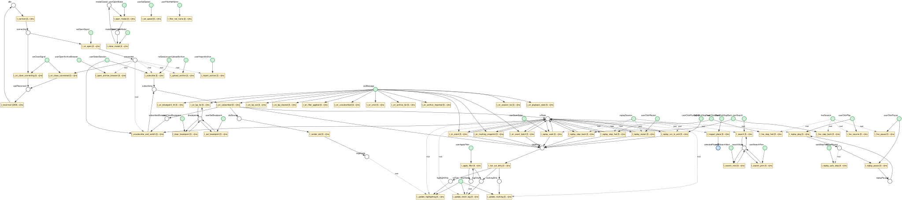
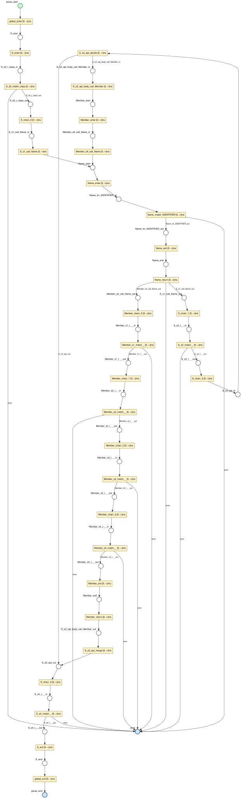

# libpetri

[](https://github.com/debe/libpetri/actions/workflows/ci.yml)
[](https://central.sonatype.com/artifact/org.libpetri/libpetri)
[](https://www.npmjs.com/package/libpetri)
[](https://crates.io/crates/libpetri)
[](https://pypi.org/project/libpetri/)
[](LICENSE)

**A modern Coloured Time Petri Net runtime with first-class composability.**

Write small, reusable subnets with typed interfaces. Compose them into systems the way you compose modules in a programming language. Run them on a real-time-aware executor. Prove them correct with SMT.

| Implementation | Language | Runtime | Status |
|---|---|---|---|
| [**libpetri-java**](java/) | Java 25 | Virtual threads | Production |
| [**libpetri-ts**](typescript/) | TypeScript 5.7 | Promises / event loop | Production |
| [**libpetri-rust**](rust/) | Rust 2024 | Tokio async tasks | Production |
| [**libpetri-py**](python/) | Python ≥3.11 | Tokio async via PyO3 | Beta |

> See [`spec/`](spec/) for the language-agnostic contract all implementations follow.

[Specification](spec/00-index.md)

---

## Why libpetri

- **Composable like a module system** — Define small subnets with typed interfaces (ports + channels), instantiate them with prefix-scoped state, and compose them by structural rewrite into a flat production net. `FusionSet` for shared cross-instance state, per-instance action overrides. Same five abstractions across Java, TypeScript, and Rust.
- **Executable, not a simulator** — Production runtime where Petri nets *are* the program. Typed tokens carry data, transitions are instructions, timing constraints are deadlines, and the executor is a scheduler. Suitable for agent orchestration, workflow automation, protocol modeling, game logic, UI state machines, and anything with concurrency.
- **Four implementations, one spec** — Java 25, TypeScript 5.7, Rust 2024, and Python ≥3.11 (PyO3 bindings on the Rust runtime) share [183 language-agnostic requirements](spec/00-index.md) covering every arc type, timing variant, execution phase, and the modular composition surface. Same behavior, verified independently in three of four (Python rides on Rust).
- **Turing-complete** — Coloured Petri Nets with inhibitor arcs can simulate any Turing machine. libpetri's nets can model arbitrary computation, not just finite-state workflows.

---

## Core Capabilities

| Capability | Details |
|---|---|
| **Modular composition** | Open subnets with typed interfaces (ports + channels), composition via structural rewrite, place fusion for shared state, per-instance action binding |
| **Arc types** | Input, Output, Inhibitor, Read (non-consuming), Reset (clear all) |
| **Input cardinality** | `one`, `exactly(n)`, `all` (drain), `atLeast(n)` — with optional guard predicates |
| **Output routing** | `place` (single), `and` (fork), `xor` (choice), `timeout`, `forwardInput` |
| **Timing** | Immediate, Deadline, Delayed, Window, Exact — with urgent deadline enforcement |
| **Executor** | Bitmap-based O(W) enablement, dirty-set optimization, priority + FIFO scheduling. Precompiled flat-array executor with 1.5–4× speedup (Java, TypeScript, Rust). |
| **Concurrency** | Single-threaded orchestrator, concurrent async actions (virtual threads / promises / Tokio tasks) |
| **Environment places** | External event injection for long-running, event-driven workflows |
| **Events** | 13 event types, pluggable stores (in-memory, noop, logging, debug) |
| **Formal verification** | SMT/IC3 via Z3 — deadlock freedom, mutual exclusion, place bounds, unreachability |
| **Structural analysis** | P-invariants (Farkas), siphon/trap pre-checks, XOR branch analysis |
| **State class graph** | Berthomieu-Diaz algorithm for timed reachability (Java, TypeScript, Rust) |
| **Export** | DOT/Graphviz |

---

## Quick Start

### Java

```java
import org.libpetri.core.*;
import org.libpetri.runtime.BitmapNetExecutor;
import java.time.Duration;
import java.util.*;
import java.util.concurrent.*;

var request  = Place.of("Request", String.class);
var response = Place.of("Response", String.class);

var process = Transition.builder("Process")
    .inputs(In.one(request))
    .outputs(Out.place(response))
    .timing(Timing.deadline(Duration.ofSeconds(5)))
    .action(ctx -> {
        String req = ctx.input(request);
        ctx.output(response, "Processed: " + req);
        return CompletableFuture.completedFuture(null);
    })
    .build();

var net = PetriNet.builder("Example")
    .transitions(process)
    .build();

try (var executor = BitmapNetExecutor.builder(net, Map.of(
            request, List.of(Token.of("hello"))))
        .executor(Executors.newVirtualThreadPerTaskExecutor())
        .build()) {
    Marking result = executor.run();
    System.out.println(result.peekFirst(response).value());
    // → "Processed: hello"
}
```

```bash
cd java && ./mvnw verify
```

### TypeScript

```typescript
import {
  place, tokenOf, one, outPlace, deadline,
  Transition, PetriNet, BitmapNetExecutor
} from 'libpetri';

const request  = place<string>('Request');
const response = place<string>('Response');

const process = Transition.builder('Process')
  .inputs(one(request))
  .outputs(outPlace(response))
  .timing(deadline(5000))
  .action(async (ctx) => {
    const req = ctx.input(request);
    ctx.output(response, `Processed: ${req}`);
  })
  .build();

const net = PetriNet.builder('Example')
  .transitions(process)
  .build();

const executor = new BitmapNetExecutor(net, new Map([
  [request, [tokenOf('hello')]],
]));
const result = await executor.run();
console.log(result.peekFirst(response)?.value);
// → "Processed: hello"
```

```bash
cd typescript && npm install && npm test
```

### Rust

```rust
use libpetri::*;
use libpetri::runtime::environment::ExternalEvent;

let request  = Place::<String>::new("Request");
let response = Place::<String>::new("Response");

let process = Transition::builder("Process")
    .input(one(&request))
    .output(out_place(&response))
    .timing(deadline(5000))
    .action(async_action(|mut ctx| async move {
        let req: std::sync::Arc<String> = ctx.input("Request")?;
        ctx.output("Response", format!("Processed: {req}"))?;
        Ok(ctx)
    }))
    .build();

let net = PetriNet::builder("Example").transition(process).build();

let mut marking = Marking::new();
marking.add(&request, Token::at("hello".to_string(), 0));

let mut executor = BitmapNetExecutor::<NoopEventStore>::new(
    &net, marking, ExecutorOptions::default(),
);
let (_tx, rx) = tokio::sync::mpsc::unbounded_channel::<ExternalEvent>();
executor.run_async(rx).await;
// → "Processed: hello"
```

```bash
cd rust && cargo test
```

### Python

```python
import libpetri as lp

request  = lp.Place("Request")
response = lp.Place("Response")

def process(ctx: lp.TransitionContext) -> None:
    req = ctx.input("Request")
    ctx.output("Response", f"Processed: {req}")

net = (
    lp.Net("Example")
    .transition(
        lp.Transition("Process")
        .input(lp.one(request))
        .output(lp.out(response))
        .timing(lp.deadline(5000))
        .action(process)
        .build()
    )
    .build()
)

result = lp.run_sync(net, initial={request: ["hello"]})
print(result.first(response))  # → "Processed: hello"
```

```bash
pip install libpetri              # from PyPI
# or, from the repo:
cd python && pip install -e ".[dev]" && pytest
```

Tokens are untyped `Py<PyAny>` across the FFI — net structure is type-checked,
runtime token types are not. See [`python/README.md`](python/README.md) for the
typing-relaxation note.

---

## Modular Composition

Build large Petri nets the way you build large programs: out of small, reusable, parameterised pieces. A `SubnetDef` is a `PetriNet` body paired with a typed `Interface` of named **ports** (boundary places) and **channels** (boundary transitions for synchronous fusion). `def.instantiate("p1", params)` returns an `Instance` whose internal names are scoped to `p1/…`. `PetriNet.builder().compose(...)` weaves an instance into a host net by structural rewrite; the result is a flat `PetriNet` indistinguishable from a hand-written one.

```java
// A reusable bounded buffer: one input port, one output port, one sync channel.
var items = Place.of("items", Integer.class);
var slots = Place.of("slots", Integer.class);
var buffer = SubnetDef.builder("Buffer", Integer.class)
    .place(items).place(slots)
    .transition(Transition.builder("enqueue")
        .inputs(In.one(slots)).outputs(Out.place(items)).build())
    .inputPort("put", slots).outputPort("get", items)
    .channel("backpressure", /* boundary transition */)
    .build();

// Instantiate and compose into a host pipeline.
var wire = Place.of("wire", Integer.class);
var system = PetriNet.builder("Pipeline")
    .compose(producer.instantiate("p1"), b -> b.bindPort("output", wire))
    .compose(buffer.instantiate("b1", 4), b -> b.bindPort("put", wire))
    .fuse(FusionSet.of("limiter", /* shared slots */))
    .build();
```

Instance renaming runs at `instantiate(...)`; every internal place / transition becomes `prefix/name`. Port bindings rewrite arcs so the port place merges into the caller's place. Channel bindings merge the boundary transition with a caller-side transition (arc union, timing intersection, caller-wins priority, sequential actions). `FusionSet` is orthogonal to compose — declare N places of the same token type as equivalent for shared cross-instance state (e.g. a global rate limiter). Per-instance action overrides via `instance.bindActions(map)`.

TypeScript, Rust, and Python expose the same five abstractions — `SubnetDef`, `Instance`, `Interface`, `FusionSet`, `compose()` on the builder. Composed nets render one `subgraph cluster_*` per instance prefix on DOT export (EXP-016); the debug protocol carries `SubnetInstance` descriptors; `SubnetDef.verify(harness)` runs SMT properties against a subnet in isolation.

See [`spec/11-modular-composition.md`](spec/11-modular-composition.md) for the full 22-requirement contract (MOD-001..061).

---

## Showcase: Debug UI — A Petri Net That Debugs Petri Nets

The libpetri debug UI is itself a Coloured Time Petri Net — 55 transitions, 53 places (including 31 environment places) across 13 subnets. The entire UI lifecycle (WebSocket connection, session management, message dispatch, diagram rendering, replay playback, live debugging, breakpoints, search, session archives) is modeled and executed as a CTPN.

<p align="center">
  
</p>

<details>
<summary><strong>Subnet breakdown + patterns at work</strong></summary>

| Subnet | Transitions | Pattern |
|---|---|---|
| **Connection** | 5 | State machine: idle → connecting → connected / waitReconnect, with 2s delayed reconnect |
| **Session** | 3 | Subscribe, unsubscribe-and-switch, receive session data with DOT diagram |
| **Message Dispatch** | 12 | Guard predicates on input arcs filter WebSocket messages by type |
| **Diagram** | 1 | Async DOT→SVG rendering via Graphviz WASM |
| **UI Fan-Out** | 4 | Single `stateDirty` token AND-forks to 3 parallel updates (highlighting, event-log, marking) |
| **Replay Playback** | 10 | Play/pause/auto-step/step-fwd/step-back/seek/restart/run-to-end/breakpoint-pause/breakpoint-resume |
| **Live Mode** | 4 | Pause/resume/step-forward/step-back via WebSocket commands |
| **Inspector** | 1 | Place click → token inspection |
| **Modal** | 2 | Open/close with mutual exclusion (modalClosed ↔ modalOpen) |
| **Breakpoints** | 2 | Set/clear with list state as a resource place |
| **Filter/Search** | 4 | Apply filter, search, search-next, search-prev |
| **Speed** | 1 | Playback speed adjustment |
| **Archives** | 6 | Browse/list/import/upload archives, net-name filtering |

Patterns: **environment places** for WebSocket / DOM / RAF events; **dirty-flag fan-out** where one `stateDirty` token AND-forks into three RAF-gated UI updates; **resource places** for `uiState` / `breakpoints` / `filterState` enforcing single-writer semantics; **`delayed(2000)`** for reconnect backoff; **guard predicates** on `wsMessage` for type-based dispatch. Full source: [`debug-ui/src/net/definition.ts`](debug-ui/src/net/definition.ts).

</details>

---

## Example: Java 25 Parser — Pushing Petri Nets to the Limit

The [`examples/java-parser/`](examples/java-parser/) module implements a **complete Java 25 parser as a Coloured Time Petri Net** — 167 grammar productions compiled into 2,335 places and 2,326 transitions. A stress test demonstrating CTPN execution overhead is acceptable even under extreme workloads; not a competitor to javac.

<p align="center">
  
</p>

**Self-parse results:** parses all 85 libpetri core Java source files (17,395 lines) in ~500ms (~34,000 lines/sec) using the `PrecompiledNetExecutor`.

<details>
<summary><strong>How it works (grammar fragment image + design notes)</strong></summary>

A grammar fragment — 3 productions compiled to a 33-place, 31-transition net showing the hierarchical structure:

<p align="center">
  
</p>

- **Coloured tokens** — A single `ParseState` token carries position, call stack, and AST through the net. No global mutable state.
- **Grammar-to-net compilation** — Each grammar element (terminal, sequence, choice, repetition, optional, non-terminal call/return) maps to a specific net pattern.
- **Structural sharing** — Non-terminal calls push a return-site ID onto the token's call stack; a shared return-dispatch transition routes the token back to the correct call site via XOR guards.
- **PrecompiledNetExecutor + `skipOutputValidation`** — the flat-array executor handles the 2,300+ transitions efficiently.

</details>

---

## API at a Glance

<details>
<summary><strong>Arc types</strong></summary>

| Arc | Semantics | Java | TypeScript | Rust | Python |
|---|---|---|---|---|---|
| **Input** | Consume token(s) from place | `In.one(p)` | `one(p)` | `one(&p)` | `lp.one(p)` |
| **Output** | Deposit token into place | `Out.place(p)` | `outPlace(p)` | `out_place(&p)` | `lp.out(p)` |
| **Inhibitor** | Block when place has tokens | `.inhibitor(p)` | `.inhibitor(p)` | `.inhibitor(inhibitor(&p))` | `.inhibitor(lp.inhibitor(p))` |
| **Read** | Test without consuming | `.read(p)` | `.read(p)` | `.read(read(&p))` | `.read(lp.read(p))` |
| **Reset** | Clear all tokens from place | `.reset(p)` | `.reset(p)` | `.reset(reset(&p))` | `.reset(lp.reset(p))` |

</details>

<details>
<summary><strong>Input cardinality</strong></summary>

| Cardinality | Semantics | Java | TypeScript | Rust | Python |
|---|---|---|---|---|---|
| **One** | Consume exactly 1 token | `In.one(p)` | `one(p)` | `one(&p)` | `lp.one(p)` |
| **Exactly(n)** | Consume exactly n tokens | `In.exactly(n, p)` | `exactly(n, p)` | `exactly(n, &p)` | `lp.exactly(n, p)` |
| **All** | Drain all tokens (at least 1) | `In.all(p)` | `all(p)` | `all(&p)` | `lp.all_tokens(p)` |
| **AtLeast(n)** | Consume all, require >= n | `In.atLeast(n, p)` | `atLeast(n, p)` | `at_least(n, &p)` | `lp.at_least(n, p)` |

All input specs support optional guard predicates to filter tokens.

</details>

<details>
<summary><strong>Output routing</strong></summary>

| Routing | Semantics | Java | TypeScript | Rust | Python |
|---|---|---|---|---|---|
| **Place** | Deposit to a single place | `Out.place(p)` | `outPlace(p)` | `out_place(&p)` | `lp.out(p)` |
| **And** | Fork to all children | `Out.and(p1, p2)` | `and(outPlace(p1), outPlace(p2))` | `and(vec![out_place(&p1), out_place(&p2)])` | `lp.and_(lp.out(p1), lp.out(p2))` |
| **Xor** | Route to exactly one child | `Out.xor(p1, p2)` | `xor(outPlace(p1), outPlace(p2))` | `xor(vec![out_place(&p1), out_place(&p2)])` | `lp.xor(lp.out(p1), lp.out(p2))` |
| **Timeout** | Fallback output after delay | `Out.timeout(Duration, p)` | `timeout(ms, outPlace(p))` | `timeout(ms, out_place(&p))` | `lp.timeout(ms, lp.out(p))` |
| **ForwardInput** | Pass consumed token through | `Out.forwardInput(from, to)` | `forwardInput(from, to)` | `forward_input(&from, &to)` | `lp.forward_input(from, to)` |

</details>

<details>
<summary><strong>Timing variants</strong></summary>

| Variant | Interval | Behavior | Java | TypeScript | Rust | Python |
|---|---|---|---|---|---|---|
| **Immediate** | [0, inf) | Fire as soon as enabled, no deadline | `Timing.immediate()` | `immediate()` | `immediate()` | `lp.immediate()` |
| **Deadline** | [0, d] | Fire anytime before deadline | `Timing.deadline(Duration)` | `deadline(ms)` | `deadline(ms)` | `lp.deadline(ms)` |
| **Delayed** | [d, +inf) | Wait at least d, then fire | `Timing.delayed(Duration)` | `delayed(ms)` | `delayed(ms)` | `lp.delayed(ms)` |
| **Window** | [a, b] | Fire between a and b | `Timing.window(Duration, Duration)` | `window(a, b)` | `window(a, b)` | `lp.window(a, b)` |
| **Exact** | [t, t] | Fire at precisely t | `Timing.exact(Duration)` | `exact(ms)` | `exact(ms)` | `lp.exact(ms)` |

Transitions are force-disabled past their deadline (urgent semantics).

</details>

---

## Formal Verification

All implementations include structural verification (P-invariants, siphon/trap analysis, state class graphs). Java, TypeScript, and Python (when the wheel ships with Z3 available) support SMT-based verification via Z3 using the IC3/PDR algorithm; Rust has Z3 feature-gated but not yet wired.

| Property | Description |
|---|---|
| **Deadlock freedom** | No reachable state where all transitions are disabled |
| **Mutual exclusion** | Two places never hold tokens simultaneously |
| **Place bound** | A place never exceeds *k* tokens |
| **Unreachability** | A set of places never all hold tokens simultaneously |

**Pipeline:** structural siphon/trap analysis → P-invariant computation (Farkas) → XOR branch analysis → SMT encoding → IC3/PDR solving. Many small nets are proven *structurally* (Commoner's theorem) without invoking the SMT solver at all.

```java
// Java — same API shape exists in TypeScript and Python (lp.verify, lp.deadlock_free, ...).
var pA = Place.of("A", Void.class);
var pB = Place.of("B", Void.class);

var net = PetriNet.builder("TokenRing")
    .transitions(
        Transition.builder("AtoB").inputs(In.one(pA)).outputs(Out.place(pB)).build(),
        Transition.builder("BtoA").inputs(In.one(pB)).outputs(Out.place(pA)).build())
    .build();

var result = SmtVerifier.forNet(net)
    .initialMarking(m -> m.tokens(pA, 1))
    .property(SmtProperty.deadlockFree())
    .timeout(Duration.ofSeconds(30))
    .verify();

System.out.println(result.verdict());  // Proven[method=structural, ...]
```

---

## Architecture

### Execution Loop

The executor runs a single-threaded orchestration loop with six phases per cycle:

1. **Process completions** — collect outputs from finished async actions
2. **Process events** — inject tokens from environment places
3. **Update enablement** — re-evaluate only dirty transitions via bitmap masks
4. **Enforce deadlines** — force-disable transitions past their deadline (urgent semantics)
5. **Fire transitions** — select by priority, then FIFO by enablement time
6. **Await work** — sleep until an action completes, a timer fires, or an event arrives

### Module Structure

| Module | Java | TypeScript | Rust | Python |
|---|---|---|---|---|
| Core model | `org.libpetri.core` | `libpetri` (core exports) | `libpetri-core` | `libpetri.model` |
| Runtime | `org.libpetri.runtime` | `libpetri` (runtime exports) | `libpetri-runtime` | `libpetri.runtime` |
| Events | `org.libpetri.event` | `libpetri` (event exports) | `libpetri-event` | (via Rust) |
| Verification | `org.libpetri.smt` | `libpetri/verification` | `libpetri-verification` | `libpetri.verification` |
| Export | `org.libpetri.export` | `libpetri/export` | `libpetri-export` | `libpetri.export` |
| Debug | `org.libpetri.debug` | `libpetri/debug` | `libpetri-debug` | `libpetri.debug` |
| Doclet | `org.libpetri.doclet` | `libpetri/doclet` | `build.rs` (Rustdoc SVGs) | — |

All four share the same architecture: immutable net definitions, builder-pattern construction, bitmap-based enablement with dirty-set optimization, and a single-threaded orchestrator dispatching async actions to a separate task pool. Rust uses a `tokio` feature flag for async execution and a `debug` feature flag for the debug protocol; Python wraps the Rust runtime through PyO3 (`rust/libpetri-py`) and ships with `.pyi` stubs + `py.typed`.

### PrecompiledNetExecutor — Flat-Array Executor

The `BitmapNetExecutor` interprets the net definition on every firing (pattern-matches arc types, HashMap-looks up tokens, `TreeMap`-sorts enabled transitions). The `PrecompiledNetExecutor` compiles those abstractions away: integer opcode sequences for consume/reset, per-place token arrays indexed by place ID, priority-partitioned circular queues for O(1) next-to-fire, pooled context objects for zero-alloc on the sync path. Java and Rust additionally use ring buffers and two-level summary bitmaps; Rust precomputes `Arc<str>` name arrays and uses sparse enablement masks. The Python bindings wrap Rust's `OwnedPrecompiledNet` (an `Arc<PrecompiledNet>` cache) and inherit the speedup.

Same six execution phases as `BitmapNetExecutor`, same results — Java shares the test suite via abstract-base inheritance; Rust has its own. Speedup ranges: 1.4–4× on pure-sync chains (grows with scale), ~1× → 2-3× on async-dominated (scheduling cost dominates at small N), 1.3–3.6× on mixed workloads (the common real-world pattern). See [`spec/05-concurrency.md`](spec/05-concurrency.md) for the full opcode set + execution semantics (CONC-001..018).

---

## Performance

All times in microseconds (µs/op, lower is better), measured with the noop event store on a single dev machine — re-run for 2.6.0. Tools: Java JMH (1 fork, 2 warmup, 3 measurement), TypeScript vitest bench, Rust Criterion, Python pytest-benchmark. Java and Rust show both `BitmapNetExecutor` and `PrecompiledNetExecutor`; TypeScript shows the same pair; **Python wraps Rust's `OwnedPrecompiledNet` through PyO3 — only one executor path exists**, so a single Python column is shown with a small FFI-overhead delta vs. the Rust precompiled column.

Concurrency model: Java orchestrator + actions on separate virtual threads (true multicore for CPU-bound actions); TypeScript single-core event loop (no parallelism); Rust sync is single-threaded, async uses Tokio's multi-threaded task pool; Python inherits Rust's model through the FFI (the GIL is released for the executor loop, re-acquired only for Python callbacks). All bench actions are trivial, so Java's per-thread scheduling cost is visible while its multicore advantage is not.

**Scaling note:** thanks to dirty-set optimization, the executor only re-evaluates transitions whose input places changed. Times reflect cost per transition that fires — adding inactive transitions does not increase per-cycle cost.

### Sync Linear Chains

All transitions use synchronous (passthrough) actions.

| Transitions | Java Bitmap | Java Precomp. | TS Bitmap | TS Precomp. | Rust Bitmap | Rust Precomp. | **Python** | Target (PERF-021) |
|---|---|---|---|---|---|---|---|---|
| 10  | 11.9 | 3.8 | 40.6 | 22.5 | 14.7 | 5.0 | **8.7** | < 100 |
| 20  | 20.0 | 8.4 | 74.3 | 44.6 | 27.3 | 9.8 | **14.3** | |
| 50  | 43.5 | 17.5 | 191.4 | 76.3 | 73.4 | 24.0 | **30.3** | < 500 |
| 100 | 91.7 | 39.3 | 399.9 | 80.1 | 140.3 | 44.7 | **49.2** | |
| 200 | 189.0 | 70.7 | 794.3 | 92.2 | 283.3 | 80.7 | **92.6** | |
| 500 | 493.4 | 190.6 | 3685.7 | 140.2 | 811.7 | 219.3 | **252.7** | |
| 1000 | 1484.1 | 371.8 | — | — | — | — | — | |
| 2000 | 2917.9 | 869.8 | — | — | — | — | — | |
| 5000 | 11186.3 | 2259.8 | — | — | — | — | — | |
| 10000 | 30485.5 | 5434.3 | — | — | — | — | — | |

All times µs/op (lower is better). Python uses Rust's `OwnedPrecompiledNet` through PyO3 — single column, footnoted; ~10% overhead vs. the bare Rust precompiled path is the FFI cost.

### Async Linear Chains

All transitions dispatch to a virtual thread / microtask / Tokio task.

| Transitions | Java Bitmap | Java Precomp. | TS Bitmap | TS Precomp. | Rust Bitmap | Rust Precomp. | **Python** |
|---|---|---|---|---|---|---|---|
| 5   | 26.3 | 19.7 | 36.8 | 27.8 | 7.9 | 4.5 | **84.2** |
| 10  | 46.2 | 41.4 | 83.3 | 55.3 | 16.2 | 7.4 | **90.1** |
| 20  | 82.9 | 85.4 | 175.2 | 94.3 | 34.6 | 14.0 | **119.4** |
| 50  | 207.0 | 216.6 | 540.7 | 164.0 | 84.6 | 31.9 | **143.2** |
| 100 | 423.1 | 330.5 | 852.9 | 169.6 | 164.9 | 66.7 | **411.4** |
| 200 | 738.1 | 410.4 | 1501.7 | 179.1 | 333.8 | 128.1 | **366.3** |
| 500 | 2332.4 | 717.4 | 4713.4 | 243.5 | 959.4 | 336.2 | **811.1** |

### Mixed Linear Chains (2 async)

Two transitions are async, the rest synchronous — the common real-world pattern.

| Transitions | Java Bitmap | Java Precomp. | TS Bitmap | TS Precomp. | Rust Bitmap | Rust Precomp. | **Python (sync cb)** |
|---|---|---|---|---|---|---|---|
| 10  | 20.5 | 11.2 | 43.9 | 31.0 | 8.3 | 2.3 | **14.1** |
| 20  | 31.2 | 17.1 | 80.4 | 54.6 | 15.3 | 2.6 | **24.8** |
| 50  | 60.7 | 29.0 | 175.2 | 78.2 | 39.3 | 3.3 | **55.7** |
| 100 | 127.5 | 52.8 | 366.8 | 110.3 | 80.4 | 4.6 | **108.2** |
| 200 | 236.7 | 80.5 | 858.0 | 97.6 | 156.0 | 6.9 | — |
| 500 | 715.5 | 230.6 | 2640.8 | 146.7 | 336.8 | 14.0 | — |

Python's "mixed chain" closest equivalent in the suite is `bench_chain_sync_callback[N]`: every transition runs a Python `def f(ctx): ctx.output(...)`. For a Python `async def` callback per fire, see `bench_chain_async_callback[N]` in [`python/benches/RESULTS_2026-05-27.md`](python/benches/RESULTS_2026-05-27.md) — the centerpiece of the Python perf sprint that landed −78.8% in 2.6.0.

### Parallel Fan-Out

One dispatch transition fans out to N parallel async branches, then joins.

| Branches | Java Bitmap | Java Precomp. | TS Bitmap | TS Precomp. | Rust Bitmap | Rust Precomp. | **Python** |
|---|---|---|---|---|---|---|---|
| 5  | 35.8 | 26.6 | 47.0 | 35.0 | 11.7 | 5.2 | **8.6** |
| 10 | 36.9 | 38.3 | 86.2 | 65.1 | 27.1 | 9.5 | **14.2** |
| 20 | 68.5 | 38.0 | 181.4 | 214.1 | 59.8 | 18.5 | **23.3** |

### Complex Workflows

| Scenario | Java Bitmap | Java Precomp. | TS Bitmap | TS Precomp. | Rust Bitmap | Rust Precomp. | **Python** |
|---|---|---|---|---|---|---|---|
| Order pipeline (8t, 13p)   | 26.6 | 9.0 | 38.7 | 50.2 | 11.8 | 3.9 | **7.7** |
| Large workflow (16t, 17p)  | 42.6 | 36.7 | — | — | — | — | — |

### Event Store Overhead

Impact of different event store implementations on a small workload (Java is the complex workflow; TS / Rust use the noop-vs-inMemory linear-chain comparison). All numbers µs/op.

| Implementation | noop | inMemory | debug | debugAware | + LogCapture |
|---|---|---|---|---|---|
| Java BitmapNetExecutor       | 26.6 | 24.6 (≈) | 22.2 (≈) | 30.6 (≈) | 32.5 |
| Java PrecompiledNetExecutor  | 9.0  | 9.4 (≈)  | 19.0 (≈) | 25.4 (≈) | 33.1 |
| TypeScript BitmapNetExecutor | 41.5 | 48.4 (+17%) | — | — | — |
| TypeScript Precompiled        | 33.3 | 33.1 (flat) | — | — | — |
| Rust BitmapNetExecutor       | 12.7 | 14.5 (+14%) | — | — | — |

Java's debug / debugAware overhead is real but variable; (≈) marks values pulled from JMH-parameterized bench runs whose exact event-store binding is determined at fork time — the magnitudes are stable across runs (debug ≪ debugAware < +LogCapture), individual cell ordering may vary by ~1µs. Rust/TS don't ship dedicated debug-store benchmarks (the debug event store is identical in cost to `inMemory` because it writes to the same in-memory journal).

### Compilation

Time to compile a PetriNet into a CompiledNet / PrecompiledNet.

| Places | TS Compiled | TS Precomp. | Rust Compiled | Rust Precomp. | **Python (compile + build)** |
|---|---|---|---|---|---|
| 10  | 15.3 | 15.3 | 5.9 | 8.0 | **9.6** |
| 50  | 36.7 | 56.8 | 30.9 | 45.9 | **45.4** |
| 100 | 71.1 | 111.5 | 60.1 | 105.0 | **87.8** |
| 500 | 362.7 | 552.6 | 297.8 | 401.2 | **466.3** |

### Running Benchmarks

```bash
cd java && ./mvnw test-compile exec:exec -Pjmh                                # JMH → benchmark-results.json
cd typescript && npm run bench                                                # vitest bench → stdout
cd rust && cargo bench                                                        # Criterion → target/criterion/
cd python && pytest benches/ --benchmark-only --override-ini="testpaths=benches"  # pytest-benchmark → stdout
```

---

## Specification

The [`spec/`](spec/) directory defines the complete engine contract — **183 requirements** across 11 files.

| File | Prefix | Scope | Count |
|---|---|---|---|
| [01-core-model.md](spec/01-core-model.md) | CORE | Places, tokens, transitions, arcs, net construction | 33 |
| [02-input-output-specs.md](spec/02-input-output-specs.md) | IO | Input cardinality, output routing, validation | 15 |
| [03-timing.md](spec/03-timing.md) | TIME | Firing intervals, clock semantics, deadlines | 11 |
| [04-execution-model.md](spec/04-execution-model.md) | EXEC | Orchestrator loop, scheduling, quiescence | 15 |
| [05-concurrency.md](spec/05-concurrency.md) | CONC | Bitmap executor, precompiled flat-array executor, async actions, wake-up | 18 |
| [06-environment-places.md](spec/06-environment-places.md) | ENV | External event injection, implicit long-running behavior, executor lifecycle | 10 |
| [07-verification.md](spec/07-verification.md) | VER | SMT/IC3, state class graph, structural analysis | 10 |
| [08-events-observability.md](spec/08-events-observability.md) | EVT | Event types, event store, log capture | 20 |
| [09-export.md](spec/09-export.md) | EXP | Graph export, formal interchange, junction nodes, subnet clusters | 15 |
| [10-performance.md](spec/10-performance.md) | PERF | Scaling, benchmarks, memory efficiency, flat-array executor performance | 14 |
| [11-modular-composition.md](spec/11-modular-composition.md) | MOD | Subnet definitions, instances, port/channel composition, place fusion, action binding | 22 |
| **Total** | | | **183** |

See [spec/00-index.md](spec/00-index.md) for the full cross-reference index, priority breakdown, and coverage matrix.

---

## Build & Test

### Java

```bash
cd java
./mvnw verify                                          # Full build + tests
./mvnw test                                            # Run all tests
./mvnw test -Dtest="org.libpetri.core.PetriNetTest"    # Single test class
./mvnw test -Dtest="*BitmapNetExecutor*"               # Wildcard match
./mvnw test-compile exec:exec -Pjmh                    # Run JMH benchmarks
./mvnw javadoc:javadoc                                 # Generate Javadocs
```

Java 25 (no preview features — all used features are finalized). Uses Maven 3.9.x via wrapper.

### TypeScript

```bash
cd typescript
npm install              # Install dependencies
npm run build            # Build with tsup
npm run check            # Type-check (tsc --noEmit)
npm test                 # Run vitest
npm run test:watch       # Watch mode
npm test -- core         # Run tests matching "core"
```

TypeScript 5.7, ESM-only, strict mode. Built with tsup, tested with vitest.

### Rust

```bash
cd rust
cargo build --workspace --exclude libpetri-py    # Build all (libpetri-py is cdylib via maturin)
cargo test  --workspace --exclude libpetri-py    # Run all tests
cargo test -p libpetri-core                      # Single crate
cargo bench                                      # Criterion benchmarks
```

Rust 2024 edition, workspace with 8 crates (including the PyO3 binding `libpetri-py`). Feature flags: `tokio` (async executor), `z3` (SMT verification, not yet wired), `debug` (debug protocol).

### Python

```bash
cd python
pip install -e ".[dev]"           # Editable install (uses maturin)
pytest                            # Run all tests
maturin develop --release         # Re-build the Rust extension in-place
pytest benches/ --benchmark-only \
    --override-ini="testpaths=benches"
```

Python ≥3.11, PyO3 0.28 bindings via maturin. Wraps the Rust runtime; ships `.pyi` stubs + `py.typed` for IDE / mypy support. See [`python/README.md`](python/README.md).

---

## Errata

| Versions | Issue | Severity | Fixed in |
|---|---|---|---|
| 1.5.0–1.5.1 (Java), 1.5.0 (Rust) | `drain()` with enabled timed transitions causes 100% CPU spin (Java) or premature termination (Rust). Workaround: call `close()` instead. | High | 1.5.2 (Java), 1.5.1 (Rust) |
| 1.5.0 (Java) | `close()` with in-flight async actions causes 100% CPU spin. | High | 1.5.1 (Java) |

See [CHANGELOG.md](CHANGELOG.md) for details.

## License

[Apache License 2.0](LICENSE)

---

[Specification](spec/00-index.md)
