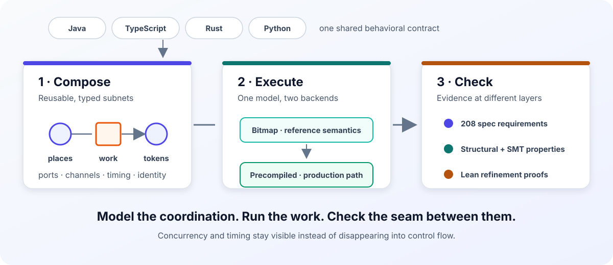
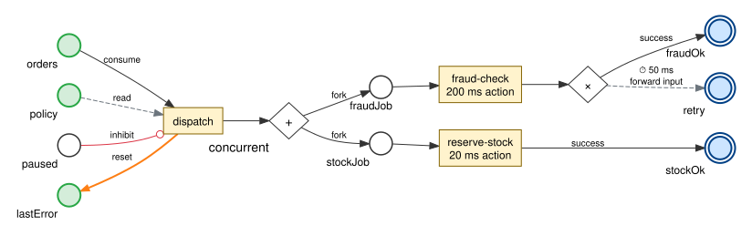

# libpetri

[](https://github.com/debe/libpetri/actions/workflows/ci.yml)
[](https://central.sonatype.com/artifact/org.libpetri/libpetri)
[](https://www.npmjs.com/package/libpetri)
[](https://crates.io/crates/libpetri)
[](https://pypi.org/project/libpetri/)
[](LICENSE)

**Build concurrent, time-aware systems from reusable Petri-net modules—and check their behavior before they run.**

libpetri is a Coloured Time Petri Net engine for Java, TypeScript, Rust, and Python. Places hold typed data, transitions perform work, arcs describe data flow, and timing constraints make deadlines part of the model. The net is not merely a diagram: it is the program the runtime executes.

Use it for workflow and agent orchestration, protocols, game logic, UI state machines, or other systems where concurrency, correlation, and timing are easier to see as a graph than as nested control flow.

<p align="center">
  
</p>

## Choose an implementation

All four APIs follow the same [language-agnostic specification](spec/00-index.md). Java, TypeScript, and Rust implement it independently; Python binds the Rust runtime through PyO3.

| Language | Runtime | Maturity | Install | Guide |
|---|---|---:|---|---|
| Java 25 | `CompletionStage` actions | Production | `org.libpetri:libpetri:3.0.1` | [Java guide](java/README.md) |
| TypeScript 6 | Promises and the event loop | Production | `npm install libpetri` | [TypeScript guide](typescript/README.md) |
| Rust 2024 | Tokio | Production | `cargo add libpetri --features tokio` | [Rust guide](rust/README.md) |
| Python ≥3.11 | Tokio through PyO3 | Beta | `pip install libpetri` | [Python guide](python/README.md) |

## Why a Petri net?

This small order workflow shows the difference from an ordinary task queue. The graph declares not only *what code runs*, but also the state that enables it, the state it observes, what it clears, which work may run concurrently, and what happens when work is late.

<p align="center">
  
</p>

```typescript
import {
  BitmapNetExecutor, PetriNet, Transition, and, forwardInput,
  one, outPlace, place, timeout, tokenOf, xor,
} from 'libpetri';

const orders = place<string>('orders');
const policy = place<string>('policy');
const paused = place<void>('paused');
const lastError = place<string>('lastError');
const fraudJob = place<string>('fraudJob');
const stockJob = place<string>('stockJob');
const fraudOk = place<string>('fraudOk');
const stockOk = place<string>('stockOk');
const retry = place<string>('retry');

const dispatch = Transition.builder('dispatch')
  .inputs(one(orders))                    // consume one order
  .read(policy)                            // observe policy; keep its token
  .inhibitor(paused)                       // block while paused has a token
  .reset(lastError)                        // clear stale failure state
  .outputs(and(outPlace(fraudJob), outPlace(stockJob))) // fork
  .action(async (ctx) => {
    const order = ctx.input(orders);
    ctx.read(policy);
    ctx.output(fraudJob, order);
    ctx.output(stockJob, order);
  })
  .build();

const fraud = Transition.builder('fraud-check')
  .inputs(one(fraudJob))
  .outputs(xor(
    outPlace(fraudOk),
    timeout(50, forwardInput(fraudJob, retry)), // preserve order on timeout
  ))
  .action(async (ctx) => {
    await new Promise(resolve => setTimeout(resolve, 200)); // slow service
    ctx.output(fraudOk, ctx.input(fraudJob));
  })
  .build();

const stock = Transition.builder('reserve-stock')
  .inputs(one(stockJob))
  .outputs(outPlace(stockOk))
  .action(async (ctx) => {
    await new Promise(resolve => setTimeout(resolve, 20));
    ctx.output(stockOk, ctx.input(stockJob));
  })
  .build();

const net = PetriNet.builder('orders')
  .transitions(dispatch, fraud, stock)
  .build();

const executor = new BitmapNetExecutor(
  net,
  new Map([
    [orders, [tokenOf('order-42')]],
    [policy, [tokenOf('standard')]],
    [lastError, [tokenOf('previous attempt failed')]],
  ]),
);

const result = await executor.run();
console.log(result.peekFirst(stockOk)?.value); // order-42
console.log(result.peekFirst(retry)?.value);   // order-42
```

After `dispatch` fires, `fraud-check` and `reserve-stock` are both enabled. Their promises run concurrently; the orchestrator does not wait for one before starting the other. Stock completes normally, while the 50 ms timeout routes the original order to `retry` and isolates the late fraud result.

That is the “why”: coordination policy is explicit and inspectable. A viewer can see the consumed resource, shared read-only state, pause condition, reset, concurrent fan-out, and timeout path without reconstructing them from callbacks, locks, and error handlers. The same structure drives execution, DOT diagrams, event traces, and verification.

`BitmapNetExecutor` is the readable reference implementation. For production hot paths, compile once and run with `PrecompiledNetExecutor`, which preserves the same firing semantics using flat arrays, opcode streams, ring buffers, and priority-partitioned ready queues.

## What the model gives you

- **Composition without hidden wiring.** Define open subnets with typed ports and synchronous channels, instantiate them under scoped names, bind them into larger nets, and fuse places that intentionally share state. Composition produces a flat net that can be executed, exported, and verified like a hand-written one.
- **Precise execution semantics.** Model input cardinality, read/inhibitor/reset arcs, AND/XOR/timeout output routing, priorities, and immediate, delayed, windowed, exact, or deadline-constrained transitions.
- **Concurrency with correlation.** Actions may complete asynchronously while one orchestrator owns the marking. ν-net names let a fork mint an identity and a join reunite the correct sibling tokens instead of relying on an external check-then-act lookup.
- **Long-running and observable workflows.** Environment places accept external events. Thirteen event types, pluggable event stores, DOT export, and the debug protocol expose what fired, what moved, and why a net is waiting.
- **Analysis before execution.** Check deadlock freedom, mutual exclusion, place bounds, and unreachability with structural analysis, timed state-class graphs, and SMT/IC3 where supported.

The full contract covers **208 active requirements** across the core model, I/O, timing, execution, concurrency, environment places, verification, observability, export, performance, modular composition, and ν-nets. Start with the [specification index](spec/00-index.md) when exact behavior matters.

## Evidence, not just an API

libpetri uses three complementary levels of assurance:

1. **A shared executable contract.** Java, TypeScript, and Rust have independent implementations and conformance tests. Python inherits the Rust engine and tests its FFI surface separately.
2. **Model-level verification.** Structural checks, state-class exploration, and SMT/IC3 prove selected safety properties of a net. As with any abstraction, the result is only as sound as the relationship between the model and executor.
3. **Machine-checked metatheory.** The dependency-free [Lean 4 development](lean/README.md) checks that relationship at two important seams.

The Lean development proves:

- `proposition_one`: the verifier's untimed abstraction over-approximates concrete reachability under its stated hypotheses. Guard-free consumption now holds by construction; unrestricted action output multiplicity remains an explicit boundary.
- `token_conservation`: one precompiled firing accounts exactly for delivered, reset-destroyed, and surviving tokens—without loss, duplication, or reordering.
- `precompiled_refines_bitmap_immediate`: across any number of cycles in the untimed immediate fragment, the precompiled backend agrees with the bitmap reference on markings and firing decisions.
- `collect_ready_general_refines`: the general ready-queue path produces the same deterministic priority/FIFO/tid order as the reference scheduler.

The models also reproduce historical verifier and executor defects, including wrong ready ordering, read/reset ordering, duplicate-input failure, and unknown-place token loss. This matters because a model that cannot see real divergences offers weak evidence about the code it describes.

The proof boundary is deliberate: the full timed cycle, asynchronous action plumbing, and complete ν-match/cache lockstep are not yet refined end to end. CI runs `lake build`, rejects `sorry` and `admit`, and checks the headline theorems for unexpected axioms. See [`lean/README.md`](lean/README.md) for the theorem map, assumptions, counterexamples, and maintenance obligation.

## See it at scale

- **A Petri net that debugs Petri nets.** The [debug UI](debug-ui/) models its own connection, session, replay, breakpoint, search, and archive lifecycle as a 55-transition, 53-place net assembled from 13 subnets. [View the exported net](docs/showcase-debug-ui.svg).
- **A complete Java 25 parser.** The [`examples/java-parser/`](examples/java-parser/) example compiles 167 grammar productions into 2,335 places and 2,326 transitions, then parses libpetri's own Java sources with the precompiled executor. [View the full net](docs/example-java-parser.svg).
- **A reusable order pipeline.** The project examples combine timed approvals, parallel work, and failure paths in a conventional workflow shape. [View the pipeline](docs/showcase-order-pipeline.svg).

These are stress tests and design examples, not an argument that every program should be expressed as a Petri net. libpetri is most useful when the graph makes concurrency, timing, resource ownership, or coordination easier to reason about.

## Build and test

```bash
# Java
cd java && ./mvnw verify

# TypeScript
cd typescript && npm install && npm run check && npm test

# Rust (the workspace CI gate)
cd rust && cargo test --workspace --exclude libpetri-py --all-features

# Python
cd python && pip install -e '.[dev]' && maturin develop && pytest

# Lean proofs
cd lean && lake build
```

Package-specific guides contain the complete APIs and setup details. For behavioral changes and known fixes, see the [changelog](CHANGELOG.md). For benchmark methodology and reproducible commands, see the [performance specification](spec/10-performance.md) and each implementation's benchmark suite.

## License

[Apache License 2.0](LICENSE)
