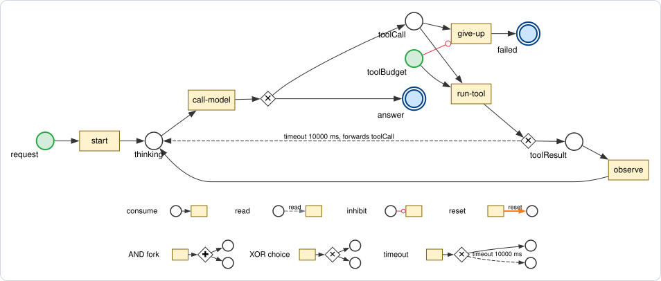
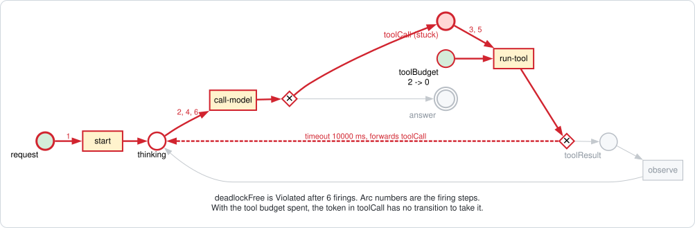
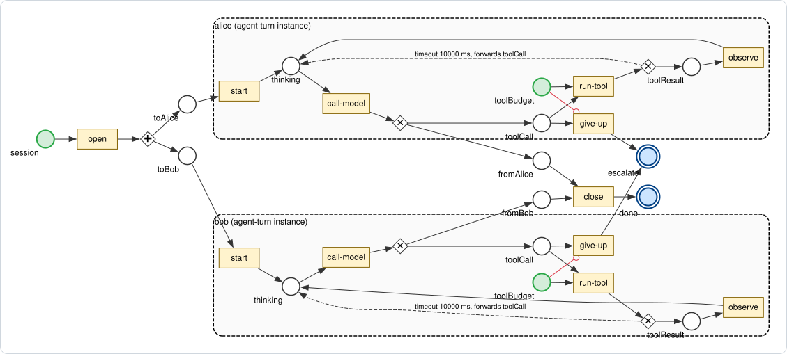
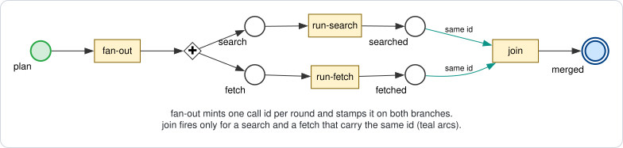
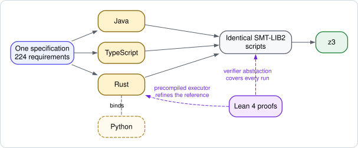

# libpetri

[](https://github.com/debe/libpetri/actions/workflows/ci.yml)
[](https://central.sonatype.com/artifact/org.libpetri/libpetri)
[](https://www.npmjs.com/package/libpetri)
[](https://crates.io/crates/libpetri)
[](https://pypi.org/project/libpetri/)
[](LICENSE)

**Model concurrent, time-aware workflows as Petri nets, run them, and check them before they ship.**

libpetri is a Coloured Time Petri Net engine for Java, TypeScript, Rust and Python. You describe a workflow as
places that hold typed tokens and transitions that do the work. The runtime executes that net, the exporter
draws it, and the verifier proves properties of it or returns the run that breaks them.

<p align="center">
  
</p>

The net above is one turn of an LLM agent. The rest of this page reads it, runs it, checks it, and composes it
into larger nets. Every diagram, verdict and trace on this page is generated from code by
[`scripts/readme-images.ts`](scripts/readme-images.ts).

## The problem

An agent turn looks simple: ask the model, maybe call a tool, feed the result back, answer. In code the
coordination spreads across callbacks, retry counters, time-outs and error handlers. The failures show up late.
A turn waits forever for a permit that was never returned. A tool result arrives after its turn gave up. A
retry loop has no bound. libpetri makes that coordination the program: each state a turn can be in is a place,
each step is a transition, and the arcs say exactly what a step needs, what it blocks on and what it produces.

## An agent turn as a net

Circles are places, boxes are transitions. A token in `thinking` enables `call-model`. Its action asks the model
and puts the turn into either `toolCall` or `answer` (an XOR output). `run-tool` needs a tool call and one
permit from `toolBudget`. If the tool does not answer within 10 seconds, the timeout branch sends the turn back
to `thinking`. `give-up` fires only while `toolBudget` is empty (an inhibitor arc) and moves the turn to
`failed`.

```typescript
import {
  PetriNet, Transition, forwardInput, one, outPlace, place, timeout, transformFrom, xor,
} from 'libpetri';

type Turn = { question: string; notes: string[] };
type Reply = { tool: string } | { answer: string };

const request = place<string>('request');
const thinking = place<Turn>('thinking');
const toolCall = place<Turn>('toolCall');
const toolResult = place<{ turn: Turn; result: string }>('toolResult');
const toolBudget = place<null>('toolBudget');   // k permits, never refunded
const answer = place<string>('answer');
const failed = place<Turn>('failed');

function agentTurn(model: (t: Turn) => Promise<Reply>, tool: (t: Turn) => Promise<string>) {
  const start = Transition.builder('start')
    .inputs(one(request)).outputs(outPlace(thinking))
    .action(transformFrom(request, question => ({ question, notes: [] })))
    .build();
  const callModel = Transition.builder('call-model')
    .inputs(one(thinking)).outputs(xor(outPlace(toolCall), outPlace(answer)))
    .action(async ctx => {
      const turn = ctx.input(thinking), reply = await model(turn);
      if ('answer' in reply) ctx.output(answer, reply.answer);
      else ctx.output(toolCall, { ...turn, notes: [...turn.notes, `call ${reply.tool}`] });
    })
    .build();
  const runTool = Transition.builder('run-tool')
    .inputs(one(toolCall), one(toolBudget))
    .outputs(xor(outPlace(toolResult), timeout(10_000, forwardInput(toolCall, thinking))))
    .action(async ctx => {
      const turn = ctx.input(toolCall);
      ctx.output(toolResult, { turn, result: await tool(turn) });
    })
    .build();
  const observe = Transition.builder('observe')
    .inputs(one(toolResult)).outputs(outPlace(thinking))
    .action(transformFrom(toolResult, ({ turn, result }) => ({ ...turn, notes: [...turn.notes, result] })))
    .build();
  const giveUp = Transition.builder('give-up')       // the fix: budget spent, stop
    .inputs(one(toolCall)).inhibitor(toolBudget).outputs(outPlace(failed))
    .action(transformFrom(toolCall, turn => turn))
    .build();
  return PetriNet.builder('agent-turn')
    .transitions(start, callModel, runTool, observe, giveUp).build();
}
```

The legend under the diagram also shows the arc kinds this net does not use. A read arc lets a transition see a
token without taking it. A reset arc empties a place when the transition fires. An AND output forks work to
several places at once. Transitions can also carry timing (`delayed`, `window`, `deadline`, `exact`) and
priorities. The [TypeScript guide](typescript/README.md#every-arc-kind-in-one-workflow) has a workflow that uses
every arc kind, and the Java, Rust and Python guides build nets with the same builder API.

## Running the net

The net is the program. Put a question in `request`, two permits in `toolBudget`, and run it with a stub model
that asks for one tool and then answers. The executor fires this sequence:

```text
start       request                ->  thinking
call-model  thinking               ->  toolCall
run-tool    toolCall + toolBudget  ->  toolResult
observe     toolResult             ->  thinking
call-model  thinking               ->  answer

answer: "answer from 2 notes"
```

One orchestrator owns the marking and starts every enabled action without waiting for earlier ones, so two
turns in flight call their models at the same time. Every firing is an event: 13 event types go to a pluggable
event store, the DOT exporter draws the net, and the [debug UI](debug-ui/) replays a run step by step.

`BitmapNetExecutor` is the reference implementation and the one to read. `PrecompiledNetExecutor` compiles the
same net into flat arrays, opcode streams, ring buffers and priority-partitioned ready queues. It has the same
firing semantics, is 1.5 to 4 times faster on synchronous chains, and is the one to deploy.

## Checking the net before it runs

The first version of this net had no `give-up` transition. Ask the verifier whether a turn can get stuck:

```typescript
import { SmtVerifier, deadlockFree } from 'libpetri/verification';

function verifyTurn(net: PetriNet) {
  return SmtVerifier.forNet(net)
    .initialMarking(m => m.tokens(request, 1).tokens(toolBudget, 2))
    .property(deadlockFree())
    .sinkPlaces(answer, failed, toolBudget)   // unspent permits may remain
    .verify();
}
```

`deadlockFree` holds when no run comes to rest with a token outside the sink places. Without `give-up` the answer is
**Violated**, with a six-step run: two tool calls time out, the model asks for a third tool, and no permit is
left. The turn sits in `toolCall` and no transition can take it.

<p align="center">
  
</p>

The counterexample is a real firing sequence from the initial marking, drawn on the net. Adding `give-up`, one
transition with an inhibitor arc on `toolBudget`, turns the verdict into **Proven**. These two verdicts come from
the enumeration route, which explores every reachable state of this small net. So does the session check below;
the ν fan-out at the end of the next section is decided by the ν route.

The verifier offers these properties:

| Property | Holds when |
|---|---|
| `deadlockFree()` | no run comes to rest with a token outside the declared sink places |
| `terminatesAtSink()` | every run that comes to rest has reached a declared sink place |
| `placeBound(p, k)` | `p` never holds more than `k` tokens |
| `unreachable(places)` | no reachable marking puts tokens in all of `places` |
| `mutualExclusion(p, q)` | `p` and `q` are never marked together |
| `quiescentCount(places, min, max)` | when the net comes to rest, the token count in `places` is within bounds |

Several routes decide them. Structural checks (siphons and traps, a linear bound from the state equation) prove
a property without exploring states. An enumeration of the state-class graph decides small and medium nets
exactly. For larger nets the verifier encodes the net for the `z3` SMT solver and runs IC3/PDR. The result
names the route that decided it. When no route finishes within the class budget or the time budget
(`totalBudget`), the verdict is **Unknown** and the result gives the reason.

The SMT encoding ignores timing, so its proofs cover every timed run as well. A violation found that way may need
timing the real net never allows. The result says so in `counterexampleTiming`, and
`timedCounterexampleCheck(true)` checks it again on the timed state-class graph.

## Subnets and correlated fan-out

A net this size is readable. A product has dozens of them. libpetri composes nets from subnets with typed ports.
Here the turn loop is a subnet with an input port and two output ports, instantiated twice in a session host. The
instances keep their own places (`alice/toolBudget`, `bob/toolBudget`), and the exporter draws each one as a
cluster.

<p align="center">
  
</p>

Composition produces one flat net, so the session is executed, exported and verified like a hand-written one.
Its `deadlockFree` check is **Proven**, with one declared exception: after an escalation the other agent's answer
may stay in `fromAlice` or `fromBob`. Place fusion shares state on purpose, and synchronous channels merge
transitions across subnets. See [modular composition](spec/11-modular-composition.md).

Parallel tool calls raise a second problem. When a turn fans out a search and a fetch, the join must combine the
results of the same call. With several turns in flight a plain join could pair the search of one call with the
fetch of another. libpetri solves this with ν-nets: `fan-out` mints a call id and stamps it on both branches, and
`join` fires only for two tokens that carry the same id.

<p align="center">
  
</p>

The verifier checks the join by id. With two plans in flight this net is **Proven** deadlock-free through the
ν route, which tracks ids up to renaming. `fan-out` is declared as a mint (`mintTransitions('fan-out')`): the
verifier cannot tell from an action whether it writes a fresh id or copies one it received, so it reads a write
as fresh only where the net says so. The branch places are declared as carrier places so the verifier knows the
id travels through them. See [ν-nets](spec/12-nu-nets.md).

## How the checker is checked

A verifier is only useful if its model matches what the runtime does. libpetri backs that up in three layers.

<p align="center">
  
</p>

1. **One specification.** [224 requirements](spec/00-index.md) with acceptance criteria define the model, the
   execution loop, timing, composition, ν-nets and verification. Java, TypeScript and Rust implement it
   independently, and each runs its own conformance tests. Python binds the Rust engine and tests its binding.
2. **Identical solver input.** The three implementations write byte-identical SMT-LIB2 scripts for every fixture.
   Rust writes the reference copies in [`spec/verification-fixtures/scripts/`](spec/verification-fixtures/scripts/)
   and every language diffs against them in CI.
3. **Machine-checked proofs.** The [Lean 4 development](lean/README.md) proves the two seams the other layers
   rely on:
   - `proposition_one`: the verifier's untimed abstraction covers every concrete run, under stated hypotheses.
     Guard-free consumption holds by construction. Unrestricted action output multiplicity is an explicit
     boundary.
   - `token_conservation`: one precompiled firing accounts exactly for delivered, reset and surviving tokens,
     with no loss, duplication or reordering.
   - `precompiled_refines_bitmap_immediate`: over any number of cycles in the untimed immediate fragment, the
     precompiled backend makes the same firing decisions and reaches the same markings as the reference.
   - `collect_ready_general_refines`: the general ready-queue path orders transitions by priority, FIFO and id
     exactly as the reference scheduler does.

The Lean models are pinned to the Rust functions they describe by content hash, so a change to the Rust fails CI
until the model is re-read. They also reproduce historical defects (wrong ready ordering, read and reset
ordering, a duplicate-input failure, lost tokens on unknown places). A model that could not show those bugs would
say little about the code. The full timed cycle, the asynchronous action plumbing and the ν match cache are not
yet refined end to end. CI runs `lake build`, rejects `sorry` and `admit`, and checks the headline theorems for
unexpected axioms. [`lean/README.md`](lean/README.md) has the theorem map and assumptions, and the
[interactive proof graph](https://libpetri.org/proof-graph/) shows which declarations each proved requirement
depends on.

## Where it is used

**Agent orchestration without a framework.** The turn loop on this page is the whole pattern: model calls, tool
calls, retries, budgets and time-outs as places and transitions, with the model call inside a transition action.
The same net goes to the verifier. The [design skill](#design-help-in-your-coding-agent) teaches this shape.

Two projects replace the scheduling core of an existing orchestrator with a libpetri net and leave the rest of
the product alone:

- **[adk-libpetri](https://github.com/debe/adk-libpetri)** for Google ADK Java. One coloured net, composed from
  typed subnets, replaces `SequentialAgent`, `ParallelAgent`, `LoopAgent`, `BaseLlmFlow`, `AgentTransfer` and the
  RxJava `Runner`. The stock ADK `Runner` still drives turn-based sessions through `PetriAgent`, and
  `BidiPetriAgent` bridges live and BIDI providers. Z3 proves both demo nets deadlock-free on every build. It
  forks neither ADK nor genai. Maven Central: `org.libpetri:adk-libpetri` (0.x, so a minor version may break the
  API).
- **[n8n-libpetri](https://github.com/debe/n8n-libpetri)** for n8n. A compiler turns a workflow into a net and a
  kernel runs that net to quiescence, so the graph decides what runs next instead of n8n's scheduling loop.
  Concurrency, cycles, joins, retries, resource limits and terminal states become places, transitions and arcs.
  The editor, workflow format, credentials, node implementations, persistence, webhooks and queue mode stay as
  they are. Two patches add the registration seam, and with nothing registered n8n runs its own loop.

**Large nets.** These are stress tests and design examples. They do not argue that every program should be a
Petri net.

- The [debug UI](debug-ui/) runs its own connection, session, replay, breakpoint, search and archive lifecycle as
  one net of 74 transitions and 74 places. [View the net](docs/showcase-debug-ui.svg).
- [`examples/java-parser/`](examples/java-parser/) compiles 167 grammar productions of Java 25 into 2,335 places
  and 2,326 transitions and parses libpetri's own Java sources with the precompiled executor.
  [View the net](docs/example-java-parser.svg).

## Get started

All four packages follow the [specification](spec/00-index.md). The badges at the top show the current versions.

| Language | Runtime | Maturity | Install | Guide |
|---|---|---|---|---|
| Java 25 | `CompletionStage` actions | Production | Maven `org.libpetri:libpetri` | [Java guide](java/README.md) |
| TypeScript 6 | Promises and the event loop | Production | `npm install libpetri` | [TypeScript guide](typescript/README.md) |
| Rust 2024 | Tokio | Production | `cargo add libpetri --features tokio` | [Rust guide](rust/README.md) |
| Python ≥3.11 | Tokio through PyO3 | Beta | `pip install libpetri` | [Python guide](python/README.md) |

Verification runs the `z3` executable, version 4.8.0 or newer, found on `PATH` or through `LIBPETRI_Z3`.

### Design help in your coding agent

The repository ships a skill that teaches how to design nets: data carried in tokens, decisions as
topology, budgets and permits as places, reusable subnets, fork and join by identity, and how to keep proofs
cheap as a net grows. It is language agnostic, with a short appendix per implementation.

Claude Code:

```
/plugin marketplace add debe/libpetri
/plugin install libpetri@libpetri
```

Codex, opencode and oh-my-pi all read `~/.agents/skills`, so one symlink installs it in all three:

```bash
git clone --depth 1 https://github.com/debe/libpetri.git ~/.local/share/libpetri
mkdir -p ~/.agents/skills
ln -s ~/.local/share/libpetri/plugins/libpetri/skills/petri-net-design \
      ~/.agents/skills/petri-net-design
```

The skill activates when you model a workflow as a net, add places or transitions, debug a net that stalls, or
ask why a verification returned `Unknown`. In Claude Code you can also invoke it with
`/libpetri:petri-net-design`. Inside a libpetri checkout it needs no install. Per-harness alternatives,
verification commands and the Windows note are in [`plugins/libpetri/README.md`](plugins/libpetri/README.md).
The source is in [`plugins/libpetri/skills/petri-net-design/`](plugins/libpetri/skills/petri-net-design/). Its
principles come from the specification and from a production system whose two long-lived session nets each carry
a whole-net deadlock-freedom proof.

## Build and test

```bash
# Java
cd java && ./mvnw verify

# TypeScript
cd typescript && npm install && npm run check && npm test

# Rust (the workspace CI gate)
cd rust && cargo test --workspace --exclude libpetri-py --all-features

# Python
cd python && pip install -e '.[dev]' && maturin develop && pytest

# Lean proofs (fetches prebuilt Mathlib oleans)
cd lean && lake exe cache get && lake build

# Regenerate the diagrams, verdicts and traces on this page (needs z3)
cd typescript && npx tsx ../scripts/readme-images.ts
```

Each package guide covers its full API and setup. The [changelog](CHANGELOG.md) lists behaviour changes and
fixes. Benchmark methodology is in the [performance specification](spec/10-performance.md).

## License

[Apache License 2.0](LICENSE)
