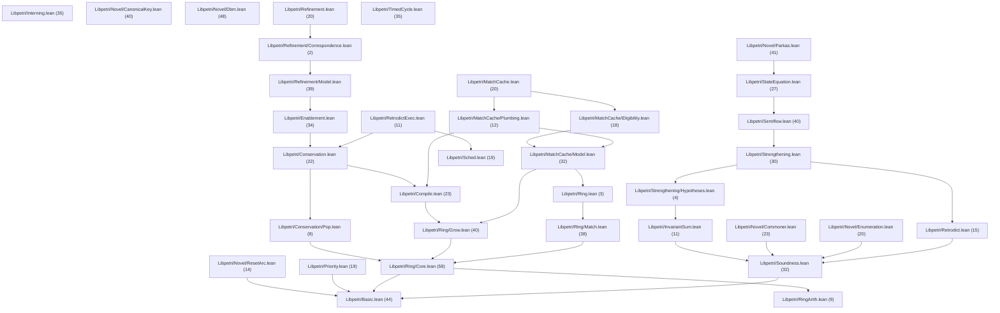

# Module overview

Generated by `scripts/proof-graph.py` from `proof-graph.json`. Do not edit.

An arrow `A --> B` means a declaration in file A uses one in file B (transitively reduced).

```mermaid
flowchart TD
  f0["Libpetri/Basic.lean (44)"]
  f1["Libpetri/Compile.lean (23)"]
  f2["Libpetri/Conservation.lean (22)"]
  f3["Libpetri/Conservation/Pop.lean (8)"]
  f4["Libpetri/Enablement.lean (34)"]
  f5["Libpetri/Interning.lean (35)"]
  f6["Libpetri/InvariantSum.lean (11)"]
  f7["Libpetri/MatchCache.lean (20)"]
  f8["Libpetri/MatchCache/Eligibility.lean (18)"]
  f9["Libpetri/MatchCache/Model.lean (32)"]
  f10["Libpetri/MatchCache/Plumbing.lean (12)"]
  f11["Libpetri/Novel/CanonicalKey.lean (40)"]
  f12["Libpetri/Novel/Commoner.lean (23)"]
  f13["Libpetri/Novel/Dbm.lean (48)"]
  f14["Libpetri/Novel/Enumeration.lean (20)"]
  f15["Libpetri/Novel/Farkas.lean (41)"]
  f16["Libpetri/Novel/ResetArc.lean (14)"]
  f17["Libpetri/Priority.lean (19)"]
  f18["Libpetri/Refinement.lean (20)"]
  f19["Libpetri/Refinement/Correspondence.lean (2)"]
  f20["Libpetri/Refinement/Model.lean (39)"]
  f21["Libpetri/Retrodict.lean (15)"]
  f22["Libpetri/RetrodictExec.lean (11)"]
  f23["Libpetri/Ring.lean (3)"]
  f24["Libpetri/Ring/Core.lean (58)"]
  f25["Libpetri/Ring/Grow.lean (40)"]
  f26["Libpetri/Ring/Match.lean (38)"]
  f27["Libpetri/RingArith.lean (9)"]
  f28["Libpetri/Sched.lean (19)"]
  f29["Libpetri/Semiflow.lean (40)"]
  f30["Libpetri/Soundness.lean (32)"]
  f31["Libpetri/StateEquation.lean (27)"]
  f32["Libpetri/Strengthening.lean (30)"]
  f33["Libpetri/Strengthening/Hypotheses.lean (4)"]
  f34["Libpetri/TimedCycle.lean (35)"]
  f1 --> f25
  f2 --> f1
  f2 --> f3
  f3 --> f24
  f4 --> f2
  f6 --> f30
  f7 --> f8
  f7 --> f10
  f8 --> f9
  f9 --> f23
  f9 --> f25
  f10 --> f1
  f10 --> f9
  f12 --> f30
  f14 --> f30
  f15 --> f31
  f16 --> f0
  f17 --> f0
  f18 --> f19
  f19 --> f20
  f20 --> f4
  f21 --> f30
  f22 --> f2
  f22 --> f28
  f23 --> f26
  f24 --> f0
  f24 --> f27
  f25 --> f24
  f26 --> f24
  f29 --> f32
  f30 --> f0
  f31 --> f29
  f32 --> f21
  f32 --> f33
  f33 --> f6
```
