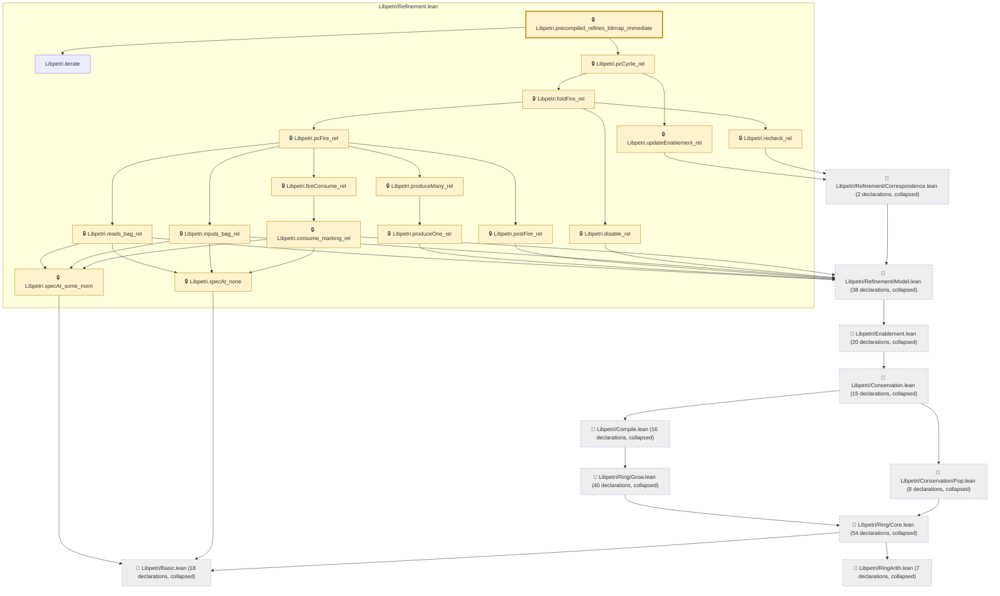

# CONC-021

Generated by `scripts/proof-graph.py` from `proof-graph.json`. Do not edit.

Theorems carrying this ID:

- `Libpetri.precompiled_refines_bitmap_immediate` (theorem, `Libpetri/Refinement.lean:410`) 🔒 locked

> **Note:** the full tree has 235 nodes (limit 60).

> Rule: this theorem's tree has 235 nodes (limit 60); every file other than its own is collapsed into one node, leaving 27.

Axioms used:

- `Libpetri.precompiled_refines_bitmap_immediate`: `Quot.sound`, `propext`
