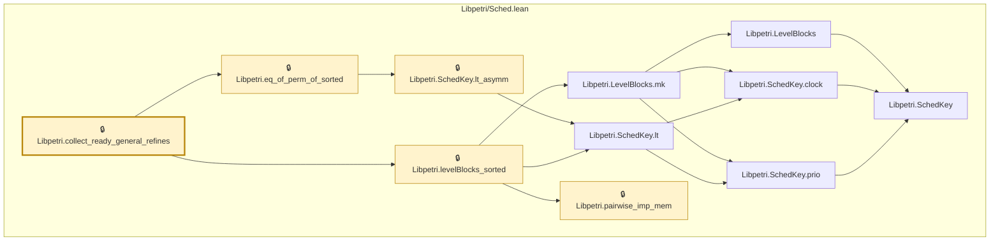

# CONC-023

Generated by `scripts/proof-graph.py` from `proof-graph.json`. Do not edit.

Theorems carrying this ID:

- `Libpetri.collect_ready_general_refines` (theorem, `Libpetri/Sched.lean:173`) 🔒 locked

Axioms used:

- `Libpetri.collect_ready_general_refines`: `Quot.sound`, `propext`
