# CORE-034

Generated by `scripts/proof-graph.py` from `proof-graph.json`. Do not edit.

Theorems carrying this ID:

- `Libpetri.Novel.ResetArc.fireA_reset_empty` (theorem, `Libpetri/Novel/ResetArc.lean:137`)
- `Libpetri.Novel.ResetArc.reset_arc_semantics` (theorem, `Libpetri/Novel/ResetArc.lean:154`)

```mermaid
flowchart TD
  subgraph g0["Libpetri/Basic.lean"]
    n0["Libpetri.AMarking"]
    n6["Libpetri.CMarking"]
    n8["Libpetri.Card"]
    n9["Libpetri.Card.all"]
    n10["Libpetri.Card.atLeast"]
    n11["Libpetri.Card.consumesAll"]
    n12["Libpetri.Card.exactly"]
    n13["Libpetri.Card.one"]
    n14["Libpetri.Card.required"]
    n21["Libpetri.Colour"]
    n74["Libpetri.Guard"]
    n76["Libpetri.InSpec"]
    n77["Libpetri.InSpec.card"]
    n78["Libpetri.InSpec.guard"]
    n80["Libpetri.InSpec.place"]
    n2374["Libpetri.PlaceId"]
    n2605["Libpetri.Transition"]
    n2606["Libpetri.Transition.inhibitors"]
    n2607["Libpetri.Transition.inputs"]
    n2608["Libpetri.Transition.mk"]
    n2609["Libpetri.Transition.name"]
    n2610["Libpetri.Transition.priority"]
    n2611["Libpetri.Transition.reads"]
    n2612["Libpetri.Transition.resets"]
    n2633["Libpetri.alphaFireC"]
    n2682["Libpetri.consumeAllAt"]
    n2683["Libpetri.consumeCount"]
    n2696["Libpetri.consumedAt"]
    n2735["Libpetri.enabledC"]
    n2756["Libpetri.fireA"]
    n2822["Libpetri.matchCount"]
    n2852["Libpetri.post"]
    n2857["Libpetri.pre"]
    n2912["Libpetri.specAt"]
  end
  subgraph g1["Libpetri/Novel/ResetArc.lean"]
    n951["Libpetri.Novel.ResetArc.OnlyReset"]
    n952["Libpetri.Novel.ResetArc.all_congr_mem"]
    n953["Libpetri.Novel.ResetArc.alphaFireC_reset"]
    n954["Libpetri.Novel.ResetArc.alphaFireC_reset_empty"]
    n956["Libpetri.Novel.ResetArc.emptyAt"]
    n959["Libpetri.Novel.ResetArc.enabledC_congr_off"]
    n960["Libpetri.Novel.ResetArc.enabledC_emptyAt"]
    n961["Libpetri.Novel.ResetArc.enabledC_resets"]
    n962["Libpetri.Novel.ResetArc.fireA_reset"]
    n963["Libpetri.Novel.ResetArc.fireA_reset_empty"]
    n964["Libpetri.Novel.ResetArc.reset_arc_semantics"]
  end
  n0 --> n2374
  n6 --> n21
  n6 --> n2374
  n9 --> n8
  n10 --> n8
  n11 --> n9
  n11 --> n10
  n11 --> n12
  n11 --> n13
  n12 --> n8
  n13 --> n8
  n14 --> n9
  n14 --> n10
  n14 --> n12
  n14 --> n13
  n74 --> n21
  n77 --> n8
  n77 --> n76
  n78 --> n74
  n78 --> n76
  n80 --> n76
  n80 --> n2374
  n951 --> n80
  n951 --> n2606
  n951 --> n2607
  n951 --> n2611
  n953 --> n2633
  n954 --> n953
  n956 --> n6
  n959 --> n951
  n959 --> n952
  n959 --> n2735
  n960 --> n956
  n960 --> n959
  n961 --> n2608
  n961 --> n2609
  n961 --> n2610
  n961 --> n2735
  n962 --> n2756
  n963 --> n962
  n964 --> n954
  n964 --> n960
  n964 --> n961
  n2606 --> n2374
  n2606 --> n2605
  n2607 --> n76
  n2607 --> n2605
  n2608 --> n76
  n2608 --> n2374
  n2608 --> n2605
  n2609 --> n2605
  n2610 --> n2605
  n2611 --> n2374
  n2611 --> n2605
  n2612 --> n2374
  n2612 --> n2605
  n2633 --> n0
  n2633 --> n2612
  n2633 --> n2696
  n2682 --> n11
  n2682 --> n77
  n2682 --> n2912
  n2683 --> n11
  n2683 --> n14
  n2683 --> n77
  n2683 --> n2822
  n2696 --> n2683
  n2696 --> n2912
  n2735 --> n14
  n2735 --> n77
  n2735 --> n2606
  n2735 --> n2607
  n2735 --> n2611
  n2735 --> n2822
  n2756 --> n0
  n2756 --> n2612
  n2756 --> n2682
  n2756 --> n2852
  n2756 --> n2857
  n2822 --> n6
  n2822 --> n78
  n2822 --> n80
  n2852 --> n2374
  n2857 --> n14
  n2857 --> n77
  n2857 --> n2912
  n2912 --> n80
  n2912 --> n2607
  classDef root stroke-width:3px
  classDef locked fill:#fff3cd,stroke:#b8860b
  classDef collapsed fill:#eeeeee,stroke-dasharray:4 4
  class n963,n964 root
```

Axioms used:

- `Libpetri.Novel.ResetArc.fireA_reset_empty`: `propext`
- `Libpetri.Novel.ResetArc.reset_arc_semantics`: `propext`
