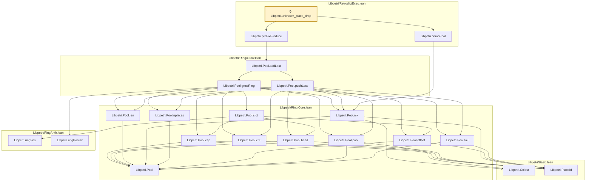

# CORE-072

Generated by `scripts/proof-graph.py` from `proof-graph.json`. Do not edit.

Theorems carrying this ID:

- `Libpetri.unknown_place_drop` (theorem, `Libpetri/RetrodictExec.lean:146`) 🔒 locked

Axioms used:

- `Libpetri.unknown_place_drop`: none
