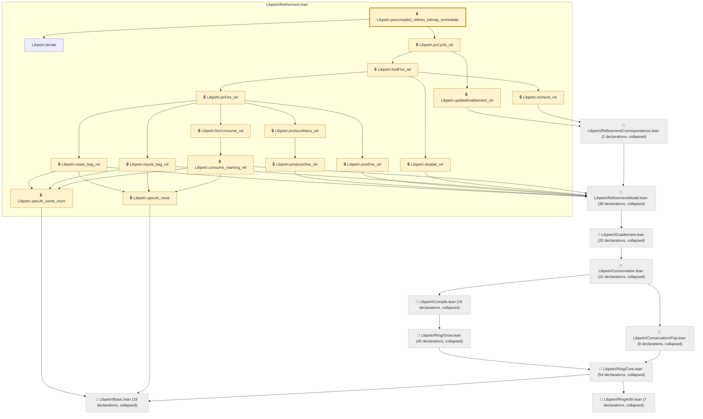

# EXEC-003

Generated by `scripts/proof-graph.py` from `proof-graph.json`. Do not edit.

Theorems carrying this ID:

- `Libpetri.disable_frame` (theorem, `Libpetri/Enablement.lean:299`) 🔒 locked
- `Libpetri.precompiled_refines_bitmap_immediate` (theorem, `Libpetri/Refinement.lean:410`) 🔒 locked
- `Libpetri.updateEnablement_sync` (theorem, `Libpetri/Enablement.lean:375`) 🔒 locked

> **Note:** the full tree has 238 nodes (limit 60), so it is drawn as one diagram per theorem (3 theorems).

### `Libpetri.disable_frame`

> Rule: this theorem's whole tree, 26 nodes.

```mermaid
flowchart TD
  subgraph g0["Libpetri/Basic.lean"]
    n8["Libpetri.Card"]
    n9["Libpetri.Card.all"]
    n10["Libpetri.Card.atLeast"]
    n12["Libpetri.Card.exactly"]
    n13["Libpetri.Card.one"]
    n14["Libpetri.Card.required"]
    n76["Libpetri.InSpec"]
    n77["Libpetri.InSpec.card"]
    n80["Libpetri.InSpec.place"]
    n2374["Libpetri.PlaceId"]
    n2605["Libpetri.Transition"]
    n2606["Libpetri.Transition.inhibitors"]
    n2607["Libpetri.Transition.inputs"]
    n2611["Libpetri.Transition.reads"]
  end
  subgraph g1["Libpetri/Compile.lean"]
    n2670["Libpetri.canEnable"]
  end
  subgraph g2["Libpetri/Enablement.lean"]
    n2368["Libpetri.PBState"]
    n2369["Libpetri.PBState.dirty"]
    n2370["Libpetri.PBState.enabled"]
    n2371["Libpetri.PBState.mk"]
    n2372["Libpetri.PBState.presence"]
    n2373["Libpetri.PBState.ring"]
    n2599["Libpetri.TId"]
    n2718["Libpetri.disable"]
    n2719["🔒 Libpetri.disable_frame"]
  end
  subgraph g3["Libpetri/Ring/Core.lean"]
    n2381["Libpetri.Pool"]
    n2397["Libpetri.Pool.cnt"]
  end
  n9 --> n8
  n10 --> n8
  n12 --> n8
  n13 --> n8
  n14 --> n9
  n14 --> n10
  n14 --> n12
  n14 --> n13
  n77 --> n8
  n77 --> n76
  n80 --> n76
  n80 --> n2374
  n2369 --> n2368
  n2369 --> n2599
  n2370 --> n2368
  n2370 --> n2599
  n2371 --> n2368
  n2371 --> n2374
  n2371 --> n2381
  n2371 --> n2599
  n2372 --> n2368
  n2372 --> n2374
  n2373 --> n2368
  n2373 --> n2381
  n2397 --> n2374
  n2397 --> n2381
  n2606 --> n2374
  n2606 --> n2605
  n2607 --> n76
  n2607 --> n2605
  n2611 --> n2374
  n2611 --> n2605
  n2670 --> n14
  n2670 --> n77
  n2670 --> n80
  n2670 --> n2397
  n2670 --> n2606
  n2670 --> n2607
  n2670 --> n2611
  n2718 --> n2369
  n2718 --> n2370
  n2718 --> n2371
  n2718 --> n2372
  n2718 --> n2373
  n2719 --> n2670
  n2719 --> n2718
  classDef root stroke-width:3px
  classDef locked fill:#fff3cd,stroke:#b8860b
  classDef collapsed fill:#eeeeee,stroke-dasharray:4 4
  class n2719 root
  class n2719 locked
```

### `Libpetri.precompiled_refines_bitmap_immediate`

> Rule: this theorem's tree has 235 nodes (limit 60); every file other than its own is collapsed into one node, leaving 27.

### `Libpetri.updateEnablement_sync`

> Rule: this theorem's whole tree, 28 nodes.

```mermaid
flowchart TD
  subgraph g0["Libpetri/Basic.lean"]
    n8["Libpetri.Card"]
    n9["Libpetri.Card.all"]
    n10["Libpetri.Card.atLeast"]
    n12["Libpetri.Card.exactly"]
    n13["Libpetri.Card.one"]
    n14["Libpetri.Card.required"]
    n76["Libpetri.InSpec"]
    n77["Libpetri.InSpec.card"]
    n80["Libpetri.InSpec.place"]
    n2374["Libpetri.PlaceId"]
    n2605["Libpetri.Transition"]
    n2606["Libpetri.Transition.inhibitors"]
    n2607["Libpetri.Transition.inputs"]
    n2611["Libpetri.Transition.reads"]
  end
  subgraph g1["Libpetri/Compile.lean"]
    n2670["Libpetri.canEnable"]
  end
  subgraph g2["Libpetri/Enablement.lean"]
    n37["Libpetri.EnabledSync"]
    n96["Libpetri.Net"]
    n2368["Libpetri.PBState"]
    n2369["Libpetri.PBState.dirty"]
    n2370["Libpetri.PBState.enabled"]
    n2371["Libpetri.PBState.mk"]
    n2372["Libpetri.PBState.presence"]
    n2373["Libpetri.PBState.ring"]
    n2599["Libpetri.TId"]
    n2954["Libpetri.updateEnablement"]
    n2957["🔒 Libpetri.updateEnablement_sync"]
  end
  subgraph g3["Libpetri/Ring/Core.lean"]
    n2381["Libpetri.Pool"]
    n2397["Libpetri.Pool.cnt"]
  end
  n9 --> n8
  n10 --> n8
  n12 --> n8
  n13 --> n8
  n14 --> n9
  n14 --> n10
  n14 --> n12
  n14 --> n13
  n37 --> n96
  n37 --> n2369
  n37 --> n2370
  n37 --> n2373
  n37 --> n2670
  n77 --> n8
  n77 --> n76
  n80 --> n76
  n80 --> n2374
  n96 --> n2605
  n2369 --> n2368
  n2369 --> n2599
  n2370 --> n2368
  n2370 --> n2599
  n2371 --> n2368
  n2371 --> n2374
  n2371 --> n2381
  n2371 --> n2599
  n2372 --> n2368
  n2372 --> n2374
  n2373 --> n2368
  n2373 --> n2381
  n2397 --> n2374
  n2397 --> n2381
  n2606 --> n2374
  n2606 --> n2605
  n2607 --> n76
  n2607 --> n2605
  n2611 --> n2374
  n2611 --> n2605
  n2670 --> n14
  n2670 --> n77
  n2670 --> n80
  n2670 --> n2397
  n2670 --> n2606
  n2670 --> n2607
  n2670 --> n2611
  n2954 --> n96
  n2954 --> n2369
  n2954 --> n2370
  n2954 --> n2371
  n2954 --> n2372
  n2954 --> n2373
  n2954 --> n2670
  n2957 --> n37
  n2957 --> n2954
  classDef root stroke-width:3px
  classDef locked fill:#fff3cd,stroke:#b8860b
  classDef collapsed fill:#eeeeee,stroke-dasharray:4 4
  class n2957 root
  class n2957 locked
```

Axioms used:

- `Libpetri.disable_frame`: none
- `Libpetri.precompiled_refines_bitmap_immediate`: `Quot.sound`, `propext`
- `Libpetri.updateEnablement_sync`: `propext`
