# EXEC-012

Generated by `scripts/proof-graph.py` from `proof-graph.json`. Do not edit.

Theorems carrying this ID:

- `Libpetri.consumeForFiring_eq_program` (theorem, `Libpetri/Conservation.lean:323`) 🔒 locked
- `Libpetri.read_reset_order_diverges` (theorem, `Libpetri/RetrodictExec.lean:101`) 🔒 locked

```mermaid
flowchart TD
  subgraph g0["Libpetri/Basic.lean"]
    n8["Libpetri.Card"]
    n9["Libpetri.Card.all"]
    n10["Libpetri.Card.atLeast"]
    n12["Libpetri.Card.exactly"]
    n13["Libpetri.Card.one"]
    n21["Libpetri.Colour"]
    n74["Libpetri.Guard"]
    n76["Libpetri.InSpec"]
    n77["Libpetri.InSpec.card"]
    n79["Libpetri.InSpec.mk"]
    n80["Libpetri.InSpec.place"]
    n2416["Libpetri.PlaceId"]
    n2647["Libpetri.Transition"]
    n2649["Libpetri.Transition.inputs"]
    n2650["Libpetri.Transition.mk"]
    n2653["Libpetri.Transition.reads"]
    n2654["Libpetri.Transition.resets"]
  end
  subgraph g1["Libpetri/Compile.lean"]
    n22["Libpetri.ConsumeOp"]
    n23["Libpetri.ConsumeOp.all"]
    n24["Libpetri.ConsumeOp.atLeast"]
    n25["Libpetri.ConsumeOp.n"]
    n26["Libpetri.ConsumeOp.one"]
    n27["Libpetri.ConsumeOp.reset"]
    n2723["Libpetri.compileConsumeOps"]
    n2878["Libpetri.opOfSpec"]
  end
  subgraph g2["Libpetri/Conservation.lean"]
    n28["Libpetri.ConsumeResult"]
    n29["Libpetri.ConsumeResult.destroyed"]
    n30["Libpetri.ConsumeResult.inputs"]
    n31["Libpetri.ConsumeResult.mk"]
    n32["Libpetri.ConsumeResult.pool"]
    n2728["Libpetri.consumeForFiring"]
    n2731["🔒 Libpetri.consumeForFiring_eq_program"]
    n2785["Libpetri.execOp"]
    n2788["Libpetri.execOpsFrom"]
    n2789["🔒 Libpetri.execOpsFrom_append"]
    n2890["Libpetri.peekReads"]
  end
  subgraph g3["Libpetri/Conservation/Pop.lean"]
    n2646["Libpetri.TokenBag"]
    n2669["Libpetri.addBag"]
    n2775["Libpetri.emptyBag"]
    n2892["Libpetri.popN"]
  end
  subgraph g4["Libpetri/RetrodictExec.lean"]
    n2759["Libpetri.demoPool"]
    n2902["Libpetri.preFixReads"]
    n2920["🔒 Libpetri.read_reset_order_diverges"]
    n2979["Libpetri.tReadReset"]
  end
  subgraph g5["Libpetri/Ring/Core.lean"]
    n2423["Libpetri.Pool"]
    n2438["Libpetri.Pool.cap"]
    n2439["Libpetri.Pool.cnt"]
    n2444["Libpetri.Pool.first"]
    n2467["Libpetri.Pool.head"]
    n2485["Libpetri.Pool.len"]
    n2489["Libpetri.Pool.mk"]
    n2490["Libpetri.Pool.nplaces"]
    n2491["Libpetri.Pool.offset"]
    n2493["Libpetri.Pool.peekFirst"]
    n2495["Libpetri.Pool.pool"]
    n2519["Libpetri.Pool.removeFirst"]
    n2538["Libpetri.Pool.slot"]
    n2543["Libpetri.Pool.tail"]
  end
  subgraph g6["Libpetri/RingArith.lean"]
    n2935["Libpetri.ringPos"]
  end
  n9 --> n8
  n10 --> n8
  n12 --> n8
  n13 --> n8
  n23 --> n22
  n23 --> n2416
  n24 --> n22
  n24 --> n2416
  n25 --> n22
  n25 --> n2416
  n26 --> n22
  n26 --> n2416
  n27 --> n22
  n27 --> n2416
  n29 --> n28
  n29 --> n2646
  n30 --> n28
  n30 --> n2646
  n31 --> n28
  n31 --> n2423
  n31 --> n2646
  n32 --> n28
  n32 --> n2423
  n74 --> n21
  n77 --> n8
  n77 --> n76
  n79 --> n8
  n79 --> n74
  n79 --> n76
  n79 --> n2416
  n80 --> n76
  n80 --> n2416
  n2438 --> n2416
  n2438 --> n2423
  n2439 --> n2416
  n2439 --> n2423
  n2444 --> n2495
  n2444 --> n2538
  n2467 --> n2416
  n2467 --> n2423
  n2485 --> n2423
  n2489 --> n21
  n2489 --> n2416
  n2489 --> n2423
  n2490 --> n2423
  n2491 --> n2416
  n2491 --> n2423
  n2493 --> n2439
  n2493 --> n2495
  n2493 --> n2538
  n2495 --> n21
  n2495 --> n2423
  n2519 --> n2439
  n2519 --> n2485
  n2519 --> n2489
  n2519 --> n2490
  n2519 --> n2495
  n2519 --> n2538
  n2519 --> n2543
  n2538 --> n2438
  n2538 --> n2467
  n2538 --> n2491
  n2538 --> n2935
  n2543 --> n2416
  n2543 --> n2423
  n2646 --> n21
  n2646 --> n2416
  n2649 --> n76
  n2649 --> n2647
  n2650 --> n76
  n2650 --> n2416
  n2650 --> n2647
  n2653 --> n2416
  n2653 --> n2647
  n2654 --> n2416
  n2654 --> n2647
  n2669 --> n2646
  n2723 --> n27
  n2723 --> n2649
  n2723 --> n2654
  n2723 --> n2878
  n2728 --> n2649
  n2728 --> n2653
  n2728 --> n2654
  n2728 --> n2788
  n2728 --> n2878
  n2728 --> n2890
  n2731 --> n2723
  n2731 --> n2728
  n2731 --> n2789
  n2759 --> n2489
  n2775 --> n2646
  n2785 --> n23
  n2785 --> n24
  n2785 --> n25
  n2785 --> n26
  n2785 --> n27
  n2785 --> n29
  n2785 --> n30
  n2785 --> n31
  n2785 --> n32
  n2785 --> n2669
  n2785 --> n2892
  n2788 --> n2785
  n2789 --> n2788
  n2878 --> n9
  n2878 --> n10
  n2878 --> n12
  n2878 --> n13
  n2878 --> n23
  n2878 --> n24
  n2878 --> n25
  n2878 --> n26
  n2878 --> n77
  n2878 --> n80
  n2890 --> n2493
  n2890 --> n2669
  n2890 --> n2775
  n2892 --> n2444
  n2892 --> n2519
  n2902 --> n2649
  n2902 --> n2653
  n2902 --> n2654
  n2902 --> n2788
  n2902 --> n2878
  n2902 --> n2890
  n2920 --> n2728
  n2920 --> n2759
  n2920 --> n2902
  n2920 --> n2979
  n2979 --> n13
  n2979 --> n79
  n2979 --> n2650
  classDef root stroke-width:3px
  classDef locked fill:#fff3cd,stroke:#b8860b
  classDef collapsed fill:#eeeeee,stroke-dasharray:4 4
  class n2731,n2920 root
  class n2731,n2789,n2920 locked
```

Axioms used:

- `Libpetri.consumeForFiring_eq_program`: `Quot.sound`, `propext`
- `Libpetri.read_reset_order_diverges`: none
