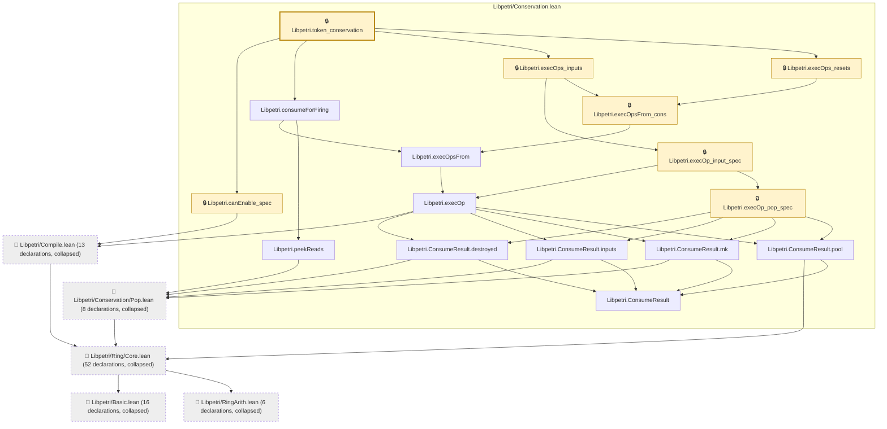

# EXEC-013

Generated by `scripts/proof-graph.py` from `proof-graph.json`. Do not edit.

Theorems carrying this ID:

- `Libpetri.consumeForFiring_eq_program` (theorem, `Libpetri/Conservation.lean:323`) 🔒 locked
- `Libpetri.read_reset_order_diverges` (theorem, `Libpetri/RetrodictExec.lean:101`) 🔒 locked
- `Libpetri.token_conservation` (theorem, `Libpetri/Conservation.lean:343`) 🔒 locked

> **Note:** the full tree has 121 nodes (limit 60), so it is drawn as one diagram per theorem (3 theorems).

### `Libpetri.consumeForFiring_eq_program`

> Rule: this theorem's whole tree, 52 nodes.

```mermaid
flowchart TD
  subgraph g0["Libpetri/Basic.lean"]
    n8["Libpetri.Card"]
    n9["Libpetri.Card.all"]
    n10["Libpetri.Card.atLeast"]
    n12["Libpetri.Card.exactly"]
    n13["Libpetri.Card.one"]
    n21["Libpetri.Colour"]
    n76["Libpetri.InSpec"]
    n77["Libpetri.InSpec.card"]
    n80["Libpetri.InSpec.place"]
    n2374["Libpetri.PlaceId"]
    n2605["Libpetri.Transition"]
    n2607["Libpetri.Transition.inputs"]
    n2611["Libpetri.Transition.reads"]
    n2612["Libpetri.Transition.resets"]
  end
  subgraph g1["Libpetri/Compile.lean"]
    n22["Libpetri.ConsumeOp"]
    n23["Libpetri.ConsumeOp.all"]
    n24["Libpetri.ConsumeOp.atLeast"]
    n25["Libpetri.ConsumeOp.n"]
    n26["Libpetri.ConsumeOp.one"]
    n27["Libpetri.ConsumeOp.reset"]
    n2681["Libpetri.compileConsumeOps"]
    n2836["Libpetri.opOfSpec"]
  end
  subgraph g2["Libpetri/Conservation.lean"]
    n28["Libpetri.ConsumeResult"]
    n29["Libpetri.ConsumeResult.destroyed"]
    n30["Libpetri.ConsumeResult.inputs"]
    n31["Libpetri.ConsumeResult.mk"]
    n32["Libpetri.ConsumeResult.pool"]
    n2686["Libpetri.consumeForFiring"]
    n2689["🔒 Libpetri.consumeForFiring_eq_program"]
    n2743["Libpetri.execOp"]
    n2746["Libpetri.execOpsFrom"]
    n2747["🔒 Libpetri.execOpsFrom_append"]
    n2848["Libpetri.peekReads"]
  end
  subgraph g3["Libpetri/Conservation/Pop.lean"]
    n2604["Libpetri.TokenBag"]
    n2627["Libpetri.addBag"]
    n2733["Libpetri.emptyBag"]
    n2850["Libpetri.popN"]
  end
  subgraph g4["Libpetri/Ring/Core.lean"]
    n2381["Libpetri.Pool"]
    n2396["Libpetri.Pool.cap"]
    n2397["Libpetri.Pool.cnt"]
    n2402["Libpetri.Pool.first"]
    n2425["Libpetri.Pool.head"]
    n2443["Libpetri.Pool.len"]
    n2447["Libpetri.Pool.mk"]
    n2448["Libpetri.Pool.nplaces"]
    n2449["Libpetri.Pool.offset"]
    n2451["Libpetri.Pool.peekFirst"]
    n2453["Libpetri.Pool.pool"]
    n2477["Libpetri.Pool.removeFirst"]
    n2496["Libpetri.Pool.slot"]
    n2501["Libpetri.Pool.tail"]
  end
  subgraph g5["Libpetri/RingArith.lean"]
    n2893["Libpetri.ringPos"]
  end
  n9 --> n8
  n10 --> n8
  n12 --> n8
  n13 --> n8
  n23 --> n22
  n23 --> n2374
  n24 --> n22
  n24 --> n2374
  n25 --> n22
  n25 --> n2374
  n26 --> n22
  n26 --> n2374
  n27 --> n22
  n27 --> n2374
  n29 --> n28
  n29 --> n2604
  n30 --> n28
  n30 --> n2604
  n31 --> n28
  n31 --> n2381
  n31 --> n2604
  n32 --> n28
  n32 --> n2381
  n77 --> n8
  n77 --> n76
  n80 --> n76
  n80 --> n2374
  n2396 --> n2374
  n2396 --> n2381
  n2397 --> n2374
  n2397 --> n2381
  n2402 --> n2453
  n2402 --> n2496
  n2425 --> n2374
  n2425 --> n2381
  n2443 --> n2381
  n2447 --> n21
  n2447 --> n2374
  n2447 --> n2381
  n2448 --> n2381
  n2449 --> n2374
  n2449 --> n2381
  n2451 --> n2397
  n2451 --> n2453
  n2451 --> n2496
  n2453 --> n21
  n2453 --> n2381
  n2477 --> n2397
  n2477 --> n2443
  n2477 --> n2447
  n2477 --> n2448
  n2477 --> n2453
  n2477 --> n2496
  n2477 --> n2501
  n2496 --> n2396
  n2496 --> n2425
  n2496 --> n2449
  n2496 --> n2893
  n2501 --> n2374
  n2501 --> n2381
  n2604 --> n21
  n2604 --> n2374
  n2607 --> n76
  n2607 --> n2605
  n2611 --> n2374
  n2611 --> n2605
  n2612 --> n2374
  n2612 --> n2605
  n2627 --> n2604
  n2681 --> n27
  n2681 --> n2607
  n2681 --> n2612
  n2681 --> n2836
  n2686 --> n2607
  n2686 --> n2611
  n2686 --> n2612
  n2686 --> n2746
  n2686 --> n2836
  n2686 --> n2848
  n2689 --> n2681
  n2689 --> n2686
  n2689 --> n2747
  n2733 --> n2604
  n2743 --> n23
  n2743 --> n24
  n2743 --> n25
  n2743 --> n26
  n2743 --> n27
  n2743 --> n29
  n2743 --> n30
  n2743 --> n31
  n2743 --> n32
  n2743 --> n2627
  n2743 --> n2850
  n2746 --> n2743
  n2747 --> n2746
  n2836 --> n9
  n2836 --> n10
  n2836 --> n12
  n2836 --> n13
  n2836 --> n23
  n2836 --> n24
  n2836 --> n25
  n2836 --> n26
  n2836 --> n77
  n2836 --> n80
  n2848 --> n2451
  n2848 --> n2627
  n2848 --> n2733
  n2850 --> n2402
  n2850 --> n2477
  classDef root stroke-width:3px
  classDef locked fill:#fff3cd,stroke:#b8860b
  classDef collapsed fill:#eeeeee,stroke-dasharray:4 4
  class n2689 root
  class n2689,n2747 locked
```

### `Libpetri.read_reset_order_diverges`

> Rule: this theorem's whole tree, 56 nodes.

```mermaid
flowchart TD
  subgraph g0["Libpetri/Basic.lean"]
    n8["Libpetri.Card"]
    n9["Libpetri.Card.all"]
    n10["Libpetri.Card.atLeast"]
    n12["Libpetri.Card.exactly"]
    n13["Libpetri.Card.one"]
    n21["Libpetri.Colour"]
    n74["Libpetri.Guard"]
    n76["Libpetri.InSpec"]
    n77["Libpetri.InSpec.card"]
    n79["Libpetri.InSpec.mk"]
    n80["Libpetri.InSpec.place"]
    n2374["Libpetri.PlaceId"]
    n2605["Libpetri.Transition"]
    n2607["Libpetri.Transition.inputs"]
    n2608["Libpetri.Transition.mk"]
    n2611["Libpetri.Transition.reads"]
    n2612["Libpetri.Transition.resets"]
  end
  subgraph g1["Libpetri/Compile.lean"]
    n22["Libpetri.ConsumeOp"]
    n23["Libpetri.ConsumeOp.all"]
    n24["Libpetri.ConsumeOp.atLeast"]
    n25["Libpetri.ConsumeOp.n"]
    n26["Libpetri.ConsumeOp.one"]
    n27["Libpetri.ConsumeOp.reset"]
    n2836["Libpetri.opOfSpec"]
  end
  subgraph g2["Libpetri/Conservation.lean"]
    n28["Libpetri.ConsumeResult"]
    n29["Libpetri.ConsumeResult.destroyed"]
    n30["Libpetri.ConsumeResult.inputs"]
    n31["Libpetri.ConsumeResult.mk"]
    n32["Libpetri.ConsumeResult.pool"]
    n2686["Libpetri.consumeForFiring"]
    n2743["Libpetri.execOp"]
    n2746["Libpetri.execOpsFrom"]
    n2848["Libpetri.peekReads"]
  end
  subgraph g3["Libpetri/Conservation/Pop.lean"]
    n2604["Libpetri.TokenBag"]
    n2627["Libpetri.addBag"]
    n2733["Libpetri.emptyBag"]
    n2850["Libpetri.popN"]
  end
  subgraph g4["Libpetri/RetrodictExec.lean"]
    n2717["Libpetri.demoPool"]
    n2860["Libpetri.preFixReads"]
    n2878["🔒 Libpetri.read_reset_order_diverges"]
    n2937["Libpetri.tReadReset"]
  end
  subgraph g5["Libpetri/Ring/Core.lean"]
    n2381["Libpetri.Pool"]
    n2396["Libpetri.Pool.cap"]
    n2397["Libpetri.Pool.cnt"]
    n2402["Libpetri.Pool.first"]
    n2425["Libpetri.Pool.head"]
    n2443["Libpetri.Pool.len"]
    n2447["Libpetri.Pool.mk"]
    n2448["Libpetri.Pool.nplaces"]
    n2449["Libpetri.Pool.offset"]
    n2451["Libpetri.Pool.peekFirst"]
    n2453["Libpetri.Pool.pool"]
    n2477["Libpetri.Pool.removeFirst"]
    n2496["Libpetri.Pool.slot"]
    n2501["Libpetri.Pool.tail"]
  end
  subgraph g6["Libpetri/RingArith.lean"]
    n2893["Libpetri.ringPos"]
  end
  n9 --> n8
  n10 --> n8
  n12 --> n8
  n13 --> n8
  n23 --> n22
  n23 --> n2374
  n24 --> n22
  n24 --> n2374
  n25 --> n22
  n25 --> n2374
  n26 --> n22
  n26 --> n2374
  n27 --> n22
  n27 --> n2374
  n29 --> n28
  n29 --> n2604
  n30 --> n28
  n30 --> n2604
  n31 --> n28
  n31 --> n2381
  n31 --> n2604
  n32 --> n28
  n32 --> n2381
  n74 --> n21
  n77 --> n8
  n77 --> n76
  n79 --> n8
  n79 --> n74
  n79 --> n76
  n79 --> n2374
  n80 --> n76
  n80 --> n2374
  n2396 --> n2374
  n2396 --> n2381
  n2397 --> n2374
  n2397 --> n2381
  n2402 --> n2453
  n2402 --> n2496
  n2425 --> n2374
  n2425 --> n2381
  n2443 --> n2381
  n2447 --> n21
  n2447 --> n2374
  n2447 --> n2381
  n2448 --> n2381
  n2449 --> n2374
  n2449 --> n2381
  n2451 --> n2397
  n2451 --> n2453
  n2451 --> n2496
  n2453 --> n21
  n2453 --> n2381
  n2477 --> n2397
  n2477 --> n2443
  n2477 --> n2447
  n2477 --> n2448
  n2477 --> n2453
  n2477 --> n2496
  n2477 --> n2501
  n2496 --> n2396
  n2496 --> n2425
  n2496 --> n2449
  n2496 --> n2893
  n2501 --> n2374
  n2501 --> n2381
  n2604 --> n21
  n2604 --> n2374
  n2607 --> n76
  n2607 --> n2605
  n2608 --> n76
  n2608 --> n2374
  n2608 --> n2605
  n2611 --> n2374
  n2611 --> n2605
  n2612 --> n2374
  n2612 --> n2605
  n2627 --> n2604
  n2686 --> n2607
  n2686 --> n2611
  n2686 --> n2612
  n2686 --> n2746
  n2686 --> n2836
  n2686 --> n2848
  n2717 --> n2447
  n2733 --> n2604
  n2743 --> n23
  n2743 --> n24
  n2743 --> n25
  n2743 --> n26
  n2743 --> n27
  n2743 --> n29
  n2743 --> n30
  n2743 --> n31
  n2743 --> n32
  n2743 --> n2627
  n2743 --> n2850
  n2746 --> n2743
  n2836 --> n9
  n2836 --> n10
  n2836 --> n12
  n2836 --> n13
  n2836 --> n23
  n2836 --> n24
  n2836 --> n25
  n2836 --> n26
  n2836 --> n77
  n2836 --> n80
  n2848 --> n2451
  n2848 --> n2627
  n2848 --> n2733
  n2850 --> n2402
  n2850 --> n2477
  n2860 --> n2607
  n2860 --> n2611
  n2860 --> n2612
  n2860 --> n2746
  n2860 --> n2836
  n2860 --> n2848
  n2878 --> n2686
  n2878 --> n2717
  n2878 --> n2860
  n2878 --> n2937
  n2937 --> n13
  n2937 --> n79
  n2937 --> n2608
  classDef root stroke-width:3px
  classDef locked fill:#fff3cd,stroke:#b8860b
  classDef collapsed fill:#eeeeee,stroke-dasharray:4 4
  class n2878 root
  class n2878 locked
```

### `Libpetri.token_conservation`

> Rule: this theorem's tree has 111 nodes (limit 60); every file other than its own is collapsed into one node, leaving 21.

Axioms used:

- `Libpetri.consumeForFiring_eq_program`: `Quot.sound`, `propext`
- `Libpetri.read_reset_order_diverges`: none
- `Libpetri.token_conservation`: `Quot.sound`, `propext`
