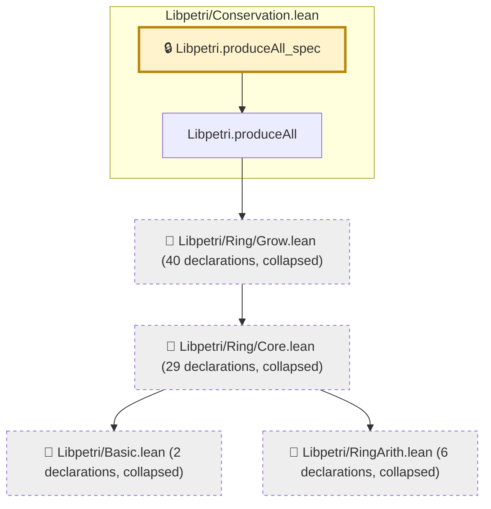

# EXEC-020

Generated by `scripts/proof-graph.py` from `proof-graph.json`. Do not edit.

Theorems carrying this ID:

- `Libpetri.produceAll_spec` (theorem, `Libpetri/Conservation.lean:444`) 🔒 locked

> **Note:** the full tree has 79 nodes (limit 60).

> Rule: this theorem's tree has 79 nodes (limit 60); every file other than its own is collapsed into one node, leaving 6.

Axioms used:

- `Libpetri.produceAll_spec`: `Quot.sound`, `propext`
