# EXEC-042

Generated by `scripts/proof-graph.py` from `proof-graph.json`. Do not edit.

Theorems carrying this ID:

- `Libpetri.Novel.InFlight.quiescent_count_stop_sound` (theorem, `Libpetri/Novel/InFlight.lean:619`)
- `Libpetri.Novel.InFlight.split_covers_executor` (theorem, `Libpetri/Novel/InFlight.lean:387`)
- `Libpetri.Novel.InFlight.split_stop_sound` (theorem, `Libpetri/Novel/InFlight.lean:542`)
- `Libpetri.Novel.InFlight.terminal_stop_witness` (theorem, `Libpetri/Novel/InFlight.lean:842`)

> **Note:** the full tree has 87 nodes (limit 60), so it is drawn as one diagram per theorem (4 theorems).

### `Libpetri.Novel.InFlight.quiescent_count_stop_sound`

> Rule: this theorem's tree has 70 nodes (limit 60); every file other than its own is collapsed into one node, leaving 48.

```mermaid
flowchart TD
  subgraph g0["Libpetri/Novel/InFlight.lean"]
    n741["Libpetri.Novel.InFlight.Completes"]
    n742["Libpetri.Novel.InFlight.MonoAt"]
    n743["Libpetri.Novel.InFlight.NamesUnique"]
    n744["Libpetri.Novel.InFlight.Row"]
    n745["Libpetri.Novel.InFlight.SReach"]
    n746["Libpetri.Novel.InFlight.SStep"]
    n747["Libpetri.Novel.InFlight.SStep.atomic"]
    n748["Libpetri.Novel.InFlight.SStep.complete"]
    n749["Libpetri.Novel.InFlight.SStep.start"]
    n750["Libpetri.Novel.InFlight.Untested"]
    n752["Libpetri.Novel.InFlight.UpClosedOff"]
    n753["Libpetri.Novel.InFlight.XReach"]
    n754["Libpetri.Novel.InFlight.XState"]
    n755["Libpetri.Novel.InFlight.XState.a"]
    n756["Libpetri.Novel.InFlight.XState.mk"]
    n757["Libpetri.Novel.InFlight.XState.pend"]
    n758["Libpetri.Novel.InFlight.XStep"]
    n759["Libpetri.Novel.InFlight.XStep.complete"]
    n760["Libpetri.Novel.InFlight.XStep.start"]
    n763["Libpetri.Novel.InFlight.addAll"]
    n764["Libpetri.Novel.InFlight.addAll_cons"]
    n765["Libpetri.Novel.InFlight.addAll_nil"]
    n766["Libpetri.Novel.InFlight.addAll_of_zero"]
    n767["Libpetri.Novel.InFlight.addAll_perm"]
    n768["Libpetri.Novel.InFlight.addD"]
    n769["Libpetri.Novel.InFlight.addD_addAll"]
    n773["Libpetri.Novel.InFlight.completes_exists"]
    n774["Libpetri.Novel.InFlight.completes_nonsplit"]
    n777["Libpetri.Novel.InFlight.enabledA_addAll"]
    n778["Libpetri.Novel.InFlight.enabledA_addD"]
    n782["Libpetri.Novel.InFlight.filter_erase_of_false"]
    n783["Libpetri.Novel.InFlight.filter_erase_of_true"]
    n784["Libpetri.Novel.InFlight.fireAD_eq_addD_startA"]
    n786["Libpetri.Novel.InFlight.le_addAll"]
    n789["Libpetri.Novel.InFlight.live_addAll"]
    n790["Libpetri.Novel.InFlight.pend_has_row"]
    n794["Libpetri.Novel.InFlight.quiescent_count_stop_sound"]
    n800["Libpetri.Novel.InFlight.split_covers_executor"]
    n804["Libpetri.Novel.InFlight.split_stop_sound"]
    n805["Libpetri.Novel.InFlight.startA"]
    n806["Libpetri.Novel.InFlight.startA_addAll"]
    n807["Libpetri.Novel.InFlight.startA_addD"]
    n808["Libpetri.Novel.InFlight.stopCountBad"]
    n809["Libpetri.Novel.InFlight.stopCountBad_upClosedOff"]
  end
  c0["📁 Libpetri/Basic.lean (22 declarations, collapsed)"]
  c26["📁 Libpetri/Novel/ForwardDeposit.lean (2 declarations, collapsed)"]
  c79["📁 Libpetri/Soundness.lean (1 declarations, collapsed)"]
  c82["📁 Libpetri/Strengthening/Hypotheses.lean (1 declarations, collapsed)"]
  c26 --> c0
  c79 --> c0
  c82 --> c79
  n741 --> n744
  n742 --> c0
  n743 --> n744
  n744 --> c26
  n745 --> n746
  n745 --> n756
  n746 --> n744
  n746 --> n754
  n747 --> n746
  n747 --> n755
  n747 --> n756
  n747 --> n757
  n748 --> n746
  n748 --> n755
  n748 --> n756
  n748 --> n757
  n748 --> n768
  n749 --> n746
  n749 --> n755
  n749 --> n756
  n749 --> n757
  n749 --> n805
  n750 --> n742
  n750 --> n744
  n752 --> c0
  n753 --> n756
  n753 --> n758
  n755 --> c0
  n755 --> n754
  n756 --> c0
  n756 --> n754
  n757 --> n754
  n758 --> n744
  n758 --> n754
  n759 --> n755
  n759 --> n756
  n759 --> n757
  n759 --> n758
  n759 --> n768
  n760 --> n755
  n760 --> n756
  n760 --> n757
  n760 --> n758
  n760 --> n805
  n763 --> n744
  n764 --> n763
  n764 --> n768
  n765 --> n763
  n766 --> n763
  n767 --> n763
  n768 --> c26
  n769 --> n763
  n769 --> n768
  n773 --> n741
  n774 --> n741
  n777 --> n750
  n777 --> n764
  n777 --> n765
  n777 --> n778
  n778 --> n742
  n778 --> n768
  n784 --> n768
  n784 --> n805
  n786 --> n763
  n789 --> n764
  n789 --> n765
  n790 --> n753
  n790 --> n759
  n790 --> n760
  n794 --> n804
  n794 --> n809
  n800 --> n743
  n800 --> n745
  n800 --> n747
  n800 --> n748
  n800 --> n749
  n800 --> n753
  n800 --> n759
  n800 --> n760
  n800 --> n767
  n800 --> n769
  n800 --> n774
  n800 --> n777
  n800 --> n782
  n800 --> n783
  n800 --> n784
  n800 --> n789
  n800 --> n806
  n804 --> n752
  n804 --> n766
  n804 --> n773
  n804 --> n786
  n804 --> n790
  n804 --> n800
  n805 --> c26
  n806 --> n750
  n806 --> n764
  n806 --> n765
  n806 --> n778
  n806 --> n807
  n807 --> c82
  n807 --> n742
  n807 --> n768
  n807 --> n805
  n808 --> c0
  n809 --> n752
  n809 --> n808
  classDef root stroke-width:3px
  classDef locked fill:#fff3cd,stroke:#b8860b
  classDef collapsed fill:#eeeeee,stroke-dasharray:4 4
  class n794 root
  class c0,c26,c79,c82 collapsed
```

### `Libpetri.Novel.InFlight.split_covers_executor`

> Rule: this theorem's tree has 61 nodes (limit 60); every file other than its own is collapsed into one node, leaving 39.

```mermaid
flowchart TD
  subgraph g0["Libpetri/Novel/InFlight.lean"]
    n741["Libpetri.Novel.InFlight.Completes"]
    n742["Libpetri.Novel.InFlight.MonoAt"]
    n743["Libpetri.Novel.InFlight.NamesUnique"]
    n744["Libpetri.Novel.InFlight.Row"]
    n745["Libpetri.Novel.InFlight.SReach"]
    n746["Libpetri.Novel.InFlight.SStep"]
    n747["Libpetri.Novel.InFlight.SStep.atomic"]
    n748["Libpetri.Novel.InFlight.SStep.complete"]
    n749["Libpetri.Novel.InFlight.SStep.start"]
    n750["Libpetri.Novel.InFlight.Untested"]
    n753["Libpetri.Novel.InFlight.XReach"]
    n754["Libpetri.Novel.InFlight.XState"]
    n755["Libpetri.Novel.InFlight.XState.a"]
    n756["Libpetri.Novel.InFlight.XState.mk"]
    n757["Libpetri.Novel.InFlight.XState.pend"]
    n758["Libpetri.Novel.InFlight.XStep"]
    n759["Libpetri.Novel.InFlight.XStep.complete"]
    n760["Libpetri.Novel.InFlight.XStep.start"]
    n763["Libpetri.Novel.InFlight.addAll"]
    n764["Libpetri.Novel.InFlight.addAll_cons"]
    n765["Libpetri.Novel.InFlight.addAll_nil"]
    n767["Libpetri.Novel.InFlight.addAll_perm"]
    n768["Libpetri.Novel.InFlight.addD"]
    n769["Libpetri.Novel.InFlight.addD_addAll"]
    n774["Libpetri.Novel.InFlight.completes_nonsplit"]
    n777["Libpetri.Novel.InFlight.enabledA_addAll"]
    n778["Libpetri.Novel.InFlight.enabledA_addD"]
    n782["Libpetri.Novel.InFlight.filter_erase_of_false"]
    n783["Libpetri.Novel.InFlight.filter_erase_of_true"]
    n784["Libpetri.Novel.InFlight.fireAD_eq_addD_startA"]
    n789["Libpetri.Novel.InFlight.live_addAll"]
    n800["Libpetri.Novel.InFlight.split_covers_executor"]
    n805["Libpetri.Novel.InFlight.startA"]
    n806["Libpetri.Novel.InFlight.startA_addAll"]
    n807["Libpetri.Novel.InFlight.startA_addD"]
  end
  c0["📁 Libpetri/Basic.lean (22 declarations, collapsed)"]
  c26["📁 Libpetri/Novel/ForwardDeposit.lean (2 declarations, collapsed)"]
  c79["📁 Libpetri/Soundness.lean (1 declarations, collapsed)"]
  c82["📁 Libpetri/Strengthening/Hypotheses.lean (1 declarations, collapsed)"]
  c26 --> c0
  c79 --> c0
  c82 --> c79
  n741 --> n744
  n742 --> c0
  n743 --> n744
  n744 --> c26
  n745 --> n746
  n745 --> n756
  n746 --> n744
  n746 --> n754
  n747 --> n746
  n747 --> n755
  n747 --> n756
  n747 --> n757
  n748 --> n746
  n748 --> n755
  n748 --> n756
  n748 --> n757
  n748 --> n768
  n749 --> n746
  n749 --> n755
  n749 --> n756
  n749 --> n757
  n749 --> n805
  n750 --> n742
  n750 --> n744
  n753 --> n756
  n753 --> n758
  n755 --> c0
  n755 --> n754
  n756 --> c0
  n756 --> n754
  n757 --> n754
  n758 --> n744
  n758 --> n754
  n759 --> n755
  n759 --> n756
  n759 --> n757
  n759 --> n758
  n759 --> n768
  n760 --> n755
  n760 --> n756
  n760 --> n757
  n760 --> n758
  n760 --> n805
  n763 --> n744
  n764 --> n763
  n764 --> n768
  n765 --> n763
  n767 --> n763
  n768 --> c26
  n769 --> n763
  n769 --> n768
  n774 --> n741
  n777 --> n750
  n777 --> n764
  n777 --> n765
  n777 --> n778
  n778 --> n742
  n778 --> n768
  n784 --> n768
  n784 --> n805
  n789 --> n764
  n789 --> n765
  n800 --> n743
  n800 --> n745
  n800 --> n747
  n800 --> n748
  n800 --> n749
  n800 --> n753
  n800 --> n759
  n800 --> n760
  n800 --> n767
  n800 --> n769
  n800 --> n774
  n800 --> n777
  n800 --> n782
  n800 --> n783
  n800 --> n784
  n800 --> n789
  n800 --> n806
  n805 --> c26
  n806 --> n750
  n806 --> n764
  n806 --> n765
  n806 --> n778
  n806 --> n807
  n807 --> c82
  n807 --> n742
  n807 --> n768
  n807 --> n805
  classDef root stroke-width:3px
  classDef locked fill:#fff3cd,stroke:#b8860b
  classDef collapsed fill:#eeeeee,stroke-dasharray:4 4
  class n800 root
  class c0,c26,c79,c82 collapsed
```

### `Libpetri.Novel.InFlight.split_stop_sound`

> Rule: this theorem's tree has 67 nodes (limit 60); every file other than its own is collapsed into one node, leaving 45.

```mermaid
flowchart TD
  subgraph g0["Libpetri/Novel/InFlight.lean"]
    n741["Libpetri.Novel.InFlight.Completes"]
    n742["Libpetri.Novel.InFlight.MonoAt"]
    n743["Libpetri.Novel.InFlight.NamesUnique"]
    n744["Libpetri.Novel.InFlight.Row"]
    n745["Libpetri.Novel.InFlight.SReach"]
    n746["Libpetri.Novel.InFlight.SStep"]
    n747["Libpetri.Novel.InFlight.SStep.atomic"]
    n748["Libpetri.Novel.InFlight.SStep.complete"]
    n749["Libpetri.Novel.InFlight.SStep.start"]
    n750["Libpetri.Novel.InFlight.Untested"]
    n752["Libpetri.Novel.InFlight.UpClosedOff"]
    n753["Libpetri.Novel.InFlight.XReach"]
    n754["Libpetri.Novel.InFlight.XState"]
    n755["Libpetri.Novel.InFlight.XState.a"]
    n756["Libpetri.Novel.InFlight.XState.mk"]
    n757["Libpetri.Novel.InFlight.XState.pend"]
    n758["Libpetri.Novel.InFlight.XStep"]
    n759["Libpetri.Novel.InFlight.XStep.complete"]
    n760["Libpetri.Novel.InFlight.XStep.start"]
    n763["Libpetri.Novel.InFlight.addAll"]
    n764["Libpetri.Novel.InFlight.addAll_cons"]
    n765["Libpetri.Novel.InFlight.addAll_nil"]
    n766["Libpetri.Novel.InFlight.addAll_of_zero"]
    n767["Libpetri.Novel.InFlight.addAll_perm"]
    n768["Libpetri.Novel.InFlight.addD"]
    n769["Libpetri.Novel.InFlight.addD_addAll"]
    n773["Libpetri.Novel.InFlight.completes_exists"]
    n774["Libpetri.Novel.InFlight.completes_nonsplit"]
    n777["Libpetri.Novel.InFlight.enabledA_addAll"]
    n778["Libpetri.Novel.InFlight.enabledA_addD"]
    n782["Libpetri.Novel.InFlight.filter_erase_of_false"]
    n783["Libpetri.Novel.InFlight.filter_erase_of_true"]
    n784["Libpetri.Novel.InFlight.fireAD_eq_addD_startA"]
    n786["Libpetri.Novel.InFlight.le_addAll"]
    n789["Libpetri.Novel.InFlight.live_addAll"]
    n790["Libpetri.Novel.InFlight.pend_has_row"]
    n800["Libpetri.Novel.InFlight.split_covers_executor"]
    n804["Libpetri.Novel.InFlight.split_stop_sound"]
    n805["Libpetri.Novel.InFlight.startA"]
    n806["Libpetri.Novel.InFlight.startA_addAll"]
    n807["Libpetri.Novel.InFlight.startA_addD"]
  end
  c0["📁 Libpetri/Basic.lean (22 declarations, collapsed)"]
  c26["📁 Libpetri/Novel/ForwardDeposit.lean (2 declarations, collapsed)"]
  c79["📁 Libpetri/Soundness.lean (1 declarations, collapsed)"]
  c82["📁 Libpetri/Strengthening/Hypotheses.lean (1 declarations, collapsed)"]
  c26 --> c0
  c79 --> c0
  c82 --> c79
  n741 --> n744
  n742 --> c0
  n743 --> n744
  n744 --> c26
  n745 --> n746
  n745 --> n756
  n746 --> n744
  n746 --> n754
  n747 --> n746
  n747 --> n755
  n747 --> n756
  n747 --> n757
  n748 --> n746
  n748 --> n755
  n748 --> n756
  n748 --> n757
  n748 --> n768
  n749 --> n746
  n749 --> n755
  n749 --> n756
  n749 --> n757
  n749 --> n805
  n750 --> n742
  n750 --> n744
  n752 --> c0
  n753 --> n756
  n753 --> n758
  n755 --> c0
  n755 --> n754
  n756 --> c0
  n756 --> n754
  n757 --> n754
  n758 --> n744
  n758 --> n754
  n759 --> n755
  n759 --> n756
  n759 --> n757
  n759 --> n758
  n759 --> n768
  n760 --> n755
  n760 --> n756
  n760 --> n757
  n760 --> n758
  n760 --> n805
  n763 --> n744
  n764 --> n763
  n764 --> n768
  n765 --> n763
  n766 --> n763
  n767 --> n763
  n768 --> c26
  n769 --> n763
  n769 --> n768
  n773 --> n741
  n774 --> n741
  n777 --> n750
  n777 --> n764
  n777 --> n765
  n777 --> n778
  n778 --> n742
  n778 --> n768
  n784 --> n768
  n784 --> n805
  n786 --> n763
  n789 --> n764
  n789 --> n765
  n790 --> n753
  n790 --> n759
  n790 --> n760
  n800 --> n743
  n800 --> n745
  n800 --> n747
  n800 --> n748
  n800 --> n749
  n800 --> n753
  n800 --> n759
  n800 --> n760
  n800 --> n767
  n800 --> n769
  n800 --> n774
  n800 --> n777
  n800 --> n782
  n800 --> n783
  n800 --> n784
  n800 --> n789
  n800 --> n806
  n804 --> n752
  n804 --> n766
  n804 --> n773
  n804 --> n786
  n804 --> n790
  n804 --> n800
  n805 --> c26
  n806 --> n750
  n806 --> n764
  n806 --> n765
  n806 --> n778
  n806 --> n807
  n807 --> c82
  n807 --> n742
  n807 --> n768
  n807 --> n805
  classDef root stroke-width:3px
  classDef locked fill:#fff3cd,stroke:#b8860b
  classDef collapsed fill:#eeeeee,stroke-dasharray:4 4
  class n804 root
  class c0,c26,c79,c82 collapsed
```

### `Libpetri.Novel.InFlight.terminal_stop_witness`

> Rule: this theorem's whole tree, 58 nodes.

```mermaid
flowchart TD
  subgraph g0["Libpetri/Basic.lean"]
    n0["Libpetri.AMarking"]
    n8["Libpetri.Card"]
    n9["Libpetri.Card.all"]
    n10["Libpetri.Card.atLeast"]
    n11["Libpetri.Card.consumesAll"]
    n12["Libpetri.Card.exactly"]
    n13["Libpetri.Card.one"]
    n14["Libpetri.Card.required"]
    n21["Libpetri.Colour"]
    n74["Libpetri.Guard"]
    n76["Libpetri.InSpec"]
    n77["Libpetri.InSpec.card"]
    n79["Libpetri.InSpec.mk"]
    n80["Libpetri.InSpec.place"]
    n2416["Libpetri.PlaceId"]
    n2647["Libpetri.Transition"]
    n2648["Libpetri.Transition.inhibitors"]
    n2649["Libpetri.Transition.inputs"]
    n2650["Libpetri.Transition.mk"]
    n2651["Libpetri.Transition.name"]
    n2653["Libpetri.Transition.reads"]
    n2654["Libpetri.Transition.resets"]
    n2724["Libpetri.consumeAllAt"]
    n2776["Libpetri.enabledA"]
    n2899["Libpetri.pre"]
    n2954["Libpetri.specAt"]
  end
  subgraph g1["Libpetri/Novel/ForwardDeposit.lean"]
    n668["Libpetri.Novel.ForwardDeposit.Deposit"]
    n696["Libpetri.Novel.ForwardDeposit.fireAD"]
  end
  subgraph g2["Libpetri/Novel/InFlight.lean"]
    n744["Libpetri.Novel.InFlight.Row"]
    n745["Libpetri.Novel.InFlight.SReach"]
    n746["Libpetri.Novel.InFlight.SStep"]
    n747["Libpetri.Novel.InFlight.SStep.atomic"]
    n748["Libpetri.Novel.InFlight.SStep.complete"]
    n749["Libpetri.Novel.InFlight.SStep.start"]
    n753["Libpetri.Novel.InFlight.XReach"]
    n754["Libpetri.Novel.InFlight.XState"]
    n755["Libpetri.Novel.InFlight.XState.a"]
    n756["Libpetri.Novel.InFlight.XState.mk"]
    n757["Libpetri.Novel.InFlight.XState.pend"]
    n758["Libpetri.Novel.InFlight.XStep"]
    n759["Libpetri.Novel.InFlight.XStep.complete"]
    n760["Libpetri.Novel.InFlight.XStep.start"]
    n761["Libpetri.Novel.InFlight.a0F"]
    n768["Libpetri.Novel.InFlight.addD"]
    n776["Libpetri.Novel.InFlight.demand_stops_short"]
    n780["Libpetri.Novel.InFlight.executor_stops_short"]
    n781["Libpetri.Novel.InFlight.fF"]
    n787["Libpetri.Novel.InFlight.liveF"]
    n791["Libpetri.Novel.InFlight.plain_misses_demand"]
    n792["Libpetri.Novel.InFlight.plain_never_short"]
    n795["Libpetri.Novel.InFlight.rowsF"]
    n797["Libpetri.Novel.InFlight.shortF"]
    n798["Libpetri.Novel.InFlight.spDemand"]
    n799["Libpetri.Novel.InFlight.spPlain"]
    n805["Libpetri.Novel.InFlight.startA"]
    n808["Libpetri.Novel.InFlight.stopCountBad"]
    n812["Libpetri.Novel.InFlight.tF"]
    n815["Libpetri.Novel.InFlight.terminal_stop_witness"]
  end
  n0 --> n2416
  n9 --> n8
  n10 --> n8
  n11 --> n9
  n11 --> n10
  n11 --> n12
  n11 --> n13
  n12 --> n8
  n13 --> n8
  n14 --> n9
  n14 --> n10
  n14 --> n12
  n14 --> n13
  n74 --> n21
  n77 --> n8
  n77 --> n76
  n79 --> n8
  n79 --> n74
  n79 --> n76
  n79 --> n2416
  n80 --> n76
  n80 --> n2416
  n668 --> n2416
  n696 --> n0
  n696 --> n668
  n696 --> n2654
  n696 --> n2724
  n696 --> n2899
  n744 --> n668
  n744 --> n2647
  n745 --> n746
  n745 --> n756
  n746 --> n0
  n746 --> n744
  n746 --> n754
  n747 --> n696
  n747 --> n746
  n747 --> n755
  n747 --> n756
  n747 --> n757
  n747 --> n2651
  n747 --> n2776
  n748 --> n746
  n748 --> n755
  n748 --> n756
  n748 --> n757
  n748 --> n768
  n748 --> n2651
  n749 --> n746
  n749 --> n755
  n749 --> n756
  n749 --> n757
  n749 --> n805
  n749 --> n2651
  n749 --> n2776
  n753 --> n756
  n753 --> n758
  n755 --> n0
  n755 --> n754
  n756 --> n0
  n756 --> n754
  n757 --> n754
  n758 --> n0
  n758 --> n744
  n758 --> n754
  n759 --> n755
  n759 --> n756
  n759 --> n757
  n759 --> n758
  n759 --> n768
  n759 --> n2651
  n760 --> n755
  n760 --> n756
  n760 --> n757
  n760 --> n758
  n760 --> n805
  n760 --> n2651
  n760 --> n2776
  n761 --> n0
  n768 --> n0
  n768 --> n668
  n776 --> n745
  n776 --> n748
  n776 --> n749
  n776 --> n761
  n776 --> n787
  n776 --> n795
  n776 --> n797
  n776 --> n798
  n780 --> n753
  n780 --> n759
  n780 --> n760
  n780 --> n761
  n780 --> n787
  n780 --> n795
  n780 --> n797
  n781 --> n13
  n781 --> n79
  n781 --> n2650
  n787 --> n0
  n791 --> n795
  n791 --> n799
  n791 --> n2651
  n792 --> n745
  n792 --> n747
  n792 --> n748
  n792 --> n749
  n792 --> n761
  n792 --> n787
  n792 --> n795
  n792 --> n797
  n792 --> n799
  n795 --> n744
  n795 --> n781
  n795 --> n812
  n797 --> n808
  n805 --> n696
  n808 --> n0
  n812 --> n13
  n812 --> n79
  n812 --> n2650
  n815 --> n776
  n815 --> n780
  n815 --> n791
  n815 --> n792
  n2648 --> n2416
  n2648 --> n2647
  n2649 --> n76
  n2649 --> n2647
  n2650 --> n76
  n2650 --> n2416
  n2650 --> n2647
  n2651 --> n2647
  n2653 --> n2416
  n2653 --> n2647
  n2654 --> n2416
  n2654 --> n2647
  n2724 --> n11
  n2724 --> n77
  n2724 --> n2954
  n2776 --> n0
  n2776 --> n14
  n2776 --> n77
  n2776 --> n80
  n2776 --> n2648
  n2776 --> n2649
  n2776 --> n2653
  n2899 --> n14
  n2899 --> n77
  n2899 --> n2954
  n2954 --> n80
  n2954 --> n2649
  classDef root stroke-width:3px
  classDef locked fill:#fff3cd,stroke:#b8860b
  classDef collapsed fill:#eeeeee,stroke-dasharray:4 4
  class n815 root
```

Axioms used:

- `Libpetri.Novel.InFlight.quiescent_count_stop_sound`: `Classical.choice`, `Quot.sound`, `propext`
- `Libpetri.Novel.InFlight.split_covers_executor`: `Classical.choice`, `Quot.sound`, `propext`
- `Libpetri.Novel.InFlight.split_stop_sound`: `Classical.choice`, `Quot.sound`, `propext`
- `Libpetri.Novel.InFlight.terminal_stop_witness`: `Classical.choice`, `Quot.sound`, `propext`
