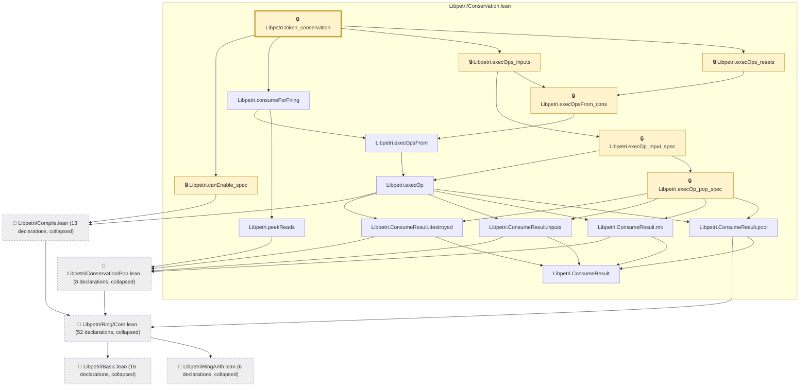

# IO-007

Generated by `scripts/proof-graph.py` from `proof-graph.json`. Do not edit.

Theorems carrying this ID:

- `Libpetri.consume_faithful` (theorem, `Libpetri/Conservation.lean:407`) 🔒 locked
- `Libpetri.token_conservation` (theorem, `Libpetri/Conservation.lean:343`) 🔒 locked

> **Note:** the full tree has 112 nodes (limit 60), so it is drawn as one diagram per theorem (2 theorems).

### `Libpetri.consume_faithful`

> Rule: this theorem's tree has 111 nodes (limit 60); every file other than its own is collapsed into one node, leaving 21.

### `Libpetri.token_conservation`

> Rule: this theorem's tree has 111 nodes (limit 60); every file other than its own is collapsed into one node, leaving 21.

Axioms used:

- `Libpetri.consume_faithful`: `Quot.sound`, `propext`
- `Libpetri.token_conservation`: `Quot.sound`, `propext`
