# IO-014

Generated by `scripts/proof-graph.py` from `proof-graph.json`. Do not edit.

Theorems carrying this ID:

- `Libpetri.Novel.ForwardDeposit.forward_exactly_two_breaks_unit_output` (theorem, `Libpetri/Novel/ForwardDeposit.lean:193`)

```mermaid
flowchart TD
  subgraph g0["Libpetri/Basic.lean"]
    n6["Libpetri.CMarking"]
    n8["Libpetri.Card"]
    n9["Libpetri.Card.all"]
    n10["Libpetri.Card.atLeast"]
    n11["Libpetri.Card.consumesAll"]
    n12["Libpetri.Card.exactly"]
    n13["Libpetri.Card.one"]
    n14["Libpetri.Card.required"]
    n21["Libpetri.Colour"]
    n74["Libpetri.Guard"]
    n76["Libpetri.InSpec"]
    n77["Libpetri.InSpec.card"]
    n78["Libpetri.InSpec.guard"]
    n79["Libpetri.InSpec.mk"]
    n80["Libpetri.InSpec.place"]
    n2374["Libpetri.PlaceId"]
    n2605["Libpetri.Transition"]
    n2607["Libpetri.Transition.inputs"]
    n2608["Libpetri.Transition.mk"]
    n2613["Libpetri.UnitOutput"]
    n2683["Libpetri.consumeCount"]
    n2696["Libpetri.consumedAt"]
    n2822["Libpetri.matchCount"]
    n2852["Libpetri.post"]
    n2912["Libpetri.specAt"]
  end
  subgraph g1["Libpetri/Novel/ForwardDeposit.lean"]
    n665["Libpetri.Novel.ForwardDeposit.Choice"]
    n666["Libpetri.Novel.ForwardDeposit.Choice.action"]
    n667["Libpetri.Novel.ForwardDeposit.Choice.timedOut"]
    n668["Libpetri.Novel.ForwardDeposit.Deposit"]
    n670["Libpetri.Novel.ForwardDeposit.OutSpec"]
    n671["Libpetri.Novel.ForwardDeposit.OutSpec.and"]
    n673["Libpetri.Novel.ForwardDeposit.OutSpec.brecOn.go"]
    n674["Libpetri.Novel.ForwardDeposit.OutSpec.forward"]
    n675["Libpetri.Novel.ForwardDeposit.OutSpec.place"]
    n676["Libpetri.Novel.ForwardDeposit.OutSpec.timeout"]
    n677["Libpetri.Novel.ForwardDeposit.OutSpec.xor"]
    n686["Libpetri.Novel.ForwardDeposit.branches"]
    n688["Libpetri.Novel.ForwardDeposit.cross"]
    n692["Libpetri.Novel.ForwardDeposit.deposit"]
    n695["Libpetri.Novel.ForwardDeposit.findTimeout"]
    n705["Libpetri.Novel.ForwardDeposit.forward_exactly_two_breaks_unit_output"]
    n709["Libpetri.Novel.ForwardDeposit.fwd_timeout_deposit"]
    n718["Libpetri.Novel.ForwardDeposit.m0Fwd"]
    n720["Libpetri.Novel.ForwardDeposit.oFwd"]
    n723["Libpetri.Novel.ForwardDeposit.oldRows"]
    n726["Libpetri.Novel.ForwardDeposit.pa"]
    n727["Libpetri.Novel.ForwardDeposit.pb"]
    n728["Libpetri.Novel.ForwardDeposit.pc"]
    n736["Libpetri.Novel.ForwardDeposit.tFwd"]
    n737["Libpetri.Novel.ForwardDeposit.timeoutDeposits"]
  end
  n6 --> n21
  n6 --> n2374
  n9 --> n8
  n10 --> n8
  n11 --> n9
  n11 --> n10
  n11 --> n12
  n11 --> n13
  n12 --> n8
  n13 --> n8
  n14 --> n9
  n14 --> n10
  n14 --> n12
  n14 --> n13
  n74 --> n21
  n77 --> n8
  n77 --> n76
  n78 --> n74
  n78 --> n76
  n79 --> n8
  n79 --> n74
  n79 --> n76
  n79 --> n2374
  n80 --> n76
  n80 --> n2374
  n666 --> n665
  n667 --> n665
  n668 --> n2374
  n671 --> n670
  n673 --> n671
  n673 --> n674
  n673 --> n675
  n673 --> n676
  n673 --> n677
  n674 --> n670
  n674 --> n2374
  n675 --> n670
  n675 --> n2374
  n676 --> n670
  n677 --> n670
  n686 --> n673
  n686 --> n688
  n688 --> n668
  n692 --> n666
  n692 --> n667
  n692 --> n686
  n692 --> n695
  n692 --> n737
  n695 --> n673
  n705 --> n709
  n705 --> n723
  n705 --> n2613
  n709 --> n692
  n709 --> n718
  n709 --> n720
  n709 --> n736
  n709 --> n2696
  n718 --> n6
  n718 --> n726
  n720 --> n674
  n720 --> n675
  n720 --> n676
  n720 --> n677
  n720 --> n726
  n720 --> n727
  n720 --> n728
  n723 --> n686
  n726 --> n2374
  n727 --> n2374
  n728 --> n2374
  n736 --> n12
  n736 --> n79
  n736 --> n726
  n736 --> n2608
  n737 --> n673
  n737 --> n688
  n2607 --> n76
  n2607 --> n2605
  n2608 --> n76
  n2608 --> n2374
  n2608 --> n2605
  n2613 --> n2852
  n2683 --> n11
  n2683 --> n14
  n2683 --> n77
  n2683 --> n2822
  n2696 --> n2683
  n2696 --> n2912
  n2822 --> n6
  n2822 --> n78
  n2822 --> n80
  n2852 --> n2374
  n2912 --> n80
  n2912 --> n2607
  classDef root stroke-width:3px
  classDef locked fill:#fff3cd,stroke:#b8860b
  classDef collapsed fill:#eeeeee,stroke-dasharray:4 4
  class n705 root
```

Axioms used:

- `Libpetri.Novel.ForwardDeposit.forward_exactly_two_breaks_unit_output`: `Quot.sound`, `propext`
