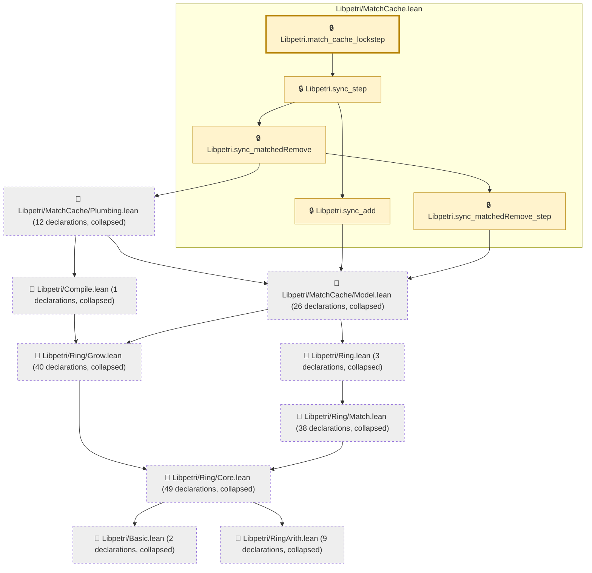
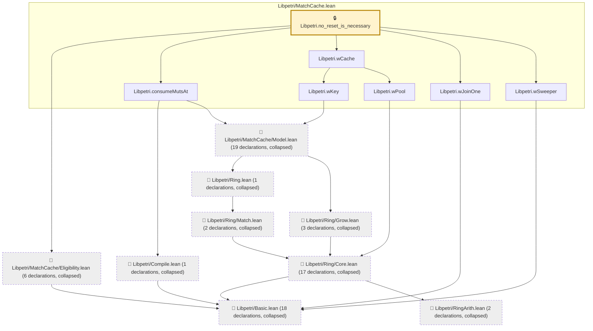
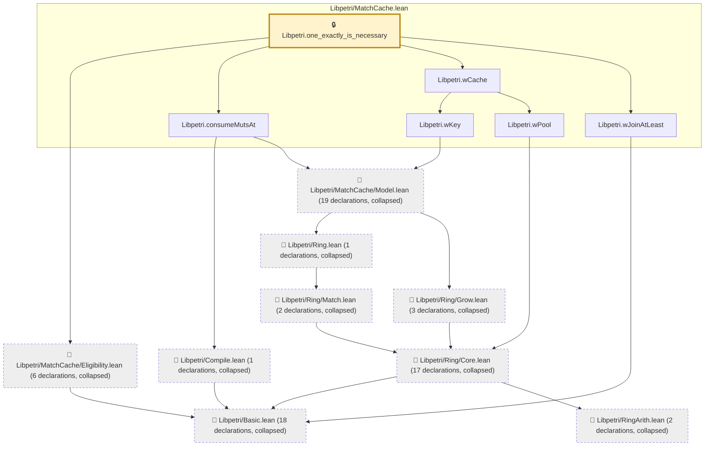
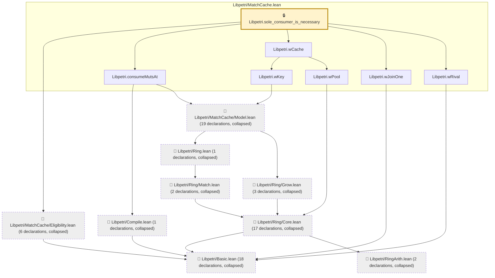

# NU-020

Generated by `scripts/proof-graph.py` from `proof-graph.json`. Do not edit.

Theorems carrying this ID:

- `Libpetri.fire_muts_lockstep` (theorem, `Libpetri/MatchCache.lean:344`) 🔒 locked
- `Libpetri.match_cache_lockstep` (theorem, `Libpetri/MatchCache.lean:213`) 🔒 locked
- `Libpetri.no_reset_is_necessary` (theorem, `Libpetri/MatchCache.lean:476`) 🔒 locked
- `Libpetri.one_exactly_is_necessary` (theorem, `Libpetri/MatchCache.lean:437`) 🔒 locked
- `Libpetri.sole_consumer_is_necessary` (theorem, `Libpetri/MatchCache.lean:460`) 🔒 locked

> **Note:** the full tree has 238 nodes (limit 60), so it is drawn as one diagram per theorem (5 theorems).

### `Libpetri.fire_muts_lockstep`

> Rule: this theorem's whole tree, 51 nodes.

```mermaid
flowchart TD
  subgraph g0["Libpetri/Basic.lean"]
    n8["Libpetri.Card"]
    n9["Libpetri.Card.all"]
    n10["Libpetri.Card.atLeast"]
    n12["Libpetri.Card.exactly"]
    n13["Libpetri.Card.one"]
    n14["Libpetri.Card.required"]
    n21["Libpetri.Colour"]
    n76["Libpetri.InSpec"]
    n77["Libpetri.InSpec.card"]
    n80["Libpetri.InSpec.place"]
    n2374["Libpetri.PlaceId"]
    n2605["Libpetri.Transition"]
    n2607["Libpetri.Transition.inputs"]
    n2612["Libpetri.Transition.resets"]
    n2912["Libpetri.specAt"]
  end
  subgraph g1["Libpetri/Compile.lean"]
    n2684["Libpetri.consumeCountAt"]
  end
  subgraph g2["Libpetri/MatchCache.lean"]
    n2691["Libpetri.consumeMutsAt"]
    n2764["🔒 Libpetri.fire_muts_lockstep"]
    n2771["🔒 Libpetri.foreign_fire_emits_nothing"]
    n2838["🔒 Libpetri.owner_fire_emits_lockstep"]
  end
  subgraph g3["Libpetri/MatchCache/Eligibility.lean"]
    n66["Libpetri.FastPathEligible"]
    n67["Libpetri.FastPathEligible.fixed_count"]
    n69["Libpetri.FastPathEligible.no_reset"]
    n70["Libpetri.FastPathEligible.owner"]
    n71["Libpetri.FastPathEligible.sole_consumer"]
    n2697["Libpetri.consumerTids"]
    n2698["🔒 Libpetri.consumerTids_ge"]
    n2699["🔒 Libpetri.consumerTids_nil"]
    n2700["🔒 Libpetri.consumerTids_single"]
    n2767["Libpetri.fixedRequired"]
    n2781["Libpetri.inputConsumers"]
    n2890["Libpetri.requiredOf"]
    n2891["Libpetri.resetTarget"]
    n2892["🔒 Libpetri.resetTarget_false"]
    n2917["Libpetri.specTids"]
    n2918["🔒 Libpetri.specTids_length"]
    n2919["🔒 Libpetri.specTids_mem"]
  end
  subgraph g4["Libpetri/MatchCache/Model.lean"]
    n83["Libpetri.KeyOf"]
    n89["Libpetri.LockstepMut"]
    n90["Libpetri.Mut"]
    n91["Libpetri.Mut.add"]
    n92["Libpetri.Mut.consumeFirst"]
    n93["Libpetri.Mut.matchedConsume"]
    n94["Libpetri.Mut.reset"]
    n95["Libpetri.Name"]
    n2634["🔒 Libpetri.any_eq_false_all"]
    n2635["🔒 Libpetri.append_eq_nil'"]
    n2706["🔒 Libpetri.countP_zero_all"]
    n2768["🔒 Libpetri.flatMap_if_nil"]
    n2769["🔒 Libpetri.flatMap_if_single"]
    n2811["Libpetri.keyPred"]
  end
  n9 --> n8
  n10 --> n8
  n12 --> n8
  n13 --> n8
  n14 --> n9
  n14 --> n10
  n14 --> n12
  n14 --> n13
  n66 --> n2374
  n66 --> n2605
  n67 --> n66
  n67 --> n2890
  n69 --> n66
  n69 --> n2891
  n70 --> n66
  n71 --> n66
  n71 --> n2781
  n77 --> n8
  n77 --> n76
  n80 --> n76
  n80 --> n2374
  n83 --> n21
  n83 --> n95
  n89 --> n91
  n89 --> n92
  n89 --> n93
  n89 --> n94
  n89 --> n2811
  n91 --> n21
  n91 --> n90
  n92 --> n90
  n93 --> n21
  n93 --> n90
  n93 --> n95
  n94 --> n90
  n2607 --> n76
  n2607 --> n2605
  n2612 --> n2374
  n2612 --> n2605
  n2684 --> n9
  n2684 --> n10
  n2684 --> n12
  n2684 --> n13
  n2691 --> n14
  n2691 --> n77
  n2691 --> n80
  n2691 --> n92
  n2691 --> n93
  n2691 --> n94
  n2691 --> n2607
  n2691 --> n2612
  n2691 --> n2684
  n2697 --> n2607
  n2697 --> n2917
  n2698 --> n2697
  n2698 --> n2919
  n2699 --> n2635
  n2699 --> n2697
  n2699 --> n2918
  n2700 --> n2698
  n2700 --> n2699
  n2764 --> n89
  n2764 --> n2771
  n2764 --> n2838
  n2767 --> n9
  n2767 --> n10
  n2767 --> n12
  n2767 --> n13
  n2769 --> n2706
  n2769 --> n2768
  n2771 --> n69
  n2771 --> n71
  n2771 --> n2634
  n2771 --> n2691
  n2771 --> n2700
  n2771 --> n2706
  n2771 --> n2768
  n2771 --> n2892
  n2781 --> n2697
  n2811 --> n83
  n2838 --> n67
  n2838 --> n69
  n2838 --> n70
  n2838 --> n71
  n2838 --> n2634
  n2838 --> n2691
  n2838 --> n2700
  n2838 --> n2769
  n2838 --> n2811
  n2838 --> n2892
  n2890 --> n77
  n2890 --> n2767
  n2890 --> n2912
  n2891 --> n2612
  n2892 --> n2891
  n2912 --> n80
  n2912 --> n2607
  n2917 --> n80
  n2918 --> n2917
  n2919 --> n2917
  classDef root stroke-width:3px
  classDef locked fill:#fff3cd,stroke:#b8860b
  classDef collapsed fill:#eeeeee,stroke-dasharray:4 4
  class n2764 root
  class n2634,n2635,n2698,n2699,n2700,n2706,n2764,n2768,n2769,n2771,n2838,n2892,n2918,n2919 locked
```

### `Libpetri.match_cache_lockstep`

> Rule: this theorem's tree has 185 nodes (limit 60); every file other than its own is collapsed into one node, leaving 14.

### `Libpetri.no_reset_is_necessary`

> Rule: this theorem's tree has 76 nodes (limit 60); every file other than its own is collapsed into one node, leaving 16.

### `Libpetri.one_exactly_is_necessary`

> Rule: this theorem's tree has 75 nodes (limit 60); every file other than its own is collapsed into one node, leaving 15.

### `Libpetri.sole_consumer_is_necessary`

> Rule: this theorem's tree has 76 nodes (limit 60); every file other than its own is collapsed into one node, leaving 16.

Axioms used:

- `Libpetri.fire_muts_lockstep`: `Quot.sound`, `propext`
- `Libpetri.match_cache_lockstep`: `Classical.choice`, `Quot.sound`, `propext`
- `Libpetri.no_reset_is_necessary`: none
- `Libpetri.one_exactly_is_necessary`: none
- `Libpetri.sole_consumer_is_necessary`: none
