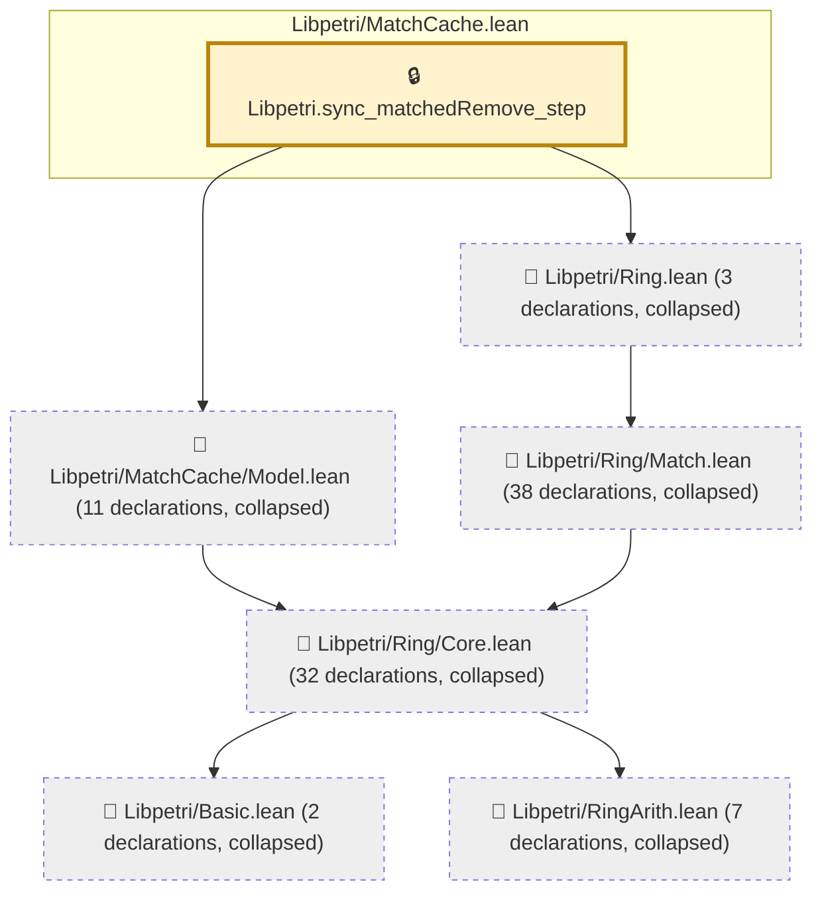

# NU-022

Generated by `scripts/proof-graph.py` from `proof-graph.json`. Do not edit.

Theorems carrying this ID:

- `Libpetri.sync_matchedRemove_step` (theorem, `Libpetri/MatchCache.lean:118`) 🔒 locked

> **Note:** the full tree has 94 nodes (limit 60).

> Rule: this theorem's tree has 94 nodes (limit 60); every file other than its own is collapsed into one node, leaving 7.

Axioms used:

- `Libpetri.sync_matchedRemove_step`: `Classical.choice`, `Quot.sound`, `propext`
