# NU-050

Generated by `scripts/proof-graph.py` from `proof-graph.json`. Do not edit.

Theorems carrying this ID:

- `Libpetri.Novel.CanonicalKey.canonicalKey_comp` (theorem, `Libpetri/Novel/CanonicalKey.lean:277`)
- `Libpetri.Novel.CanonicalKey.canonicalKey_complete` (theorem, `Libpetri/Novel/CanonicalKey.lean:308`)

```mermaid
flowchart TD
  subgraph g0["Libpetri/Novel/CanonicalKey.lean"]
    n98["Libpetri.Novel.CanonicalKey.canonicalKey"]
    n99["Libpetri.Novel.CanonicalKey.canonicalKey_comp"]
    n100["Libpetri.Novel.CanonicalKey.canonicalKey_complete"]
    n101["Libpetri.Novel.CanonicalKey.canonicalKey_eq_iff"]
    n103["Libpetri.Novel.CanonicalKey.canonicalKey_eq_of_sigs"]
    n104["Libpetri.Novel.CanonicalKey.cnt"]
    n105["Libpetri.Novel.CanonicalKey.cnt_eq_zero"]
    n106["Libpetri.Novel.CanonicalKey.cnt_sigs"]
    n107["Libpetri.Novel.CanonicalKey.entries"]
    n108["Libpetri.Novel.CanonicalKey.entries_pairwise_lt"]
    n109["Libpetri.Novel.CanonicalKey.exists_cnt_ne"]
    n110["Libpetri.Novel.CanonicalKey.exists_ne_of_mem_live"]
    n111["Libpetri.Novel.CanonicalKey.exists_perm_map_eq"]
    n112["Libpetri.Novel.CanonicalKey.getElem?_rank"]
    n113["Libpetri.Novel.CanonicalKey.getElem_sigs"]
    n114["Libpetri.Novel.CanonicalKey.length_sigs"]
    n115["Libpetri.Novel.CanonicalKey.live"]
    n116["Libpetri.Novel.CanonicalKey.liveSet"]
    n117["Libpetri.Novel.CanonicalKey.live_comp"]
    n118["Libpetri.Novel.CanonicalKey.mem_entries"]
    n119["Libpetri.Novel.CanonicalKey.mem_live_of_finite"]
    n120["Libpetri.Novel.CanonicalKey.mem_syms"]
    n121["Libpetri.Novel.CanonicalKey.rank"]
    n122["Libpetri.Novel.CanonicalKey.rank_getElem"]
    n123["Libpetri.Novel.CanonicalKey.rank_injOn"]
    n124["Libpetri.Novel.CanonicalKey.rank_lt"]
    n125["Libpetri.Novel.CanonicalKey.ranked"]
    n126["Libpetri.Novel.CanonicalKey.ranked_eq"]
    n127["Libpetri.Novel.CanonicalKey.sig"]
    n128["Libpetri.Novel.CanonicalKey.sigs"]
    n129["Libpetri.Novel.CanonicalKey.sigs_coe"]
    n130["Libpetri.Novel.CanonicalKey.sigs_eq_iff"]
    n131["Libpetri.Novel.CanonicalKey.sigs_eq_of_canonicalKey"]
    n132["Libpetri.Novel.CanonicalKey.sigs_eq_sort"]
    n133["Libpetri.Novel.CanonicalKey.sigs_sorted"]
    n134["Libpetri.Novel.CanonicalKey.syms"]
    n135["Libpetri.Novel.CanonicalKey.syms_coe"]
    n136["Libpetri.Novel.CanonicalKey.syms_nodup"]
    n137["Libpetri.Novel.CanonicalKey.toLex_mem_entries"]
  end
  n98 --> n107
  n99 --> n101
  n99 --> n117
  n100 --> n111
  n100 --> n119
  n100 --> n131
  n101 --> n103
  n101 --> n130
  n101 --> n131
  n103 --> n98
  n103 --> n108
  n103 --> n118
  n105 --> n104
  n106 --> n104
  n106 --> n128
  n107 --> n121
  n108 --> n107
  n108 --> n123
  n109 --> n106
  n109 --> n110
  n109 --> n114
  n109 --> n120
  n110 --> n115
  n112 --> n124
  n113 --> n106
  n113 --> n114
  n114 --> n128
  n115 --> n116
  n117 --> n119
  n118 --> n106
  n118 --> n107
  n118 --> n112
  n118 --> n114
  n118 --> n122
  n119 --> n115
  n120 --> n135
  n121 --> n134
  n122 --> n121
  n122 --> n136
  n123 --> n112
  n124 --> n120
  n124 --> n121
  n125 --> n115
  n125 --> n127
  n126 --> n134
  n128 --> n134
  n129 --> n128
  n129 --> n135
  n130 --> n132
  n131 --> n98
  n131 --> n109
  n131 --> n113
  n131 --> n137
  n132 --> n129
  n132 --> n133
  n133 --> n126
  n133 --> n128
  n134 --> n125
  n135 --> n134
  n136 --> n135
  n137 --> n105
  n137 --> n118
  classDef root stroke-width:3px
  classDef locked fill:#fff3cd,stroke:#b8860b
  classDef collapsed fill:#eeeeee,stroke-dasharray:4 4
  class n99,n100 root
```

Axioms used:

- `Libpetri.Novel.CanonicalKey.canonicalKey_comp`: `Classical.choice`, `Quot.sound`, `propext`
- `Libpetri.Novel.CanonicalKey.canonicalKey_complete`: `Classical.choice`, `Quot.sound`, `propext`
