# NU-052

Generated by `scripts/proof-graph.py` from `proof-graph.json`. Do not edit.

Theorems carrying this ID:

- `Libpetri.postFixPrune_agrees_with_executor` (theorem, `Libpetri/Priority.lean:62`) 🔒 locked
- `Libpetri.willFire_guard_is_necessary` (theorem, `Libpetri/Priority.lean:104`) 🔒 locked

```mermaid
flowchart TD
  subgraph g0["Libpetri/Basic.lean"]
    n0["Libpetri.AMarking"]
    n8["Libpetri.Card"]
    n9["Libpetri.Card.all"]
    n10["Libpetri.Card.atLeast"]
    n12["Libpetri.Card.exactly"]
    n13["Libpetri.Card.one"]
    n14["Libpetri.Card.required"]
    n21["Libpetri.Colour"]
    n74["Libpetri.Guard"]
    n76["Libpetri.InSpec"]
    n77["Libpetri.InSpec.card"]
    n79["Libpetri.InSpec.mk"]
    n80["Libpetri.InSpec.place"]
    n294["Libpetri.PlaceId"]
    n525["Libpetri.Transition"]
    n526["Libpetri.Transition.inhibitors"]
    n527["Libpetri.Transition.inputs"]
    n528["Libpetri.Transition.mk"]
    n530["Libpetri.Transition.priority"]
    n531["Libpetri.Transition.reads"]
    n653["Libpetri.enabledA"]
    n771["Libpetri.pre"]
    n824["Libpetri.specAt"]
  end
  subgraph g1["Libpetri/Priority.lean"]
    n284["Libpetri.NuTransition"]
    n285["Libpetri.NuTransition.base"]
    n286["Libpetri.NuTransition.mk"]
    n287["Libpetri.NuTransition.nameEnabled"]
    n596["Libpetri.candsOne"]
    n599["Libpetri.competes"]
    n635["Libpetri.demand"]
    n651["Libpetri.drainNu"]
    n671["Libpetri.executorFires"]
    n725["Libpetri.joinNu"]
    n733["Libpetri.mOne"]
    n753["Libpetri.pDrain"]
    n754["Libpetri.pJoin"]
    n763["Libpetri.placesOne"]
    n769["Libpetri.postFixPrune"]
    n770["🔒 Libpetri.postFixPrune_agrees_with_executor"]
    n773["Libpetri.preFixPrune"]
    n882["🔒 Libpetri.willFire_guard_is_necessary"]
  end
  n0 --> n294
  n9 --> n8
  n10 --> n8
  n12 --> n8
  n13 --> n8
  n14 --> n9
  n14 --> n10
  n14 --> n12
  n14 --> n13
  n74 --> n21
  n77 --> n8
  n77 --> n76
  n79 --> n8
  n79 --> n74
  n79 --> n76
  n79 --> n294
  n80 --> n76
  n80 --> n294
  n285 --> n284
  n285 --> n525
  n286 --> n284
  n286 --> n525
  n287 --> n284
  n526 --> n294
  n526 --> n525
  n527 --> n76
  n527 --> n525
  n528 --> n76
  n528 --> n294
  n528 --> n525
  n530 --> n525
  n531 --> n294
  n531 --> n525
  n596 --> n651
  n596 --> n725
  n599 --> n0
  n599 --> n635
  n635 --> n771
  n651 --> n286
  n651 --> n753
  n653 --> n0
  n653 --> n14
  n653 --> n77
  n653 --> n80
  n653 --> n526
  n653 --> n527
  n653 --> n531
  n671 --> n769
  n725 --> n286
  n725 --> n754
  n733 --> n0
  n753 --> n13
  n753 --> n79
  n753 --> n528
  n754 --> n13
  n754 --> n79
  n754 --> n528
  n763 --> n294
  n769 --> n285
  n769 --> n287
  n769 --> n530
  n769 --> n599
  n769 --> n653
  n770 --> n671
  n771 --> n14
  n771 --> n77
  n771 --> n824
  n773 --> n285
  n773 --> n530
  n773 --> n599
  n773 --> n653
  n824 --> n80
  n824 --> n527
  n882 --> n596
  n882 --> n671
  n882 --> n733
  n882 --> n763
  n882 --> n773
  classDef root stroke-width:3px
  classDef locked fill:#fff3cd,stroke:#b8860b
  classDef collapsed fill:#eeeeee,stroke-dasharray:4 4
  class n770,n882 root
  class n770,n882 locked
```

Axioms used:

- `Libpetri.postFixPrune_agrees_with_executor`: `propext`
- `Libpetri.willFire_guard_is_necessary`: none
