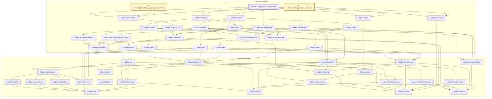

# NU-052

Generated by `scripts/proof-graph.py` from `proof-graph.json`. Do not edit.

Theorems carrying this ID:

- `Libpetri.inFlight_guard_is_necessary` (theorem, `Libpetri/Priority.lean:170`)
- `Libpetri.postFixPrune_agrees_with_executor` (theorem, `Libpetri/Priority.lean:88`) 🔒 locked
- `Libpetri.willFire_guard_is_necessary` (theorem, `Libpetri/Priority.lean:130`) 🔒 locked

```mermaid
flowchart TD
  subgraph g0["Libpetri/Basic.lean"]
    n0["Libpetri.AMarking"]
    n8["Libpetri.Card"]
    n9["Libpetri.Card.all"]
    n10["Libpetri.Card.atLeast"]
    n12["Libpetri.Card.exactly"]
    n13["Libpetri.Card.one"]
    n14["Libpetri.Card.required"]
    n21["Libpetri.Colour"]
    n74["Libpetri.Guard"]
    n76["Libpetri.InSpec"]
    n77["Libpetri.InSpec.card"]
    n79["Libpetri.InSpec.mk"]
    n80["Libpetri.InSpec.place"]
    n2374["Libpetri.PlaceId"]
    n2605["Libpetri.Transition"]
    n2606["Libpetri.Transition.inhibitors"]
    n2607["Libpetri.Transition.inputs"]
    n2608["Libpetri.Transition.mk"]
    n2610["Libpetri.Transition.priority"]
    n2611["Libpetri.Transition.reads"]
    n2734["Libpetri.enabledA"]
    n2857["Libpetri.pre"]
    n2912["Libpetri.specAt"]
  end
  subgraph g1["Libpetri/Priority.lean"]
    n2363["Libpetri.NuTransition"]
    n2364["Libpetri.NuTransition.base"]
    n2365["Libpetri.NuTransition.inFlight"]
    n2366["Libpetri.NuTransition.mk"]
    n2367["Libpetri.NuTransition.nameEnabled"]
    n2676["Libpetri.candsOne"]
    n2677["Libpetri.candsSplit"]
    n2680["Libpetri.competes"]
    n2716["Libpetri.demand"]
    n2732["Libpetri.drainNu"]
    n2752["Libpetri.executorFires"]
    n2775["Libpetri.hInFlight"]
    n2776["Libpetri.hSplit"]
    n2777["Libpetri.inFlight_guard_is_necessary"]
    n2809["Libpetri.joinNu"]
    n2813["Libpetri.lIdle"]
    n2814["Libpetri.lSplit"]
    n2819["Libpetri.mOne"]
    n2839["Libpetri.pDrain"]
    n2840["Libpetri.pJoin"]
    n2849["Libpetri.placesOne"]
    n2855["Libpetri.postFixPrune"]
    n2856["🔒 Libpetri.postFixPrune_agrees_with_executor"]
    n2859["Libpetri.preFixPrune"]
    n2861["Libpetri.preInFlightPrune"]
    n2971["🔒 Libpetri.willFire_guard_is_necessary"]
  end
  n0 --> n2374
  n9 --> n8
  n10 --> n8
  n12 --> n8
  n13 --> n8
  n14 --> n9
  n14 --> n10
  n14 --> n12
  n14 --> n13
  n74 --> n21
  n77 --> n8
  n77 --> n76
  n79 --> n8
  n79 --> n74
  n79 --> n76
  n79 --> n2374
  n80 --> n76
  n80 --> n2374
  n2364 --> n2363
  n2364 --> n2605
  n2365 --> n2363
  n2366 --> n2363
  n2366 --> n2605
  n2367 --> n2363
  n2606 --> n2374
  n2606 --> n2605
  n2607 --> n76
  n2607 --> n2605
  n2608 --> n76
  n2608 --> n2374
  n2608 --> n2605
  n2610 --> n2605
  n2611 --> n2374
  n2611 --> n2605
  n2676 --> n2732
  n2676 --> n2809
  n2677 --> n2775
  n2677 --> n2813
  n2680 --> n0
  n2680 --> n2716
  n2716 --> n2857
  n2732 --> n2366
  n2732 --> n2839
  n2734 --> n0
  n2734 --> n14
  n2734 --> n77
  n2734 --> n80
  n2734 --> n2606
  n2734 --> n2607
  n2734 --> n2611
  n2752 --> n2855
  n2775 --> n2366
  n2775 --> n2776
  n2776 --> n13
  n2776 --> n79
  n2776 --> n2608
  n2777 --> n2677
  n2777 --> n2752
  n2777 --> n2819
  n2777 --> n2849
  n2777 --> n2861
  n2809 --> n2366
  n2809 --> n2840
  n2813 --> n2366
  n2813 --> n2814
  n2814 --> n13
  n2814 --> n79
  n2814 --> n2608
  n2819 --> n0
  n2839 --> n13
  n2839 --> n79
  n2839 --> n2608
  n2840 --> n13
  n2840 --> n79
  n2840 --> n2608
  n2849 --> n2374
  n2855 --> n2364
  n2855 --> n2365
  n2855 --> n2367
  n2855 --> n2610
  n2855 --> n2680
  n2855 --> n2734
  n2856 --> n2752
  n2857 --> n14
  n2857 --> n77
  n2857 --> n2912
  n2859 --> n2364
  n2859 --> n2610
  n2859 --> n2680
  n2859 --> n2734
  n2861 --> n2364
  n2861 --> n2367
  n2861 --> n2610
  n2861 --> n2680
  n2861 --> n2734
  n2912 --> n80
  n2912 --> n2607
  n2971 --> n2676
  n2971 --> n2752
  n2971 --> n2819
  n2971 --> n2849
  n2971 --> n2859
  classDef root stroke-width:3px
  classDef locked fill:#fff3cd,stroke:#b8860b
  classDef collapsed fill:#eeeeee,stroke-dasharray:4 4
  class n2777,n2856,n2971 root
  class n2856,n2971 locked
```

Axioms used:

- `Libpetri.inFlight_guard_is_necessary`: none
- `Libpetri.postFixPrune_agrees_with_executor`: `propext`
- `Libpetri.willFire_guard_is_necessary`: none
