# NU-053

Generated by `scripts/proof-graph.py` from `proof-graph.json`. Do not edit.

Theorems carrying this ID:

- `Libpetri.covered_place_empty` (theorem, `Libpetri/Semiflow.lean:316`) 🔒 locked
- `Libpetri.vacuous_colour_layer` (theorem, `Libpetri/Semiflow.lean:362`) 🔒 locked

```mermaid
flowchart TD
  subgraph g0["Libpetri/Basic.lean"]
    n0["Libpetri.AMarking"]
    n8["Libpetri.Card"]
    n9["Libpetri.Card.all"]
    n10["Libpetri.Card.atLeast"]
    n11["Libpetri.Card.consumesAll"]
    n12["Libpetri.Card.exactly"]
    n13["Libpetri.Card.one"]
    n14["Libpetri.Card.required"]
    n76["Libpetri.InSpec"]
    n77["Libpetri.InSpec.card"]
    n80["Libpetri.InSpec.place"]
    n2374["Libpetri.PlaceId"]
    n2605["Libpetri.Transition"]
    n2606["Libpetri.Transition.inhibitors"]
    n2607["Libpetri.Transition.inputs"]
    n2611["Libpetri.Transition.reads"]
    n2612["Libpetri.Transition.resets"]
    n2682["Libpetri.consumeAllAt"]
    n2734["Libpetri.enabledA"]
    n2756["Libpetri.fireA"]
    n2852["Libpetri.post"]
    n2857["Libpetri.pre"]
    n2912["Libpetri.specAt"]
  end
  subgraph g1["Libpetri/InvariantSum.lean"]
    n2622["Libpetri.Weight"]
    n2721["Libpetri.dot"]
    n2722["Libpetri.dotInc"]
    n2723["Libpetri.dot_eq_isum"]
    n2801["Libpetri.isum"]
    n2802["🔒 Libpetri.isum_add"]
    n2804["🔒 Libpetri.isum_congr"]
  end
  subgraph g2["Libpetri/Semiflow.lean"]
    n2614["Libpetri.ValidLaw"]
    n2615["Libpetri.ValidLaw.h1"]
    n2616["Libpetri.ValidLaw.h2"]
    n2709["🔒 Libpetri.covered_place_empty"]
    n2711["🔒 Libpetri.covered_transition_dead"]
    n2727["🔒 Libpetri.dot_zero_forces_empty"]
    n2807["🔒 Libpetri.isum_term_le"]
    n2943["Libpetri.touchesCovered"]
    n2958["🔒 Libpetri.vacuous_colour_layer"]
  end
  subgraph g3["Libpetri/Soundness.lean"]
    n72["Libpetri.FlatNet"]
    n73["Libpetri.FlatTransition"]
    n2522["Libpetri.ReachA"]
    n2523["Libpetri.ReachA.init"]
    n2524["Libpetri.ReachA.rec'"]
    n2525["Libpetri.ReachA.step"]
    n2586["Libpetri.StepARel"]
    n2916["🔒 Libpetri.specAt_sound"]
  end
  subgraph g4["Libpetri/Strengthening.lean"]
    n2798["🔒 Libpetri.invariant_strengthening_sound"]
  end
  subgraph g5["Libpetri/Strengthening/Hypotheses.lean"]
    n2624["Libpetri.ZeroOnNonlinear"]
    n2724["🔒 Libpetri.dot_fireA"]
    n2765["🔒 Libpetri.fire_term"]
    n2862["🔒 Libpetri.pre_le_of_enabledA"]
  end
  n0 --> n2374
  n9 --> n8
  n10 --> n8
  n11 --> n9
  n11 --> n10
  n11 --> n12
  n11 --> n13
  n12 --> n8
  n13 --> n8
  n14 --> n9
  n14 --> n10
  n14 --> n12
  n14 --> n13
  n72 --> n73
  n73 --> n2374
  n73 --> n2605
  n77 --> n8
  n77 --> n76
  n80 --> n76
  n80 --> n2374
  n2522 --> n2586
  n2523 --> n2522
  n2524 --> n2523
  n2524 --> n2525
  n2525 --> n2522
  n2586 --> n72
  n2586 --> n2734
  n2586 --> n2756
  n2606 --> n2374
  n2606 --> n2605
  n2607 --> n76
  n2607 --> n2605
  n2611 --> n2374
  n2611 --> n2605
  n2612 --> n2374
  n2612 --> n2605
  n2614 --> n72
  n2614 --> n2622
  n2615 --> n2614
  n2615 --> n2624
  n2616 --> n2614
  n2616 --> n2722
  n2622 --> n2374
  n2624 --> n2612
  n2624 --> n2622
  n2624 --> n2682
  n2682 --> n11
  n2682 --> n77
  n2682 --> n2912
  n2709 --> n2615
  n2709 --> n2616
  n2709 --> n2727
  n2709 --> n2798
  n2711 --> n2709
  n2711 --> n2943
  n2721 --> n0
  n2721 --> n2622
  n2722 --> n73
  n2722 --> n2622
  n2722 --> n2801
  n2722 --> n2852
  n2722 --> n2857
  n2723 --> n2721
  n2723 --> n2801
  n2724 --> n2722
  n2724 --> n2723
  n2724 --> n2765
  n2724 --> n2802
  n2724 --> n2804
  n2727 --> n2723
  n2727 --> n2807
  n2734 --> n0
  n2734 --> n14
  n2734 --> n77
  n2734 --> n80
  n2734 --> n2606
  n2734 --> n2607
  n2734 --> n2611
  n2756 --> n0
  n2756 --> n2612
  n2756 --> n2682
  n2756 --> n2852
  n2756 --> n2857
  n2765 --> n2624
  n2765 --> n2756
  n2765 --> n2862
  n2798 --> n2524
  n2798 --> n2724
  n2801 --> n2374
  n2802 --> n2801
  n2804 --> n2801
  n2807 --> n2801
  n2852 --> n2374
  n2857 --> n14
  n2857 --> n77
  n2857 --> n2912
  n2862 --> n2734
  n2862 --> n2857
  n2862 --> n2916
  n2912 --> n80
  n2912 --> n2607
  n2916 --> n2912
  n2943 --> n73
  n2943 --> n2622
  n2943 --> n2852
  n2943 --> n2857
  n2958 --> n2711
  classDef root stroke-width:3px
  classDef locked fill:#fff3cd,stroke:#b8860b
  classDef collapsed fill:#eeeeee,stroke-dasharray:4 4
  class n2709,n2958 root
  class n2709,n2711,n2724,n2727,n2765,n2798,n2802,n2804,n2807,n2862,n2916,n2958 locked
```

Axioms used:

- `Libpetri.covered_place_empty`: `Classical.choice`, `Quot.sound`, `propext`
- `Libpetri.vacuous_colour_layer`: `Classical.choice`, `Quot.sound`, `propext`
