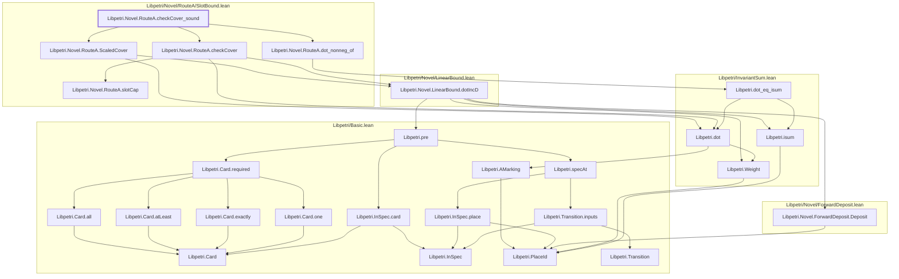

# NU-053

Generated by `scripts/proof-graph.py` from `proof-graph.json`. Do not edit.

Theorems carrying this ID:

- `Libpetri.Novel.RouteA.buildPlan_premisesS` (theorem, `Libpetri/Novel/RouteA/Plan.lean:555`)
- `Libpetri.Novel.RouteA.checkCover_sound` (theorem, `Libpetri/Novel/RouteA/SlotBound.lean:125`)
- `Libpetri.Novel.RouteA.vacuous_colour_layer_lp` (theorem, `Libpetri/Novel/RouteA/SlotBound.lean:211`)
- `Libpetri.covered_place_empty` (theorem, `Libpetri/Semiflow.lean:326`) 🔒 locked
- `Libpetri.vacuous_colour_layer` (theorem, `Libpetri/Semiflow.lean:375`) 🔒 locked

> **Note:** the full tree has 130 nodes (limit 60), so it is drawn as one diagram per theorem (5 theorems).

### `Libpetri.Novel.RouteA.buildPlan_premisesS`

> Rule: this theorem's tree has 88 nodes (limit 60); every file other than its own is collapsed into one node, leaving 32.

```mermaid
flowchart TD
  subgraph g0["Libpetri/Novel/RouteA/Plan.lean"]
    n1018["Libpetri.Novel.RouteA.Gate"]
    n1027["Libpetri.Novel.RouteA.MatchInfo"]
    n1028["Libpetri.Novel.RouteA.MatchInfo.keys"]
    n1030["Libpetri.Novel.RouteA.MatchInfo.relays"]
    n1052["Libpetri.Novel.RouteA.PremisesS"]
    n1058["Libpetri.Novel.RouteA.PremisesS.mk"]
    n1192["Libpetri.Novel.RouteA.SrcRow"]
    n1193["Libpetri.Novel.RouteA.SrcRow.d"]
    n1194["Libpetri.Novel.RouteA.SrcRow.declared"]
    n1195["Libpetri.Novel.RouteA.SrcRow.flat"]
    n1197["Libpetri.Novel.RouteA.SrcRow.ms"]
    n1198["Libpetri.Novel.RouteA.SrcRow.t"]
    n1199["Libpetri.Novel.RouteA.SrcRow.tw"]
    n1204["Libpetri.Novel.RouteA.arcsOK"]
    n1205["Libpetri.Novel.RouteA.arcsOK_spec"]
    n1207["Libpetri.Novel.RouteA.buildPlan"]
    n1211["Libpetri.Novel.RouteA.buildPlanG"]
    n1213["Libpetri.Novel.RouteA.buildPlanG_premisesS"]
    n1215["Libpetri.Novel.RouteA.buildPlan_premisesS"]
    n1220["Libpetri.Novel.RouteA.classifyAllG"]
    n1221["Libpetri.Novel.RouteA.classifyAll_spec"]
    n1223["Libpetri.Novel.RouteA.classifyRowG"]
    n1226["Libpetri.Novel.RouteA.classifyRowG_ok"]
    n1274["Libpetri.Novel.RouteA.mem_cin"]
    n1302["Libpetri.Novel.RouteA.shippedGate"]
  end
  c0["📁 Libpetri/Basic.lean (26 declarations, collapsed)"]
  c6["📁 Libpetri/InvariantSum.lean (4 declarations, collapsed)"]
  c26["📁 Libpetri/Novel/ForwardDeposit.lean (1 declarations, collapsed)"]
  c28["📁 Libpetri/Novel/LinearBound.lean (1 declarations, collapsed)"]
  c33["📁 Libpetri/Novel/RouteA/Model.lean (23 declarations, collapsed)"]
  c39["📁 Libpetri/Novel/RouteA/SlotBound.lean (7 declarations, collapsed)"]
  c83["📁 Libpetri/Strengthening/Hypotheses.lean (1 declarations, collapsed)"]
  c6 --> c0
  c26 --> c0
  c28 --> c6
  c28 --> c26
  c33 --> c6
  c33 --> c26
  c39 --> c28
  c83 --> c6
  n1018 --> c0
  n1018 --> n1192
  n1028 --> c0
  n1028 --> n1027
  n1030 --> c0
  n1030 --> n1027
  n1052 --> c33
  n1058 --> c39
  n1058 --> c83
  n1058 --> n1052
  n1193 --> c26
  n1193 --> n1192
  n1194 --> n1192
  n1195 --> n1193
  n1195 --> n1198
  n1197 --> n1027
  n1197 --> n1192
  n1198 --> c0
  n1198 --> n1192
  n1199 --> c0
  n1199 --> n1192
  n1204 --> c0
  n1205 --> c33
  n1205 --> n1204
  n1207 --> c39
  n1207 --> n1195
  n1207 --> n1211
  n1207 --> n1302
  n1211 --> n1204
  n1211 --> n1220
  n1213 --> n1058
  n1213 --> n1205
  n1213 --> n1211
  n1213 --> n1221
  n1215 --> n1207
  n1215 --> n1213
  n1220 --> n1018
  n1220 --> n1193
  n1220 --> n1197
  n1220 --> n1198
  n1220 --> n1223
  n1221 --> n1195
  n1221 --> n1220
  n1221 --> n1226
  n1223 --> c33
  n1223 --> n1028
  n1223 --> n1030
  n1226 --> n1223
  n1226 --> n1274
  n1274 --> c0
  n1302 --> n1018
  n1302 --> n1194
  n1302 --> n1199
  classDef root stroke-width:3px
  classDef locked fill:#fff3cd,stroke:#b8860b
  classDef collapsed fill:#eeeeee,stroke-dasharray:4 4
  class n1215 root
  class c0,c6,c26,c28,c33,c39,c83 collapsed
```

### `Libpetri.Novel.RouteA.checkCover_sound`

> Rule: this theorem's whole tree, 26 nodes.

```mermaid
flowchart TD
  subgraph g0["Libpetri/Basic.lean"]
    n0["Libpetri.AMarking"]
    n8["Libpetri.Card"]
    n9["Libpetri.Card.all"]
    n10["Libpetri.Card.atLeast"]
    n12["Libpetri.Card.exactly"]
    n13["Libpetri.Card.one"]
    n14["Libpetri.Card.required"]
    n76["Libpetri.InSpec"]
    n77["Libpetri.InSpec.card"]
    n80["Libpetri.InSpec.place"]
    n2506["Libpetri.PlaceId"]
    n2737["Libpetri.Transition"]
    n2739["Libpetri.Transition.inputs"]
    n2989["Libpetri.pre"]
    n3044["Libpetri.specAt"]
  end
  subgraph g1["Libpetri/InvariantSum.lean"]
    n2754["Libpetri.Weight"]
    n2853["Libpetri.dot"]
    n2855["Libpetri.dot_eq_isum"]
    n2933["Libpetri.isum"]
  end
  subgraph g2["Libpetri/Novel/ForwardDeposit.lean"]
    n668["Libpetri.Novel.ForwardDeposit.Deposit"]
  end
  subgraph g3["Libpetri/Novel/LinearBound.lean"]
    n840["Libpetri.Novel.LinearBound.dotIncD"]
  end
  subgraph g4["Libpetri/Novel/RouteA/SlotBound.lean"]
    n1186["Libpetri.Novel.RouteA.ScaledCover"]
    n1216["Libpetri.Novel.RouteA.checkCover"]
    n1217["Libpetri.Novel.RouteA.checkCover_sound"]
    n1257["Libpetri.Novel.RouteA.dot_nonneg_of"]
    n1307["Libpetri.Novel.RouteA.slotCap"]
  end
  n0 --> n2506
  n9 --> n8
  n10 --> n8
  n12 --> n8
  n13 --> n8
  n14 --> n9
  n14 --> n10
  n14 --> n12
  n14 --> n13
  n77 --> n8
  n77 --> n76
  n80 --> n76
  n80 --> n2506
  n668 --> n2506
  n840 --> n668
  n840 --> n2754
  n840 --> n2933
  n840 --> n2989
  n1186 --> n840
  n1186 --> n2853
  n1216 --> n840
  n1216 --> n1307
  n1216 --> n2853
  n1217 --> n1186
  n1217 --> n1216
  n1217 --> n1257
  n1257 --> n2855
  n2739 --> n76
  n2739 --> n2737
  n2754 --> n2506
  n2853 --> n0
  n2853 --> n2754
  n2855 --> n2853
  n2855 --> n2933
  n2933 --> n2506
  n2989 --> n14
  n2989 --> n77
  n2989 --> n3044
  n3044 --> n80
  n3044 --> n2739
  classDef root stroke-width:3px
  classDef locked fill:#fff3cd,stroke:#b8860b
  classDef collapsed fill:#eeeeee,stroke-dasharray:4 4
  class n1217 root
```

### `Libpetri.Novel.RouteA.vacuous_colour_layer_lp`

> Rule: this theorem's whole tree, 47 nodes.

```mermaid
flowchart TD
  subgraph g0["Libpetri/Basic.lean"]
    n0["Libpetri.AMarking"]
    n8["Libpetri.Card"]
    n9["Libpetri.Card.all"]
    n10["Libpetri.Card.atLeast"]
    n11["Libpetri.Card.consumesAll"]
    n12["Libpetri.Card.exactly"]
    n13["Libpetri.Card.one"]
    n14["Libpetri.Card.required"]
    n76["Libpetri.InSpec"]
    n77["Libpetri.InSpec.card"]
    n80["Libpetri.InSpec.place"]
    n2506["Libpetri.PlaceId"]
    n2737["Libpetri.Transition"]
    n2738["Libpetri.Transition.inhibitors"]
    n2739["Libpetri.Transition.inputs"]
    n2743["Libpetri.Transition.reads"]
    n2744["Libpetri.Transition.resets"]
    n2814["Libpetri.consumeAllAt"]
    n2866["Libpetri.enabledA"]
    n2989["Libpetri.pre"]
    n3044["Libpetri.specAt"]
  end
  subgraph g1["Libpetri/InvariantSum.lean"]
    n2754["Libpetri.Weight"]
    n2853["Libpetri.dot"]
    n2855["Libpetri.dot_eq_isum"]
    n2933["Libpetri.isum"]
    n2934["🔒 Libpetri.isum_add"]
    n2936["🔒 Libpetri.isum_congr"]
  end
  subgraph g2["Libpetri/Novel/ForwardDeposit.lean"]
    n668["Libpetri.Novel.ForwardDeposit.Deposit"]
    n678["Libpetri.Novel.ForwardDeposit.ReachAD"]
    n679["Libpetri.Novel.ForwardDeposit.ReachADInj"]
    n681["Libpetri.Novel.ForwardDeposit.StepAD"]
    n682["Libpetri.Novel.ForwardDeposit.StepADInj"]
    n696["Libpetri.Novel.ForwardDeposit.fireAD"]
    n731["Libpetri.Novel.ForwardDeposit.reachAD_sub_inj"]
  end
  subgraph g3["Libpetri/Novel/LinearBound.lean"]
    n840["Libpetri.Novel.LinearBound.dotIncD"]
    n843["Libpetri.Novel.LinearBound.dot_fireAD_le"]
    n845["Libpetri.Novel.LinearBound.dot_inject"]
    n847["Libpetri.Novel.LinearBound.dot_le_initial_rows"]
    n850["Libpetri.Novel.LinearBound.fireAD_le_linear"]
    n853["Libpetri.Novel.LinearBound.isum_le"]
  end
  subgraph g4["Libpetri/Novel/RouteA/SlotBound.lean"]
    n1186["Libpetri.Novel.RouteA.ScaledCover"]
    n1245["Libpetri.Novel.RouteA.coloured_tokens_le"]
    n1246["Libpetri.Novel.RouteA.count_le_fireAD"]
    n1310["Libpetri.Novel.RouteA.sum_le_dot_scaled"]
    n1316["Libpetri.Novel.RouteA.vacuous_colour_layer_lp"]
  end
  subgraph g5["Libpetri/Soundness.lean"]
    n3048["🔒 Libpetri.specAt_sound"]
  end
  subgraph g6["Libpetri/Strengthening/Hypotheses.lean"]
    n2994["🔒 Libpetri.pre_le_of_enabledA"]
  end
  n0 --> n2506
  n9 --> n8
  n10 --> n8
  n11 --> n9
  n11 --> n10
  n11 --> n12
  n11 --> n13
  n12 --> n8
  n13 --> n8
  n14 --> n9
  n14 --> n10
  n14 --> n12
  n14 --> n13
  n77 --> n8
  n77 --> n76
  n80 --> n76
  n80 --> n2506
  n668 --> n2506
  n678 --> n681
  n679 --> n682
  n681 --> n696
  n681 --> n2866
  n682 --> n681
  n696 --> n0
  n696 --> n668
  n696 --> n2744
  n696 --> n2814
  n696 --> n2989
  n731 --> n678
  n731 --> n679
  n840 --> n668
  n840 --> n2754
  n840 --> n2933
  n840 --> n2989
  n843 --> n840
  n843 --> n850
  n843 --> n853
  n843 --> n2855
  n843 --> n2934
  n845 --> n2855
  n845 --> n2936
  n847 --> n679
  n847 --> n843
  n847 --> n845
  n850 --> n696
  n850 --> n2994
  n853 --> n2933
  n1186 --> n840
  n1186 --> n2853
  n1245 --> n731
  n1245 --> n847
  n1245 --> n1186
  n1245 --> n1310
  n1246 --> n696
  n1310 --> n2855
  n1316 --> n1245
  n1316 --> n1246
  n2738 --> n2506
  n2738 --> n2737
  n2739 --> n76
  n2739 --> n2737
  n2743 --> n2506
  n2743 --> n2737
  n2744 --> n2506
  n2744 --> n2737
  n2754 --> n2506
  n2814 --> n11
  n2814 --> n77
  n2814 --> n3044
  n2853 --> n0
  n2853 --> n2754
  n2855 --> n2853
  n2855 --> n2933
  n2866 --> n0
  n2866 --> n14
  n2866 --> n77
  n2866 --> n80
  n2866 --> n2738
  n2866 --> n2739
  n2866 --> n2743
  n2933 --> n2506
  n2934 --> n2933
  n2936 --> n2933
  n2989 --> n14
  n2989 --> n77
  n2989 --> n3044
  n2994 --> n2866
  n2994 --> n2989
  n2994 --> n3048
  n3044 --> n80
  n3044 --> n2739
  n3048 --> n3044
  classDef root stroke-width:3px
  classDef locked fill:#fff3cd,stroke:#b8860b
  classDef collapsed fill:#eeeeee,stroke-dasharray:4 4
  class n1316 root
  class n2934,n2936,n2994,n3048 locked
```

### `Libpetri.covered_place_empty`

> Rule: this theorem's whole tree, 49 nodes.

```mermaid
flowchart TD
  subgraph g0["Libpetri/Basic.lean"]
    n0["Libpetri.AMarking"]
    n8["Libpetri.Card"]
    n9["Libpetri.Card.all"]
    n10["Libpetri.Card.atLeast"]
    n11["Libpetri.Card.consumesAll"]
    n12["Libpetri.Card.exactly"]
    n13["Libpetri.Card.one"]
    n14["Libpetri.Card.required"]
    n76["Libpetri.InSpec"]
    n77["Libpetri.InSpec.card"]
    n80["Libpetri.InSpec.place"]
    n2506["Libpetri.PlaceId"]
    n2737["Libpetri.Transition"]
    n2738["Libpetri.Transition.inhibitors"]
    n2739["Libpetri.Transition.inputs"]
    n2743["Libpetri.Transition.reads"]
    n2744["Libpetri.Transition.resets"]
    n2814["Libpetri.consumeAllAt"]
    n2866["Libpetri.enabledA"]
    n2888["Libpetri.fireA"]
    n2984["Libpetri.post"]
    n2989["Libpetri.pre"]
    n3044["Libpetri.specAt"]
  end
  subgraph g1["Libpetri/InvariantSum.lean"]
    n2754["Libpetri.Weight"]
    n2853["Libpetri.dot"]
    n2854["Libpetri.dotInc"]
    n2855["Libpetri.dot_eq_isum"]
    n2933["Libpetri.isum"]
    n2934["🔒 Libpetri.isum_add"]
    n2936["🔒 Libpetri.isum_congr"]
  end
  subgraph g2["Libpetri/Semiflow.lean"]
    n2746["Libpetri.ValidLaw"]
    n2747["Libpetri.ValidLaw.h1"]
    n2748["Libpetri.ValidLaw.h2"]
    n2841["🔒 Libpetri.covered_place_empty"]
    n2859["🔒 Libpetri.dot_zero_forces_empty"]
    n2939["🔒 Libpetri.isum_term_le"]
  end
  subgraph g3["Libpetri/Soundness.lean"]
    n72["Libpetri.FlatNet"]
    n73["Libpetri.FlatTransition"]
    n2654["Libpetri.ReachA"]
    n2655["Libpetri.ReachA.init"]
    n2656["Libpetri.ReachA.rec'"]
    n2657["Libpetri.ReachA.step"]
    n2718["Libpetri.StepARel"]
    n3048["🔒 Libpetri.specAt_sound"]
  end
  subgraph g4["Libpetri/Strengthening.lean"]
    n2930["🔒 Libpetri.invariant_strengthening_sound"]
  end
  subgraph g5["Libpetri/Strengthening/Hypotheses.lean"]
    n2756["Libpetri.ZeroOnNonlinear"]
    n2856["🔒 Libpetri.dot_fireA"]
    n2897["🔒 Libpetri.fire_term"]
    n2994["🔒 Libpetri.pre_le_of_enabledA"]
  end
  n0 --> n2506
  n9 --> n8
  n10 --> n8
  n11 --> n9
  n11 --> n10
  n11 --> n12
  n11 --> n13
  n12 --> n8
  n13 --> n8
  n14 --> n9
  n14 --> n10
  n14 --> n12
  n14 --> n13
  n72 --> n73
  n73 --> n2506
  n73 --> n2737
  n77 --> n8
  n77 --> n76
  n80 --> n76
  n80 --> n2506
  n2654 --> n2718
  n2655 --> n2654
  n2656 --> n2655
  n2656 --> n2657
  n2657 --> n2654
  n2718 --> n72
  n2718 --> n2866
  n2718 --> n2888
  n2738 --> n2506
  n2738 --> n2737
  n2739 --> n76
  n2739 --> n2737
  n2743 --> n2506
  n2743 --> n2737
  n2744 --> n2506
  n2744 --> n2737
  n2746 --> n72
  n2746 --> n2754
  n2747 --> n2746
  n2747 --> n2756
  n2748 --> n2746
  n2748 --> n2854
  n2754 --> n2506
  n2756 --> n2744
  n2756 --> n2754
  n2756 --> n2814
  n2814 --> n11
  n2814 --> n77
  n2814 --> n3044
  n2841 --> n2747
  n2841 --> n2748
  n2841 --> n2859
  n2841 --> n2930
  n2853 --> n0
  n2853 --> n2754
  n2854 --> n73
  n2854 --> n2754
  n2854 --> n2933
  n2854 --> n2984
  n2854 --> n2989
  n2855 --> n2853
  n2855 --> n2933
  n2856 --> n2854
  n2856 --> n2855
  n2856 --> n2897
  n2856 --> n2934
  n2856 --> n2936
  n2859 --> n2855
  n2859 --> n2939
  n2866 --> n0
  n2866 --> n14
  n2866 --> n77
  n2866 --> n80
  n2866 --> n2738
  n2866 --> n2739
  n2866 --> n2743
  n2888 --> n0
  n2888 --> n2744
  n2888 --> n2814
  n2888 --> n2984
  n2888 --> n2989
  n2897 --> n2756
  n2897 --> n2888
  n2897 --> n2994
  n2930 --> n2656
  n2930 --> n2856
  n2933 --> n2506
  n2934 --> n2933
  n2936 --> n2933
  n2939 --> n2933
  n2984 --> n2506
  n2989 --> n14
  n2989 --> n77
  n2989 --> n3044
  n2994 --> n2866
  n2994 --> n2989
  n2994 --> n3048
  n3044 --> n80
  n3044 --> n2739
  n3048 --> n3044
  classDef root stroke-width:3px
  classDef locked fill:#fff3cd,stroke:#b8860b
  classDef collapsed fill:#eeeeee,stroke-dasharray:4 4
  class n2841 root
  class n2841,n2856,n2859,n2897,n2930,n2934,n2936,n2939,n2994,n3048 locked
```

### `Libpetri.vacuous_colour_layer`

> Rule: this theorem's whole tree, 52 nodes.

```mermaid
flowchart TD
  subgraph g0["Libpetri/Basic.lean"]
    n0["Libpetri.AMarking"]
    n8["Libpetri.Card"]
    n9["Libpetri.Card.all"]
    n10["Libpetri.Card.atLeast"]
    n11["Libpetri.Card.consumesAll"]
    n12["Libpetri.Card.exactly"]
    n13["Libpetri.Card.one"]
    n14["Libpetri.Card.required"]
    n76["Libpetri.InSpec"]
    n77["Libpetri.InSpec.card"]
    n80["Libpetri.InSpec.place"]
    n2506["Libpetri.PlaceId"]
    n2737["Libpetri.Transition"]
    n2738["Libpetri.Transition.inhibitors"]
    n2739["Libpetri.Transition.inputs"]
    n2743["Libpetri.Transition.reads"]
    n2744["Libpetri.Transition.resets"]
    n2814["Libpetri.consumeAllAt"]
    n2866["Libpetri.enabledA"]
    n2888["Libpetri.fireA"]
    n2984["Libpetri.post"]
    n2989["Libpetri.pre"]
    n3044["Libpetri.specAt"]
  end
  subgraph g1["Libpetri/InvariantSum.lean"]
    n2754["Libpetri.Weight"]
    n2853["Libpetri.dot"]
    n2854["Libpetri.dotInc"]
    n2855["Libpetri.dot_eq_isum"]
    n2933["Libpetri.isum"]
    n2934["🔒 Libpetri.isum_add"]
    n2936["🔒 Libpetri.isum_congr"]
  end
  subgraph g2["Libpetri/Semiflow.lean"]
    n2746["Libpetri.ValidLaw"]
    n2747["Libpetri.ValidLaw.h1"]
    n2748["Libpetri.ValidLaw.h2"]
    n2841["🔒 Libpetri.covered_place_empty"]
    n2843["🔒 Libpetri.covered_transition_dead"]
    n2859["🔒 Libpetri.dot_zero_forces_empty"]
    n2939["🔒 Libpetri.isum_term_le"]
    n3075["Libpetri.touchesCovered"]
    n3090["🔒 Libpetri.vacuous_colour_layer"]
  end
  subgraph g3["Libpetri/Soundness.lean"]
    n72["Libpetri.FlatNet"]
    n73["Libpetri.FlatTransition"]
    n2654["Libpetri.ReachA"]
    n2655["Libpetri.ReachA.init"]
    n2656["Libpetri.ReachA.rec'"]
    n2657["Libpetri.ReachA.step"]
    n2718["Libpetri.StepARel"]
    n3048["🔒 Libpetri.specAt_sound"]
  end
  subgraph g4["Libpetri/Strengthening.lean"]
    n2930["🔒 Libpetri.invariant_strengthening_sound"]
  end
  subgraph g5["Libpetri/Strengthening/Hypotheses.lean"]
    n2756["Libpetri.ZeroOnNonlinear"]
    n2856["🔒 Libpetri.dot_fireA"]
    n2897["🔒 Libpetri.fire_term"]
    n2994["🔒 Libpetri.pre_le_of_enabledA"]
  end
  n0 --> n2506
  n9 --> n8
  n10 --> n8
  n11 --> n9
  n11 --> n10
  n11 --> n12
  n11 --> n13
  n12 --> n8
  n13 --> n8
  n14 --> n9
  n14 --> n10
  n14 --> n12
  n14 --> n13
  n72 --> n73
  n73 --> n2506
  n73 --> n2737
  n77 --> n8
  n77 --> n76
  n80 --> n76
  n80 --> n2506
  n2654 --> n2718
  n2655 --> n2654
  n2656 --> n2655
  n2656 --> n2657
  n2657 --> n2654
  n2718 --> n72
  n2718 --> n2866
  n2718 --> n2888
  n2738 --> n2506
  n2738 --> n2737
  n2739 --> n76
  n2739 --> n2737
  n2743 --> n2506
  n2743 --> n2737
  n2744 --> n2506
  n2744 --> n2737
  n2746 --> n72
  n2746 --> n2754
  n2747 --> n2746
  n2747 --> n2756
  n2748 --> n2746
  n2748 --> n2854
  n2754 --> n2506
  n2756 --> n2744
  n2756 --> n2754
  n2756 --> n2814
  n2814 --> n11
  n2814 --> n77
  n2814 --> n3044
  n2841 --> n2747
  n2841 --> n2748
  n2841 --> n2859
  n2841 --> n2930
  n2843 --> n2841
  n2843 --> n3075
  n2853 --> n0
  n2853 --> n2754
  n2854 --> n73
  n2854 --> n2754
  n2854 --> n2933
  n2854 --> n2984
  n2854 --> n2989
  n2855 --> n2853
  n2855 --> n2933
  n2856 --> n2854
  n2856 --> n2855
  n2856 --> n2897
  n2856 --> n2934
  n2856 --> n2936
  n2859 --> n2855
  n2859 --> n2939
  n2866 --> n0
  n2866 --> n14
  n2866 --> n77
  n2866 --> n80
  n2866 --> n2738
  n2866 --> n2739
  n2866 --> n2743
  n2888 --> n0
  n2888 --> n2744
  n2888 --> n2814
  n2888 --> n2984
  n2888 --> n2989
  n2897 --> n2756
  n2897 --> n2888
  n2897 --> n2994
  n2930 --> n2656
  n2930 --> n2856
  n2933 --> n2506
  n2934 --> n2933
  n2936 --> n2933
  n2939 --> n2933
  n2984 --> n2506
  n2989 --> n14
  n2989 --> n77
  n2989 --> n3044
  n2994 --> n2866
  n2994 --> n2989
  n2994 --> n3048
  n3044 --> n80
  n3044 --> n2739
  n3048 --> n3044
  n3075 --> n73
  n3075 --> n2754
  n3075 --> n2984
  n3075 --> n2989
  n3090 --> n2843
  classDef root stroke-width:3px
  classDef locked fill:#fff3cd,stroke:#b8860b
  classDef collapsed fill:#eeeeee,stroke-dasharray:4 4
  class n3090 root
  class n2841,n2843,n2856,n2859,n2897,n2930,n2934,n2936,n2939,n2994,n3048,n3090 locked
```

Axioms used:

- `Libpetri.Novel.RouteA.buildPlan_premisesS`: `Classical.choice`, `Quot.sound`, `propext`
- `Libpetri.Novel.RouteA.checkCover_sound`: `Classical.choice`, `Quot.sound`, `propext`
- `Libpetri.Novel.RouteA.vacuous_colour_layer_lp`: `Classical.choice`, `Quot.sound`, `propext`
- `Libpetri.covered_place_empty`: `Classical.choice`, `Quot.sound`, `propext`
- `Libpetri.vacuous_colour_layer`: `Classical.choice`, `Quot.sound`, `propext`
