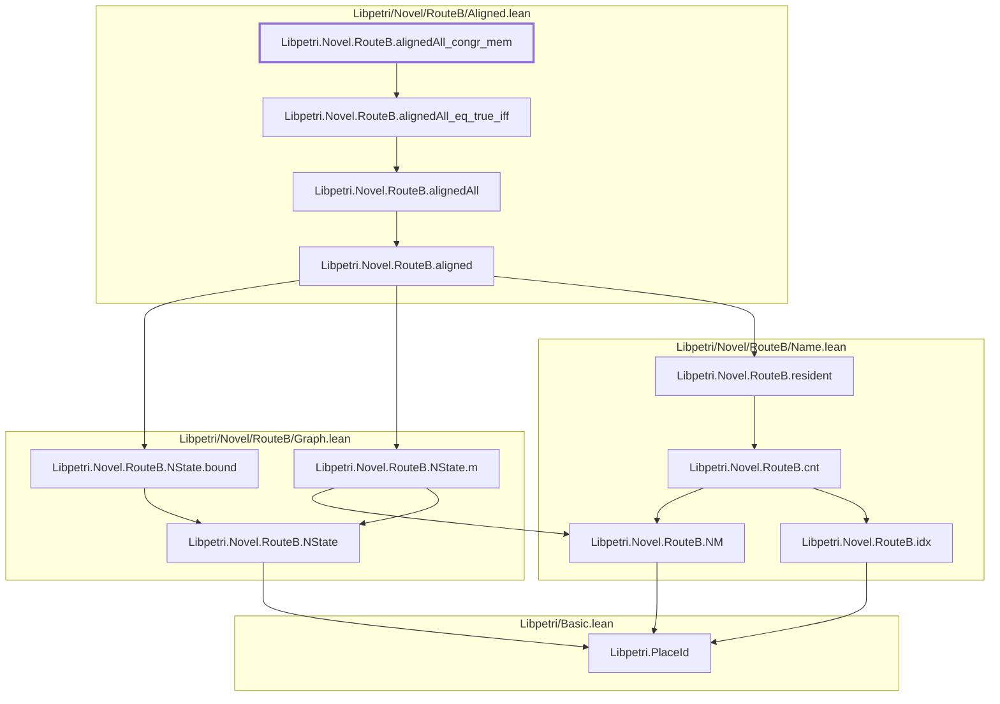
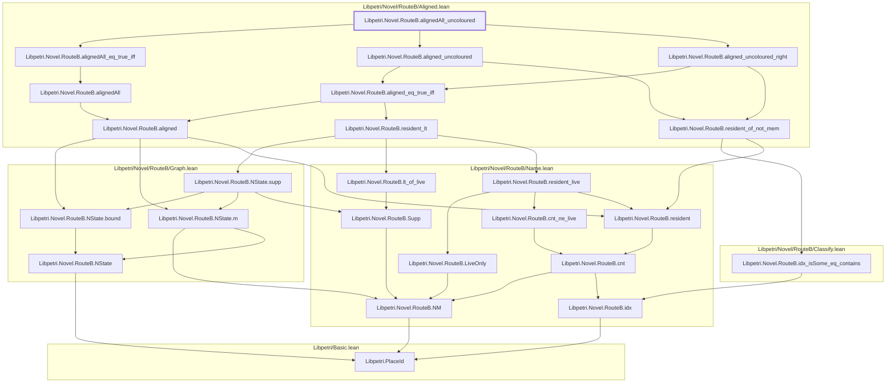
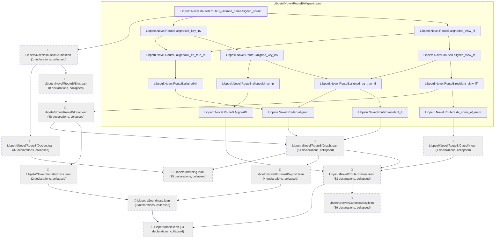
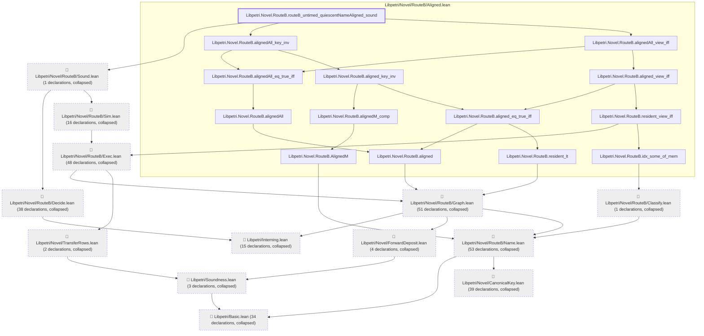

# NU-055

Generated by `scripts/proof-graph.py` from `proof-graph.json`. Do not edit.

Theorems carrying this ID:

- `Libpetri.Novel.RouteB.alignedAll_congr_mem` (theorem, `Libpetri/Novel/RouteB/Aligned.lean:194`)
- `Libpetri.Novel.RouteB.alignedAll_key_inv` (theorem, `Libpetri/Novel/RouteB/Aligned.lean:201`)
- `Libpetri.Novel.RouteB.alignedAll_uncoloured` (theorem, `Libpetri/Novel/RouteB/Aligned.lean:220`)
- `Libpetri.Novel.RouteB.alignedAll_view_iff` (theorem, `Libpetri/Novel/RouteB/Aligned.lean:207`)
- `Libpetri.Novel.RouteB.routeB_untimed_nameAligned_sound` (theorem, `Libpetri/Novel/RouteB/Aligned.lean:241`)
- `Libpetri.Novel.RouteB.routeB_untimed_quiescentNameAligned_sound` (theorem, `Libpetri/Novel/RouteB/Aligned.lean:260`)

> **Note:** the full tree has 327 nodes (limit 60), so it is drawn as one diagram per theorem (6 theorems).

### `Libpetri.Novel.RouteB.alignedAll_congr_mem`

> Rule: this theorem's whole tree, 12 nodes.

### `Libpetri.Novel.RouteB.alignedAll_key_inv`

> Rule: this theorem's whole tree, 57 nodes.

```mermaid
flowchart TD
  subgraph g0["Libpetri/Basic.lean"]
    n2512["Libpetri.PlaceId"]
  end
  subgraph g1["Libpetri/Novel/CanonicalKey.lean"]
    n98["Libpetri.Novel.CanonicalKey.canonicalKey"]
    n100["Libpetri.Novel.CanonicalKey.canonicalKey_complete"]
    n104["Libpetri.Novel.CanonicalKey.cnt"]
    n105["Libpetri.Novel.CanonicalKey.cnt_eq_zero"]
    n106["Libpetri.Novel.CanonicalKey.cnt_sigs"]
    n107["Libpetri.Novel.CanonicalKey.entries"]
    n109["Libpetri.Novel.CanonicalKey.exists_cnt_ne"]
    n110["Libpetri.Novel.CanonicalKey.exists_ne_of_mem_live"]
    n111["Libpetri.Novel.CanonicalKey.exists_perm_map_eq"]
    n112["Libpetri.Novel.CanonicalKey.getElem?_rank"]
    n113["Libpetri.Novel.CanonicalKey.getElem_sigs"]
    n114["Libpetri.Novel.CanonicalKey.length_sigs"]
    n115["Libpetri.Novel.CanonicalKey.live"]
    n116["Libpetri.Novel.CanonicalKey.liveSet"]
    n118["Libpetri.Novel.CanonicalKey.mem_entries"]
    n119["Libpetri.Novel.CanonicalKey.mem_live_of_finite"]
    n120["Libpetri.Novel.CanonicalKey.mem_syms"]
    n121["Libpetri.Novel.CanonicalKey.rank"]
    n122["Libpetri.Novel.CanonicalKey.rank_getElem"]
    n124["Libpetri.Novel.CanonicalKey.rank_lt"]
    n125["Libpetri.Novel.CanonicalKey.ranked"]
    n127["Libpetri.Novel.CanonicalKey.sig"]
    n128["Libpetri.Novel.CanonicalKey.sigs"]
    n131["Libpetri.Novel.CanonicalKey.sigs_eq_of_canonicalKey"]
    n134["Libpetri.Novel.CanonicalKey.syms"]
    n135["Libpetri.Novel.CanonicalKey.syms_coe"]
    n136["Libpetri.Novel.CanonicalKey.syms_nodup"]
    n137["Libpetri.Novel.CanonicalKey.toLex_mem_entries"]
  end
  subgraph g2["Libpetri/Novel/RouteB/Aligned.lean"]
    n1318["Libpetri.Novel.RouteB.AlignedM"]
    n1477["Libpetri.Novel.RouteB.aligned"]
    n1478["Libpetri.Novel.RouteB.alignedAll"]
    n1480["Libpetri.Novel.RouteB.alignedAll_eq_true_iff"]
    n1481["Libpetri.Novel.RouteB.alignedAll_key_inv"]
    n1484["Libpetri.Novel.RouteB.alignedM_comp"]
    n1485["Libpetri.Novel.RouteB.aligned_eq_true_iff"]
    n1486["Libpetri.Novel.RouteB.aligned_key_inv"]
    n1661["Libpetri.Novel.RouteB.resident_lt"]
  end
  subgraph g3["Libpetri/Novel/RouteB/Graph.lean"]
    n1414["Libpetri.Novel.RouteB.NState"]
    n1415["Libpetri.Novel.RouteB.NState.b"]
    n1416["Libpetri.Novel.RouteB.NState.bound"]
    n1417["Libpetri.Novel.RouteB.NState.m"]
    n1420["Libpetri.Novel.RouteB.NState.supp"]
    n1602["Libpetri.Novel.RouteB.keyOf"]
    n1609["Libpetri.Novel.RouteB.liveSet_finite"]
  end
  subgraph g4["Libpetri/Novel/RouteB/Name.lean"]
    n1406["Libpetri.Novel.RouteB.LiveOnly"]
    n1413["Libpetri.Novel.RouteB.NM"]
    n1435["Libpetri.Novel.RouteB.RenamingInvariant"]
    n1450["Libpetri.Novel.RouteB.Supp"]
    n1508["Libpetri.Novel.RouteB.cnt"]
    n1509["Libpetri.Novel.RouteB.cnt_comp"]
    n1512["Libpetri.Novel.RouteB.cnt_ne_live"]
    n1570["Libpetri.Novel.RouteB.idx"]
    n1611["Libpetri.Novel.RouteB.lt_of_live"]
    n1658["Libpetri.Novel.RouteB.resident"]
    n1659["Libpetri.Novel.RouteB.resident_inv"]
    n1660["Libpetri.Novel.RouteB.resident_live"]
  end
  n98 --> n107
  n100 --> n111
  n100 --> n119
  n100 --> n131
  n105 --> n104
  n106 --> n104
  n106 --> n128
  n107 --> n121
  n109 --> n106
  n109 --> n110
  n109 --> n114
  n109 --> n120
  n110 --> n115
  n112 --> n124
  n113 --> n106
  n113 --> n114
  n114 --> n128
  n115 --> n116
  n118 --> n106
  n118 --> n107
  n118 --> n112
  n118 --> n114
  n118 --> n122
  n119 --> n115
  n120 --> n135
  n121 --> n134
  n122 --> n121
  n122 --> n136
  n124 --> n120
  n124 --> n121
  n125 --> n115
  n125 --> n127
  n128 --> n134
  n131 --> n98
  n131 --> n109
  n131 --> n113
  n131 --> n137
  n134 --> n125
  n135 --> n134
  n136 --> n135
  n137 --> n105
  n137 --> n118
  n1318 --> n1658
  n1406 --> n1413
  n1413 --> n2512
  n1414 --> n2512
  n1415 --> n1414
  n1416 --> n1414
  n1417 --> n1413
  n1417 --> n1414
  n1420 --> n1416
  n1420 --> n1417
  n1420 --> n1450
  n1435 --> n1413
  n1450 --> n1413
  n1477 --> n1416
  n1477 --> n1417
  n1477 --> n1658
  n1478 --> n1477
  n1480 --> n1478
  n1481 --> n1480
  n1481 --> n1486
  n1484 --> n1318
  n1484 --> n1659
  n1485 --> n1477
  n1485 --> n1661
  n1486 --> n100
  n1486 --> n1484
  n1486 --> n1485
  n1486 --> n1602
  n1486 --> n1609
  n1508 --> n1413
  n1508 --> n1570
  n1509 --> n1508
  n1512 --> n1508
  n1570 --> n2512
  n1602 --> n98
  n1602 --> n1415
  n1602 --> n1417
  n1609 --> n116
  n1609 --> n1611
  n1611 --> n1450
  n1658 --> n1508
  n1659 --> n1435
  n1659 --> n1509
  n1659 --> n1658
  n1660 --> n1406
  n1660 --> n1512
  n1660 --> n1658
  n1661 --> n1420
  n1661 --> n1611
  n1661 --> n1660
  classDef root stroke-width:3px
  classDef locked fill:#fff3cd,stroke:#b8860b
  classDef collapsed fill:#eeeeee,stroke-dasharray:4 4
  class n1481 root
```

### `Libpetri.Novel.RouteB.alignedAll_uncoloured`

> Rule: this theorem's whole tree, 24 nodes.

### `Libpetri.Novel.RouteB.alignedAll_view_iff`

> Rule: this theorem's whole tree, 35 nodes.

```mermaid
flowchart TD
  subgraph g0["Libpetri/Basic.lean"]
    n0["Libpetri.AMarking"]
    n6["Libpetri.CMarking"]
    n21["Libpetri.Colour"]
    n2512["Libpetri.PlaceId"]
    n2770["Libpetri.alpha"]
  end
  subgraph g1["Libpetri/Novel/RouteB/Aligned.lean"]
    n1477["Libpetri.Novel.RouteB.aligned"]
    n1478["Libpetri.Novel.RouteB.alignedAll"]
    n1480["Libpetri.Novel.RouteB.alignedAll_eq_true_iff"]
    n1483["Libpetri.Novel.RouteB.alignedAll_view_iff"]
    n1485["Libpetri.Novel.RouteB.aligned_eq_true_iff"]
    n1489["Libpetri.Novel.RouteB.aligned_view_iff"]
    n1575["Libpetri.Novel.RouteB.idx_some_of_mem"]
    n1661["Libpetri.Novel.RouteB.resident_lt"]
    n1663["Libpetri.Novel.RouteB.resident_view_iff"]
  end
  subgraph g2["Libpetri/Novel/RouteB/Classify.lean"]
    n1572["Libpetri.Novel.RouteB.idx_isSome_eq_contains"]
  end
  subgraph g3["Libpetri/Novel/RouteB/Exec.lean"]
    n1568["Libpetri.Novel.RouteB.get_of_idx"]
    n1608["Libpetri.Novel.RouteB.le_foldr_max"]
    n1633["Libpetri.Novel.RouteB.nameBound"]
    n1636["Libpetri.Novel.RouteB.nameLayer"]
    n1637["Libpetri.Novel.RouteB.nameLayer_supp"]
    n1703["Libpetri.Novel.RouteB.view"]
  end
  subgraph g4["Libpetri/Novel/RouteB/Graph.lean"]
    n1414["Libpetri.Novel.RouteB.NState"]
    n1416["Libpetri.Novel.RouteB.NState.bound"]
    n1417["Libpetri.Novel.RouteB.NState.m"]
    n1418["Libpetri.Novel.RouteB.NState.mk"]
    n1420["Libpetri.Novel.RouteB.NState.supp"]
  end
  subgraph g5["Libpetri/Novel/RouteB/Name.lean"]
    n1406["Libpetri.Novel.RouteB.LiveOnly"]
    n1413["Libpetri.Novel.RouteB.NM"]
    n1450["Libpetri.Novel.RouteB.Supp"]
    n1508["Libpetri.Novel.RouteB.cnt"]
    n1512["Libpetri.Novel.RouteB.cnt_ne_live"]
    n1570["Libpetri.Novel.RouteB.idx"]
    n1611["Libpetri.Novel.RouteB.lt_of_live"]
    n1658["Libpetri.Novel.RouteB.resident"]
    n1660["Libpetri.Novel.RouteB.resident_live"]
  end
  n0 --> n2512
  n6 --> n21
  n6 --> n2512
  n1406 --> n1413
  n1413 --> n2512
  n1414 --> n2512
  n1416 --> n1414
  n1417 --> n1413
  n1417 --> n1414
  n1418 --> n1414
  n1418 --> n1450
  n1420 --> n1416
  n1420 --> n1417
  n1420 --> n1450
  n1450 --> n1413
  n1477 --> n1416
  n1477 --> n1417
  n1477 --> n1658
  n1478 --> n1477
  n1480 --> n1478
  n1483 --> n1480
  n1483 --> n1489
  n1485 --> n1477
  n1485 --> n1661
  n1489 --> n1485
  n1489 --> n1663
  n1489 --> n1703
  n1508 --> n1413
  n1508 --> n1570
  n1512 --> n1508
  n1568 --> n1570
  n1570 --> n2512
  n1572 --> n1570
  n1575 --> n1572
  n1611 --> n1450
  n1633 --> n6
  n1636 --> n6
  n1636 --> n1413
  n1637 --> n1450
  n1637 --> n1608
  n1637 --> n1633
  n1637 --> n1636
  n1658 --> n1508
  n1660 --> n1406
  n1660 --> n1512
  n1660 --> n1658
  n1661 --> n1420
  n1661 --> n1611
  n1661 --> n1660
  n1663 --> n1568
  n1663 --> n1575
  n1663 --> n1636
  n1663 --> n1658
  n1703 --> n1418
  n1703 --> n1637
  n1703 --> n2770
  n2770 --> n0
  n2770 --> n6
  classDef root stroke-width:3px
  classDef locked fill:#fff3cd,stroke:#b8860b
  classDef collapsed fill:#eeeeee,stroke-dasharray:4 4
  class n1483 root
```

### `Libpetri.Novel.RouteB.routeB_untimed_nameAligned_sound`

> Rule: this theorem's tree has 310 nodes (limit 60); every file other than its own is collapsed into one node, leaving 27.

### `Libpetri.Novel.RouteB.routeB_untimed_quiescentNameAligned_sound`

> Rule: this theorem's tree has 319 nodes (limit 60); every file other than its own is collapsed into one node, leaving 27.

Axioms used:

- `Libpetri.Novel.RouteB.alignedAll_congr_mem`: `Quot.sound`, `propext`
- `Libpetri.Novel.RouteB.alignedAll_key_inv`: `Classical.choice`, `Quot.sound`, `propext`
- `Libpetri.Novel.RouteB.alignedAll_uncoloured`: `Classical.choice`, `Quot.sound`, `propext`
- `Libpetri.Novel.RouteB.alignedAll_view_iff`: `Classical.choice`, `Quot.sound`, `propext`
- `Libpetri.Novel.RouteB.routeB_untimed_nameAligned_sound`: `Classical.choice`, `Quot.sound`, `propext`
- `Libpetri.Novel.RouteB.routeB_untimed_quiescentNameAligned_sound`: `Classical.choice`, `Quot.sound`, `propext`
