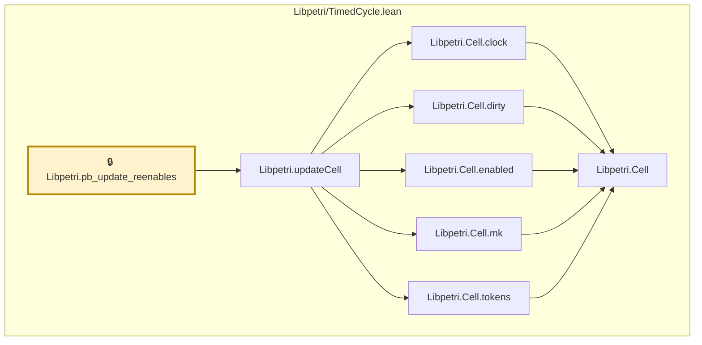

# TIME-011

Generated by `scripts/proof-graph.py` from `proof-graph.json`. Do not edit.

Theorems carrying this ID:

- `Libpetri.pb_update_reenables` (theorem, `Libpetri/TimedCycle.lean:231`) 🔒 locked

Axioms used:

- `Libpetri.pb_update_reenables`: `propext`
