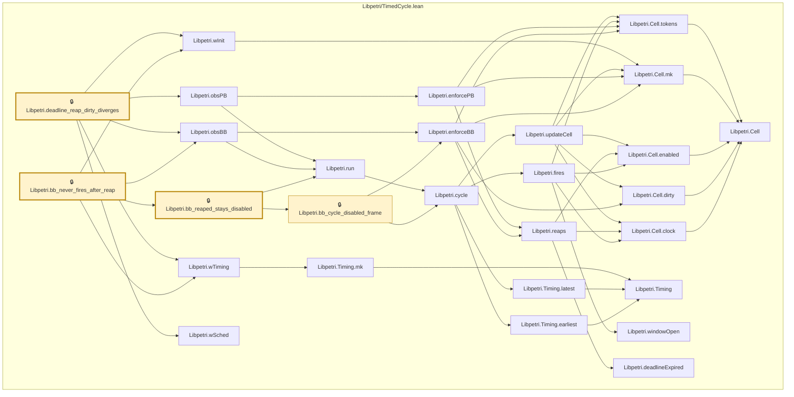

# TIME-013

Generated by `scripts/proof-graph.py` from `proof-graph.json`. Do not edit.

Theorems carrying this ID:

- `Libpetri.bb_never_fires_after_reap` (theorem, `Libpetri/TimedCycle.lean:300`) 🔒 locked
- `Libpetri.bb_reaped_stays_disabled` (theorem, `Libpetri/TimedCycle.lean:250`) 🔒 locked
- `Libpetri.deadline_reap_dirty_diverges` (theorem, `Libpetri/TimedCycle.lean:284`) 🔒 locked

Axioms used:

- `Libpetri.bb_never_fires_after_reap`: `propext`
- `Libpetri.bb_reaped_stays_disabled`: `propext`
- `Libpetri.deadline_reap_dirty_diverges`: none
