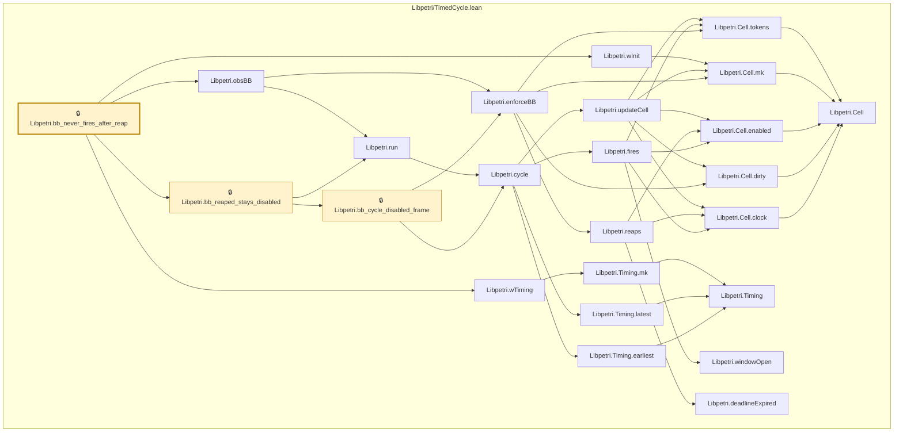
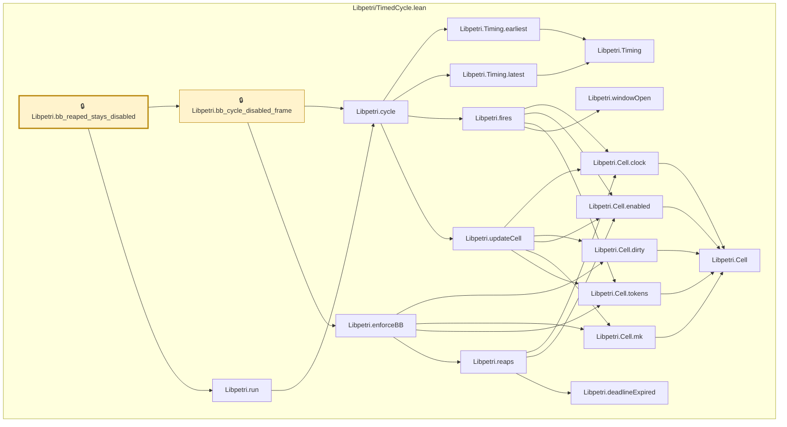
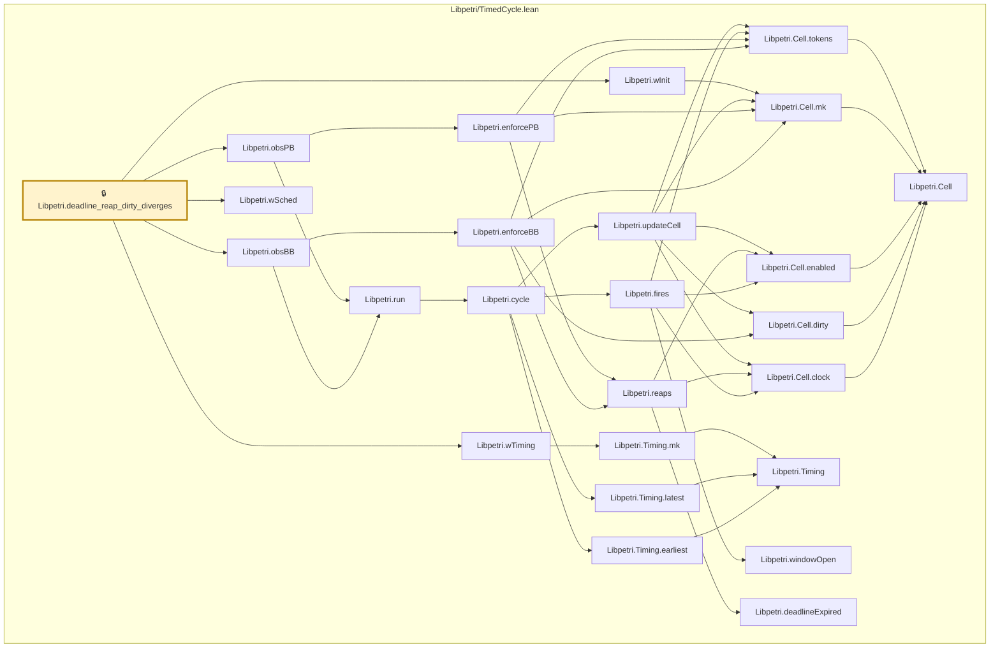
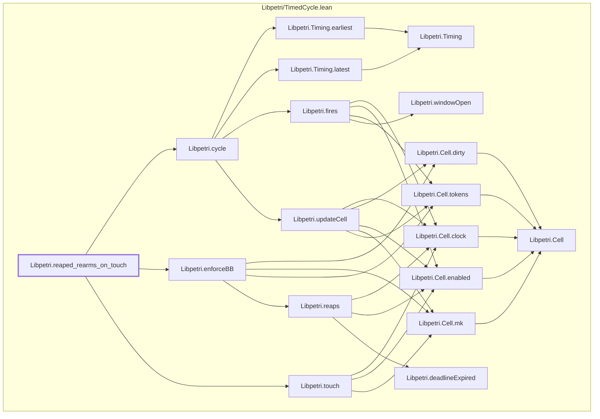

# TIME-013

Generated by `scripts/proof-graph.py` from `proof-graph.json`. Do not edit.

Theorems carrying this ID:

- `Libpetri.Novel.ReapAware.rest_sound` (theorem, `Libpetri/Novel/ReapAware.lean:312`)
- `Libpetri.bb_never_fires_after_reap` (theorem, `Libpetri/TimedCycle.lean:322`) 🔒 locked
- `Libpetri.bb_reaped_stays_disabled` (theorem, `Libpetri/TimedCycle.lean:254`) 🔒 locked
- `Libpetri.deadline_reap_dirty_diverges` (theorem, `Libpetri/TimedCycle.lean:305`) 🔒 locked
- `Libpetri.reaped_rearms_on_touch` (theorem, `Libpetri/TimedCycle.lean:276`)

> **Note:** the full tree has 87 nodes (limit 60), so it is drawn as one diagram per theorem (5 theorems).

### `Libpetri.Novel.ReapAware.rest_sound`

> Rule: this theorem's tree has 66 nodes (limit 60); every file other than its own is collapsed into one node, leaving 31.

```mermaid
flowchart TD
  subgraph g0["Libpetri/Novel/ReapAware.lean"]
    n879["Libpetri.Novel.ReapAware.Cycle"]
    n880["Libpetri.Novel.ReapAware.FireStep"]
    n881["Libpetri.Novel.ReapAware.Halts"]
    n882["Libpetri.Novel.ReapAware.Inv"]
    n884["Libpetri.Novel.ReapAware.ReapQuiescentA"]
    n885["Libpetri.Novel.ReapAware.RestsAt"]
    n886["Libpetri.Novel.ReapAware.Runs"]
    n887["Libpetri.Novel.ReapAware.TTiming"]
    n888["Libpetri.Novel.ReapAware.TTiming.earliest"]
    n889["Libpetri.Novel.ReapAware.TTiming.latest"]
    n891["Libpetri.Novel.ReapAware.Touches"]
    n892["Libpetri.Novel.ReapAware.XState"]
    n893["Libpetri.Novel.ReapAware.XState.a"]
    n894["Libpetri.Novel.ReapAware.XState.cells"]
    n895["Libpetri.Novel.ReapAware.XState.mk"]
    n896["Libpetri.Novel.ReapAware.cycle_inv"]
    n898["Libpetri.Novel.ReapAware.enabledA_congr"]
    n899["Libpetri.Novel.ReapAware.enf"]
    n900["Libpetri.Novel.ReapAware.enf_enabled"]
    n901["Libpetri.Novel.ReapAware.firePhase_reach"]
    n902["Libpetri.Novel.ReapAware.halts_reapQuiescent"]
    n903["Libpetri.Novel.ReapAware.initCells"]
    n904["Libpetri.Novel.ReapAware.inv_init"]
    n915["Libpetri.Novel.ReapAware.reapable"]
    n916["Libpetri.Novel.ReapAware.rest_sound"]
    n919["Libpetri.Novel.ReapAware.run_inv"]
    n921["Libpetri.Novel.ReapAware.upd"]
    n922["Libpetri.Novel.ReapAware.upd_enabled"]
  end
  c0["📁 Libpetri/Basic.lean (23 declarations, collapsed)"]
  c78["📁 Libpetri/Soundness.lean (6 declarations, collapsed)"]
  c82["📁 Libpetri/TimedCycle.lean (9 declarations, collapsed)"]
  c78 --> c0
  n879 --> n880
  n879 --> n881
  n879 --> n891
  n880 --> c78
  n880 --> n888
  n880 --> n899
  n881 --> c78
  n881 --> n899
  n882 --> c78
  n882 --> n893
  n882 --> n894
  n882 --> n915
  n884 --> c78
  n885 --> n886
  n885 --> n895
  n885 --> n903
  n886 --> n879
  n888 --> n887
  n889 --> n887
  n891 --> c0
  n893 --> c0
  n893 --> n892
  n894 --> c0
  n894 --> c82
  n894 --> n892
  n895 --> c0
  n895 --> c82
  n895 --> n892
  n896 --> n879
  n896 --> n898
  n896 --> n900
  n896 --> n922
  n898 --> n891
  n899 --> n889
  n899 --> n921
  n900 --> n899
  n900 --> n915
  n901 --> n880
  n902 --> n881
  n902 --> n884
  n902 --> n900
  n902 --> n922
  n903 --> c0
  n903 --> c82
  n904 --> n882
  n904 --> n895
  n904 --> n903
  n915 --> c0
  n915 --> n889
  n916 --> n885
  n916 --> n902
  n916 --> n919
  n919 --> n886
  n919 --> n896
  n919 --> n901
  n919 --> n904
  n921 --> n893
  n921 --> n894
  n922 --> n882
  n922 --> n921
  classDef root stroke-width:3px
  classDef locked fill:#fff3cd,stroke:#b8860b
  classDef collapsed fill:#eeeeee,stroke-dasharray:4 4
  class n916 root
  class c0,c78,c82 collapsed
```

### `Libpetri.bb_never_fires_after_reap`

> Rule: this theorem's whole tree, 24 nodes.

```mermaid
flowchart TD
  subgraph g0["Libpetri/TimedCycle.lean"]
    n15["Libpetri.Cell"]
    n16["Libpetri.Cell.clock"]
    n17["Libpetri.Cell.dirty"]
    n18["Libpetri.Cell.enabled"]
    n19["Libpetri.Cell.mk"]
    n20["Libpetri.Cell.tokens"]
    n2626["Libpetri.Timing"]
    n2627["Libpetri.Timing.earliest"]
    n2628["Libpetri.Timing.latest"]
    n2629["Libpetri.Timing.mk"]
    n2687["🔒 Libpetri.bb_cycle_disabled_frame"]
    n2688["🔒 Libpetri.bb_never_fires_after_reap"]
    n2689["🔒 Libpetri.bb_reaped_stays_disabled"]
    n2739["Libpetri.cycle"]
    n2740["Libpetri.deadlineExpired"]
    n2762["Libpetri.enforceBB"]
    n2792["Libpetri.fires"]
    n2859["Libpetri.obsBB"]
    n2909["Libpetri.reaps"]
    n2932["Libpetri.run"]
    n2979["Libpetri.updateCell"]
    n2987["Libpetri.wInit"]
    n2996["Libpetri.wTiming"]
    n2998["Libpetri.windowOpen"]
  end
  n16 --> n15
  n17 --> n15
  n18 --> n15
  n19 --> n15
  n20 --> n15
  n2627 --> n2626
  n2628 --> n2626
  n2629 --> n2626
  n2687 --> n2739
  n2687 --> n2762
  n2688 --> n2689
  n2688 --> n2859
  n2688 --> n2987
  n2688 --> n2996
  n2689 --> n2687
  n2689 --> n2932
  n2739 --> n2627
  n2739 --> n2628
  n2739 --> n2792
  n2739 --> n2979
  n2762 --> n17
  n2762 --> n19
  n2762 --> n20
  n2762 --> n2909
  n2792 --> n16
  n2792 --> n18
  n2792 --> n20
  n2792 --> n2998
  n2859 --> n2762
  n2859 --> n2932
  n2909 --> n16
  n2909 --> n18
  n2909 --> n2740
  n2932 --> n2739
  n2979 --> n16
  n2979 --> n17
  n2979 --> n18
  n2979 --> n19
  n2979 --> n20
  n2987 --> n19
  n2996 --> n2629
  classDef root stroke-width:3px
  classDef locked fill:#fff3cd,stroke:#b8860b
  classDef collapsed fill:#eeeeee,stroke-dasharray:4 4
  class n2688 root
  class n2687,n2688,n2689 locked
```

### `Libpetri.bb_reaped_stays_disabled`

> Rule: this theorem's whole tree, 19 nodes.

```mermaid
flowchart TD
  subgraph g0["Libpetri/TimedCycle.lean"]
    n15["Libpetri.Cell"]
    n16["Libpetri.Cell.clock"]
    n17["Libpetri.Cell.dirty"]
    n18["Libpetri.Cell.enabled"]
    n19["Libpetri.Cell.mk"]
    n20["Libpetri.Cell.tokens"]
    n2626["Libpetri.Timing"]
    n2627["Libpetri.Timing.earliest"]
    n2628["Libpetri.Timing.latest"]
    n2687["🔒 Libpetri.bb_cycle_disabled_frame"]
    n2689["🔒 Libpetri.bb_reaped_stays_disabled"]
    n2739["Libpetri.cycle"]
    n2740["Libpetri.deadlineExpired"]
    n2762["Libpetri.enforceBB"]
    n2792["Libpetri.fires"]
    n2909["Libpetri.reaps"]
    n2932["Libpetri.run"]
    n2979["Libpetri.updateCell"]
    n2998["Libpetri.windowOpen"]
  end
  n16 --> n15
  n17 --> n15
  n18 --> n15
  n19 --> n15
  n20 --> n15
  n2627 --> n2626
  n2628 --> n2626
  n2687 --> n2739
  n2687 --> n2762
  n2689 --> n2687
  n2689 --> n2932
  n2739 --> n2627
  n2739 --> n2628
  n2739 --> n2792
  n2739 --> n2979
  n2762 --> n17
  n2762 --> n19
  n2762 --> n20
  n2762 --> n2909
  n2792 --> n16
  n2792 --> n18
  n2792 --> n20
  n2792 --> n2998
  n2909 --> n16
  n2909 --> n18
  n2909 --> n2740
  n2932 --> n2739
  n2979 --> n16
  n2979 --> n17
  n2979 --> n18
  n2979 --> n19
  n2979 --> n20
  classDef root stroke-width:3px
  classDef locked fill:#fff3cd,stroke:#b8860b
  classDef collapsed fill:#eeeeee,stroke-dasharray:4 4
  class n2689 root
  class n2687,n2689 locked
```

### `Libpetri.deadline_reap_dirty_diverges`

> Rule: this theorem's whole tree, 25 nodes.

```mermaid
flowchart TD
  subgraph g0["Libpetri/TimedCycle.lean"]
    n15["Libpetri.Cell"]
    n16["Libpetri.Cell.clock"]
    n17["Libpetri.Cell.dirty"]
    n18["Libpetri.Cell.enabled"]
    n19["Libpetri.Cell.mk"]
    n20["Libpetri.Cell.tokens"]
    n2626["Libpetri.Timing"]
    n2627["Libpetri.Timing.earliest"]
    n2628["Libpetri.Timing.latest"]
    n2629["Libpetri.Timing.mk"]
    n2739["Libpetri.cycle"]
    n2740["Libpetri.deadlineExpired"]
    n2741["🔒 Libpetri.deadline_reap_dirty_diverges"]
    n2762["Libpetri.enforceBB"]
    n2763["Libpetri.enforcePB"]
    n2792["Libpetri.fires"]
    n2859["Libpetri.obsBB"]
    n2860["Libpetri.obsPB"]
    n2909["Libpetri.reaps"]
    n2932["Libpetri.run"]
    n2979["Libpetri.updateCell"]
    n2987["Libpetri.wInit"]
    n2994["Libpetri.wSched"]
    n2996["Libpetri.wTiming"]
    n2998["Libpetri.windowOpen"]
  end
  n16 --> n15
  n17 --> n15
  n18 --> n15
  n19 --> n15
  n20 --> n15
  n2627 --> n2626
  n2628 --> n2626
  n2629 --> n2626
  n2739 --> n2627
  n2739 --> n2628
  n2739 --> n2792
  n2739 --> n2979
  n2741 --> n2859
  n2741 --> n2860
  n2741 --> n2987
  n2741 --> n2994
  n2741 --> n2996
  n2762 --> n17
  n2762 --> n19
  n2762 --> n20
  n2762 --> n2909
  n2763 --> n19
  n2763 --> n20
  n2763 --> n2909
  n2792 --> n16
  n2792 --> n18
  n2792 --> n20
  n2792 --> n2998
  n2859 --> n2762
  n2859 --> n2932
  n2860 --> n2763
  n2860 --> n2932
  n2909 --> n16
  n2909 --> n18
  n2909 --> n2740
  n2932 --> n2739
  n2979 --> n16
  n2979 --> n17
  n2979 --> n18
  n2979 --> n19
  n2979 --> n20
  n2987 --> n19
  n2996 --> n2629
  classDef root stroke-width:3px
  classDef locked fill:#fff3cd,stroke:#b8860b
  classDef collapsed fill:#eeeeee,stroke-dasharray:4 4
  class n2741 root
  class n2741 locked
```

### `Libpetri.reaped_rearms_on_touch`

> Rule: this theorem's whole tree, 18 nodes.

```mermaid
flowchart TD
  subgraph g0["Libpetri/TimedCycle.lean"]
    n15["Libpetri.Cell"]
    n16["Libpetri.Cell.clock"]
    n17["Libpetri.Cell.dirty"]
    n18["Libpetri.Cell.enabled"]
    n19["Libpetri.Cell.mk"]
    n20["Libpetri.Cell.tokens"]
    n2626["Libpetri.Timing"]
    n2627["Libpetri.Timing.earliest"]
    n2628["Libpetri.Timing.latest"]
    n2739["Libpetri.cycle"]
    n2740["Libpetri.deadlineExpired"]
    n2762["Libpetri.enforceBB"]
    n2792["Libpetri.fires"]
    n2908["Libpetri.reaped_rearms_on_touch"]
    n2909["Libpetri.reaps"]
    n2967["Libpetri.touch"]
    n2979["Libpetri.updateCell"]
    n2998["Libpetri.windowOpen"]
  end
  n16 --> n15
  n17 --> n15
  n18 --> n15
  n19 --> n15
  n20 --> n15
  n2627 --> n2626
  n2628 --> n2626
  n2739 --> n2627
  n2739 --> n2628
  n2739 --> n2792
  n2739 --> n2979
  n2762 --> n17
  n2762 --> n19
  n2762 --> n20
  n2762 --> n2909
  n2792 --> n16
  n2792 --> n18
  n2792 --> n20
  n2792 --> n2998
  n2908 --> n2739
  n2908 --> n2762
  n2908 --> n2967
  n2909 --> n16
  n2909 --> n18
  n2909 --> n2740
  n2967 --> n16
  n2967 --> n18
  n2967 --> n19
  n2979 --> n16
  n2979 --> n17
  n2979 --> n18
  n2979 --> n19
  n2979 --> n20
  classDef root stroke-width:3px
  classDef locked fill:#fff3cd,stroke:#b8860b
  classDef collapsed fill:#eeeeee,stroke-dasharray:4 4
  class n2908 root
```

Axioms used:

- `Libpetri.Novel.ReapAware.rest_sound`: `Quot.sound`, `propext`
- `Libpetri.bb_never_fires_after_reap`: `propext`
- `Libpetri.bb_reaped_stays_disabled`: `propext`
- `Libpetri.deadline_reap_dirty_diverges`: none
- `Libpetri.reaped_rearms_on_touch`: `propext`
