# VER-001

Generated by `scripts/proof-graph.py` from `proof-graph.json`. Do not edit.

Theorems carrying this ID:

- `Libpetri.Novel.ForwardDeposit.deposit_mem_fixedRows` (theorem, `Libpetri/Novel/ForwardDeposit.lean:400`)
- `Libpetri.Novel.ForwardDeposit.drained_forward_has_no_row` (theorem, `Libpetri/Novel/ForwardDeposit.lean:253`)
- `Libpetri.Novel.ForwardDeposit.fixedRows_mem_deposit` (theorem, `Libpetri/Novel/ForwardDeposit.lean:429`)

> **Note:** the full tree has 63 nodes (limit 60), so it is drawn as one diagram per theorem (3 theorems).

### `Libpetri.Novel.ForwardDeposit.deposit_mem_fixedRows`

> Rule: this theorem's whole tree, 50 nodes.

```mermaid
flowchart TD
  subgraph g0["Libpetri/Basic.lean"]
    n6["Libpetri.CMarking"]
    n8["Libpetri.Card"]
    n9["Libpetri.Card.all"]
    n10["Libpetri.Card.atLeast"]
    n11["Libpetri.Card.consumesAll"]
    n12["Libpetri.Card.exactly"]
    n13["Libpetri.Card.one"]
    n14["Libpetri.Card.required"]
    n21["Libpetri.Colour"]
    n74["Libpetri.Guard"]
    n76["Libpetri.InSpec"]
    n77["Libpetri.InSpec.card"]
    n78["Libpetri.InSpec.guard"]
    n80["Libpetri.InSpec.place"]
    n2416["Libpetri.PlaceId"]
    n2647["Libpetri.Transition"]
    n2649["Libpetri.Transition.inputs"]
    n2724["Libpetri.consumeAllAt"]
    n2725["Libpetri.consumeCount"]
    n2738["Libpetri.consumedAt"]
    n2864["Libpetri.matchCount"]
    n2899["Libpetri.pre"]
    n2954["Libpetri.specAt"]
  end
  subgraph g1["Libpetri/Novel/ForwardDeposit.lean"]
    n665["Libpetri.Novel.ForwardDeposit.Choice"]
    n666["Libpetri.Novel.ForwardDeposit.Choice.action"]
    n667["Libpetri.Novel.ForwardDeposit.Choice.timedOut"]
    n668["Libpetri.Novel.ForwardDeposit.Deposit"]
    n669["Libpetri.Novel.ForwardDeposit.FixedForwards"]
    n670["Libpetri.Novel.ForwardDeposit.OutSpec"]
    n671["Libpetri.Novel.ForwardDeposit.OutSpec.and"]
    n673["Libpetri.Novel.ForwardDeposit.OutSpec.brecOn.go"]
    n674["Libpetri.Novel.ForwardDeposit.OutSpec.forward"]
    n675["Libpetri.Novel.ForwardDeposit.OutSpec.place"]
    n676["Libpetri.Novel.ForwardDeposit.OutSpec.timeout"]
    n677["Libpetri.Novel.ForwardDeposit.OutSpec.xor"]
    n686["Libpetri.Novel.ForwardDeposit.branches"]
    n687["Libpetri.Novel.ForwardDeposit.consumedAt_eq_pre"]
    n688["Libpetri.Novel.ForwardDeposit.cross"]
    n689["Libpetri.Novel.ForwardDeposit.dedupAppend"]
    n690["Libpetri.Novel.ForwardDeposit.dedupAppend_covers"]
    n692["Libpetri.Novel.ForwardDeposit.deposit"]
    n693["Libpetri.Novel.ForwardDeposit.deposit_mem_fixedRows"]
    n695["Libpetri.Novel.ForwardDeposit.findTimeout"]
    n698["Libpetri.Novel.ForwardDeposit.fixedRows"]
    n703["Libpetri.Novel.ForwardDeposit.forwardSources"]
    n704["Libpetri.Novel.ForwardDeposit.forwardSources_findTimeout"]
    n719["Libpetri.Novel.ForwardDeposit.mem_dedupAppend_of_mem"]
    n737["Libpetri.Novel.ForwardDeposit.timeoutDeposits"]
    n738["Libpetri.Novel.ForwardDeposit.timeoutDeposits_congr"]
    n739["Libpetri.Novel.ForwardDeposit.timeoutDeposits_fixed"]
  end
  n6 --> n21
  n6 --> n2416
  n9 --> n8
  n10 --> n8
  n11 --> n9
  n11 --> n10
  n11 --> n12
  n11 --> n13
  n12 --> n8
  n13 --> n8
  n14 --> n9
  n14 --> n10
  n14 --> n12
  n14 --> n13
  n74 --> n21
  n77 --> n8
  n77 --> n76
  n78 --> n74
  n78 --> n76
  n80 --> n76
  n80 --> n2416
  n666 --> n665
  n667 --> n665
  n668 --> n2416
  n669 --> n703
  n669 --> n2724
  n671 --> n670
  n673 --> n671
  n673 --> n674
  n673 --> n675
  n673 --> n676
  n673 --> n677
  n674 --> n670
  n674 --> n2416
  n675 --> n670
  n675 --> n2416
  n676 --> n670
  n677 --> n670
  n686 --> n673
  n686 --> n688
  n687 --> n2724
  n687 --> n2738
  n687 --> n2899
  n688 --> n668
  n689 --> n668
  n690 --> n719
  n692 --> n666
  n692 --> n667
  n692 --> n686
  n692 --> n695
  n692 --> n737
  n693 --> n690
  n693 --> n692
  n693 --> n698
  n693 --> n739
  n695 --> n673
  n698 --> n686
  n698 --> n689
  n698 --> n695
  n698 --> n737
  n698 --> n2899
  n703 --> n673
  n704 --> n695
  n704 --> n703
  n719 --> n689
  n737 --> n673
  n737 --> n688
  n738 --> n703
  n738 --> n737
  n739 --> n669
  n739 --> n687
  n739 --> n704
  n739 --> n738
  n2649 --> n76
  n2649 --> n2647
  n2724 --> n11
  n2724 --> n77
  n2724 --> n2954
  n2725 --> n11
  n2725 --> n14
  n2725 --> n77
  n2725 --> n2864
  n2738 --> n2725
  n2738 --> n2954
  n2864 --> n6
  n2864 --> n78
  n2864 --> n80
  n2899 --> n14
  n2899 --> n77
  n2899 --> n2954
  n2954 --> n80
  n2954 --> n2649
  classDef root stroke-width:3px
  classDef locked fill:#fff3cd,stroke:#b8860b
  classDef collapsed fill:#eeeeee,stroke-dasharray:4 4
  class n693 root
```

### `Libpetri.Novel.ForwardDeposit.drained_forward_has_no_row`

> Rule: this theorem's whole tree, 48 nodes.

```mermaid
flowchart TD
  subgraph g0["Libpetri/Basic.lean"]
    n6["Libpetri.CMarking"]
    n8["Libpetri.Card"]
    n9["Libpetri.Card.all"]
    n10["Libpetri.Card.atLeast"]
    n11["Libpetri.Card.consumesAll"]
    n12["Libpetri.Card.exactly"]
    n13["Libpetri.Card.one"]
    n14["Libpetri.Card.required"]
    n21["Libpetri.Colour"]
    n74["Libpetri.Guard"]
    n76["Libpetri.InSpec"]
    n77["Libpetri.InSpec.card"]
    n78["Libpetri.InSpec.guard"]
    n79["Libpetri.InSpec.mk"]
    n80["Libpetri.InSpec.place"]
    n2416["Libpetri.PlaceId"]
    n2647["Libpetri.Transition"]
    n2648["Libpetri.Transition.inhibitors"]
    n2649["Libpetri.Transition.inputs"]
    n2650["Libpetri.Transition.mk"]
    n2653["Libpetri.Transition.reads"]
    n2725["Libpetri.consumeCount"]
    n2738["Libpetri.consumedAt"]
    n2777["Libpetri.enabledC"]
    n2864["Libpetri.matchCount"]
    n2954["Libpetri.specAt"]
  end
  subgraph g1["Libpetri/Novel/ForwardDeposit.lean"]
    n665["Libpetri.Novel.ForwardDeposit.Choice"]
    n666["Libpetri.Novel.ForwardDeposit.Choice.action"]
    n667["Libpetri.Novel.ForwardDeposit.Choice.timedOut"]
    n668["Libpetri.Novel.ForwardDeposit.Deposit"]
    n670["Libpetri.Novel.ForwardDeposit.OutSpec"]
    n671["Libpetri.Novel.ForwardDeposit.OutSpec.and"]
    n673["Libpetri.Novel.ForwardDeposit.OutSpec.brecOn.go"]
    n674["Libpetri.Novel.ForwardDeposit.OutSpec.forward"]
    n675["Libpetri.Novel.ForwardDeposit.OutSpec.place"]
    n676["Libpetri.Novel.ForwardDeposit.OutSpec.timeout"]
    n677["Libpetri.Novel.ForwardDeposit.OutSpec.xor"]
    n686["Libpetri.Novel.ForwardDeposit.branches"]
    n688["Libpetri.Novel.ForwardDeposit.cross"]
    n692["Libpetri.Novel.ForwardDeposit.deposit"]
    n694["Libpetri.Novel.ForwardDeposit.drained_forward_has_no_row"]
    n695["Libpetri.Novel.ForwardDeposit.findTimeout"]
    n720["Libpetri.Novel.ForwardDeposit.oFwd"]
    n726["Libpetri.Novel.ForwardDeposit.pa"]
    n727["Libpetri.Novel.ForwardDeposit.pb"]
    n728["Libpetri.Novel.ForwardDeposit.pc"]
    n735["Libpetri.Novel.ForwardDeposit.tAll"]
    n737["Libpetri.Novel.ForwardDeposit.timeoutDeposits"]
  end
  n6 --> n21
  n6 --> n2416
  n9 --> n8
  n10 --> n8
  n11 --> n9
  n11 --> n10
  n11 --> n12
  n11 --> n13
  n12 --> n8
  n13 --> n8
  n14 --> n9
  n14 --> n10
  n14 --> n12
  n14 --> n13
  n74 --> n21
  n77 --> n8
  n77 --> n76
  n78 --> n74
  n78 --> n76
  n79 --> n8
  n79 --> n74
  n79 --> n76
  n79 --> n2416
  n80 --> n76
  n80 --> n2416
  n666 --> n665
  n667 --> n665
  n668 --> n2416
  n671 --> n670
  n673 --> n671
  n673 --> n674
  n673 --> n675
  n673 --> n676
  n673 --> n677
  n674 --> n670
  n674 --> n2416
  n675 --> n670
  n675 --> n2416
  n676 --> n670
  n677 --> n670
  n686 --> n673
  n686 --> n688
  n688 --> n668
  n692 --> n666
  n692 --> n667
  n692 --> n686
  n692 --> n695
  n692 --> n737
  n694 --> n692
  n694 --> n720
  n694 --> n735
  n694 --> n2738
  n694 --> n2777
  n695 --> n673
  n720 --> n674
  n720 --> n675
  n720 --> n676
  n720 --> n677
  n720 --> n726
  n720 --> n727
  n720 --> n728
  n726 --> n2416
  n727 --> n2416
  n728 --> n2416
  n735 --> n9
  n735 --> n79
  n735 --> n726
  n735 --> n2650
  n737 --> n673
  n737 --> n688
  n2648 --> n2416
  n2648 --> n2647
  n2649 --> n76
  n2649 --> n2647
  n2650 --> n76
  n2650 --> n2416
  n2650 --> n2647
  n2653 --> n2416
  n2653 --> n2647
  n2725 --> n11
  n2725 --> n14
  n2725 --> n77
  n2725 --> n2864
  n2738 --> n2725
  n2738 --> n2954
  n2777 --> n14
  n2777 --> n77
  n2777 --> n2648
  n2777 --> n2649
  n2777 --> n2653
  n2777 --> n2864
  n2864 --> n6
  n2864 --> n78
  n2864 --> n80
  n2954 --> n80
  n2954 --> n2649
  classDef root stroke-width:3px
  classDef locked fill:#fff3cd,stroke:#b8860b
  classDef collapsed fill:#eeeeee,stroke-dasharray:4 4
  class n694 root
```

### `Libpetri.Novel.ForwardDeposit.fixedRows_mem_deposit`

> Rule: this theorem's whole tree, 49 nodes.

```mermaid
flowchart TD
  subgraph g0["Libpetri/Basic.lean"]
    n6["Libpetri.CMarking"]
    n8["Libpetri.Card"]
    n9["Libpetri.Card.all"]
    n10["Libpetri.Card.atLeast"]
    n11["Libpetri.Card.consumesAll"]
    n12["Libpetri.Card.exactly"]
    n13["Libpetri.Card.one"]
    n14["Libpetri.Card.required"]
    n21["Libpetri.Colour"]
    n74["Libpetri.Guard"]
    n76["Libpetri.InSpec"]
    n77["Libpetri.InSpec.card"]
    n78["Libpetri.InSpec.guard"]
    n80["Libpetri.InSpec.place"]
    n2416["Libpetri.PlaceId"]
    n2647["Libpetri.Transition"]
    n2649["Libpetri.Transition.inputs"]
    n2724["Libpetri.consumeAllAt"]
    n2725["Libpetri.consumeCount"]
    n2738["Libpetri.consumedAt"]
    n2864["Libpetri.matchCount"]
    n2899["Libpetri.pre"]
    n2954["Libpetri.specAt"]
  end
  subgraph g1["Libpetri/Novel/ForwardDeposit.lean"]
    n665["Libpetri.Novel.ForwardDeposit.Choice"]
    n666["Libpetri.Novel.ForwardDeposit.Choice.action"]
    n667["Libpetri.Novel.ForwardDeposit.Choice.timedOut"]
    n668["Libpetri.Novel.ForwardDeposit.Deposit"]
    n669["Libpetri.Novel.ForwardDeposit.FixedForwards"]
    n670["Libpetri.Novel.ForwardDeposit.OutSpec"]
    n671["Libpetri.Novel.ForwardDeposit.OutSpec.and"]
    n673["Libpetri.Novel.ForwardDeposit.OutSpec.brecOn.go"]
    n674["Libpetri.Novel.ForwardDeposit.OutSpec.forward"]
    n675["Libpetri.Novel.ForwardDeposit.OutSpec.place"]
    n676["Libpetri.Novel.ForwardDeposit.OutSpec.timeout"]
    n677["Libpetri.Novel.ForwardDeposit.OutSpec.xor"]
    n686["Libpetri.Novel.ForwardDeposit.branches"]
    n687["Libpetri.Novel.ForwardDeposit.consumedAt_eq_pre"]
    n688["Libpetri.Novel.ForwardDeposit.cross"]
    n689["Libpetri.Novel.ForwardDeposit.dedupAppend"]
    n691["Libpetri.Novel.ForwardDeposit.dedupAppend_subset"]
    n692["Libpetri.Novel.ForwardDeposit.deposit"]
    n695["Libpetri.Novel.ForwardDeposit.findTimeout"]
    n698["Libpetri.Novel.ForwardDeposit.fixedRows"]
    n699["Libpetri.Novel.ForwardDeposit.fixedRows_mem_deposit"]
    n703["Libpetri.Novel.ForwardDeposit.forwardSources"]
    n704["Libpetri.Novel.ForwardDeposit.forwardSources_findTimeout"]
    n737["Libpetri.Novel.ForwardDeposit.timeoutDeposits"]
    n738["Libpetri.Novel.ForwardDeposit.timeoutDeposits_congr"]
    n739["Libpetri.Novel.ForwardDeposit.timeoutDeposits_fixed"]
  end
  n6 --> n21
  n6 --> n2416
  n9 --> n8
  n10 --> n8
  n11 --> n9
  n11 --> n10
  n11 --> n12
  n11 --> n13
  n12 --> n8
  n13 --> n8
  n14 --> n9
  n14 --> n10
  n14 --> n12
  n14 --> n13
  n74 --> n21
  n77 --> n8
  n77 --> n76
  n78 --> n74
  n78 --> n76
  n80 --> n76
  n80 --> n2416
  n666 --> n665
  n667 --> n665
  n668 --> n2416
  n669 --> n703
  n669 --> n2724
  n671 --> n670
  n673 --> n671
  n673 --> n674
  n673 --> n675
  n673 --> n676
  n673 --> n677
  n674 --> n670
  n674 --> n2416
  n675 --> n670
  n675 --> n2416
  n676 --> n670
  n677 --> n670
  n686 --> n673
  n686 --> n688
  n687 --> n2724
  n687 --> n2738
  n687 --> n2899
  n688 --> n668
  n689 --> n668
  n691 --> n689
  n692 --> n666
  n692 --> n667
  n692 --> n686
  n692 --> n695
  n692 --> n737
  n695 --> n673
  n698 --> n686
  n698 --> n689
  n698 --> n695
  n698 --> n737
  n698 --> n2899
  n699 --> n691
  n699 --> n692
  n699 --> n698
  n699 --> n739
  n703 --> n673
  n704 --> n695
  n704 --> n703
  n737 --> n673
  n737 --> n688
  n738 --> n703
  n738 --> n737
  n739 --> n669
  n739 --> n687
  n739 --> n704
  n739 --> n738
  n2649 --> n76
  n2649 --> n2647
  n2724 --> n11
  n2724 --> n77
  n2724 --> n2954
  n2725 --> n11
  n2725 --> n14
  n2725 --> n77
  n2725 --> n2864
  n2738 --> n2725
  n2738 --> n2954
  n2864 --> n6
  n2864 --> n78
  n2864 --> n80
  n2899 --> n14
  n2899 --> n77
  n2899 --> n2954
  n2954 --> n80
  n2954 --> n2649
  classDef root stroke-width:3px
  classDef locked fill:#fff3cd,stroke:#b8860b
  classDef collapsed fill:#eeeeee,stroke-dasharray:4 4
  class n699 root
```

Axioms used:

- `Libpetri.Novel.ForwardDeposit.deposit_mem_fixedRows`: `Classical.choice`, `Quot.sound`, `propext`
- `Libpetri.Novel.ForwardDeposit.drained_forward_has_no_row`: `Classical.choice`, `Quot.sound`, `propext`
- `Libpetri.Novel.ForwardDeposit.fixedRows_mem_deposit`: `Quot.sound`, `propext`
