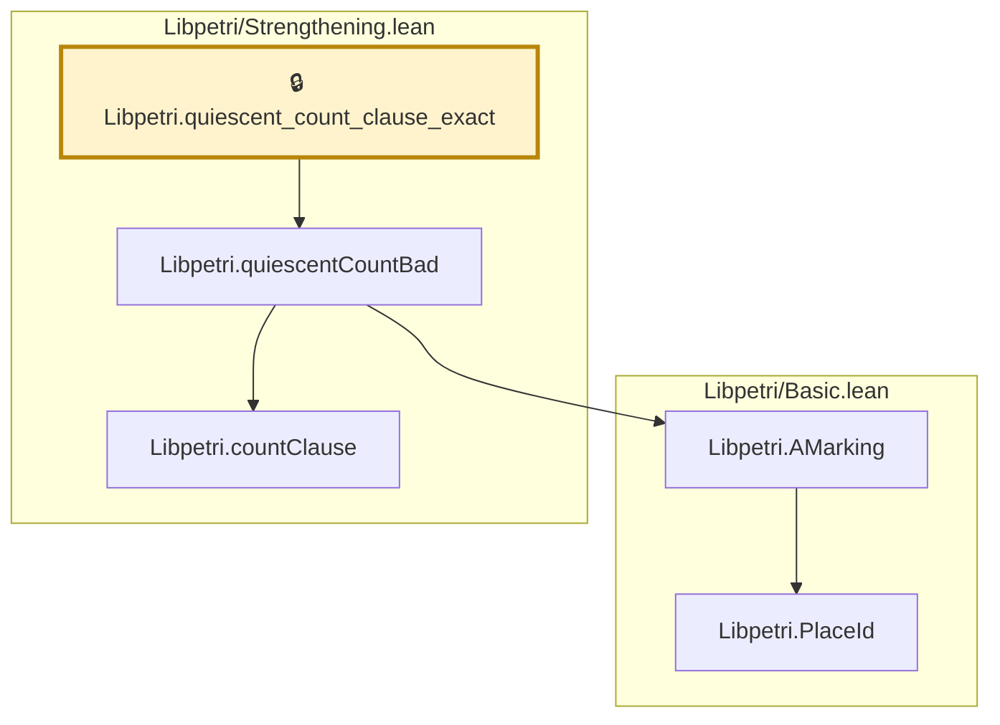

# VER-002

Generated by `scripts/proof-graph.py` from `proof-graph.json`. Do not edit.

Theorems carrying this ID:

- `Libpetri.quiescent_count_clause_exact` (theorem, `Libpetri/Strengthening.lean:472`) 🔒 locked

Axioms used:

- `Libpetri.quiescent_count_clause_exact`: `Classical.choice`, `Quot.sound`, `propext`
