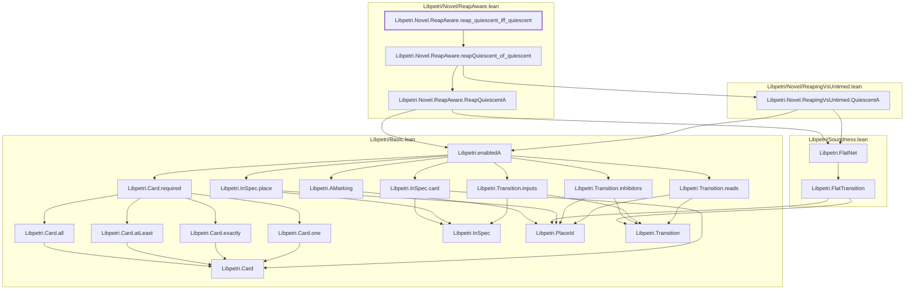
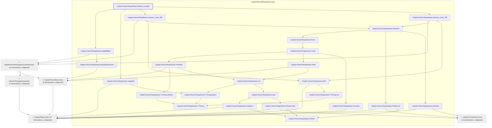
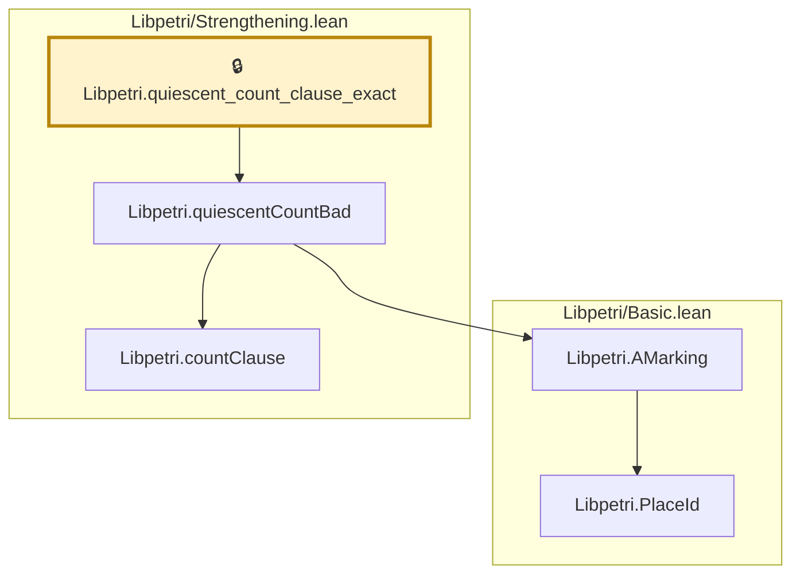

# VER-002

Generated by `scripts/proof-graph.py` from `proof-graph.json`. Do not edit.

Theorems carrying this ID:

- `Libpetri.Novel.InFlight.quiescent_count_stop_sound` (theorem, `Libpetri/Novel/InFlight.lean:619`)
- `Libpetri.Novel.ReapAware.reap_aware_ac3` (theorem, `Libpetri/Novel/ReapAware.lean:332`)
- `Libpetri.Novel.ReapAware.reap_quiescent_iff_quiescent` (theorem, `Libpetri/Novel/ReapAware.lean:109`)
- `Libpetri.Novel.ReapAware.rest_sound` (theorem, `Libpetri/Novel/ReapAware.lean:312`)
- `Libpetri.Novel.ReapAware.witness_caught` (theorem, `Libpetri/Novel/ReapAware.lean:401`)
- `Libpetri.quiescent_count_clause_exact` (theorem, `Libpetri/Strengthening.lean:474`) 🔒 locked

> **Note:** the full tree has 144 nodes (limit 60), so it is drawn as one diagram per theorem (6 theorems).

### `Libpetri.Novel.InFlight.quiescent_count_stop_sound`

> Rule: this theorem's tree has 70 nodes (limit 60); every file other than its own is collapsed into one node, leaving 48.

```mermaid
flowchart TD
  subgraph g0["Libpetri/Novel/InFlight.lean"]
    n741["Libpetri.Novel.InFlight.Completes"]
    n742["Libpetri.Novel.InFlight.MonoAt"]
    n743["Libpetri.Novel.InFlight.NamesUnique"]
    n744["Libpetri.Novel.InFlight.Row"]
    n745["Libpetri.Novel.InFlight.SReach"]
    n746["Libpetri.Novel.InFlight.SStep"]
    n747["Libpetri.Novel.InFlight.SStep.atomic"]
    n748["Libpetri.Novel.InFlight.SStep.complete"]
    n749["Libpetri.Novel.InFlight.SStep.start"]
    n750["Libpetri.Novel.InFlight.Untested"]
    n752["Libpetri.Novel.InFlight.UpClosedOff"]
    n753["Libpetri.Novel.InFlight.XReach"]
    n754["Libpetri.Novel.InFlight.XState"]
    n755["Libpetri.Novel.InFlight.XState.a"]
    n756["Libpetri.Novel.InFlight.XState.mk"]
    n757["Libpetri.Novel.InFlight.XState.pend"]
    n758["Libpetri.Novel.InFlight.XStep"]
    n759["Libpetri.Novel.InFlight.XStep.complete"]
    n760["Libpetri.Novel.InFlight.XStep.start"]
    n763["Libpetri.Novel.InFlight.addAll"]
    n764["Libpetri.Novel.InFlight.addAll_cons"]
    n765["Libpetri.Novel.InFlight.addAll_nil"]
    n766["Libpetri.Novel.InFlight.addAll_of_zero"]
    n767["Libpetri.Novel.InFlight.addAll_perm"]
    n768["Libpetri.Novel.InFlight.addD"]
    n769["Libpetri.Novel.InFlight.addD_addAll"]
    n773["Libpetri.Novel.InFlight.completes_exists"]
    n774["Libpetri.Novel.InFlight.completes_nonsplit"]
    n777["Libpetri.Novel.InFlight.enabledA_addAll"]
    n778["Libpetri.Novel.InFlight.enabledA_addD"]
    n782["Libpetri.Novel.InFlight.filter_erase_of_false"]
    n783["Libpetri.Novel.InFlight.filter_erase_of_true"]
    n784["Libpetri.Novel.InFlight.fireAD_eq_addD_startA"]
    n786["Libpetri.Novel.InFlight.le_addAll"]
    n789["Libpetri.Novel.InFlight.live_addAll"]
    n790["Libpetri.Novel.InFlight.pend_has_row"]
    n794["Libpetri.Novel.InFlight.quiescent_count_stop_sound"]
    n800["Libpetri.Novel.InFlight.split_covers_executor"]
    n804["Libpetri.Novel.InFlight.split_stop_sound"]
    n805["Libpetri.Novel.InFlight.startA"]
    n806["Libpetri.Novel.InFlight.startA_addAll"]
    n807["Libpetri.Novel.InFlight.startA_addD"]
    n808["Libpetri.Novel.InFlight.stopCountBad"]
    n809["Libpetri.Novel.InFlight.stopCountBad_upClosedOff"]
  end
  c0["📁 Libpetri/Basic.lean (22 declarations, collapsed)"]
  c26["📁 Libpetri/Novel/ForwardDeposit.lean (2 declarations, collapsed)"]
  c77["📁 Libpetri/Soundness.lean (1 declarations, collapsed)"]
  c80["📁 Libpetri/Strengthening/Hypotheses.lean (1 declarations, collapsed)"]
  c26 --> c0
  c77 --> c0
  c80 --> c77
  n741 --> n744
  n742 --> c0
  n743 --> n744
  n744 --> c26
  n745 --> n746
  n745 --> n756
  n746 --> n744
  n746 --> n754
  n747 --> n746
  n747 --> n755
  n747 --> n756
  n747 --> n757
  n748 --> n746
  n748 --> n755
  n748 --> n756
  n748 --> n757
  n748 --> n768
  n749 --> n746
  n749 --> n755
  n749 --> n756
  n749 --> n757
  n749 --> n805
  n750 --> n742
  n750 --> n744
  n752 --> c0
  n753 --> n756
  n753 --> n758
  n755 --> c0
  n755 --> n754
  n756 --> c0
  n756 --> n754
  n757 --> n754
  n758 --> n744
  n758 --> n754
  n759 --> n755
  n759 --> n756
  n759 --> n757
  n759 --> n758
  n759 --> n768
  n760 --> n755
  n760 --> n756
  n760 --> n757
  n760 --> n758
  n760 --> n805
  n763 --> n744
  n764 --> n763
  n764 --> n768
  n765 --> n763
  n766 --> n763
  n767 --> n763
  n768 --> c26
  n769 --> n763
  n769 --> n768
  n773 --> n741
  n774 --> n741
  n777 --> n750
  n777 --> n764
  n777 --> n765
  n777 --> n778
  n778 --> n742
  n778 --> n768
  n784 --> n768
  n784 --> n805
  n786 --> n763
  n789 --> n764
  n789 --> n765
  n790 --> n753
  n790 --> n759
  n790 --> n760
  n794 --> n804
  n794 --> n809
  n800 --> n743
  n800 --> n745
  n800 --> n747
  n800 --> n748
  n800 --> n749
  n800 --> n753
  n800 --> n759
  n800 --> n760
  n800 --> n767
  n800 --> n769
  n800 --> n774
  n800 --> n777
  n800 --> n782
  n800 --> n783
  n800 --> n784
  n800 --> n789
  n800 --> n806
  n804 --> n752
  n804 --> n766
  n804 --> n773
  n804 --> n786
  n804 --> n790
  n804 --> n800
  n805 --> c26
  n806 --> n750
  n806 --> n764
  n806 --> n765
  n806 --> n778
  n806 --> n807
  n807 --> c80
  n807 --> n742
  n807 --> n768
  n807 --> n805
  n808 --> c0
  n809 --> n752
  n809 --> n808
  classDef root stroke-width:3px
  classDef locked fill:#fff3cd,stroke:#b8860b
  classDef collapsed fill:#eeeeee,stroke-dasharray:4 4
  class n794 root
  class c0,c26,c77,c80 collapsed
```

### `Libpetri.Novel.ReapAware.reap_aware_ac3`

> Rule: this theorem's tree has 68 nodes (limit 60); every file other than its own is collapsed into one node, leaving 33.

```mermaid
flowchart TD
  subgraph g0["Libpetri/Novel/ReapAware.lean"]
    n879["Libpetri.Novel.ReapAware.Cycle"]
    n880["Libpetri.Novel.ReapAware.FireStep"]
    n881["Libpetri.Novel.ReapAware.Halts"]
    n882["Libpetri.Novel.ReapAware.Inv"]
    n884["Libpetri.Novel.ReapAware.ReapQuiescentA"]
    n885["Libpetri.Novel.ReapAware.RestsAt"]
    n886["Libpetri.Novel.ReapAware.Runs"]
    n887["Libpetri.Novel.ReapAware.TTiming"]
    n888["Libpetri.Novel.ReapAware.TTiming.earliest"]
    n889["Libpetri.Novel.ReapAware.TTiming.latest"]
    n891["Libpetri.Novel.ReapAware.Touches"]
    n892["Libpetri.Novel.ReapAware.XState"]
    n893["Libpetri.Novel.ReapAware.XState.a"]
    n894["Libpetri.Novel.ReapAware.XState.cells"]
    n895["Libpetri.Novel.ReapAware.XState.mk"]
    n896["Libpetri.Novel.ReapAware.cycle_inv"]
    n898["Libpetri.Novel.ReapAware.enabledA_congr"]
    n899["Libpetri.Novel.ReapAware.enf"]
    n900["Libpetri.Novel.ReapAware.enf_enabled"]
    n901["Libpetri.Novel.ReapAware.firePhase_reach"]
    n902["Libpetri.Novel.ReapAware.halts_reapQuiescent"]
    n903["Libpetri.Novel.ReapAware.initCells"]
    n904["Libpetri.Novel.ReapAware.inv_init"]
    n913["Libpetri.Novel.ReapAware.reap_aware_ac3"]
    n915["Libpetri.Novel.ReapAware.reapable"]
    n916["Libpetri.Novel.ReapAware.rest_sound"]
    n919["Libpetri.Novel.ReapAware.run_inv"]
    n921["Libpetri.Novel.ReapAware.upd"]
    n922["Libpetri.Novel.ReapAware.upd_enabled"]
  end
  c0["📁 Libpetri/Basic.lean (23 declarations, collapsed)"]
  c77["📁 Libpetri/Soundness.lean (6 declarations, collapsed)"]
  c79["📁 Libpetri/Strengthening.lean (1 declarations, collapsed)"]
  c81["📁 Libpetri/TimedCycle.lean (9 declarations, collapsed)"]
  c77 --> c0
  c79 --> c0
  n879 --> n880
  n879 --> n881
  n879 --> n891
  n880 --> c77
  n880 --> n888
  n880 --> n899
  n881 --> c77
  n881 --> n899
  n882 --> c77
  n882 --> n893
  n882 --> n894
  n882 --> n915
  n884 --> c77
  n885 --> n886
  n885 --> n895
  n885 --> n903
  n886 --> n879
  n888 --> n887
  n889 --> n887
  n891 --> c0
  n893 --> c0
  n893 --> n892
  n894 --> c0
  n894 --> c81
  n894 --> n892
  n895 --> c0
  n895 --> c81
  n895 --> n892
  n896 --> n879
  n896 --> n898
  n896 --> n900
  n896 --> n922
  n898 --> n891
  n899 --> n889
  n899 --> n921
  n900 --> n899
  n900 --> n915
  n901 --> n880
  n902 --> n881
  n902 --> n884
  n902 --> n900
  n902 --> n922
  n903 --> c0
  n903 --> c81
  n904 --> n882
  n904 --> n895
  n904 --> n903
  n913 --> c79
  n913 --> n916
  n915 --> c0
  n915 --> n889
  n916 --> n885
  n916 --> n902
  n916 --> n919
  n919 --> n886
  n919 --> n896
  n919 --> n901
  n919 --> n904
  n921 --> n893
  n921 --> n894
  n922 --> n882
  n922 --> n921
  classDef root stroke-width:3px
  classDef locked fill:#fff3cd,stroke:#b8860b
  classDef collapsed fill:#eeeeee,stroke-dasharray:4 4
  class n913 root
  class c0,c77,c79,c81 collapsed
```

### `Libpetri.Novel.ReapAware.reap_quiescent_iff_quiescent`

> Rule: this theorem's whole tree, 22 nodes.

```mermaid
flowchart TD
  subgraph g0["Libpetri/Basic.lean"]
    n0["Libpetri.AMarking"]
    n8["Libpetri.Card"]
    n9["Libpetri.Card.all"]
    n10["Libpetri.Card.atLeast"]
    n12["Libpetri.Card.exactly"]
    n13["Libpetri.Card.one"]
    n14["Libpetri.Card.required"]
    n76["Libpetri.InSpec"]
    n77["Libpetri.InSpec.card"]
    n80["Libpetri.InSpec.place"]
    n2374["Libpetri.PlaceId"]
    n2605["Libpetri.Transition"]
    n2606["Libpetri.Transition.inhibitors"]
    n2607["Libpetri.Transition.inputs"]
    n2611["Libpetri.Transition.reads"]
    n2734["Libpetri.enabledA"]
  end
  subgraph g1["Libpetri/Novel/ReapAware.lean"]
    n884["Libpetri.Novel.ReapAware.ReapQuiescentA"]
    n912["Libpetri.Novel.ReapAware.reapQuiescent_of_quiescent"]
    n914["Libpetri.Novel.ReapAware.reap_quiescent_iff_quiescent"]
  end
  subgraph g2["Libpetri/Novel/ReapingVsUntimed.lean"]
    n932["Libpetri.Novel.ReapingVsUntimed.QuiescentA"]
  end
  subgraph g3["Libpetri/Soundness.lean"]
    n72["Libpetri.FlatNet"]
    n73["Libpetri.FlatTransition"]
  end
  n0 --> n2374
  n9 --> n8
  n10 --> n8
  n12 --> n8
  n13 --> n8
  n14 --> n9
  n14 --> n10
  n14 --> n12
  n14 --> n13
  n72 --> n73
  n73 --> n2374
  n73 --> n2605
  n77 --> n8
  n77 --> n76
  n80 --> n76
  n80 --> n2374
  n884 --> n72
  n884 --> n2734
  n912 --> n884
  n912 --> n932
  n914 --> n912
  n932 --> n72
  n932 --> n2734
  n2606 --> n2374
  n2606 --> n2605
  n2607 --> n76
  n2607 --> n2605
  n2611 --> n2374
  n2611 --> n2605
  n2734 --> n0
  n2734 --> n14
  n2734 --> n77
  n2734 --> n80
  n2734 --> n2606
  n2734 --> n2607
  n2734 --> n2611
  classDef root stroke-width:3px
  classDef locked fill:#fff3cd,stroke:#b8860b
  classDef collapsed fill:#eeeeee,stroke-dasharray:4 4
  class n914 root
```

### `Libpetri.Novel.ReapAware.rest_sound`

> Rule: this theorem's tree has 66 nodes (limit 60); every file other than its own is collapsed into one node, leaving 31.

```mermaid
flowchart TD
  subgraph g0["Libpetri/Novel/ReapAware.lean"]
    n879["Libpetri.Novel.ReapAware.Cycle"]
    n880["Libpetri.Novel.ReapAware.FireStep"]
    n881["Libpetri.Novel.ReapAware.Halts"]
    n882["Libpetri.Novel.ReapAware.Inv"]
    n884["Libpetri.Novel.ReapAware.ReapQuiescentA"]
    n885["Libpetri.Novel.ReapAware.RestsAt"]
    n886["Libpetri.Novel.ReapAware.Runs"]
    n887["Libpetri.Novel.ReapAware.TTiming"]
    n888["Libpetri.Novel.ReapAware.TTiming.earliest"]
    n889["Libpetri.Novel.ReapAware.TTiming.latest"]
    n891["Libpetri.Novel.ReapAware.Touches"]
    n892["Libpetri.Novel.ReapAware.XState"]
    n893["Libpetri.Novel.ReapAware.XState.a"]
    n894["Libpetri.Novel.ReapAware.XState.cells"]
    n895["Libpetri.Novel.ReapAware.XState.mk"]
    n896["Libpetri.Novel.ReapAware.cycle_inv"]
    n898["Libpetri.Novel.ReapAware.enabledA_congr"]
    n899["Libpetri.Novel.ReapAware.enf"]
    n900["Libpetri.Novel.ReapAware.enf_enabled"]
    n901["Libpetri.Novel.ReapAware.firePhase_reach"]
    n902["Libpetri.Novel.ReapAware.halts_reapQuiescent"]
    n903["Libpetri.Novel.ReapAware.initCells"]
    n904["Libpetri.Novel.ReapAware.inv_init"]
    n915["Libpetri.Novel.ReapAware.reapable"]
    n916["Libpetri.Novel.ReapAware.rest_sound"]
    n919["Libpetri.Novel.ReapAware.run_inv"]
    n921["Libpetri.Novel.ReapAware.upd"]
    n922["Libpetri.Novel.ReapAware.upd_enabled"]
  end
  c0["📁 Libpetri/Basic.lean (23 declarations, collapsed)"]
  c77["📁 Libpetri/Soundness.lean (6 declarations, collapsed)"]
  c81["📁 Libpetri/TimedCycle.lean (9 declarations, collapsed)"]
  c77 --> c0
  n879 --> n880
  n879 --> n881
  n879 --> n891
  n880 --> c77
  n880 --> n888
  n880 --> n899
  n881 --> c77
  n881 --> n899
  n882 --> c77
  n882 --> n893
  n882 --> n894
  n882 --> n915
  n884 --> c77
  n885 --> n886
  n885 --> n895
  n885 --> n903
  n886 --> n879
  n888 --> n887
  n889 --> n887
  n891 --> c0
  n893 --> c0
  n893 --> n892
  n894 --> c0
  n894 --> c81
  n894 --> n892
  n895 --> c0
  n895 --> c81
  n895 --> n892
  n896 --> n879
  n896 --> n898
  n896 --> n900
  n896 --> n922
  n898 --> n891
  n899 --> n889
  n899 --> n921
  n900 --> n899
  n900 --> n915
  n901 --> n880
  n902 --> n881
  n902 --> n884
  n902 --> n900
  n902 --> n922
  n903 --> c0
  n903 --> c81
  n904 --> n882
  n904 --> n895
  n904 --> n903
  n915 --> c0
  n915 --> n889
  n916 --> n885
  n916 --> n902
  n916 --> n919
  n919 --> n886
  n919 --> n896
  n919 --> n901
  n919 --> n904
  n921 --> n893
  n921 --> n894
  n922 --> n882
  n922 --> n921
  classDef root stroke-width:3px
  classDef locked fill:#fff3cd,stroke:#b8860b
  classDef collapsed fill:#eeeeee,stroke-dasharray:4 4
  class n916 root
  class c0,c77,c81 collapsed
```

### `Libpetri.Novel.ReapAware.witness_caught`

> Rule: this theorem's tree has 78 nodes (limit 60); every file other than its own is collapsed into one node, leaving 29.

```mermaid
flowchart TD
  subgraph g0["Libpetri/Novel/ReapAware.lean"]
    n879["Libpetri.Novel.ReapAware.Cycle"]
    n880["Libpetri.Novel.ReapAware.FireStep"]
    n881["Libpetri.Novel.ReapAware.Halts"]
    n884["Libpetri.Novel.ReapAware.ReapQuiescentA"]
    n885["Libpetri.Novel.ReapAware.RestsAt"]
    n886["Libpetri.Novel.ReapAware.Runs"]
    n887["Libpetri.Novel.ReapAware.TTiming"]
    n888["Libpetri.Novel.ReapAware.TTiming.earliest"]
    n889["Libpetri.Novel.ReapAware.TTiming.latest"]
    n890["Libpetri.Novel.ReapAware.TTiming.mk"]
    n891["Libpetri.Novel.ReapAware.Touches"]
    n892["Libpetri.Novel.ReapAware.XState"]
    n893["Libpetri.Novel.ReapAware.XState.a"]
    n894["Libpetri.Novel.ReapAware.XState.cells"]
    n895["Libpetri.Novel.ReapAware.XState.mk"]
    n899["Libpetri.Novel.ReapAware.enf"]
    n903["Libpetri.Novel.ReapAware.initCells"]
    n911["Libpetri.Novel.ReapAware.reapDlfBad"]
    n915["Libpetri.Novel.ReapAware.reapable"]
    n920["Libpetri.Novel.ReapAware.tmR"]
    n921["Libpetri.Novel.ReapAware.upd"]
    n923["Libpetri.Novel.ReapAware.witness_caught"]
    n925["Libpetri.Novel.ReapAware.witness_rests_BB"]
    n926["Libpetri.Novel.ReapAware.witness_rests_PB"]
  end
  c0["📁 Libpetri/Basic.lean (27 declarations, collapsed)"]
  c31["📁 Libpetri/Novel/ReapingVsUntimed.lean (8 declarations, collapsed)"]
  c77["📁 Libpetri/Soundness.lean (5 declarations, collapsed)"]
  c79["📁 Libpetri/Strengthening.lean (1 declarations, collapsed)"]
  c81["📁 Libpetri/TimedCycle.lean (13 declarations, collapsed)"]
  c31 --> c77
  c31 --> c79
  c77 --> c0
  c79 --> c0
  n879 --> n880
  n879 --> n881
  n879 --> n891
  n880 --> c77
  n880 --> n888
  n880 --> n899
  n881 --> c77
  n881 --> n899
  n884 --> c77
  n885 --> n886
  n885 --> n895
  n885 --> n903
  n886 --> n879
  n888 --> n887
  n889 --> n887
  n890 --> n887
  n891 --> c0
  n893 --> c0
  n893 --> n892
  n894 --> c0
  n894 --> c81
  n894 --> n892
  n895 --> c0
  n895 --> c81
  n895 --> n892
  n899 --> n889
  n899 --> n921
  n903 --> c0
  n903 --> c81
  n911 --> c31
  n911 --> n884
  n915 --> c0
  n915 --> n889
  n920 --> c0
  n920 --> n890
  n921 --> n893
  n921 --> n894
  n923 --> n911
  n923 --> n915
  n923 --> n925
  n923 --> n926
  n925 --> c31
  n925 --> n885
  n925 --> n920
  n926 --> c31
  n926 --> n885
  n926 --> n920
  classDef root stroke-width:3px
  classDef locked fill:#fff3cd,stroke:#b8860b
  classDef collapsed fill:#eeeeee,stroke-dasharray:4 4
  class n923 root
  class c0,c31,c77,c79,c81 collapsed
```

### `Libpetri.quiescent_count_clause_exact`

> Rule: this theorem's whole tree, 5 nodes.

```mermaid
flowchart TD
  subgraph g0["Libpetri/Basic.lean"]
    n0["Libpetri.AMarking"]
    n2374["Libpetri.PlaceId"]
  end
  subgraph g1["Libpetri/Strengthening.lean"]
    n2705["Libpetri.countClause"]
    n2876["Libpetri.quiescentCountBad"]
    n2877["🔒 Libpetri.quiescent_count_clause_exact"]
  end
  n0 --> n2374
  n2876 --> n0
  n2876 --> n2705
  n2877 --> n2876
  classDef root stroke-width:3px
  classDef locked fill:#fff3cd,stroke:#b8860b
  classDef collapsed fill:#eeeeee,stroke-dasharray:4 4
  class n2877 root
  class n2877 locked
```

Axioms used:

- `Libpetri.Novel.InFlight.quiescent_count_stop_sound`: `Classical.choice`, `Quot.sound`, `propext`
- `Libpetri.Novel.ReapAware.reap_aware_ac3`: `Quot.sound`, `propext`
- `Libpetri.Novel.ReapAware.reap_quiescent_iff_quiescent`: none
- `Libpetri.Novel.ReapAware.rest_sound`: `Quot.sound`, `propext`
- `Libpetri.Novel.ReapAware.witness_caught`: `Classical.choice`, `Quot.sound`, `propext`
- `Libpetri.quiescent_count_clause_exact`: `Classical.choice`, `Quot.sound`, `propext`
