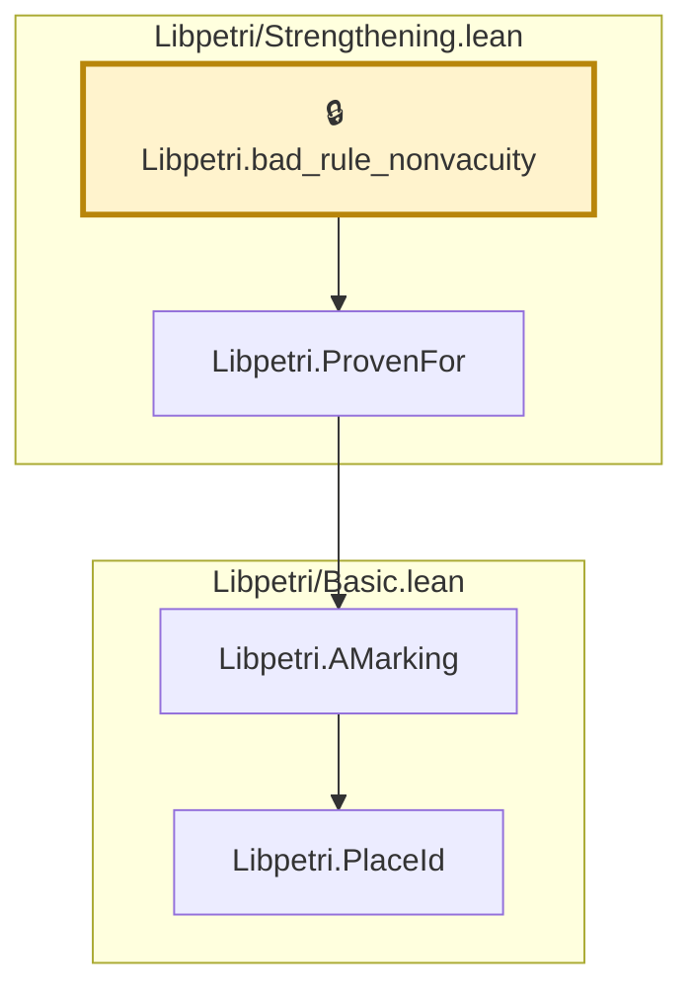

# VER-004

Generated by `scripts/proof-graph.py` from `proof-graph.json`. Do not edit.

Theorems carrying this ID:

- `Libpetri.bad_rule_nonvacuity` (theorem, `Libpetri/Strengthening.lean:423`) 🔒 locked
- `Libpetri.guard_hypothesis_is_necessary` (theorem, `Libpetri/Soundness.lean:242`) 🔒 locked
- `Libpetri.proposition_one` (theorem, `Libpetri/Soundness.lean:203`) 🔒 locked
- `Libpetri.unit_output_hypothesis_is_necessary` (theorem, `Libpetri/Soundness.lean:273`) 🔒 locked

> **Note:** the full tree has 67 nodes (limit 60), so it is drawn as one diagram per theorem (4 theorems).

### `Libpetri.bad_rule_nonvacuity`

> Rule: this theorem's whole tree, 4 nodes.

### `Libpetri.guard_hypothesis_is_necessary`

> Rule: this theorem's whole tree, 35 nodes.

```mermaid
flowchart TD
  subgraph g0["Libpetri/Basic.lean"]
    n0["Libpetri.AMarking"]
    n6["Libpetri.CMarking"]
    n8["Libpetri.Card"]
    n9["Libpetri.Card.all"]
    n10["Libpetri.Card.atLeast"]
    n11["Libpetri.Card.consumesAll"]
    n12["Libpetri.Card.exactly"]
    n13["Libpetri.Card.one"]
    n14["Libpetri.Card.required"]
    n21["Libpetri.Colour"]
    n74["Libpetri.Guard"]
    n76["Libpetri.InSpec"]
    n77["Libpetri.InSpec.card"]
    n78["Libpetri.InSpec.guard"]
    n79["Libpetri.InSpec.mk"]
    n80["Libpetri.InSpec.place"]
    n2374["Libpetri.PlaceId"]
    n2605["Libpetri.Transition"]
    n2607["Libpetri.Transition.inputs"]
    n2608["Libpetri.Transition.mk"]
    n2612["Libpetri.Transition.resets"]
    n2632["Libpetri.alpha"]
    n2633["Libpetri.alphaFireC"]
    n2682["Libpetri.consumeAllAt"]
    n2683["Libpetri.consumeCount"]
    n2696["Libpetri.consumedAt"]
    n2756["Libpetri.fireA"]
    n2822["Libpetri.matchCount"]
    n2852["Libpetri.post"]
    n2857["Libpetri.pre"]
    n2912["Libpetri.specAt"]
  end
  subgraph g1["Libpetri/Soundness.lean"]
    n2772["Libpetri.guardIsOne"]
    n2773["🔒 Libpetri.guard_hypothesis_is_necessary"]
    n2818["Libpetri.mGuarded"]
    n2936["Libpetri.tGuardedAll"]
  end
  n0 --> n2374
  n6 --> n21
  n6 --> n2374
  n9 --> n8
  n10 --> n8
  n11 --> n9
  n11 --> n10
  n11 --> n12
  n11 --> n13
  n12 --> n8
  n13 --> n8
  n14 --> n9
  n14 --> n10
  n14 --> n12
  n14 --> n13
  n74 --> n21
  n77 --> n8
  n77 --> n76
  n78 --> n74
  n78 --> n76
  n79 --> n8
  n79 --> n74
  n79 --> n76
  n79 --> n2374
  n80 --> n76
  n80 --> n2374
  n2607 --> n76
  n2607 --> n2605
  n2608 --> n76
  n2608 --> n2374
  n2608 --> n2605
  n2612 --> n2374
  n2612 --> n2605
  n2632 --> n0
  n2632 --> n6
  n2633 --> n0
  n2633 --> n2612
  n2633 --> n2696
  n2682 --> n11
  n2682 --> n77
  n2682 --> n2912
  n2683 --> n11
  n2683 --> n14
  n2683 --> n77
  n2683 --> n2822
  n2696 --> n2683
  n2696 --> n2912
  n2756 --> n0
  n2756 --> n2612
  n2756 --> n2682
  n2756 --> n2852
  n2756 --> n2857
  n2772 --> n74
  n2773 --> n2632
  n2773 --> n2633
  n2773 --> n2756
  n2773 --> n2818
  n2773 --> n2936
  n2818 --> n6
  n2822 --> n6
  n2822 --> n78
  n2822 --> n80
  n2852 --> n2374
  n2857 --> n14
  n2857 --> n77
  n2857 --> n2912
  n2912 --> n80
  n2912 --> n2607
  n2936 --> n9
  n2936 --> n79
  n2936 --> n2608
  n2936 --> n2772
  classDef root stroke-width:3px
  classDef locked fill:#fff3cd,stroke:#b8860b
  classDef collapsed fill:#eeeeee,stroke-dasharray:4 4
  class n2773 root
  class n2773 locked
```

### `Libpetri.proposition_one`

> Rule: this theorem's whole tree, 55 nodes.

```mermaid
flowchart TD
  subgraph g0["Libpetri/Basic.lean"]
    n0["Libpetri.AMarking"]
    n6["Libpetri.CMarking"]
    n8["Libpetri.Card"]
    n9["Libpetri.Card.all"]
    n10["Libpetri.Card.atLeast"]
    n11["Libpetri.Card.consumesAll"]
    n12["Libpetri.Card.exactly"]
    n13["Libpetri.Card.one"]
    n14["Libpetri.Card.required"]
    n21["Libpetri.Colour"]
    n74["Libpetri.Guard"]
    n75["Libpetri.GuardFreeConsumeAll"]
    n76["Libpetri.InSpec"]
    n77["Libpetri.InSpec.card"]
    n78["Libpetri.InSpec.guard"]
    n80["Libpetri.InSpec.place"]
    n81["Libpetri.InputsDistinctPlaces"]
    n2374["Libpetri.PlaceId"]
    n2605["Libpetri.Transition"]
    n2606["Libpetri.Transition.inhibitors"]
    n2607["Libpetri.Transition.inputs"]
    n2611["Libpetri.Transition.reads"]
    n2612["Libpetri.Transition.resets"]
    n2613["Libpetri.UnitOutput"]
    n2632["Libpetri.alpha"]
    n2633["Libpetri.alphaFireC"]
    n2682["Libpetri.consumeAllAt"]
    n2683["Libpetri.consumeCount"]
    n2696["Libpetri.consumedAt"]
    n2734["Libpetri.enabledA"]
    n2735["Libpetri.enabledC"]
    n2756["Libpetri.fireA"]
    n2822["Libpetri.matchCount"]
    n2852["Libpetri.post"]
    n2857["Libpetri.pre"]
    n2912["Libpetri.specAt"]
  end
  subgraph g1["Libpetri/Soundness.lean"]
    n72["Libpetri.FlatNet"]
    n73["Libpetri.FlatTransition"]
    n2522["Libpetri.ReachA"]
    n2523["Libpetri.ReachA.init"]
    n2525["Libpetri.ReachA.step"]
    n2549["Libpetri.ReachC"]
    n2550["Libpetri.ReachC.init"]
    n2551["Libpetri.ReachC.rec'"]
    n2552["Libpetri.ReachC.step"]
    n2586["Libpetri.StepARel"]
    n2589["Libpetri.StepC"]
    n2592["Libpetri.StepC.mk"]
    n2594["Libpetri.StepCRel"]
    n2623["Libpetri.WellFormed"]
    n2815["🔒 Libpetri.len_filter_le"]
    n2823["🔒 Libpetri.matchCount_le"]
    n2874["🔒 Libpetri.prop1_step"]
    n2875["🔒 Libpetri.proposition_one"]
    n2916["🔒 Libpetri.specAt_sound"]
  end
  n0 --> n2374
  n6 --> n21
  n6 --> n2374
  n9 --> n8
  n10 --> n8
  n11 --> n9
  n11 --> n10
  n11 --> n12
  n11 --> n13
  n12 --> n8
  n13 --> n8
  n14 --> n9
  n14 --> n10
  n14 --> n12
  n14 --> n13
  n72 --> n73
  n73 --> n2374
  n73 --> n2605
  n74 --> n21
  n75 --> n11
  n75 --> n77
  n75 --> n78
  n75 --> n2607
  n77 --> n8
  n77 --> n76
  n78 --> n74
  n78 --> n76
  n80 --> n76
  n80 --> n2374
  n81 --> n2912
  n2522 --> n2586
  n2523 --> n2522
  n2525 --> n2522
  n2549 --> n2594
  n2550 --> n2549
  n2551 --> n2550
  n2551 --> n2552
  n2552 --> n2549
  n2586 --> n72
  n2586 --> n2734
  n2586 --> n2756
  n2589 --> n6
  n2589 --> n73
  n2592 --> n2589
  n2592 --> n2613
  n2592 --> n2632
  n2592 --> n2633
  n2592 --> n2735
  n2594 --> n72
  n2594 --> n2589
  n2606 --> n2374
  n2606 --> n2605
  n2607 --> n76
  n2607 --> n2605
  n2611 --> n2374
  n2611 --> n2605
  n2612 --> n2374
  n2612 --> n2605
  n2613 --> n2852
  n2623 --> n72
  n2623 --> n75
  n2623 --> n81
  n2632 --> n0
  n2632 --> n6
  n2633 --> n0
  n2633 --> n2612
  n2633 --> n2696
  n2682 --> n11
  n2682 --> n77
  n2682 --> n2912
  n2683 --> n11
  n2683 --> n14
  n2683 --> n77
  n2683 --> n2822
  n2696 --> n2683
  n2696 --> n2912
  n2734 --> n0
  n2734 --> n14
  n2734 --> n77
  n2734 --> n80
  n2734 --> n2606
  n2734 --> n2607
  n2734 --> n2611
  n2735 --> n14
  n2735 --> n77
  n2735 --> n2606
  n2735 --> n2607
  n2735 --> n2611
  n2735 --> n2822
  n2756 --> n0
  n2756 --> n2612
  n2756 --> n2682
  n2756 --> n2852
  n2756 --> n2857
  n2822 --> n6
  n2822 --> n78
  n2822 --> n80
  n2823 --> n2815
  n2823 --> n2822
  n2852 --> n2374
  n2857 --> n14
  n2857 --> n77
  n2857 --> n2912
  n2874 --> n75
  n2874 --> n2613
  n2874 --> n2632
  n2874 --> n2633
  n2874 --> n2734
  n2874 --> n2735
  n2874 --> n2756
  n2874 --> n2823
  n2874 --> n2916
  n2875 --> n2523
  n2875 --> n2525
  n2875 --> n2551
  n2875 --> n2592
  n2875 --> n2623
  n2875 --> n2874
  n2912 --> n80
  n2912 --> n2607
  n2916 --> n2912
  classDef root stroke-width:3px
  classDef locked fill:#fff3cd,stroke:#b8860b
  classDef collapsed fill:#eeeeee,stroke-dasharray:4 4
  class n2875 root
  class n2815,n2823,n2874,n2875,n2916 locked
```

### `Libpetri.unit_output_hypothesis_is_necessary`

> Rule: this theorem's whole tree, 35 nodes.

```mermaid
flowchart TD
  subgraph g0["Libpetri/Basic.lean"]
    n0["Libpetri.AMarking"]
    n6["Libpetri.CMarking"]
    n8["Libpetri.Card"]
    n9["Libpetri.Card.all"]
    n10["Libpetri.Card.atLeast"]
    n11["Libpetri.Card.consumesAll"]
    n12["Libpetri.Card.exactly"]
    n13["Libpetri.Card.one"]
    n14["Libpetri.Card.required"]
    n21["Libpetri.Colour"]
    n74["Libpetri.Guard"]
    n76["Libpetri.InSpec"]
    n77["Libpetri.InSpec.card"]
    n78["Libpetri.InSpec.guard"]
    n79["Libpetri.InSpec.mk"]
    n80["Libpetri.InSpec.place"]
    n2374["Libpetri.PlaceId"]
    n2605["Libpetri.Transition"]
    n2607["Libpetri.Transition.inputs"]
    n2608["Libpetri.Transition.mk"]
    n2612["Libpetri.Transition.resets"]
    n2632["Libpetri.alpha"]
    n2633["Libpetri.alphaFireC"]
    n2682["Libpetri.consumeAllAt"]
    n2683["Libpetri.consumeCount"]
    n2696["Libpetri.consumedAt"]
    n2756["Libpetri.fireA"]
    n2822["Libpetri.matchCount"]
    n2852["Libpetri.post"]
    n2857["Libpetri.pre"]
    n2912["Libpetri.specAt"]
  end
  subgraph g1["Libpetri/Soundness.lean"]
    n2820["Libpetri.mSimple"]
    n2865["Libpetri.prodDouble"]
    n2938["Libpetri.tSimple"]
    n2951["🔒 Libpetri.unit_output_hypothesis_is_necessary"]
  end
  n0 --> n2374
  n6 --> n21
  n6 --> n2374
  n9 --> n8
  n10 --> n8
  n11 --> n9
  n11 --> n10
  n11 --> n12
  n11 --> n13
  n12 --> n8
  n13 --> n8
  n14 --> n9
  n14 --> n10
  n14 --> n12
  n14 --> n13
  n74 --> n21
  n77 --> n8
  n77 --> n76
  n78 --> n74
  n78 --> n76
  n79 --> n8
  n79 --> n74
  n79 --> n76
  n79 --> n2374
  n80 --> n76
  n80 --> n2374
  n2607 --> n76
  n2607 --> n2605
  n2608 --> n76
  n2608 --> n2374
  n2608 --> n2605
  n2612 --> n2374
  n2612 --> n2605
  n2632 --> n0
  n2632 --> n6
  n2633 --> n0
  n2633 --> n2612
  n2633 --> n2696
  n2682 --> n11
  n2682 --> n77
  n2682 --> n2912
  n2683 --> n11
  n2683 --> n14
  n2683 --> n77
  n2683 --> n2822
  n2696 --> n2683
  n2696 --> n2912
  n2756 --> n0
  n2756 --> n2612
  n2756 --> n2682
  n2756 --> n2852
  n2756 --> n2857
  n2820 --> n6
  n2822 --> n6
  n2822 --> n78
  n2822 --> n80
  n2852 --> n2374
  n2857 --> n14
  n2857 --> n77
  n2857 --> n2912
  n2865 --> n2374
  n2912 --> n80
  n2912 --> n2607
  n2938 --> n13
  n2938 --> n79
  n2938 --> n2608
  n2951 --> n2632
  n2951 --> n2633
  n2951 --> n2756
  n2951 --> n2820
  n2951 --> n2865
  n2951 --> n2938
  classDef root stroke-width:3px
  classDef locked fill:#fff3cd,stroke:#b8860b
  classDef collapsed fill:#eeeeee,stroke-dasharray:4 4
  class n2951 root
  class n2951 locked
```

Axioms used:

- `Libpetri.bad_rule_nonvacuity`: none
- `Libpetri.guard_hypothesis_is_necessary`: `propext`
- `Libpetri.proposition_one`: `Quot.sound`, `propext`
- `Libpetri.unit_output_hypothesis_is_necessary`: `propext`
