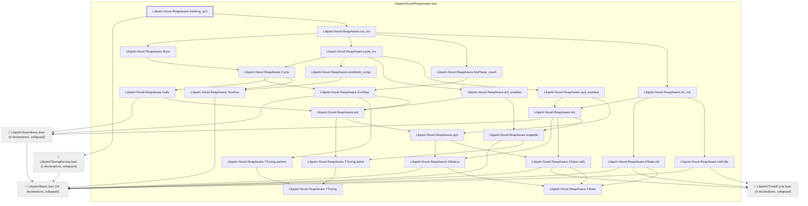
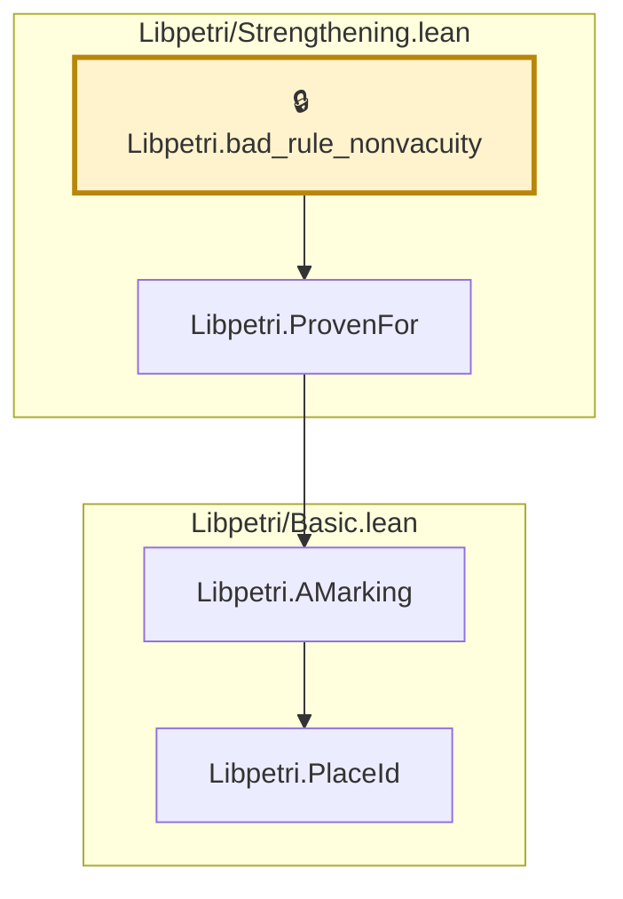

# VER-004

Generated by `scripts/proof-graph.py` from `proof-graph.json`. Do not edit.

Theorems carrying this ID:

- `Libpetri.Novel.ForwardDeposit.forward_reachability_simulated` (theorem, `Libpetri/Novel/ForwardDeposit.lean:593`)
- `Libpetri.Novel.ForwardDeposit.old_rows_prove_bound_one` (theorem, `Libpetri/Novel/ForwardDeposit.lean:226`)
- `Libpetri.Novel.InFlight.atomic_covers_executor` (theorem, `Libpetri/Novel/InFlight.lean:504`)
- `Libpetri.Novel.InFlight.inflight_witness` (theorem, `Libpetri/Novel/InFlight.lean:700`)
- `Libpetri.Novel.InFlight.split_covers_executor` (theorem, `Libpetri/Novel/InFlight.lean:387`)
- `Libpetri.Novel.InFlight.split_rest_sound` (theorem, `Libpetri/Novel/InFlight.lean:574`)
- `Libpetri.Novel.InFlight.split_safety_sound` (theorem, `Libpetri/Novel/InFlight.lean:562`)
- `Libpetri.Novel.InFlight.split_stop_sound` (theorem, `Libpetri/Novel/InFlight.lean:542`)
- `Libpetri.Novel.InFlight.terminal_stop_witness` (theorem, `Libpetri/Novel/InFlight.lean:842`)
- `Libpetri.Novel.ReapAware.marking_ac3` (theorem, `Libpetri/Novel/ReapAware.lean:343`)
- `Libpetri.Novel.ReapAware.reap_aware_ac3` (theorem, `Libpetri/Novel/ReapAware.lean:332`)
- `Libpetri.bad_rule_nonvacuity` (theorem, `Libpetri/Strengthening.lean:425`) 🔒 locked
- `Libpetri.guard_hypothesis_is_necessary` (theorem, `Libpetri/Soundness.lean:249`) 🔒 locked
- `Libpetri.proposition_one` (theorem, `Libpetri/Soundness.lean:206`) 🔒 locked
- `Libpetri.unit_output_hypothesis_is_necessary` (theorem, `Libpetri/Soundness.lean:280`) 🔒 locked

> **Note:** the full tree has 229 nodes (limit 60), so it is drawn as one diagram per theorem (15 theorems).

### `Libpetri.Novel.ForwardDeposit.forward_reachability_simulated`

> Rule: this theorem's tree has 75 nodes (limit 60); every file other than its own is collapsed into one node, leaving 42.

```mermaid
flowchart TD
  subgraph g0["Libpetri/Novel/ForwardDeposit.lean"]
    n665["Libpetri.Novel.ForwardDeposit.Choice"]
    n666["Libpetri.Novel.ForwardDeposit.Choice.action"]
    n667["Libpetri.Novel.ForwardDeposit.Choice.timedOut"]
    n668["Libpetri.Novel.ForwardDeposit.Deposit"]
    n669["Libpetri.Novel.ForwardDeposit.FixedForwards"]
    n670["Libpetri.Novel.ForwardDeposit.OutSpec"]
    n671["Libpetri.Novel.ForwardDeposit.OutSpec.and"]
    n673["Libpetri.Novel.ForwardDeposit.OutSpec.brecOn.go"]
    n674["Libpetri.Novel.ForwardDeposit.OutSpec.forward"]
    n675["Libpetri.Novel.ForwardDeposit.OutSpec.place"]
    n676["Libpetri.Novel.ForwardDeposit.OutSpec.timeout"]
    n677["Libpetri.Novel.ForwardDeposit.OutSpec.xor"]
    n678["Libpetri.Novel.ForwardDeposit.ReachAD"]
    n680["Libpetri.Novel.ForwardDeposit.SpecNet"]
    n681["Libpetri.Novel.ForwardDeposit.StepAD"]
    n683["Libpetri.Novel.ForwardDeposit.StepCD"]
    n684["Libpetri.Novel.ForwardDeposit.StepCR"]
    n686["Libpetri.Novel.ForwardDeposit.branches"]
    n687["Libpetri.Novel.ForwardDeposit.consumedAt_eq_pre"]
    n688["Libpetri.Novel.ForwardDeposit.cross"]
    n689["Libpetri.Novel.ForwardDeposit.dedupAppend"]
    n690["Libpetri.Novel.ForwardDeposit.dedupAppend_covers"]
    n692["Libpetri.Novel.ForwardDeposit.deposit"]
    n693["Libpetri.Novel.ForwardDeposit.deposit_mem_fixedRows"]
    n695["Libpetri.Novel.ForwardDeposit.findTimeout"]
    n696["Libpetri.Novel.ForwardDeposit.fireAD"]
    n698["Libpetri.Novel.ForwardDeposit.fixedRows"]
    n701["Libpetri.Novel.ForwardDeposit.flatRows"]
    n702["Libpetri.Novel.ForwardDeposit.flatRows_guardFree"]
    n703["Libpetri.Novel.ForwardDeposit.forwardSources"]
    n704["Libpetri.Novel.ForwardDeposit.forwardSources_findTimeout"]
    n706["Libpetri.Novel.ForwardDeposit.forward_reachability_simulated"]
    n719["Libpetri.Novel.ForwardDeposit.mem_dedupAppend_of_mem"]
    n730["Libpetri.Novel.ForwardDeposit.prop1_step_deposit"]
    n732["Libpetri.Novel.ForwardDeposit.rows_reachability_simulated"]
    n733["Libpetri.Novel.ForwardDeposit.stepCD_stepCR"]
    n734["Libpetri.Novel.ForwardDeposit.stepCR_simulated"]
    n737["Libpetri.Novel.ForwardDeposit.timeoutDeposits"]
    n738["Libpetri.Novel.ForwardDeposit.timeoutDeposits_congr"]
    n739["Libpetri.Novel.ForwardDeposit.timeoutDeposits_fixed"]
  end
  c0["📁 Libpetri/Basic.lean (32 declarations, collapsed)"]
  c77["📁 Libpetri/Soundness.lean (3 declarations, collapsed)"]
  c77 --> c0
  n666 --> n665
  n667 --> n665
  n668 --> c0
  n669 --> n703
  n671 --> n670
  n673 --> n671
  n673 --> n674
  n673 --> n675
  n673 --> n676
  n673 --> n677
  n674 --> c0
  n674 --> n670
  n675 --> c0
  n675 --> n670
  n676 --> n670
  n677 --> n670
  n678 --> n681
  n680 --> c0
  n680 --> n670
  n681 --> n696
  n683 --> n680
  n683 --> n692
  n684 --> n668
  n686 --> n673
  n686 --> n688
  n687 --> c0
  n688 --> n668
  n689 --> n668
  n690 --> n719
  n692 --> n666
  n692 --> n667
  n692 --> n686
  n692 --> n695
  n692 --> n737
  n693 --> n690
  n693 --> n692
  n693 --> n698
  n693 --> n739
  n695 --> n673
  n696 --> n668
  n698 --> n686
  n698 --> n689
  n698 --> n695
  n698 --> n737
  n701 --> n680
  n701 --> n698
  n702 --> n701
  n703 --> n673
  n704 --> n695
  n704 --> n703
  n706 --> n702
  n706 --> n732
  n706 --> n733
  n719 --> n689
  n730 --> c77
  n730 --> n687
  n730 --> n696
  n732 --> n678
  n732 --> n734
  n733 --> n683
  n733 --> n684
  n733 --> n693
  n733 --> n701
  n734 --> n681
  n734 --> n684
  n734 --> n730
  n737 --> n673
  n737 --> n688
  n738 --> n703
  n738 --> n737
  n739 --> n669
  n739 --> n687
  n739 --> n704
  n739 --> n738
  classDef root stroke-width:3px
  classDef locked fill:#fff3cd,stroke:#b8860b
  classDef collapsed fill:#eeeeee,stroke-dasharray:4 4
  class n706 root
  class c0,c77 collapsed
```

### `Libpetri.Novel.ForwardDeposit.old_rows_prove_bound_one`

> Rule: this theorem's whole tree, 56 nodes.

```mermaid
flowchart TD
  subgraph g0["Libpetri/Basic.lean"]
    n0["Libpetri.AMarking"]
    n6["Libpetri.CMarking"]
    n8["Libpetri.Card"]
    n9["Libpetri.Card.all"]
    n10["Libpetri.Card.atLeast"]
    n11["Libpetri.Card.consumesAll"]
    n12["Libpetri.Card.exactly"]
    n13["Libpetri.Card.one"]
    n14["Libpetri.Card.required"]
    n21["Libpetri.Colour"]
    n74["Libpetri.Guard"]
    n76["Libpetri.InSpec"]
    n77["Libpetri.InSpec.card"]
    n79["Libpetri.InSpec.mk"]
    n80["Libpetri.InSpec.place"]
    n2374["Libpetri.PlaceId"]
    n2605["Libpetri.Transition"]
    n2606["Libpetri.Transition.inhibitors"]
    n2607["Libpetri.Transition.inputs"]
    n2608["Libpetri.Transition.mk"]
    n2611["Libpetri.Transition.reads"]
    n2612["Libpetri.Transition.resets"]
    n2632["Libpetri.alpha"]
    n2682["Libpetri.consumeAllAt"]
    n2734["Libpetri.enabledA"]
    n2756["Libpetri.fireA"]
    n2852["Libpetri.post"]
    n2857["Libpetri.pre"]
    n2912["Libpetri.specAt"]
  end
  subgraph g1["Libpetri/Novel/ForwardDeposit.lean"]
    n668["Libpetri.Novel.ForwardDeposit.Deposit"]
    n670["Libpetri.Novel.ForwardDeposit.OutSpec"]
    n671["Libpetri.Novel.ForwardDeposit.OutSpec.and"]
    n673["Libpetri.Novel.ForwardDeposit.OutSpec.brecOn.go"]
    n674["Libpetri.Novel.ForwardDeposit.OutSpec.forward"]
    n675["Libpetri.Novel.ForwardDeposit.OutSpec.place"]
    n676["Libpetri.Novel.ForwardDeposit.OutSpec.timeout"]
    n677["Libpetri.Novel.ForwardDeposit.OutSpec.xor"]
    n686["Libpetri.Novel.ForwardDeposit.branches"]
    n688["Libpetri.Novel.ForwardDeposit.cross"]
    n718["Libpetri.Novel.ForwardDeposit.m0Fwd"]
    n720["Libpetri.Novel.ForwardDeposit.oFwd"]
    n721["Libpetri.Novel.ForwardDeposit.oldNet"]
    n723["Libpetri.Novel.ForwardDeposit.oldRows"]
    n724["Libpetri.Novel.ForwardDeposit.old_rows_invariant"]
    n725["Libpetri.Novel.ForwardDeposit.old_rows_prove_bound_one"]
    n726["Libpetri.Novel.ForwardDeposit.pa"]
    n727["Libpetri.Novel.ForwardDeposit.pb"]
    n728["Libpetri.Novel.ForwardDeposit.pc"]
    n736["Libpetri.Novel.ForwardDeposit.tFwd"]
  end
  subgraph g2["Libpetri/Soundness.lean"]
    n72["Libpetri.FlatNet"]
    n73["Libpetri.FlatTransition"]
    n2522["Libpetri.ReachA"]
    n2523["Libpetri.ReachA.init"]
    n2524["Libpetri.ReachA.rec'"]
    n2525["Libpetri.ReachA.step"]
    n2586["Libpetri.StepARel"]
  end
  n0 --> n2374
  n6 --> n21
  n6 --> n2374
  n9 --> n8
  n10 --> n8
  n11 --> n9
  n11 --> n10
  n11 --> n12
  n11 --> n13
  n12 --> n8
  n13 --> n8
  n14 --> n9
  n14 --> n10
  n14 --> n12
  n14 --> n13
  n72 --> n73
  n73 --> n2374
  n73 --> n2605
  n74 --> n21
  n77 --> n8
  n77 --> n76
  n79 --> n8
  n79 --> n74
  n79 --> n76
  n79 --> n2374
  n80 --> n76
  n80 --> n2374
  n668 --> n2374
  n671 --> n670
  n673 --> n671
  n673 --> n674
  n673 --> n675
  n673 --> n676
  n673 --> n677
  n674 --> n670
  n674 --> n2374
  n675 --> n670
  n675 --> n2374
  n676 --> n670
  n677 --> n670
  n686 --> n673
  n686 --> n688
  n688 --> n668
  n718 --> n6
  n718 --> n726
  n720 --> n674
  n720 --> n675
  n720 --> n676
  n720 --> n677
  n720 --> n726
  n720 --> n727
  n720 --> n728
  n721 --> n72
  n721 --> n720
  n721 --> n723
  n721 --> n736
  n723 --> n686
  n724 --> n718
  n724 --> n721
  n724 --> n2524
  n724 --> n2632
  n725 --> n724
  n726 --> n2374
  n727 --> n2374
  n728 --> n2374
  n736 --> n12
  n736 --> n79
  n736 --> n726
  n736 --> n2608
  n2522 --> n2586
  n2523 --> n2522
  n2524 --> n2523
  n2524 --> n2525
  n2525 --> n2522
  n2586 --> n72
  n2586 --> n2734
  n2586 --> n2756
  n2606 --> n2374
  n2606 --> n2605
  n2607 --> n76
  n2607 --> n2605
  n2608 --> n76
  n2608 --> n2374
  n2608 --> n2605
  n2611 --> n2374
  n2611 --> n2605
  n2612 --> n2374
  n2612 --> n2605
  n2632 --> n0
  n2632 --> n6
  n2682 --> n11
  n2682 --> n77
  n2682 --> n2912
  n2734 --> n0
  n2734 --> n14
  n2734 --> n77
  n2734 --> n80
  n2734 --> n2606
  n2734 --> n2607
  n2734 --> n2611
  n2756 --> n0
  n2756 --> n2612
  n2756 --> n2682
  n2756 --> n2852
  n2756 --> n2857
  n2852 --> n2374
  n2857 --> n14
  n2857 --> n77
  n2857 --> n2912
  n2912 --> n80
  n2912 --> n2607
  classDef root stroke-width:3px
  classDef locked fill:#fff3cd,stroke:#b8860b
  classDef collapsed fill:#eeeeee,stroke-dasharray:4 4
  class n725 root
```

### `Libpetri.Novel.InFlight.atomic_covers_executor`

> Rule: this theorem's tree has 64 nodes (limit 60); every file other than its own is collapsed into one node, leaving 40.

```mermaid
flowchart TD
  subgraph g0["Libpetri/Novel/InFlight.lean"]
    n741["Libpetri.Novel.InFlight.Completes"]
    n742["Libpetri.Novel.InFlight.MonoAt"]
    n743["Libpetri.Novel.InFlight.NamesUnique"]
    n744["Libpetri.Novel.InFlight.Row"]
    n745["Libpetri.Novel.InFlight.SReach"]
    n746["Libpetri.Novel.InFlight.SStep"]
    n747["Libpetri.Novel.InFlight.SStep.atomic"]
    n748["Libpetri.Novel.InFlight.SStep.complete"]
    n749["Libpetri.Novel.InFlight.SStep.start"]
    n750["Libpetri.Novel.InFlight.Untested"]
    n753["Libpetri.Novel.InFlight.XReach"]
    n754["Libpetri.Novel.InFlight.XState"]
    n755["Libpetri.Novel.InFlight.XState.a"]
    n756["Libpetri.Novel.InFlight.XState.mk"]
    n757["Libpetri.Novel.InFlight.XState.pend"]
    n758["Libpetri.Novel.InFlight.XStep"]
    n759["Libpetri.Novel.InFlight.XStep.complete"]
    n760["Libpetri.Novel.InFlight.XStep.start"]
    n763["Libpetri.Novel.InFlight.addAll"]
    n764["Libpetri.Novel.InFlight.addAll_cons"]
    n765["Libpetri.Novel.InFlight.addAll_nil"]
    n767["Libpetri.Novel.InFlight.addAll_perm"]
    n768["Libpetri.Novel.InFlight.addD"]
    n769["Libpetri.Novel.InFlight.addD_addAll"]
    n770["Libpetri.Novel.InFlight.atomic_covers_executor"]
    n774["Libpetri.Novel.InFlight.completes_nonsplit"]
    n777["Libpetri.Novel.InFlight.enabledA_addAll"]
    n778["Libpetri.Novel.InFlight.enabledA_addD"]
    n782["Libpetri.Novel.InFlight.filter_erase_of_false"]
    n783["Libpetri.Novel.InFlight.filter_erase_of_true"]
    n784["Libpetri.Novel.InFlight.fireAD_eq_addD_startA"]
    n789["Libpetri.Novel.InFlight.live_addAll"]
    n800["Libpetri.Novel.InFlight.split_covers_executor"]
    n805["Libpetri.Novel.InFlight.startA"]
    n806["Libpetri.Novel.InFlight.startA_addAll"]
    n807["Libpetri.Novel.InFlight.startA_addD"]
  end
  c0["📁 Libpetri/Basic.lean (22 declarations, collapsed)"]
  c26["📁 Libpetri/Novel/ForwardDeposit.lean (4 declarations, collapsed)"]
  c77["📁 Libpetri/Soundness.lean (1 declarations, collapsed)"]
  c80["📁 Libpetri/Strengthening/Hypotheses.lean (1 declarations, collapsed)"]
  c26 --> c0
  c77 --> c0
  c80 --> c77
  n741 --> n744
  n742 --> c0
  n743 --> n744
  n744 --> c26
  n745 --> n746
  n745 --> n756
  n746 --> n744
  n746 --> n754
  n747 --> n746
  n747 --> n755
  n747 --> n756
  n747 --> n757
  n748 --> n746
  n748 --> n755
  n748 --> n756
  n748 --> n757
  n748 --> n768
  n749 --> n746
  n749 --> n755
  n749 --> n756
  n749 --> n757
  n749 --> n805
  n750 --> n742
  n750 --> n744
  n753 --> n756
  n753 --> n758
  n755 --> c0
  n755 --> n754
  n756 --> c0
  n756 --> n754
  n757 --> n754
  n758 --> n744
  n758 --> n754
  n759 --> n755
  n759 --> n756
  n759 --> n757
  n759 --> n758
  n759 --> n768
  n760 --> n755
  n760 --> n756
  n760 --> n757
  n760 --> n758
  n760 --> n805
  n763 --> n744
  n764 --> n763
  n764 --> n768
  n765 --> n763
  n767 --> n763
  n768 --> c26
  n769 --> n763
  n769 --> n768
  n770 --> n800
  n774 --> n741
  n777 --> n750
  n777 --> n764
  n777 --> n765
  n777 --> n778
  n778 --> n742
  n778 --> n768
  n784 --> n768
  n784 --> n805
  n789 --> n764
  n789 --> n765
  n800 --> n743
  n800 --> n745
  n800 --> n747
  n800 --> n748
  n800 --> n749
  n800 --> n753
  n800 --> n759
  n800 --> n760
  n800 --> n767
  n800 --> n769
  n800 --> n774
  n800 --> n777
  n800 --> n782
  n800 --> n783
  n800 --> n784
  n800 --> n789
  n800 --> n806
  n805 --> c26
  n806 --> n750
  n806 --> n764
  n806 --> n765
  n806 --> n778
  n806 --> n807
  n807 --> c80
  n807 --> n742
  n807 --> n768
  n807 --> n805
  classDef root stroke-width:3px
  classDef locked fill:#fff3cd,stroke:#b8860b
  classDef collapsed fill:#eeeeee,stroke-dasharray:4 4
  class n770 root
  class c0,c26,c77,c80 collapsed
```

### `Libpetri.Novel.InFlight.inflight_witness`

> Rule: this theorem's whole tree, 57 nodes.

```mermaid
flowchart TD
  subgraph g0["Libpetri/Basic.lean"]
    n0["Libpetri.AMarking"]
    n8["Libpetri.Card"]
    n9["Libpetri.Card.all"]
    n10["Libpetri.Card.atLeast"]
    n11["Libpetri.Card.consumesAll"]
    n12["Libpetri.Card.exactly"]
    n13["Libpetri.Card.one"]
    n14["Libpetri.Card.required"]
    n21["Libpetri.Colour"]
    n74["Libpetri.Guard"]
    n76["Libpetri.InSpec"]
    n77["Libpetri.InSpec.card"]
    n79["Libpetri.InSpec.mk"]
    n80["Libpetri.InSpec.place"]
    n2374["Libpetri.PlaceId"]
    n2605["Libpetri.Transition"]
    n2606["Libpetri.Transition.inhibitors"]
    n2607["Libpetri.Transition.inputs"]
    n2608["Libpetri.Transition.mk"]
    n2609["Libpetri.Transition.name"]
    n2611["Libpetri.Transition.reads"]
    n2612["Libpetri.Transition.resets"]
    n2682["Libpetri.consumeAllAt"]
    n2734["Libpetri.enabledA"]
    n2857["Libpetri.pre"]
    n2912["Libpetri.specAt"]
  end
  subgraph g1["Libpetri/Novel/ForwardDeposit.lean"]
    n668["Libpetri.Novel.ForwardDeposit.Deposit"]
    n678["Libpetri.Novel.ForwardDeposit.ReachAD"]
    n681["Libpetri.Novel.ForwardDeposit.StepAD"]
    n696["Libpetri.Novel.ForwardDeposit.fireAD"]
  end
  subgraph g2["Libpetri/Novel/InFlight.lean"]
    n742["Libpetri.Novel.InFlight.MonoAt"]
    n744["Libpetri.Novel.InFlight.Row"]
    n745["Libpetri.Novel.InFlight.SReach"]
    n746["Libpetri.Novel.InFlight.SStep"]
    n747["Libpetri.Novel.InFlight.SStep.atomic"]
    n749["Libpetri.Novel.InFlight.SStep.start"]
    n750["Libpetri.Novel.InFlight.Untested"]
    n753["Libpetri.Novel.InFlight.XReach"]
    n754["Libpetri.Novel.InFlight.XState"]
    n755["Libpetri.Novel.InFlight.XState.a"]
    n756["Libpetri.Novel.InFlight.XState.mk"]
    n757["Libpetri.Novel.InFlight.XState.pend"]
    n758["Libpetri.Novel.InFlight.XStep"]
    n759["Libpetri.Novel.InFlight.XStep.complete"]
    n760["Libpetri.Novel.InFlight.XStep.start"]
    n762["Libpetri.Novel.InFlight.a0W"]
    n768["Libpetri.Novel.InFlight.addD"]
    n771["Libpetri.Novel.InFlight.atomic_never_bad"]
    n779["Libpetri.Novel.InFlight.executor_marks_bad"]
    n785["Libpetri.Novel.InFlight.inflight_witness"]
    n788["Libpetri.Novel.InFlight.liveW"]
    n796["Libpetri.Novel.InFlight.rowsW"]
    n801["Libpetri.Novel.InFlight.split_marks_bad"]
    n805["Libpetri.Novel.InFlight.startA"]
    n813["Libpetri.Novel.InFlight.tW"]
    n814["Libpetri.Novel.InFlight.t_output_tested"]
    n816["Libpetri.Novel.InFlight.uW"]
  end
  n0 --> n2374
  n9 --> n8
  n10 --> n8
  n11 --> n9
  n11 --> n10
  n11 --> n12
  n11 --> n13
  n12 --> n8
  n13 --> n8
  n14 --> n9
  n14 --> n10
  n14 --> n12
  n14 --> n13
  n74 --> n21
  n77 --> n8
  n77 --> n76
  n79 --> n8
  n79 --> n74
  n79 --> n76
  n79 --> n2374
  n80 --> n76
  n80 --> n2374
  n668 --> n2374
  n678 --> n681
  n681 --> n696
  n681 --> n2734
  n696 --> n0
  n696 --> n668
  n696 --> n2612
  n696 --> n2682
  n696 --> n2857
  n742 --> n2606
  n742 --> n2612
  n742 --> n2682
  n744 --> n668
  n744 --> n2605
  n745 --> n746
  n745 --> n756
  n746 --> n0
  n746 --> n744
  n746 --> n754
  n747 --> n696
  n747 --> n746
  n747 --> n755
  n747 --> n756
  n747 --> n757
  n747 --> n2609
  n747 --> n2734
  n749 --> n746
  n749 --> n755
  n749 --> n756
  n749 --> n757
  n749 --> n805
  n749 --> n2609
  n749 --> n2734
  n750 --> n742
  n750 --> n744
  n753 --> n756
  n753 --> n758
  n755 --> n0
  n755 --> n754
  n756 --> n0
  n756 --> n754
  n757 --> n754
  n758 --> n0
  n758 --> n744
  n758 --> n754
  n759 --> n755
  n759 --> n756
  n759 --> n757
  n759 --> n758
  n759 --> n768
  n759 --> n2609
  n760 --> n755
  n760 --> n756
  n760 --> n757
  n760 --> n758
  n760 --> n805
  n760 --> n2609
  n760 --> n2734
  n762 --> n0
  n768 --> n0
  n768 --> n668
  n771 --> n678
  n771 --> n762
  n771 --> n796
  n779 --> n753
  n779 --> n759
  n779 --> n760
  n779 --> n762
  n779 --> n788
  n779 --> n796
  n785 --> n771
  n785 --> n779
  n785 --> n801
  n785 --> n814
  n788 --> n0
  n796 --> n744
  n796 --> n813
  n796 --> n816
  n801 --> n745
  n801 --> n747
  n801 --> n749
  n801 --> n762
  n801 --> n788
  n801 --> n796
  n805 --> n696
  n813 --> n13
  n813 --> n79
  n813 --> n2608
  n814 --> n750
  n814 --> n796
  n816 --> n13
  n816 --> n79
  n816 --> n2608
  n2606 --> n2374
  n2606 --> n2605
  n2607 --> n76
  n2607 --> n2605
  n2608 --> n76
  n2608 --> n2374
  n2608 --> n2605
  n2609 --> n2605
  n2611 --> n2374
  n2611 --> n2605
  n2612 --> n2374
  n2612 --> n2605
  n2682 --> n11
  n2682 --> n77
  n2682 --> n2912
  n2734 --> n0
  n2734 --> n14
  n2734 --> n77
  n2734 --> n80
  n2734 --> n2606
  n2734 --> n2607
  n2734 --> n2611
  n2857 --> n14
  n2857 --> n77
  n2857 --> n2912
  n2912 --> n80
  n2912 --> n2607
  classDef root stroke-width:3px
  classDef locked fill:#fff3cd,stroke:#b8860b
  classDef collapsed fill:#eeeeee,stroke-dasharray:4 4
  class n785 root
```

### `Libpetri.Novel.InFlight.split_covers_executor`

> Rule: this theorem's tree has 61 nodes (limit 60); every file other than its own is collapsed into one node, leaving 39.

```mermaid
flowchart TD
  subgraph g0["Libpetri/Novel/InFlight.lean"]
    n741["Libpetri.Novel.InFlight.Completes"]
    n742["Libpetri.Novel.InFlight.MonoAt"]
    n743["Libpetri.Novel.InFlight.NamesUnique"]
    n744["Libpetri.Novel.InFlight.Row"]
    n745["Libpetri.Novel.InFlight.SReach"]
    n746["Libpetri.Novel.InFlight.SStep"]
    n747["Libpetri.Novel.InFlight.SStep.atomic"]
    n748["Libpetri.Novel.InFlight.SStep.complete"]
    n749["Libpetri.Novel.InFlight.SStep.start"]
    n750["Libpetri.Novel.InFlight.Untested"]
    n753["Libpetri.Novel.InFlight.XReach"]
    n754["Libpetri.Novel.InFlight.XState"]
    n755["Libpetri.Novel.InFlight.XState.a"]
    n756["Libpetri.Novel.InFlight.XState.mk"]
    n757["Libpetri.Novel.InFlight.XState.pend"]
    n758["Libpetri.Novel.InFlight.XStep"]
    n759["Libpetri.Novel.InFlight.XStep.complete"]
    n760["Libpetri.Novel.InFlight.XStep.start"]
    n763["Libpetri.Novel.InFlight.addAll"]
    n764["Libpetri.Novel.InFlight.addAll_cons"]
    n765["Libpetri.Novel.InFlight.addAll_nil"]
    n767["Libpetri.Novel.InFlight.addAll_perm"]
    n768["Libpetri.Novel.InFlight.addD"]
    n769["Libpetri.Novel.InFlight.addD_addAll"]
    n774["Libpetri.Novel.InFlight.completes_nonsplit"]
    n777["Libpetri.Novel.InFlight.enabledA_addAll"]
    n778["Libpetri.Novel.InFlight.enabledA_addD"]
    n782["Libpetri.Novel.InFlight.filter_erase_of_false"]
    n783["Libpetri.Novel.InFlight.filter_erase_of_true"]
    n784["Libpetri.Novel.InFlight.fireAD_eq_addD_startA"]
    n789["Libpetri.Novel.InFlight.live_addAll"]
    n800["Libpetri.Novel.InFlight.split_covers_executor"]
    n805["Libpetri.Novel.InFlight.startA"]
    n806["Libpetri.Novel.InFlight.startA_addAll"]
    n807["Libpetri.Novel.InFlight.startA_addD"]
  end
  c0["📁 Libpetri/Basic.lean (22 declarations, collapsed)"]
  c26["📁 Libpetri/Novel/ForwardDeposit.lean (2 declarations, collapsed)"]
  c77["📁 Libpetri/Soundness.lean (1 declarations, collapsed)"]
  c80["📁 Libpetri/Strengthening/Hypotheses.lean (1 declarations, collapsed)"]
  c26 --> c0
  c77 --> c0
  c80 --> c77
  n741 --> n744
  n742 --> c0
  n743 --> n744
  n744 --> c26
  n745 --> n746
  n745 --> n756
  n746 --> n744
  n746 --> n754
  n747 --> n746
  n747 --> n755
  n747 --> n756
  n747 --> n757
  n748 --> n746
  n748 --> n755
  n748 --> n756
  n748 --> n757
  n748 --> n768
  n749 --> n746
  n749 --> n755
  n749 --> n756
  n749 --> n757
  n749 --> n805
  n750 --> n742
  n750 --> n744
  n753 --> n756
  n753 --> n758
  n755 --> c0
  n755 --> n754
  n756 --> c0
  n756 --> n754
  n757 --> n754
  n758 --> n744
  n758 --> n754
  n759 --> n755
  n759 --> n756
  n759 --> n757
  n759 --> n758
  n759 --> n768
  n760 --> n755
  n760 --> n756
  n760 --> n757
  n760 --> n758
  n760 --> n805
  n763 --> n744
  n764 --> n763
  n764 --> n768
  n765 --> n763
  n767 --> n763
  n768 --> c26
  n769 --> n763
  n769 --> n768
  n774 --> n741
  n777 --> n750
  n777 --> n764
  n777 --> n765
  n777 --> n778
  n778 --> n742
  n778 --> n768
  n784 --> n768
  n784 --> n805
  n789 --> n764
  n789 --> n765
  n800 --> n743
  n800 --> n745
  n800 --> n747
  n800 --> n748
  n800 --> n749
  n800 --> n753
  n800 --> n759
  n800 --> n760
  n800 --> n767
  n800 --> n769
  n800 --> n774
  n800 --> n777
  n800 --> n782
  n800 --> n783
  n800 --> n784
  n800 --> n789
  n800 --> n806
  n805 --> c26
  n806 --> n750
  n806 --> n764
  n806 --> n765
  n806 --> n778
  n806 --> n807
  n807 --> c80
  n807 --> n742
  n807 --> n768
  n807 --> n805
  classDef root stroke-width:3px
  classDef locked fill:#fff3cd,stroke:#b8860b
  classDef collapsed fill:#eeeeee,stroke-dasharray:4 4
  class n800 root
  class c0,c26,c77,c80 collapsed
```

### `Libpetri.Novel.InFlight.split_rest_sound`

> Rule: this theorem's tree has 62 nodes (limit 60); every file other than its own is collapsed into one node, leaving 40.

```mermaid
flowchart TD
  subgraph g0["Libpetri/Novel/InFlight.lean"]
    n741["Libpetri.Novel.InFlight.Completes"]
    n742["Libpetri.Novel.InFlight.MonoAt"]
    n743["Libpetri.Novel.InFlight.NamesUnique"]
    n744["Libpetri.Novel.InFlight.Row"]
    n745["Libpetri.Novel.InFlight.SReach"]
    n746["Libpetri.Novel.InFlight.SStep"]
    n747["Libpetri.Novel.InFlight.SStep.atomic"]
    n748["Libpetri.Novel.InFlight.SStep.complete"]
    n749["Libpetri.Novel.InFlight.SStep.start"]
    n750["Libpetri.Novel.InFlight.Untested"]
    n753["Libpetri.Novel.InFlight.XReach"]
    n754["Libpetri.Novel.InFlight.XState"]
    n755["Libpetri.Novel.InFlight.XState.a"]
    n756["Libpetri.Novel.InFlight.XState.mk"]
    n757["Libpetri.Novel.InFlight.XState.pend"]
    n758["Libpetri.Novel.InFlight.XStep"]
    n759["Libpetri.Novel.InFlight.XStep.complete"]
    n760["Libpetri.Novel.InFlight.XStep.start"]
    n763["Libpetri.Novel.InFlight.addAll"]
    n764["Libpetri.Novel.InFlight.addAll_cons"]
    n765["Libpetri.Novel.InFlight.addAll_nil"]
    n767["Libpetri.Novel.InFlight.addAll_perm"]
    n768["Libpetri.Novel.InFlight.addD"]
    n769["Libpetri.Novel.InFlight.addD_addAll"]
    n774["Libpetri.Novel.InFlight.completes_nonsplit"]
    n777["Libpetri.Novel.InFlight.enabledA_addAll"]
    n778["Libpetri.Novel.InFlight.enabledA_addD"]
    n782["Libpetri.Novel.InFlight.filter_erase_of_false"]
    n783["Libpetri.Novel.InFlight.filter_erase_of_true"]
    n784["Libpetri.Novel.InFlight.fireAD_eq_addD_startA"]
    n789["Libpetri.Novel.InFlight.live_addAll"]
    n800["Libpetri.Novel.InFlight.split_covers_executor"]
    n802["Libpetri.Novel.InFlight.split_rest_sound"]
    n805["Libpetri.Novel.InFlight.startA"]
    n806["Libpetri.Novel.InFlight.startA_addAll"]
    n807["Libpetri.Novel.InFlight.startA_addD"]
  end
  c0["📁 Libpetri/Basic.lean (22 declarations, collapsed)"]
  c26["📁 Libpetri/Novel/ForwardDeposit.lean (2 declarations, collapsed)"]
  c77["📁 Libpetri/Soundness.lean (1 declarations, collapsed)"]
  c80["📁 Libpetri/Strengthening/Hypotheses.lean (1 declarations, collapsed)"]
  c26 --> c0
  c77 --> c0
  c80 --> c77
  n741 --> n744
  n742 --> c0
  n743 --> n744
  n744 --> c26
  n745 --> n746
  n745 --> n756
  n746 --> n744
  n746 --> n754
  n747 --> n746
  n747 --> n755
  n747 --> n756
  n747 --> n757
  n748 --> n746
  n748 --> n755
  n748 --> n756
  n748 --> n757
  n748 --> n768
  n749 --> n746
  n749 --> n755
  n749 --> n756
  n749 --> n757
  n749 --> n805
  n750 --> n742
  n750 --> n744
  n753 --> n756
  n753 --> n758
  n755 --> c0
  n755 --> n754
  n756 --> c0
  n756 --> n754
  n757 --> n754
  n758 --> n744
  n758 --> n754
  n759 --> n755
  n759 --> n756
  n759 --> n757
  n759 --> n758
  n759 --> n768
  n760 --> n755
  n760 --> n756
  n760 --> n757
  n760 --> n758
  n760 --> n805
  n763 --> n744
  n764 --> n763
  n764 --> n768
  n765 --> n763
  n767 --> n763
  n768 --> c26
  n769 --> n763
  n769 --> n768
  n774 --> n741
  n777 --> n750
  n777 --> n764
  n777 --> n765
  n777 --> n778
  n778 --> n742
  n778 --> n768
  n784 --> n768
  n784 --> n805
  n789 --> n764
  n789 --> n765
  n800 --> n743
  n800 --> n745
  n800 --> n747
  n800 --> n748
  n800 --> n749
  n800 --> n753
  n800 --> n759
  n800 --> n760
  n800 --> n767
  n800 --> n769
  n800 --> n774
  n800 --> n777
  n800 --> n782
  n800 --> n783
  n800 --> n784
  n800 --> n789
  n800 --> n806
  n802 --> n800
  n805 --> c26
  n806 --> n750
  n806 --> n764
  n806 --> n765
  n806 --> n778
  n806 --> n807
  n807 --> c80
  n807 --> n742
  n807 --> n768
  n807 --> n805
  classDef root stroke-width:3px
  classDef locked fill:#fff3cd,stroke:#b8860b
  classDef collapsed fill:#eeeeee,stroke-dasharray:4 4
  class n802 root
  class c0,c26,c77,c80 collapsed
```

### `Libpetri.Novel.InFlight.split_safety_sound`

> Rule: this theorem's tree has 70 nodes (limit 60); every file other than its own is collapsed into one node, leaving 48.

```mermaid
flowchart TD
  subgraph g0["Libpetri/Novel/InFlight.lean"]
    n741["Libpetri.Novel.InFlight.Completes"]
    n742["Libpetri.Novel.InFlight.MonoAt"]
    n743["Libpetri.Novel.InFlight.NamesUnique"]
    n744["Libpetri.Novel.InFlight.Row"]
    n745["Libpetri.Novel.InFlight.SReach"]
    n746["Libpetri.Novel.InFlight.SStep"]
    n747["Libpetri.Novel.InFlight.SStep.atomic"]
    n748["Libpetri.Novel.InFlight.SStep.complete"]
    n749["Libpetri.Novel.InFlight.SStep.start"]
    n750["Libpetri.Novel.InFlight.Untested"]
    n751["Libpetri.Novel.InFlight.UpClosed"]
    n752["Libpetri.Novel.InFlight.UpClosedOff"]
    n753["Libpetri.Novel.InFlight.XReach"]
    n754["Libpetri.Novel.InFlight.XState"]
    n755["Libpetri.Novel.InFlight.XState.a"]
    n756["Libpetri.Novel.InFlight.XState.mk"]
    n757["Libpetri.Novel.InFlight.XState.pend"]
    n758["Libpetri.Novel.InFlight.XStep"]
    n759["Libpetri.Novel.InFlight.XStep.complete"]
    n760["Libpetri.Novel.InFlight.XStep.start"]
    n763["Libpetri.Novel.InFlight.addAll"]
    n764["Libpetri.Novel.InFlight.addAll_cons"]
    n765["Libpetri.Novel.InFlight.addAll_nil"]
    n766["Libpetri.Novel.InFlight.addAll_of_zero"]
    n767["Libpetri.Novel.InFlight.addAll_perm"]
    n768["Libpetri.Novel.InFlight.addD"]
    n769["Libpetri.Novel.InFlight.addD_addAll"]
    n773["Libpetri.Novel.InFlight.completes_exists"]
    n774["Libpetri.Novel.InFlight.completes_nonsplit"]
    n777["Libpetri.Novel.InFlight.enabledA_addAll"]
    n778["Libpetri.Novel.InFlight.enabledA_addD"]
    n782["Libpetri.Novel.InFlight.filter_erase_of_false"]
    n783["Libpetri.Novel.InFlight.filter_erase_of_true"]
    n784["Libpetri.Novel.InFlight.fireAD_eq_addD_startA"]
    n786["Libpetri.Novel.InFlight.le_addAll"]
    n789["Libpetri.Novel.InFlight.live_addAll"]
    n790["Libpetri.Novel.InFlight.pend_has_row"]
    n800["Libpetri.Novel.InFlight.split_covers_executor"]
    n803["Libpetri.Novel.InFlight.split_safety_sound"]
    n804["Libpetri.Novel.InFlight.split_stop_sound"]
    n805["Libpetri.Novel.InFlight.startA"]
    n806["Libpetri.Novel.InFlight.startA_addAll"]
    n807["Libpetri.Novel.InFlight.startA_addD"]
    n817["Libpetri.Novel.InFlight.upClosedOff_of_upClosed"]
  end
  c0["📁 Libpetri/Basic.lean (22 declarations, collapsed)"]
  c26["📁 Libpetri/Novel/ForwardDeposit.lean (2 declarations, collapsed)"]
  c77["📁 Libpetri/Soundness.lean (1 declarations, collapsed)"]
  c80["📁 Libpetri/Strengthening/Hypotheses.lean (1 declarations, collapsed)"]
  c26 --> c0
  c77 --> c0
  c80 --> c77
  n741 --> n744
  n742 --> c0
  n743 --> n744
  n744 --> c26
  n745 --> n746
  n745 --> n756
  n746 --> n744
  n746 --> n754
  n747 --> n746
  n747 --> n755
  n747 --> n756
  n747 --> n757
  n748 --> n746
  n748 --> n755
  n748 --> n756
  n748 --> n757
  n748 --> n768
  n749 --> n746
  n749 --> n755
  n749 --> n756
  n749 --> n757
  n749 --> n805
  n750 --> n742
  n750 --> n744
  n751 --> c0
  n752 --> c0
  n753 --> n756
  n753 --> n758
  n755 --> c0
  n755 --> n754
  n756 --> c0
  n756 --> n754
  n757 --> n754
  n758 --> n744
  n758 --> n754
  n759 --> n755
  n759 --> n756
  n759 --> n757
  n759 --> n758
  n759 --> n768
  n760 --> n755
  n760 --> n756
  n760 --> n757
  n760 --> n758
  n760 --> n805
  n763 --> n744
  n764 --> n763
  n764 --> n768
  n765 --> n763
  n766 --> n763
  n767 --> n763
  n768 --> c26
  n769 --> n763
  n769 --> n768
  n773 --> n741
  n774 --> n741
  n777 --> n750
  n777 --> n764
  n777 --> n765
  n777 --> n778
  n778 --> n742
  n778 --> n768
  n784 --> n768
  n784 --> n805
  n786 --> n763
  n789 --> n764
  n789 --> n765
  n790 --> n753
  n790 --> n759
  n790 --> n760
  n800 --> n743
  n800 --> n745
  n800 --> n747
  n800 --> n748
  n800 --> n749
  n800 --> n753
  n800 --> n759
  n800 --> n760
  n800 --> n767
  n800 --> n769
  n800 --> n774
  n800 --> n777
  n800 --> n782
  n800 --> n783
  n800 --> n784
  n800 --> n789
  n800 --> n806
  n803 --> n804
  n803 --> n817
  n804 --> n752
  n804 --> n766
  n804 --> n773
  n804 --> n786
  n804 --> n790
  n804 --> n800
  n805 --> c26
  n806 --> n750
  n806 --> n764
  n806 --> n765
  n806 --> n778
  n806 --> n807
  n807 --> c80
  n807 --> n742
  n807 --> n768
  n807 --> n805
  n817 --> n751
  n817 --> n752
  classDef root stroke-width:3px
  classDef locked fill:#fff3cd,stroke:#b8860b
  classDef collapsed fill:#eeeeee,stroke-dasharray:4 4
  class n803 root
  class c0,c26,c77,c80 collapsed
```

### `Libpetri.Novel.InFlight.split_stop_sound`

> Rule: this theorem's tree has 67 nodes (limit 60); every file other than its own is collapsed into one node, leaving 45.

```mermaid
flowchart TD
  subgraph g0["Libpetri/Novel/InFlight.lean"]
    n741["Libpetri.Novel.InFlight.Completes"]
    n742["Libpetri.Novel.InFlight.MonoAt"]
    n743["Libpetri.Novel.InFlight.NamesUnique"]
    n744["Libpetri.Novel.InFlight.Row"]
    n745["Libpetri.Novel.InFlight.SReach"]
    n746["Libpetri.Novel.InFlight.SStep"]
    n747["Libpetri.Novel.InFlight.SStep.atomic"]
    n748["Libpetri.Novel.InFlight.SStep.complete"]
    n749["Libpetri.Novel.InFlight.SStep.start"]
    n750["Libpetri.Novel.InFlight.Untested"]
    n752["Libpetri.Novel.InFlight.UpClosedOff"]
    n753["Libpetri.Novel.InFlight.XReach"]
    n754["Libpetri.Novel.InFlight.XState"]
    n755["Libpetri.Novel.InFlight.XState.a"]
    n756["Libpetri.Novel.InFlight.XState.mk"]
    n757["Libpetri.Novel.InFlight.XState.pend"]
    n758["Libpetri.Novel.InFlight.XStep"]
    n759["Libpetri.Novel.InFlight.XStep.complete"]
    n760["Libpetri.Novel.InFlight.XStep.start"]
    n763["Libpetri.Novel.InFlight.addAll"]
    n764["Libpetri.Novel.InFlight.addAll_cons"]
    n765["Libpetri.Novel.InFlight.addAll_nil"]
    n766["Libpetri.Novel.InFlight.addAll_of_zero"]
    n767["Libpetri.Novel.InFlight.addAll_perm"]
    n768["Libpetri.Novel.InFlight.addD"]
    n769["Libpetri.Novel.InFlight.addD_addAll"]
    n773["Libpetri.Novel.InFlight.completes_exists"]
    n774["Libpetri.Novel.InFlight.completes_nonsplit"]
    n777["Libpetri.Novel.InFlight.enabledA_addAll"]
    n778["Libpetri.Novel.InFlight.enabledA_addD"]
    n782["Libpetri.Novel.InFlight.filter_erase_of_false"]
    n783["Libpetri.Novel.InFlight.filter_erase_of_true"]
    n784["Libpetri.Novel.InFlight.fireAD_eq_addD_startA"]
    n786["Libpetri.Novel.InFlight.le_addAll"]
    n789["Libpetri.Novel.InFlight.live_addAll"]
    n790["Libpetri.Novel.InFlight.pend_has_row"]
    n800["Libpetri.Novel.InFlight.split_covers_executor"]
    n804["Libpetri.Novel.InFlight.split_stop_sound"]
    n805["Libpetri.Novel.InFlight.startA"]
    n806["Libpetri.Novel.InFlight.startA_addAll"]
    n807["Libpetri.Novel.InFlight.startA_addD"]
  end
  c0["📁 Libpetri/Basic.lean (22 declarations, collapsed)"]
  c26["📁 Libpetri/Novel/ForwardDeposit.lean (2 declarations, collapsed)"]
  c77["📁 Libpetri/Soundness.lean (1 declarations, collapsed)"]
  c80["📁 Libpetri/Strengthening/Hypotheses.lean (1 declarations, collapsed)"]
  c26 --> c0
  c77 --> c0
  c80 --> c77
  n741 --> n744
  n742 --> c0
  n743 --> n744
  n744 --> c26
  n745 --> n746
  n745 --> n756
  n746 --> n744
  n746 --> n754
  n747 --> n746
  n747 --> n755
  n747 --> n756
  n747 --> n757
  n748 --> n746
  n748 --> n755
  n748 --> n756
  n748 --> n757
  n748 --> n768
  n749 --> n746
  n749 --> n755
  n749 --> n756
  n749 --> n757
  n749 --> n805
  n750 --> n742
  n750 --> n744
  n752 --> c0
  n753 --> n756
  n753 --> n758
  n755 --> c0
  n755 --> n754
  n756 --> c0
  n756 --> n754
  n757 --> n754
  n758 --> n744
  n758 --> n754
  n759 --> n755
  n759 --> n756
  n759 --> n757
  n759 --> n758
  n759 --> n768
  n760 --> n755
  n760 --> n756
  n760 --> n757
  n760 --> n758
  n760 --> n805
  n763 --> n744
  n764 --> n763
  n764 --> n768
  n765 --> n763
  n766 --> n763
  n767 --> n763
  n768 --> c26
  n769 --> n763
  n769 --> n768
  n773 --> n741
  n774 --> n741
  n777 --> n750
  n777 --> n764
  n777 --> n765
  n777 --> n778
  n778 --> n742
  n778 --> n768
  n784 --> n768
  n784 --> n805
  n786 --> n763
  n789 --> n764
  n789 --> n765
  n790 --> n753
  n790 --> n759
  n790 --> n760
  n800 --> n743
  n800 --> n745
  n800 --> n747
  n800 --> n748
  n800 --> n749
  n800 --> n753
  n800 --> n759
  n800 --> n760
  n800 --> n767
  n800 --> n769
  n800 --> n774
  n800 --> n777
  n800 --> n782
  n800 --> n783
  n800 --> n784
  n800 --> n789
  n800 --> n806
  n804 --> n752
  n804 --> n766
  n804 --> n773
  n804 --> n786
  n804 --> n790
  n804 --> n800
  n805 --> c26
  n806 --> n750
  n806 --> n764
  n806 --> n765
  n806 --> n778
  n806 --> n807
  n807 --> c80
  n807 --> n742
  n807 --> n768
  n807 --> n805
  classDef root stroke-width:3px
  classDef locked fill:#fff3cd,stroke:#b8860b
  classDef collapsed fill:#eeeeee,stroke-dasharray:4 4
  class n804 root
  class c0,c26,c77,c80 collapsed
```

### `Libpetri.Novel.InFlight.terminal_stop_witness`

> Rule: this theorem's whole tree, 58 nodes.

```mermaid
flowchart TD
  subgraph g0["Libpetri/Basic.lean"]
    n0["Libpetri.AMarking"]
    n8["Libpetri.Card"]
    n9["Libpetri.Card.all"]
    n10["Libpetri.Card.atLeast"]
    n11["Libpetri.Card.consumesAll"]
    n12["Libpetri.Card.exactly"]
    n13["Libpetri.Card.one"]
    n14["Libpetri.Card.required"]
    n21["Libpetri.Colour"]
    n74["Libpetri.Guard"]
    n76["Libpetri.InSpec"]
    n77["Libpetri.InSpec.card"]
    n79["Libpetri.InSpec.mk"]
    n80["Libpetri.InSpec.place"]
    n2374["Libpetri.PlaceId"]
    n2605["Libpetri.Transition"]
    n2606["Libpetri.Transition.inhibitors"]
    n2607["Libpetri.Transition.inputs"]
    n2608["Libpetri.Transition.mk"]
    n2609["Libpetri.Transition.name"]
    n2611["Libpetri.Transition.reads"]
    n2612["Libpetri.Transition.resets"]
    n2682["Libpetri.consumeAllAt"]
    n2734["Libpetri.enabledA"]
    n2857["Libpetri.pre"]
    n2912["Libpetri.specAt"]
  end
  subgraph g1["Libpetri/Novel/ForwardDeposit.lean"]
    n668["Libpetri.Novel.ForwardDeposit.Deposit"]
    n696["Libpetri.Novel.ForwardDeposit.fireAD"]
  end
  subgraph g2["Libpetri/Novel/InFlight.lean"]
    n744["Libpetri.Novel.InFlight.Row"]
    n745["Libpetri.Novel.InFlight.SReach"]
    n746["Libpetri.Novel.InFlight.SStep"]
    n747["Libpetri.Novel.InFlight.SStep.atomic"]
    n748["Libpetri.Novel.InFlight.SStep.complete"]
    n749["Libpetri.Novel.InFlight.SStep.start"]
    n753["Libpetri.Novel.InFlight.XReach"]
    n754["Libpetri.Novel.InFlight.XState"]
    n755["Libpetri.Novel.InFlight.XState.a"]
    n756["Libpetri.Novel.InFlight.XState.mk"]
    n757["Libpetri.Novel.InFlight.XState.pend"]
    n758["Libpetri.Novel.InFlight.XStep"]
    n759["Libpetri.Novel.InFlight.XStep.complete"]
    n760["Libpetri.Novel.InFlight.XStep.start"]
    n761["Libpetri.Novel.InFlight.a0F"]
    n768["Libpetri.Novel.InFlight.addD"]
    n776["Libpetri.Novel.InFlight.demand_stops_short"]
    n780["Libpetri.Novel.InFlight.executor_stops_short"]
    n781["Libpetri.Novel.InFlight.fF"]
    n787["Libpetri.Novel.InFlight.liveF"]
    n791["Libpetri.Novel.InFlight.plain_misses_demand"]
    n792["Libpetri.Novel.InFlight.plain_never_short"]
    n795["Libpetri.Novel.InFlight.rowsF"]
    n797["Libpetri.Novel.InFlight.shortF"]
    n798["Libpetri.Novel.InFlight.spDemand"]
    n799["Libpetri.Novel.InFlight.spPlain"]
    n805["Libpetri.Novel.InFlight.startA"]
    n808["Libpetri.Novel.InFlight.stopCountBad"]
    n812["Libpetri.Novel.InFlight.tF"]
    n815["Libpetri.Novel.InFlight.terminal_stop_witness"]
  end
  n0 --> n2374
  n9 --> n8
  n10 --> n8
  n11 --> n9
  n11 --> n10
  n11 --> n12
  n11 --> n13
  n12 --> n8
  n13 --> n8
  n14 --> n9
  n14 --> n10
  n14 --> n12
  n14 --> n13
  n74 --> n21
  n77 --> n8
  n77 --> n76
  n79 --> n8
  n79 --> n74
  n79 --> n76
  n79 --> n2374
  n80 --> n76
  n80 --> n2374
  n668 --> n2374
  n696 --> n0
  n696 --> n668
  n696 --> n2612
  n696 --> n2682
  n696 --> n2857
  n744 --> n668
  n744 --> n2605
  n745 --> n746
  n745 --> n756
  n746 --> n0
  n746 --> n744
  n746 --> n754
  n747 --> n696
  n747 --> n746
  n747 --> n755
  n747 --> n756
  n747 --> n757
  n747 --> n2609
  n747 --> n2734
  n748 --> n746
  n748 --> n755
  n748 --> n756
  n748 --> n757
  n748 --> n768
  n748 --> n2609
  n749 --> n746
  n749 --> n755
  n749 --> n756
  n749 --> n757
  n749 --> n805
  n749 --> n2609
  n749 --> n2734
  n753 --> n756
  n753 --> n758
  n755 --> n0
  n755 --> n754
  n756 --> n0
  n756 --> n754
  n757 --> n754
  n758 --> n0
  n758 --> n744
  n758 --> n754
  n759 --> n755
  n759 --> n756
  n759 --> n757
  n759 --> n758
  n759 --> n768
  n759 --> n2609
  n760 --> n755
  n760 --> n756
  n760 --> n757
  n760 --> n758
  n760 --> n805
  n760 --> n2609
  n760 --> n2734
  n761 --> n0
  n768 --> n0
  n768 --> n668
  n776 --> n745
  n776 --> n748
  n776 --> n749
  n776 --> n761
  n776 --> n787
  n776 --> n795
  n776 --> n797
  n776 --> n798
  n780 --> n753
  n780 --> n759
  n780 --> n760
  n780 --> n761
  n780 --> n787
  n780 --> n795
  n780 --> n797
  n781 --> n13
  n781 --> n79
  n781 --> n2608
  n787 --> n0
  n791 --> n795
  n791 --> n799
  n791 --> n2609
  n792 --> n745
  n792 --> n747
  n792 --> n748
  n792 --> n749
  n792 --> n761
  n792 --> n787
  n792 --> n795
  n792 --> n797
  n792 --> n799
  n795 --> n744
  n795 --> n781
  n795 --> n812
  n797 --> n808
  n805 --> n696
  n808 --> n0
  n812 --> n13
  n812 --> n79
  n812 --> n2608
  n815 --> n776
  n815 --> n780
  n815 --> n791
  n815 --> n792
  n2606 --> n2374
  n2606 --> n2605
  n2607 --> n76
  n2607 --> n2605
  n2608 --> n76
  n2608 --> n2374
  n2608 --> n2605
  n2609 --> n2605
  n2611 --> n2374
  n2611 --> n2605
  n2612 --> n2374
  n2612 --> n2605
  n2682 --> n11
  n2682 --> n77
  n2682 --> n2912
  n2734 --> n0
  n2734 --> n14
  n2734 --> n77
  n2734 --> n80
  n2734 --> n2606
  n2734 --> n2607
  n2734 --> n2611
  n2857 --> n14
  n2857 --> n77
  n2857 --> n2912
  n2912 --> n80
  n2912 --> n2607
  classDef root stroke-width:3px
  classDef locked fill:#fff3cd,stroke:#b8860b
  classDef collapsed fill:#eeeeee,stroke-dasharray:4 4
  class n815 root
```

### `Libpetri.Novel.ReapAware.marking_ac3`

> Rule: this theorem's tree has 64 nodes (limit 60); every file other than its own is collapsed into one node, leaving 29.

```mermaid
flowchart TD
  subgraph g0["Libpetri/Novel/ReapAware.lean"]
    n879["Libpetri.Novel.ReapAware.Cycle"]
    n880["Libpetri.Novel.ReapAware.FireStep"]
    n881["Libpetri.Novel.ReapAware.Halts"]
    n882["Libpetri.Novel.ReapAware.Inv"]
    n886["Libpetri.Novel.ReapAware.Runs"]
    n887["Libpetri.Novel.ReapAware.TTiming"]
    n888["Libpetri.Novel.ReapAware.TTiming.earliest"]
    n889["Libpetri.Novel.ReapAware.TTiming.latest"]
    n891["Libpetri.Novel.ReapAware.Touches"]
    n892["Libpetri.Novel.ReapAware.XState"]
    n893["Libpetri.Novel.ReapAware.XState.a"]
    n894["Libpetri.Novel.ReapAware.XState.cells"]
    n895["Libpetri.Novel.ReapAware.XState.mk"]
    n896["Libpetri.Novel.ReapAware.cycle_inv"]
    n898["Libpetri.Novel.ReapAware.enabledA_congr"]
    n899["Libpetri.Novel.ReapAware.enf"]
    n900["Libpetri.Novel.ReapAware.enf_enabled"]
    n901["Libpetri.Novel.ReapAware.firePhase_reach"]
    n903["Libpetri.Novel.ReapAware.initCells"]
    n904["Libpetri.Novel.ReapAware.inv_init"]
    n906["Libpetri.Novel.ReapAware.marking_ac3"]
    n915["Libpetri.Novel.ReapAware.reapable"]
    n919["Libpetri.Novel.ReapAware.run_inv"]
    n921["Libpetri.Novel.ReapAware.upd"]
    n922["Libpetri.Novel.ReapAware.upd_enabled"]
  end
  c0["📁 Libpetri/Basic.lean (23 declarations, collapsed)"]
  c77["📁 Libpetri/Soundness.lean (6 declarations, collapsed)"]
  c79["📁 Libpetri/Strengthening.lean (1 declarations, collapsed)"]
  c81["📁 Libpetri/TimedCycle.lean (9 declarations, collapsed)"]
  c77 --> c0
  c79 --> c0
  n879 --> n880
  n879 --> n881
  n879 --> n891
  n880 --> c77
  n880 --> n888
  n880 --> n899
  n881 --> c77
  n881 --> n899
  n882 --> c77
  n882 --> n893
  n882 --> n894
  n882 --> n915
  n886 --> n879
  n888 --> n887
  n889 --> n887
  n891 --> c0
  n893 --> c0
  n893 --> n892
  n894 --> c0
  n894 --> c81
  n894 --> n892
  n895 --> c0
  n895 --> c81
  n895 --> n892
  n896 --> n879
  n896 --> n898
  n896 --> n900
  n896 --> n922
  n898 --> n891
  n899 --> n889
  n899 --> n921
  n900 --> n899
  n900 --> n915
  n901 --> n880
  n903 --> c0
  n903 --> c81
  n904 --> n882
  n904 --> n895
  n904 --> n903
  n906 --> c79
  n906 --> n919
  n915 --> c0
  n915 --> n889
  n919 --> n886
  n919 --> n896
  n919 --> n901
  n919 --> n904
  n921 --> n893
  n921 --> n894
  n922 --> n882
  n922 --> n921
  classDef root stroke-width:3px
  classDef locked fill:#fff3cd,stroke:#b8860b
  classDef collapsed fill:#eeeeee,stroke-dasharray:4 4
  class n906 root
  class c0,c77,c79,c81 collapsed
```

### `Libpetri.Novel.ReapAware.reap_aware_ac3`

> Rule: this theorem's tree has 68 nodes (limit 60); every file other than its own is collapsed into one node, leaving 33.

```mermaid
flowchart TD
  subgraph g0["Libpetri/Novel/ReapAware.lean"]
    n879["Libpetri.Novel.ReapAware.Cycle"]
    n880["Libpetri.Novel.ReapAware.FireStep"]
    n881["Libpetri.Novel.ReapAware.Halts"]
    n882["Libpetri.Novel.ReapAware.Inv"]
    n884["Libpetri.Novel.ReapAware.ReapQuiescentA"]
    n885["Libpetri.Novel.ReapAware.RestsAt"]
    n886["Libpetri.Novel.ReapAware.Runs"]
    n887["Libpetri.Novel.ReapAware.TTiming"]
    n888["Libpetri.Novel.ReapAware.TTiming.earliest"]
    n889["Libpetri.Novel.ReapAware.TTiming.latest"]
    n891["Libpetri.Novel.ReapAware.Touches"]
    n892["Libpetri.Novel.ReapAware.XState"]
    n893["Libpetri.Novel.ReapAware.XState.a"]
    n894["Libpetri.Novel.ReapAware.XState.cells"]
    n895["Libpetri.Novel.ReapAware.XState.mk"]
    n896["Libpetri.Novel.ReapAware.cycle_inv"]
    n898["Libpetri.Novel.ReapAware.enabledA_congr"]
    n899["Libpetri.Novel.ReapAware.enf"]
    n900["Libpetri.Novel.ReapAware.enf_enabled"]
    n901["Libpetri.Novel.ReapAware.firePhase_reach"]
    n902["Libpetri.Novel.ReapAware.halts_reapQuiescent"]
    n903["Libpetri.Novel.ReapAware.initCells"]
    n904["Libpetri.Novel.ReapAware.inv_init"]
    n913["Libpetri.Novel.ReapAware.reap_aware_ac3"]
    n915["Libpetri.Novel.ReapAware.reapable"]
    n916["Libpetri.Novel.ReapAware.rest_sound"]
    n919["Libpetri.Novel.ReapAware.run_inv"]
    n921["Libpetri.Novel.ReapAware.upd"]
    n922["Libpetri.Novel.ReapAware.upd_enabled"]
  end
  c0["📁 Libpetri/Basic.lean (23 declarations, collapsed)"]
  c77["📁 Libpetri/Soundness.lean (6 declarations, collapsed)"]
  c79["📁 Libpetri/Strengthening.lean (1 declarations, collapsed)"]
  c81["📁 Libpetri/TimedCycle.lean (9 declarations, collapsed)"]
  c77 --> c0
  c79 --> c0
  n879 --> n880
  n879 --> n881
  n879 --> n891
  n880 --> c77
  n880 --> n888
  n880 --> n899
  n881 --> c77
  n881 --> n899
  n882 --> c77
  n882 --> n893
  n882 --> n894
  n882 --> n915
  n884 --> c77
  n885 --> n886
  n885 --> n895
  n885 --> n903
  n886 --> n879
  n888 --> n887
  n889 --> n887
  n891 --> c0
  n893 --> c0
  n893 --> n892
  n894 --> c0
  n894 --> c81
  n894 --> n892
  n895 --> c0
  n895 --> c81
  n895 --> n892
  n896 --> n879
  n896 --> n898
  n896 --> n900
  n896 --> n922
  n898 --> n891
  n899 --> n889
  n899 --> n921
  n900 --> n899
  n900 --> n915
  n901 --> n880
  n902 --> n881
  n902 --> n884
  n902 --> n900
  n902 --> n922
  n903 --> c0
  n903 --> c81
  n904 --> n882
  n904 --> n895
  n904 --> n903
  n913 --> c79
  n913 --> n916
  n915 --> c0
  n915 --> n889
  n916 --> n885
  n916 --> n902
  n916 --> n919
  n919 --> n886
  n919 --> n896
  n919 --> n901
  n919 --> n904
  n921 --> n893
  n921 --> n894
  n922 --> n882
  n922 --> n921
  classDef root stroke-width:3px
  classDef locked fill:#fff3cd,stroke:#b8860b
  classDef collapsed fill:#eeeeee,stroke-dasharray:4 4
  class n913 root
  class c0,c77,c79,c81 collapsed
```

### `Libpetri.bad_rule_nonvacuity`

> Rule: this theorem's whole tree, 4 nodes.

```mermaid
flowchart TD
  subgraph g0["Libpetri/Basic.lean"]
    n0["Libpetri.AMarking"]
    n2374["Libpetri.PlaceId"]
  end
  subgraph g1["Libpetri/Strengthening.lean"]
    n2521["Libpetri.ProvenFor"]
    n2642["🔒 Libpetri.bad_rule_nonvacuity"]
  end
  n0 --> n2374
  n2521 --> n0
  n2642 --> n2521
  classDef root stroke-width:3px
  classDef locked fill:#fff3cd,stroke:#b8860b
  classDef collapsed fill:#eeeeee,stroke-dasharray:4 4
  class n2642 root
  class n2642 locked
```

### `Libpetri.guard_hypothesis_is_necessary`

> Rule: this theorem's whole tree, 35 nodes.

```mermaid
flowchart TD
  subgraph g0["Libpetri/Basic.lean"]
    n0["Libpetri.AMarking"]
    n6["Libpetri.CMarking"]
    n8["Libpetri.Card"]
    n9["Libpetri.Card.all"]
    n10["Libpetri.Card.atLeast"]
    n11["Libpetri.Card.consumesAll"]
    n12["Libpetri.Card.exactly"]
    n13["Libpetri.Card.one"]
    n14["Libpetri.Card.required"]
    n21["Libpetri.Colour"]
    n74["Libpetri.Guard"]
    n76["Libpetri.InSpec"]
    n77["Libpetri.InSpec.card"]
    n78["Libpetri.InSpec.guard"]
    n79["Libpetri.InSpec.mk"]
    n80["Libpetri.InSpec.place"]
    n2374["Libpetri.PlaceId"]
    n2605["Libpetri.Transition"]
    n2607["Libpetri.Transition.inputs"]
    n2608["Libpetri.Transition.mk"]
    n2612["Libpetri.Transition.resets"]
    n2632["Libpetri.alpha"]
    n2633["Libpetri.alphaFireC"]
    n2682["Libpetri.consumeAllAt"]
    n2683["Libpetri.consumeCount"]
    n2696["Libpetri.consumedAt"]
    n2756["Libpetri.fireA"]
    n2822["Libpetri.matchCount"]
    n2852["Libpetri.post"]
    n2857["Libpetri.pre"]
    n2912["Libpetri.specAt"]
  end
  subgraph g1["Libpetri/Soundness.lean"]
    n2772["Libpetri.guardIsOne"]
    n2773["🔒 Libpetri.guard_hypothesis_is_necessary"]
    n2818["Libpetri.mGuarded"]
    n2936["Libpetri.tGuardedAll"]
  end
  n0 --> n2374
  n6 --> n21
  n6 --> n2374
  n9 --> n8
  n10 --> n8
  n11 --> n9
  n11 --> n10
  n11 --> n12
  n11 --> n13
  n12 --> n8
  n13 --> n8
  n14 --> n9
  n14 --> n10
  n14 --> n12
  n14 --> n13
  n74 --> n21
  n77 --> n8
  n77 --> n76
  n78 --> n74
  n78 --> n76
  n79 --> n8
  n79 --> n74
  n79 --> n76
  n79 --> n2374
  n80 --> n76
  n80 --> n2374
  n2607 --> n76
  n2607 --> n2605
  n2608 --> n76
  n2608 --> n2374
  n2608 --> n2605
  n2612 --> n2374
  n2612 --> n2605
  n2632 --> n0
  n2632 --> n6
  n2633 --> n0
  n2633 --> n2612
  n2633 --> n2696
  n2682 --> n11
  n2682 --> n77
  n2682 --> n2912
  n2683 --> n11
  n2683 --> n14
  n2683 --> n77
  n2683 --> n2822
  n2696 --> n2683
  n2696 --> n2912
  n2756 --> n0
  n2756 --> n2612
  n2756 --> n2682
  n2756 --> n2852
  n2756 --> n2857
  n2772 --> n74
  n2773 --> n2632
  n2773 --> n2633
  n2773 --> n2756
  n2773 --> n2818
  n2773 --> n2936
  n2818 --> n6
  n2822 --> n6
  n2822 --> n78
  n2822 --> n80
  n2852 --> n2374
  n2857 --> n14
  n2857 --> n77
  n2857 --> n2912
  n2912 --> n80
  n2912 --> n2607
  n2936 --> n9
  n2936 --> n79
  n2936 --> n2608
  n2936 --> n2772
  classDef root stroke-width:3px
  classDef locked fill:#fff3cd,stroke:#b8860b
  classDef collapsed fill:#eeeeee,stroke-dasharray:4 4
  class n2773 root
  class n2773 locked
```

### `Libpetri.proposition_one`

> Rule: this theorem's whole tree, 55 nodes.

```mermaid
flowchart TD
  subgraph g0["Libpetri/Basic.lean"]
    n0["Libpetri.AMarking"]
    n6["Libpetri.CMarking"]
    n8["Libpetri.Card"]
    n9["Libpetri.Card.all"]
    n10["Libpetri.Card.atLeast"]
    n11["Libpetri.Card.consumesAll"]
    n12["Libpetri.Card.exactly"]
    n13["Libpetri.Card.one"]
    n14["Libpetri.Card.required"]
    n21["Libpetri.Colour"]
    n74["Libpetri.Guard"]
    n75["Libpetri.GuardFreeConsumeAll"]
    n76["Libpetri.InSpec"]
    n77["Libpetri.InSpec.card"]
    n78["Libpetri.InSpec.guard"]
    n80["Libpetri.InSpec.place"]
    n81["Libpetri.InputsDistinctPlaces"]
    n2374["Libpetri.PlaceId"]
    n2605["Libpetri.Transition"]
    n2606["Libpetri.Transition.inhibitors"]
    n2607["Libpetri.Transition.inputs"]
    n2611["Libpetri.Transition.reads"]
    n2612["Libpetri.Transition.resets"]
    n2613["Libpetri.UnitOutput"]
    n2632["Libpetri.alpha"]
    n2633["Libpetri.alphaFireC"]
    n2682["Libpetri.consumeAllAt"]
    n2683["Libpetri.consumeCount"]
    n2696["Libpetri.consumedAt"]
    n2734["Libpetri.enabledA"]
    n2735["Libpetri.enabledC"]
    n2756["Libpetri.fireA"]
    n2822["Libpetri.matchCount"]
    n2852["Libpetri.post"]
    n2857["Libpetri.pre"]
    n2912["Libpetri.specAt"]
  end
  subgraph g1["Libpetri/Soundness.lean"]
    n72["Libpetri.FlatNet"]
    n73["Libpetri.FlatTransition"]
    n2522["Libpetri.ReachA"]
    n2523["Libpetri.ReachA.init"]
    n2525["Libpetri.ReachA.step"]
    n2549["Libpetri.ReachC"]
    n2550["Libpetri.ReachC.init"]
    n2551["Libpetri.ReachC.rec'"]
    n2552["Libpetri.ReachC.step"]
    n2586["Libpetri.StepARel"]
    n2589["Libpetri.StepC"]
    n2592["Libpetri.StepC.mk"]
    n2594["Libpetri.StepCRel"]
    n2623["Libpetri.WellFormed"]
    n2815["🔒 Libpetri.len_filter_le"]
    n2823["🔒 Libpetri.matchCount_le"]
    n2874["🔒 Libpetri.prop1_step"]
    n2875["🔒 Libpetri.proposition_one"]
    n2916["🔒 Libpetri.specAt_sound"]
  end
  n0 --> n2374
  n6 --> n21
  n6 --> n2374
  n9 --> n8
  n10 --> n8
  n11 --> n9
  n11 --> n10
  n11 --> n12
  n11 --> n13
  n12 --> n8
  n13 --> n8
  n14 --> n9
  n14 --> n10
  n14 --> n12
  n14 --> n13
  n72 --> n73
  n73 --> n2374
  n73 --> n2605
  n74 --> n21
  n75 --> n11
  n75 --> n77
  n75 --> n78
  n75 --> n2607
  n77 --> n8
  n77 --> n76
  n78 --> n74
  n78 --> n76
  n80 --> n76
  n80 --> n2374
  n81 --> n2912
  n2522 --> n2586
  n2523 --> n2522
  n2525 --> n2522
  n2549 --> n2594
  n2550 --> n2549
  n2551 --> n2550
  n2551 --> n2552
  n2552 --> n2549
  n2586 --> n72
  n2586 --> n2734
  n2586 --> n2756
  n2589 --> n6
  n2589 --> n73
  n2592 --> n2589
  n2592 --> n2613
  n2592 --> n2632
  n2592 --> n2633
  n2592 --> n2735
  n2594 --> n72
  n2594 --> n2589
  n2606 --> n2374
  n2606 --> n2605
  n2607 --> n76
  n2607 --> n2605
  n2611 --> n2374
  n2611 --> n2605
  n2612 --> n2374
  n2612 --> n2605
  n2613 --> n2852
  n2623 --> n72
  n2623 --> n75
  n2623 --> n81
  n2632 --> n0
  n2632 --> n6
  n2633 --> n0
  n2633 --> n2612
  n2633 --> n2696
  n2682 --> n11
  n2682 --> n77
  n2682 --> n2912
  n2683 --> n11
  n2683 --> n14
  n2683 --> n77
  n2683 --> n2822
  n2696 --> n2683
  n2696 --> n2912
  n2734 --> n0
  n2734 --> n14
  n2734 --> n77
  n2734 --> n80
  n2734 --> n2606
  n2734 --> n2607
  n2734 --> n2611
  n2735 --> n14
  n2735 --> n77
  n2735 --> n2606
  n2735 --> n2607
  n2735 --> n2611
  n2735 --> n2822
  n2756 --> n0
  n2756 --> n2612
  n2756 --> n2682
  n2756 --> n2852
  n2756 --> n2857
  n2822 --> n6
  n2822 --> n78
  n2822 --> n80
  n2823 --> n2815
  n2823 --> n2822
  n2852 --> n2374
  n2857 --> n14
  n2857 --> n77
  n2857 --> n2912
  n2874 --> n75
  n2874 --> n2613
  n2874 --> n2632
  n2874 --> n2633
  n2874 --> n2734
  n2874 --> n2735
  n2874 --> n2756
  n2874 --> n2823
  n2874 --> n2916
  n2875 --> n2523
  n2875 --> n2525
  n2875 --> n2551
  n2875 --> n2592
  n2875 --> n2623
  n2875 --> n2874
  n2912 --> n80
  n2912 --> n2607
  n2916 --> n2912
  classDef root stroke-width:3px
  classDef locked fill:#fff3cd,stroke:#b8860b
  classDef collapsed fill:#eeeeee,stroke-dasharray:4 4
  class n2875 root
  class n2815,n2823,n2874,n2875,n2916 locked
```

### `Libpetri.unit_output_hypothesis_is_necessary`

> Rule: this theorem's whole tree, 35 nodes.

```mermaid
flowchart TD
  subgraph g0["Libpetri/Basic.lean"]
    n0["Libpetri.AMarking"]
    n6["Libpetri.CMarking"]
    n8["Libpetri.Card"]
    n9["Libpetri.Card.all"]
    n10["Libpetri.Card.atLeast"]
    n11["Libpetri.Card.consumesAll"]
    n12["Libpetri.Card.exactly"]
    n13["Libpetri.Card.one"]
    n14["Libpetri.Card.required"]
    n21["Libpetri.Colour"]
    n74["Libpetri.Guard"]
    n76["Libpetri.InSpec"]
    n77["Libpetri.InSpec.card"]
    n78["Libpetri.InSpec.guard"]
    n79["Libpetri.InSpec.mk"]
    n80["Libpetri.InSpec.place"]
    n2374["Libpetri.PlaceId"]
    n2605["Libpetri.Transition"]
    n2607["Libpetri.Transition.inputs"]
    n2608["Libpetri.Transition.mk"]
    n2612["Libpetri.Transition.resets"]
    n2632["Libpetri.alpha"]
    n2633["Libpetri.alphaFireC"]
    n2682["Libpetri.consumeAllAt"]
    n2683["Libpetri.consumeCount"]
    n2696["Libpetri.consumedAt"]
    n2756["Libpetri.fireA"]
    n2822["Libpetri.matchCount"]
    n2852["Libpetri.post"]
    n2857["Libpetri.pre"]
    n2912["Libpetri.specAt"]
  end
  subgraph g1["Libpetri/Soundness.lean"]
    n2820["Libpetri.mSimple"]
    n2865["Libpetri.prodDouble"]
    n2938["Libpetri.tSimple"]
    n2951["🔒 Libpetri.unit_output_hypothesis_is_necessary"]
  end
  n0 --> n2374
  n6 --> n21
  n6 --> n2374
  n9 --> n8
  n10 --> n8
  n11 --> n9
  n11 --> n10
  n11 --> n12
  n11 --> n13
  n12 --> n8
  n13 --> n8
  n14 --> n9
  n14 --> n10
  n14 --> n12
  n14 --> n13
  n74 --> n21
  n77 --> n8
  n77 --> n76
  n78 --> n74
  n78 --> n76
  n79 --> n8
  n79 --> n74
  n79 --> n76
  n79 --> n2374
  n80 --> n76
  n80 --> n2374
  n2607 --> n76
  n2607 --> n2605
  n2608 --> n76
  n2608 --> n2374
  n2608 --> n2605
  n2612 --> n2374
  n2612 --> n2605
  n2632 --> n0
  n2632 --> n6
  n2633 --> n0
  n2633 --> n2612
  n2633 --> n2696
  n2682 --> n11
  n2682 --> n77
  n2682 --> n2912
  n2683 --> n11
  n2683 --> n14
  n2683 --> n77
  n2683 --> n2822
  n2696 --> n2683
  n2696 --> n2912
  n2756 --> n0
  n2756 --> n2612
  n2756 --> n2682
  n2756 --> n2852
  n2756 --> n2857
  n2820 --> n6
  n2822 --> n6
  n2822 --> n78
  n2822 --> n80
  n2852 --> n2374
  n2857 --> n14
  n2857 --> n77
  n2857 --> n2912
  n2865 --> n2374
  n2912 --> n80
  n2912 --> n2607
  n2938 --> n13
  n2938 --> n79
  n2938 --> n2608
  n2951 --> n2632
  n2951 --> n2633
  n2951 --> n2756
  n2951 --> n2820
  n2951 --> n2865
  n2951 --> n2938
  classDef root stroke-width:3px
  classDef locked fill:#fff3cd,stroke:#b8860b
  classDef collapsed fill:#eeeeee,stroke-dasharray:4 4
  class n2951 root
  class n2951 locked
```

Axioms used:

- `Libpetri.Novel.ForwardDeposit.forward_reachability_simulated`: `Classical.choice`, `Quot.sound`, `propext`
- `Libpetri.Novel.ForwardDeposit.old_rows_prove_bound_one`: `Classical.choice`, `Quot.sound`, `propext`
- `Libpetri.Novel.InFlight.atomic_covers_executor`: `Classical.choice`, `Quot.sound`, `propext`
- `Libpetri.Novel.InFlight.inflight_witness`: `Classical.choice`, `Quot.sound`, `propext`
- `Libpetri.Novel.InFlight.split_covers_executor`: `Classical.choice`, `Quot.sound`, `propext`
- `Libpetri.Novel.InFlight.split_rest_sound`: `Classical.choice`, `Quot.sound`, `propext`
- `Libpetri.Novel.InFlight.split_safety_sound`: `Classical.choice`, `Quot.sound`, `propext`
- `Libpetri.Novel.InFlight.split_stop_sound`: `Classical.choice`, `Quot.sound`, `propext`
- `Libpetri.Novel.InFlight.terminal_stop_witness`: `Classical.choice`, `Quot.sound`, `propext`
- `Libpetri.Novel.ReapAware.marking_ac3`: `Quot.sound`, `propext`
- `Libpetri.Novel.ReapAware.reap_aware_ac3`: `Quot.sound`, `propext`
- `Libpetri.bad_rule_nonvacuity`: none
- `Libpetri.guard_hypothesis_is_necessary`: `propext`
- `Libpetri.proposition_one`: `Quot.sound`, `propext`
- `Libpetri.unit_output_hypothesis_is_necessary`: `propext`
