# VER-005

Generated by `scripts/proof-graph.py` from `proof-graph.json`. Do not edit.

Theorems carrying this ID:

- `Libpetri.Novel.Farkas.certificate_sound` (theorem, `Libpetri/Novel/Farkas.lean:315`)
- `Libpetri.consume_all_hypothesis_is_necessary` (theorem, `Libpetri/Strengthening.lean:367`) 🔒 locked
- `Libpetri.invariant_strengthening_sound` (theorem, `Libpetri/Strengthening.lean:65`) 🔒 locked
- `Libpetri.strengthened_reach_eq` (theorem, `Libpetri/Strengthening.lean:128`) 🔒 locked

> **Note:** the full tree has 68 nodes (limit 60), so it is drawn as one diagram per theorem (4 theorems).

### `Libpetri.Novel.Farkas.certificate_sound`

> Rule: this theorem's whole tree, 50 nodes.

```mermaid
flowchart TD
  subgraph g0["Libpetri/Basic.lean"]
    n0["Libpetri.AMarking"]
    n8["Libpetri.Card"]
    n9["Libpetri.Card.all"]
    n10["Libpetri.Card.atLeast"]
    n11["Libpetri.Card.consumesAll"]
    n12["Libpetri.Card.exactly"]
    n13["Libpetri.Card.one"]
    n14["Libpetri.Card.required"]
    n76["Libpetri.InSpec"]
    n77["Libpetri.InSpec.card"]
    n80["Libpetri.InSpec.place"]
    n2374["Libpetri.PlaceId"]
    n2605["Libpetri.Transition"]
    n2606["Libpetri.Transition.inhibitors"]
    n2607["Libpetri.Transition.inputs"]
    n2611["Libpetri.Transition.reads"]
    n2612["Libpetri.Transition.resets"]
    n2682["Libpetri.consumeAllAt"]
    n2734["Libpetri.enabledA"]
    n2756["Libpetri.fireA"]
    n2852["Libpetri.post"]
    n2857["Libpetri.pre"]
    n2912["Libpetri.specAt"]
  end
  subgraph g1["Libpetri/InvariantSum.lean"]
    n2622["Libpetri.Weight"]
    n2721["Libpetri.dot"]
    n2722["Libpetri.dotInc"]
    n2723["Libpetri.dot_eq_isum"]
    n2801["Libpetri.isum"]
    n2802["🔒 Libpetri.isum_add"]
    n2804["🔒 Libpetri.isum_congr"]
    n2806["Libpetri.isum_succ"]
  end
  subgraph g2["Libpetri/Novel/Farkas.lean"]
    n495["Libpetri.Novel.Farkas.certificate_sound"]
    n497["Libpetri.Novel.Farkas.dotInc_eq_lin"]
    n498["Libpetri.Novel.Farkas.dotInc_zero_of_lin"]
    n515["Libpetri.Novel.Farkas.isum_eq_sum"]
    n517["Libpetri.Novel.Farkas.lin"]
  end
  subgraph g3["Libpetri/Soundness.lean"]
    n72["Libpetri.FlatNet"]
    n73["Libpetri.FlatTransition"]
    n2522["Libpetri.ReachA"]
    n2523["Libpetri.ReachA.init"]
    n2524["Libpetri.ReachA.rec'"]
    n2525["Libpetri.ReachA.step"]
    n2586["Libpetri.StepARel"]
    n2916["🔒 Libpetri.specAt_sound"]
  end
  subgraph g4["Libpetri/StateEquation.lean"]
    n2778["Libpetri.incAt"]
  end
  subgraph g5["Libpetri/Strengthening.lean"]
    n2798["🔒 Libpetri.invariant_strengthening_sound"]
  end
  subgraph g6["Libpetri/Strengthening/Hypotheses.lean"]
    n2624["Libpetri.ZeroOnNonlinear"]
    n2724["🔒 Libpetri.dot_fireA"]
    n2765["🔒 Libpetri.fire_term"]
    n2862["🔒 Libpetri.pre_le_of_enabledA"]
  end
  n0 --> n2374
  n9 --> n8
  n10 --> n8
  n11 --> n9
  n11 --> n10
  n11 --> n12
  n11 --> n13
  n12 --> n8
  n13 --> n8
  n14 --> n9
  n14 --> n10
  n14 --> n12
  n14 --> n13
  n72 --> n73
  n73 --> n2374
  n73 --> n2605
  n77 --> n8
  n77 --> n76
  n80 --> n76
  n80 --> n2374
  n495 --> n498
  n495 --> n2798
  n497 --> n515
  n497 --> n517
  n497 --> n2722
  n497 --> n2778
  n498 --> n497
  n515 --> n2806
  n517 --> n2622
  n2522 --> n2586
  n2523 --> n2522
  n2524 --> n2523
  n2524 --> n2525
  n2525 --> n2522
  n2586 --> n72
  n2586 --> n2734
  n2586 --> n2756
  n2606 --> n2374
  n2606 --> n2605
  n2607 --> n76
  n2607 --> n2605
  n2611 --> n2374
  n2611 --> n2605
  n2612 --> n2374
  n2612 --> n2605
  n2622 --> n2374
  n2624 --> n2612
  n2624 --> n2622
  n2624 --> n2682
  n2682 --> n11
  n2682 --> n77
  n2682 --> n2912
  n2721 --> n0
  n2721 --> n2622
  n2722 --> n73
  n2722 --> n2622
  n2722 --> n2801
  n2722 --> n2852
  n2722 --> n2857
  n2723 --> n2721
  n2723 --> n2801
  n2724 --> n2722
  n2724 --> n2723
  n2724 --> n2765
  n2724 --> n2802
  n2724 --> n2804
  n2734 --> n0
  n2734 --> n14
  n2734 --> n77
  n2734 --> n80
  n2734 --> n2606
  n2734 --> n2607
  n2734 --> n2611
  n2756 --> n0
  n2756 --> n2612
  n2756 --> n2682
  n2756 --> n2852
  n2756 --> n2857
  n2765 --> n2624
  n2765 --> n2756
  n2765 --> n2862
  n2778 --> n72
  n2778 --> n2852
  n2778 --> n2857
  n2798 --> n2524
  n2798 --> n2724
  n2801 --> n2374
  n2802 --> n2801
  n2804 --> n2801
  n2806 --> n2801
  n2852 --> n2374
  n2857 --> n14
  n2857 --> n77
  n2857 --> n2912
  n2862 --> n2734
  n2862 --> n2857
  n2862 --> n2916
  n2912 --> n80
  n2912 --> n2607
  n2916 --> n2912
  classDef root stroke-width:3px
  classDef locked fill:#fff3cd,stroke:#b8860b
  classDef collapsed fill:#eeeeee,stroke-dasharray:4 4
  class n495 root
  class n2724,n2765,n2798,n2802,n2804,n2862,n2916 locked
```

### `Libpetri.consume_all_hypothesis_is_necessary`

> Rule: this theorem's whole tree, 50 nodes.

```mermaid
flowchart TD
  subgraph g0["Libpetri/Basic.lean"]
    n0["Libpetri.AMarking"]
    n8["Libpetri.Card"]
    n9["Libpetri.Card.all"]
    n10["Libpetri.Card.atLeast"]
    n11["Libpetri.Card.consumesAll"]
    n12["Libpetri.Card.exactly"]
    n13["Libpetri.Card.one"]
    n14["Libpetri.Card.required"]
    n21["Libpetri.Colour"]
    n74["Libpetri.Guard"]
    n76["Libpetri.InSpec"]
    n77["Libpetri.InSpec.card"]
    n79["Libpetri.InSpec.mk"]
    n80["Libpetri.InSpec.place"]
    n2374["Libpetri.PlaceId"]
    n2605["Libpetri.Transition"]
    n2606["Libpetri.Transition.inhibitors"]
    n2607["Libpetri.Transition.inputs"]
    n2608["Libpetri.Transition.mk"]
    n2611["Libpetri.Transition.reads"]
    n2612["Libpetri.Transition.resets"]
    n2682["Libpetri.consumeAllAt"]
    n2734["Libpetri.enabledA"]
    n2756["Libpetri.fireA"]
    n2852["Libpetri.post"]
    n2857["Libpetri.pre"]
    n2912["Libpetri.specAt"]
  end
  subgraph g1["Libpetri/InvariantSum.lean"]
    n2622["Libpetri.Weight"]
    n2721["Libpetri.dot"]
    n2722["Libpetri.dotInc"]
    n2726["🔒 Libpetri.dot_two"]
    n2801["Libpetri.isum"]
  end
  subgraph g2["Libpetri/Soundness.lean"]
    n72["Libpetri.FlatNet"]
    n73["Libpetri.FlatTransition"]
    n2522["Libpetri.ReachA"]
    n2523["Libpetri.ReachA.init"]
    n2525["Libpetri.ReachA.step"]
    n2586["Libpetri.StepARel"]
  end
  subgraph g3["Libpetri/Strengthening.lean"]
    n2541["Libpetri.ReachAStr"]
    n2542["Libpetri.ReachAStr.init"]
    n2543["Libpetri.ReachAStr.rec'"]
    n2544["Libpetri.ReachAStr.step"]
    n2587["Libpetri.StepAStrRel"]
    n2625["Libpetri.a0All"]
    n2692["🔒 Libpetri.consume_all_hypothesis_is_necessary"]
    n2693["🔒 Libpetri.consume_all_reaches_violation"]
    n2829["Libpetri.netAll"]
    n2921["🔒 Libpetri.strengthened_all_freezes"]
    n2933["Libpetri.tAll"]
    n2973["Libpetri.yUnit"]
  end
  n0 --> n2374
  n9 --> n8
  n10 --> n8
  n11 --> n9
  n11 --> n10
  n11 --> n12
  n11 --> n13
  n12 --> n8
  n13 --> n8
  n14 --> n9
  n14 --> n10
  n14 --> n12
  n14 --> n13
  n72 --> n73
  n73 --> n2374
  n73 --> n2605
  n74 --> n21
  n77 --> n8
  n77 --> n76
  n79 --> n8
  n79 --> n74
  n79 --> n76
  n79 --> n2374
  n80 --> n76
  n80 --> n2374
  n2522 --> n2586
  n2523 --> n2522
  n2525 --> n2522
  n2541 --> n2587
  n2542 --> n2541
  n2543 --> n2542
  n2543 --> n2544
  n2544 --> n2541
  n2586 --> n72
  n2586 --> n2734
  n2586 --> n2756
  n2587 --> n2586
  n2587 --> n2721
  n2606 --> n2374
  n2606 --> n2605
  n2607 --> n76
  n2607 --> n2605
  n2608 --> n76
  n2608 --> n2374
  n2608 --> n2605
  n2611 --> n2374
  n2611 --> n2605
  n2612 --> n2374
  n2612 --> n2605
  n2622 --> n2374
  n2625 --> n0
  n2682 --> n11
  n2682 --> n77
  n2682 --> n2912
  n2692 --> n2693
  n2692 --> n2722
  n2692 --> n2921
  n2693 --> n2523
  n2693 --> n2525
  n2693 --> n2625
  n2693 --> n2829
  n2721 --> n0
  n2721 --> n2622
  n2722 --> n73
  n2722 --> n2622
  n2722 --> n2801
  n2722 --> n2852
  n2722 --> n2857
  n2726 --> n2721
  n2734 --> n0
  n2734 --> n14
  n2734 --> n77
  n2734 --> n80
  n2734 --> n2606
  n2734 --> n2607
  n2734 --> n2611
  n2756 --> n0
  n2756 --> n2612
  n2756 --> n2682
  n2756 --> n2852
  n2756 --> n2857
  n2801 --> n2374
  n2829 --> n72
  n2829 --> n2933
  n2852 --> n2374
  n2857 --> n14
  n2857 --> n77
  n2857 --> n2912
  n2912 --> n80
  n2912 --> n2607
  n2921 --> n2543
  n2921 --> n2625
  n2921 --> n2726
  n2921 --> n2829
  n2921 --> n2973
  n2933 --> n9
  n2933 --> n79
  n2933 --> n2608
  n2973 --> n2622
  classDef root stroke-width:3px
  classDef locked fill:#fff3cd,stroke:#b8860b
  classDef collapsed fill:#eeeeee,stroke-dasharray:4 4
  class n2692 root
  class n2692,n2693,n2726,n2921 locked
```

### `Libpetri.invariant_strengthening_sound`

> Rule: this theorem's whole tree, 43 nodes.

```mermaid
flowchart TD
  subgraph g0["Libpetri/Basic.lean"]
    n0["Libpetri.AMarking"]
    n8["Libpetri.Card"]
    n9["Libpetri.Card.all"]
    n10["Libpetri.Card.atLeast"]
    n11["Libpetri.Card.consumesAll"]
    n12["Libpetri.Card.exactly"]
    n13["Libpetri.Card.one"]
    n14["Libpetri.Card.required"]
    n76["Libpetri.InSpec"]
    n77["Libpetri.InSpec.card"]
    n80["Libpetri.InSpec.place"]
    n2374["Libpetri.PlaceId"]
    n2605["Libpetri.Transition"]
    n2606["Libpetri.Transition.inhibitors"]
    n2607["Libpetri.Transition.inputs"]
    n2611["Libpetri.Transition.reads"]
    n2612["Libpetri.Transition.resets"]
    n2682["Libpetri.consumeAllAt"]
    n2734["Libpetri.enabledA"]
    n2756["Libpetri.fireA"]
    n2852["Libpetri.post"]
    n2857["Libpetri.pre"]
    n2912["Libpetri.specAt"]
  end
  subgraph g1["Libpetri/InvariantSum.lean"]
    n2622["Libpetri.Weight"]
    n2721["Libpetri.dot"]
    n2722["Libpetri.dotInc"]
    n2723["Libpetri.dot_eq_isum"]
    n2801["Libpetri.isum"]
    n2802["🔒 Libpetri.isum_add"]
    n2804["🔒 Libpetri.isum_congr"]
  end
  subgraph g2["Libpetri/Soundness.lean"]
    n72["Libpetri.FlatNet"]
    n73["Libpetri.FlatTransition"]
    n2522["Libpetri.ReachA"]
    n2523["Libpetri.ReachA.init"]
    n2524["Libpetri.ReachA.rec'"]
    n2525["Libpetri.ReachA.step"]
    n2586["Libpetri.StepARel"]
    n2916["🔒 Libpetri.specAt_sound"]
  end
  subgraph g3["Libpetri/Strengthening.lean"]
    n2798["🔒 Libpetri.invariant_strengthening_sound"]
  end
  subgraph g4["Libpetri/Strengthening/Hypotheses.lean"]
    n2624["Libpetri.ZeroOnNonlinear"]
    n2724["🔒 Libpetri.dot_fireA"]
    n2765["🔒 Libpetri.fire_term"]
    n2862["🔒 Libpetri.pre_le_of_enabledA"]
  end
  n0 --> n2374
  n9 --> n8
  n10 --> n8
  n11 --> n9
  n11 --> n10
  n11 --> n12
  n11 --> n13
  n12 --> n8
  n13 --> n8
  n14 --> n9
  n14 --> n10
  n14 --> n12
  n14 --> n13
  n72 --> n73
  n73 --> n2374
  n73 --> n2605
  n77 --> n8
  n77 --> n76
  n80 --> n76
  n80 --> n2374
  n2522 --> n2586
  n2523 --> n2522
  n2524 --> n2523
  n2524 --> n2525
  n2525 --> n2522
  n2586 --> n72
  n2586 --> n2734
  n2586 --> n2756
  n2606 --> n2374
  n2606 --> n2605
  n2607 --> n76
  n2607 --> n2605
  n2611 --> n2374
  n2611 --> n2605
  n2612 --> n2374
  n2612 --> n2605
  n2622 --> n2374
  n2624 --> n2612
  n2624 --> n2622
  n2624 --> n2682
  n2682 --> n11
  n2682 --> n77
  n2682 --> n2912
  n2721 --> n0
  n2721 --> n2622
  n2722 --> n73
  n2722 --> n2622
  n2722 --> n2801
  n2722 --> n2852
  n2722 --> n2857
  n2723 --> n2721
  n2723 --> n2801
  n2724 --> n2722
  n2724 --> n2723
  n2724 --> n2765
  n2724 --> n2802
  n2724 --> n2804
  n2734 --> n0
  n2734 --> n14
  n2734 --> n77
  n2734 --> n80
  n2734 --> n2606
  n2734 --> n2607
  n2734 --> n2611
  n2756 --> n0
  n2756 --> n2612
  n2756 --> n2682
  n2756 --> n2852
  n2756 --> n2857
  n2765 --> n2624
  n2765 --> n2756
  n2765 --> n2862
  n2798 --> n2524
  n2798 --> n2724
  n2801 --> n2374
  n2802 --> n2801
  n2804 --> n2801
  n2852 --> n2374
  n2857 --> n14
  n2857 --> n77
  n2857 --> n2912
  n2862 --> n2734
  n2862 --> n2857
  n2862 --> n2916
  n2912 --> n80
  n2912 --> n2607
  n2916 --> n2912
  classDef root stroke-width:3px
  classDef locked fill:#fff3cd,stroke:#b8860b
  classDef collapsed fill:#eeeeee,stroke-dasharray:4 4
  class n2798 root
  class n2724,n2765,n2798,n2802,n2804,n2862,n2916 locked
```

### `Libpetri.strengthened_reach_eq`

> Rule: this theorem's whole tree, 49 nodes.

```mermaid
flowchart TD
  subgraph g0["Libpetri/Basic.lean"]
    n0["Libpetri.AMarking"]
    n8["Libpetri.Card"]
    n9["Libpetri.Card.all"]
    n10["Libpetri.Card.atLeast"]
    n11["Libpetri.Card.consumesAll"]
    n12["Libpetri.Card.exactly"]
    n13["Libpetri.Card.one"]
    n14["Libpetri.Card.required"]
    n76["Libpetri.InSpec"]
    n77["Libpetri.InSpec.card"]
    n80["Libpetri.InSpec.place"]
    n2374["Libpetri.PlaceId"]
    n2605["Libpetri.Transition"]
    n2606["Libpetri.Transition.inhibitors"]
    n2607["Libpetri.Transition.inputs"]
    n2611["Libpetri.Transition.reads"]
    n2612["Libpetri.Transition.resets"]
    n2682["Libpetri.consumeAllAt"]
    n2734["Libpetri.enabledA"]
    n2756["Libpetri.fireA"]
    n2852["Libpetri.post"]
    n2857["Libpetri.pre"]
    n2912["Libpetri.specAt"]
  end
  subgraph g1["Libpetri/InvariantSum.lean"]
    n2622["Libpetri.Weight"]
    n2721["Libpetri.dot"]
    n2722["Libpetri.dotInc"]
    n2723["Libpetri.dot_eq_isum"]
    n2801["Libpetri.isum"]
    n2802["🔒 Libpetri.isum_add"]
    n2804["🔒 Libpetri.isum_congr"]
  end
  subgraph g2["Libpetri/Soundness.lean"]
    n72["Libpetri.FlatNet"]
    n73["Libpetri.FlatTransition"]
    n2522["Libpetri.ReachA"]
    n2523["Libpetri.ReachA.init"]
    n2524["Libpetri.ReachA.rec'"]
    n2525["Libpetri.ReachA.step"]
    n2586["Libpetri.StepARel"]
    n2916["🔒 Libpetri.specAt_sound"]
  end
  subgraph g3["Libpetri/Strengthening.lean"]
    n2541["Libpetri.ReachAStr"]
    n2542["Libpetri.ReachAStr.init"]
    n2543["Libpetri.ReachAStr.rec'"]
    n2544["Libpetri.ReachAStr.step"]
    n2587["Libpetri.StepAStrRel"]
    n2798["🔒 Libpetri.invariant_strengthening_sound"]
    n2923["🔒 Libpetri.strengthened_reach_eq"]
  end
  subgraph g4["Libpetri/Strengthening/Hypotheses.lean"]
    n2624["Libpetri.ZeroOnNonlinear"]
    n2724["🔒 Libpetri.dot_fireA"]
    n2765["🔒 Libpetri.fire_term"]
    n2862["🔒 Libpetri.pre_le_of_enabledA"]
  end
  n0 --> n2374
  n9 --> n8
  n10 --> n8
  n11 --> n9
  n11 --> n10
  n11 --> n12
  n11 --> n13
  n12 --> n8
  n13 --> n8
  n14 --> n9
  n14 --> n10
  n14 --> n12
  n14 --> n13
  n72 --> n73
  n73 --> n2374
  n73 --> n2605
  n77 --> n8
  n77 --> n76
  n80 --> n76
  n80 --> n2374
  n2522 --> n2586
  n2523 --> n2522
  n2524 --> n2523
  n2524 --> n2525
  n2525 --> n2522
  n2541 --> n2587
  n2542 --> n2541
  n2543 --> n2542
  n2543 --> n2544
  n2544 --> n2541
  n2586 --> n72
  n2586 --> n2734
  n2586 --> n2756
  n2587 --> n2586
  n2587 --> n2721
  n2606 --> n2374
  n2606 --> n2605
  n2607 --> n76
  n2607 --> n2605
  n2611 --> n2374
  n2611 --> n2605
  n2612 --> n2374
  n2612 --> n2605
  n2622 --> n2374
  n2624 --> n2612
  n2624 --> n2622
  n2624 --> n2682
  n2682 --> n11
  n2682 --> n77
  n2682 --> n2912
  n2721 --> n0
  n2721 --> n2622
  n2722 --> n73
  n2722 --> n2622
  n2722 --> n2801
  n2722 --> n2852
  n2722 --> n2857
  n2723 --> n2721
  n2723 --> n2801
  n2724 --> n2722
  n2724 --> n2723
  n2724 --> n2765
  n2724 --> n2802
  n2724 --> n2804
  n2734 --> n0
  n2734 --> n14
  n2734 --> n77
  n2734 --> n80
  n2734 --> n2606
  n2734 --> n2607
  n2734 --> n2611
  n2756 --> n0
  n2756 --> n2612
  n2756 --> n2682
  n2756 --> n2852
  n2756 --> n2857
  n2765 --> n2624
  n2765 --> n2756
  n2765 --> n2862
  n2798 --> n2524
  n2798 --> n2724
  n2801 --> n2374
  n2802 --> n2801
  n2804 --> n2801
  n2852 --> n2374
  n2857 --> n14
  n2857 --> n77
  n2857 --> n2912
  n2862 --> n2734
  n2862 --> n2857
  n2862 --> n2916
  n2912 --> n80
  n2912 --> n2607
  n2916 --> n2912
  n2923 --> n2543
  n2923 --> n2798
  classDef root stroke-width:3px
  classDef locked fill:#fff3cd,stroke:#b8860b
  classDef collapsed fill:#eeeeee,stroke-dasharray:4 4
  class n2923 root
  class n2724,n2765,n2798,n2802,n2804,n2862,n2916,n2923 locked
```

Axioms used:

- `Libpetri.Novel.Farkas.certificate_sound`: `Classical.choice`, `Quot.sound`, `propext`
- `Libpetri.consume_all_hypothesis_is_necessary`: `Classical.choice`, `Quot.sound`, `propext`
- `Libpetri.invariant_strengthening_sound`: `Classical.choice`, `Quot.sound`, `propext`
- `Libpetri.strengthened_reach_eq`: `Classical.choice`, `Quot.sound`, `propext`
