# VER-006

Generated by `scripts/proof-graph.py` from `proof-graph.json`. Do not edit.

Theorems carrying this ID:

- `Libpetri.false_proven_without_injection` (theorem, `Libpetri/Retrodict.lean:50`) 🔒 locked
- `Libpetri.injection_hypothesis_is_necessary` (theorem, `Libpetri/Strengthening.lean:308`) 🔒 locked
- `Libpetri.injection_reaches_violation` (theorem, `Libpetri/Retrodict.lean:109`) 🔒 locked
- `Libpetri.invariant_strengthening_sound_inj` (theorem, `Libpetri/Strengthening.lean:155`) 🔒 locked
- `Libpetri.strengthened_reach_eq_inj` (theorem, `Libpetri/Strengthening.lean:242`) 🔒 locked

> **Note:** the full tree has 74 nodes (limit 60), so it is drawn as one diagram per theorem (5 theorems).

### `Libpetri.false_proven_without_injection`

> Rule: this theorem's whole tree, 41 nodes.

```mermaid
flowchart TD
  subgraph g0["Libpetri/Basic.lean"]
    n0["Libpetri.AMarking"]
    n8["Libpetri.Card"]
    n9["Libpetri.Card.all"]
    n10["Libpetri.Card.atLeast"]
    n11["Libpetri.Card.consumesAll"]
    n12["Libpetri.Card.exactly"]
    n13["Libpetri.Card.one"]
    n14["Libpetri.Card.required"]
    n21["Libpetri.Colour"]
    n74["Libpetri.Guard"]
    n76["Libpetri.InSpec"]
    n77["Libpetri.InSpec.card"]
    n79["Libpetri.InSpec.mk"]
    n80["Libpetri.InSpec.place"]
    n2374["Libpetri.PlaceId"]
    n2605["Libpetri.Transition"]
    n2606["Libpetri.Transition.inhibitors"]
    n2607["Libpetri.Transition.inputs"]
    n2608["Libpetri.Transition.mk"]
    n2611["Libpetri.Transition.reads"]
    n2612["Libpetri.Transition.resets"]
    n2682["Libpetri.consumeAllAt"]
    n2734["Libpetri.enabledA"]
    n2756["Libpetri.fireA"]
    n2852["Libpetri.post"]
    n2857["Libpetri.pre"]
    n2912["Libpetri.specAt"]
  end
  subgraph g1["Libpetri/Retrodict.lean"]
    n2738["Libpetri.envPlace"]
    n2739["🔒 Libpetri.envless_reach_is_trivial"]
    n2753["🔒 Libpetri.false_proven_without_injection"]
    n2817["Libpetri.m0A"]
    n2830["Libpetri.netEnv"]
    n2837["Libpetri.outPlace"]
    n2934["Libpetri.tConsume"]
  end
  subgraph g2["Libpetri/Soundness.lean"]
    n72["Libpetri.FlatNet"]
    n73["Libpetri.FlatTransition"]
    n2522["Libpetri.ReachA"]
    n2523["Libpetri.ReachA.init"]
    n2524["Libpetri.ReachA.rec'"]
    n2525["Libpetri.ReachA.step"]
    n2586["Libpetri.StepARel"]
  end
  n0 --> n2374
  n9 --> n8
  n10 --> n8
  n11 --> n9
  n11 --> n10
  n11 --> n12
  n11 --> n13
  n12 --> n8
  n13 --> n8
  n14 --> n9
  n14 --> n10
  n14 --> n12
  n14 --> n13
  n72 --> n73
  n73 --> n2374
  n73 --> n2605
  n74 --> n21
  n77 --> n8
  n77 --> n76
  n79 --> n8
  n79 --> n74
  n79 --> n76
  n79 --> n2374
  n80 --> n76
  n80 --> n2374
  n2522 --> n2586
  n2523 --> n2522
  n2524 --> n2523
  n2524 --> n2525
  n2525 --> n2522
  n2586 --> n72
  n2586 --> n2734
  n2586 --> n2756
  n2606 --> n2374
  n2606 --> n2605
  n2607 --> n76
  n2607 --> n2605
  n2608 --> n76
  n2608 --> n2374
  n2608 --> n2605
  n2611 --> n2374
  n2611 --> n2605
  n2612 --> n2374
  n2612 --> n2605
  n2682 --> n11
  n2682 --> n77
  n2682 --> n2912
  n2734 --> n0
  n2734 --> n14
  n2734 --> n77
  n2734 --> n80
  n2734 --> n2606
  n2734 --> n2607
  n2734 --> n2611
  n2738 --> n2374
  n2739 --> n2524
  n2739 --> n2817
  n2739 --> n2830
  n2753 --> n2739
  n2756 --> n0
  n2756 --> n2612
  n2756 --> n2682
  n2756 --> n2852
  n2756 --> n2857
  n2817 --> n0
  n2830 --> n72
  n2830 --> n2837
  n2830 --> n2934
  n2837 --> n2374
  n2852 --> n2374
  n2857 --> n14
  n2857 --> n77
  n2857 --> n2912
  n2912 --> n80
  n2912 --> n2607
  n2934 --> n13
  n2934 --> n79
  n2934 --> n2608
  n2934 --> n2738
  classDef root stroke-width:3px
  classDef locked fill:#fff3cd,stroke:#b8860b
  classDef collapsed fill:#eeeeee,stroke-dasharray:4 4
  class n2753 root
  class n2739,n2753 locked
```

### `Libpetri.injection_hypothesis_is_necessary`

> Rule: this theorem's whole tree, 57 nodes.

```mermaid
flowchart TD
  subgraph g0["Libpetri/Basic.lean"]
    n0["Libpetri.AMarking"]
    n8["Libpetri.Card"]
    n9["Libpetri.Card.all"]
    n10["Libpetri.Card.atLeast"]
    n11["Libpetri.Card.consumesAll"]
    n12["Libpetri.Card.exactly"]
    n13["Libpetri.Card.one"]
    n14["Libpetri.Card.required"]
    n21["Libpetri.Colour"]
    n74["Libpetri.Guard"]
    n76["Libpetri.InSpec"]
    n77["Libpetri.InSpec.card"]
    n79["Libpetri.InSpec.mk"]
    n80["Libpetri.InSpec.place"]
    n2374["Libpetri.PlaceId"]
    n2605["Libpetri.Transition"]
    n2606["Libpetri.Transition.inhibitors"]
    n2607["Libpetri.Transition.inputs"]
    n2608["Libpetri.Transition.mk"]
    n2611["Libpetri.Transition.reads"]
    n2612["Libpetri.Transition.resets"]
    n2682["Libpetri.consumeAllAt"]
    n2734["Libpetri.enabledA"]
    n2756["Libpetri.fireA"]
    n2852["Libpetri.post"]
    n2857["Libpetri.pre"]
    n2912["Libpetri.specAt"]
  end
  subgraph g1["Libpetri/InvariantSum.lean"]
    n2622["Libpetri.Weight"]
    n2721["Libpetri.dot"]
    n2722["Libpetri.dotInc"]
    n2726["🔒 Libpetri.dot_two"]
    n2801["Libpetri.isum"]
  end
  subgraph g2["Libpetri/Retrodict.lean"]
    n2526["Libpetri.ReachAInj"]
    n2527["Libpetri.ReachAInj.init"]
    n2528["Libpetri.ReachAInj.inject"]
    n2530["Libpetri.ReachAInj.step"]
    n2583["Libpetri.StepAInjRel"]
    n2626["Libpetri.aInjected"]
    n2738["Libpetri.envPlace"]
    n2780["🔒 Libpetri.injection_reaches_violation"]
    n2817["Libpetri.m0A"]
    n2830["Libpetri.netEnv"]
    n2837["Libpetri.outPlace"]
    n2934["Libpetri.tConsume"]
  end
  subgraph g3["Libpetri/Soundness.lean"]
    n72["Libpetri.FlatNet"]
    n73["Libpetri.FlatTransition"]
    n2586["Libpetri.StepARel"]
  end
  subgraph g4["Libpetri/Strengthening.lean"]
    n2531["Libpetri.ReachAInjStr"]
    n2532["Libpetri.ReachAInjStr.init"]
    n2533["Libpetri.ReachAInjStr.inject"]
    n2534["Libpetri.ReachAInjStr.rec'"]
    n2535["Libpetri.ReachAInjStr.step"]
    n2584["Libpetri.StepAInjStrRel"]
    n2587["Libpetri.StepAStrRel"]
    n2779["🔒 Libpetri.injection_hypothesis_is_necessary"]
    n2922["🔒 Libpetri.strengthened_inj_freezes"]
    n2973["Libpetri.yUnit"]
  end
  n0 --> n2374
  n9 --> n8
  n10 --> n8
  n11 --> n9
  n11 --> n10
  n11 --> n12
  n11 --> n13
  n12 --> n8
  n13 --> n8
  n14 --> n9
  n14 --> n10
  n14 --> n12
  n14 --> n13
  n72 --> n73
  n73 --> n2374
  n73 --> n2605
  n74 --> n21
  n77 --> n8
  n77 --> n76
  n79 --> n8
  n79 --> n74
  n79 --> n76
  n79 --> n2374
  n80 --> n76
  n80 --> n2374
  n2526 --> n2583
  n2527 --> n2526
  n2528 --> n2526
  n2530 --> n2526
  n2531 --> n2584
  n2532 --> n2531
  n2533 --> n2531
  n2534 --> n2532
  n2534 --> n2533
  n2534 --> n2535
  n2535 --> n2531
  n2583 --> n2586
  n2584 --> n2587
  n2586 --> n72
  n2586 --> n2734
  n2586 --> n2756
  n2587 --> n2586
  n2587 --> n2721
  n2606 --> n2374
  n2606 --> n2605
  n2607 --> n76
  n2607 --> n2605
  n2608 --> n76
  n2608 --> n2374
  n2608 --> n2605
  n2611 --> n2374
  n2611 --> n2605
  n2612 --> n2374
  n2612 --> n2605
  n2622 --> n2374
  n2626 --> n2738
  n2626 --> n2817
  n2682 --> n11
  n2682 --> n77
  n2682 --> n2912
  n2721 --> n0
  n2721 --> n2622
  n2722 --> n73
  n2722 --> n2622
  n2722 --> n2801
  n2722 --> n2852
  n2722 --> n2857
  n2726 --> n2721
  n2734 --> n0
  n2734 --> n14
  n2734 --> n77
  n2734 --> n80
  n2734 --> n2606
  n2734 --> n2607
  n2734 --> n2611
  n2738 --> n2374
  n2756 --> n0
  n2756 --> n2612
  n2756 --> n2682
  n2756 --> n2852
  n2756 --> n2857
  n2779 --> n2722
  n2779 --> n2780
  n2779 --> n2922
  n2780 --> n2527
  n2780 --> n2528
  n2780 --> n2530
  n2780 --> n2626
  n2780 --> n2830
  n2801 --> n2374
  n2817 --> n0
  n2830 --> n72
  n2830 --> n2837
  n2830 --> n2934
  n2837 --> n2374
  n2852 --> n2374
  n2857 --> n14
  n2857 --> n77
  n2857 --> n2912
  n2912 --> n80
  n2912 --> n2607
  n2922 --> n2534
  n2922 --> n2726
  n2922 --> n2817
  n2922 --> n2830
  n2922 --> n2973
  n2934 --> n13
  n2934 --> n79
  n2934 --> n2608
  n2934 --> n2738
  n2973 --> n2622
  classDef root stroke-width:3px
  classDef locked fill:#fff3cd,stroke:#b8860b
  classDef collapsed fill:#eeeeee,stroke-dasharray:4 4
  class n2779 root
  class n2726,n2779,n2780,n2922 locked
```

### `Libpetri.injection_reaches_violation`

> Rule: this theorem's whole tree, 42 nodes.

```mermaid
flowchart TD
  subgraph g0["Libpetri/Basic.lean"]
    n0["Libpetri.AMarking"]
    n8["Libpetri.Card"]
    n9["Libpetri.Card.all"]
    n10["Libpetri.Card.atLeast"]
    n11["Libpetri.Card.consumesAll"]
    n12["Libpetri.Card.exactly"]
    n13["Libpetri.Card.one"]
    n14["Libpetri.Card.required"]
    n21["Libpetri.Colour"]
    n74["Libpetri.Guard"]
    n76["Libpetri.InSpec"]
    n77["Libpetri.InSpec.card"]
    n79["Libpetri.InSpec.mk"]
    n80["Libpetri.InSpec.place"]
    n2374["Libpetri.PlaceId"]
    n2605["Libpetri.Transition"]
    n2606["Libpetri.Transition.inhibitors"]
    n2607["Libpetri.Transition.inputs"]
    n2608["Libpetri.Transition.mk"]
    n2611["Libpetri.Transition.reads"]
    n2612["Libpetri.Transition.resets"]
    n2682["Libpetri.consumeAllAt"]
    n2734["Libpetri.enabledA"]
    n2756["Libpetri.fireA"]
    n2852["Libpetri.post"]
    n2857["Libpetri.pre"]
    n2912["Libpetri.specAt"]
  end
  subgraph g1["Libpetri/Retrodict.lean"]
    n2526["Libpetri.ReachAInj"]
    n2527["Libpetri.ReachAInj.init"]
    n2528["Libpetri.ReachAInj.inject"]
    n2530["Libpetri.ReachAInj.step"]
    n2583["Libpetri.StepAInjRel"]
    n2626["Libpetri.aInjected"]
    n2738["Libpetri.envPlace"]
    n2780["🔒 Libpetri.injection_reaches_violation"]
    n2817["Libpetri.m0A"]
    n2830["Libpetri.netEnv"]
    n2837["Libpetri.outPlace"]
    n2934["Libpetri.tConsume"]
  end
  subgraph g2["Libpetri/Soundness.lean"]
    n72["Libpetri.FlatNet"]
    n73["Libpetri.FlatTransition"]
    n2586["Libpetri.StepARel"]
  end
  n0 --> n2374
  n9 --> n8
  n10 --> n8
  n11 --> n9
  n11 --> n10
  n11 --> n12
  n11 --> n13
  n12 --> n8
  n13 --> n8
  n14 --> n9
  n14 --> n10
  n14 --> n12
  n14 --> n13
  n72 --> n73
  n73 --> n2374
  n73 --> n2605
  n74 --> n21
  n77 --> n8
  n77 --> n76
  n79 --> n8
  n79 --> n74
  n79 --> n76
  n79 --> n2374
  n80 --> n76
  n80 --> n2374
  n2526 --> n2583
  n2527 --> n2526
  n2528 --> n2526
  n2530 --> n2526
  n2583 --> n2586
  n2586 --> n72
  n2586 --> n2734
  n2586 --> n2756
  n2606 --> n2374
  n2606 --> n2605
  n2607 --> n76
  n2607 --> n2605
  n2608 --> n76
  n2608 --> n2374
  n2608 --> n2605
  n2611 --> n2374
  n2611 --> n2605
  n2612 --> n2374
  n2612 --> n2605
  n2626 --> n2738
  n2626 --> n2817
  n2682 --> n11
  n2682 --> n77
  n2682 --> n2912
  n2734 --> n0
  n2734 --> n14
  n2734 --> n77
  n2734 --> n80
  n2734 --> n2606
  n2734 --> n2607
  n2734 --> n2611
  n2738 --> n2374
  n2756 --> n0
  n2756 --> n2612
  n2756 --> n2682
  n2756 --> n2852
  n2756 --> n2857
  n2780 --> n2527
  n2780 --> n2528
  n2780 --> n2530
  n2780 --> n2626
  n2780 --> n2830
  n2817 --> n0
  n2830 --> n72
  n2830 --> n2837
  n2830 --> n2934
  n2837 --> n2374
  n2852 --> n2374
  n2857 --> n14
  n2857 --> n77
  n2857 --> n2912
  n2912 --> n80
  n2912 --> n2607
  n2934 --> n13
  n2934 --> n79
  n2934 --> n2608
  n2934 --> n2738
  classDef root stroke-width:3px
  classDef locked fill:#fff3cd,stroke:#b8860b
  classDef collapsed fill:#eeeeee,stroke-dasharray:4 4
  class n2780 root
  class n2780 locked
```

### `Libpetri.invariant_strengthening_sound_inj`

> Rule: this theorem's whole tree, 45 nodes.

```mermaid
flowchart TD
  subgraph g0["Libpetri/Basic.lean"]
    n0["Libpetri.AMarking"]
    n8["Libpetri.Card"]
    n9["Libpetri.Card.all"]
    n10["Libpetri.Card.atLeast"]
    n11["Libpetri.Card.consumesAll"]
    n12["Libpetri.Card.exactly"]
    n13["Libpetri.Card.one"]
    n14["Libpetri.Card.required"]
    n76["Libpetri.InSpec"]
    n77["Libpetri.InSpec.card"]
    n80["Libpetri.InSpec.place"]
    n2374["Libpetri.PlaceId"]
    n2605["Libpetri.Transition"]
    n2606["Libpetri.Transition.inhibitors"]
    n2607["Libpetri.Transition.inputs"]
    n2611["Libpetri.Transition.reads"]
    n2612["Libpetri.Transition.resets"]
    n2682["Libpetri.consumeAllAt"]
    n2734["Libpetri.enabledA"]
    n2756["Libpetri.fireA"]
    n2852["Libpetri.post"]
    n2857["Libpetri.pre"]
    n2912["Libpetri.specAt"]
  end
  subgraph g1["Libpetri/InvariantSum.lean"]
    n2622["Libpetri.Weight"]
    n2721["Libpetri.dot"]
    n2722["Libpetri.dotInc"]
    n2723["Libpetri.dot_eq_isum"]
    n2801["Libpetri.isum"]
    n2802["🔒 Libpetri.isum_add"]
    n2804["🔒 Libpetri.isum_congr"]
  end
  subgraph g2["Libpetri/Retrodict.lean"]
    n2526["Libpetri.ReachAInj"]
    n2527["Libpetri.ReachAInj.init"]
    n2528["Libpetri.ReachAInj.inject"]
    n2529["Libpetri.ReachAInj.rec'"]
    n2530["Libpetri.ReachAInj.step"]
    n2583["Libpetri.StepAInjRel"]
  end
  subgraph g3["Libpetri/Soundness.lean"]
    n72["Libpetri.FlatNet"]
    n73["Libpetri.FlatTransition"]
    n2586["Libpetri.StepARel"]
    n2916["🔒 Libpetri.specAt_sound"]
  end
  subgraph g4["Libpetri/Strengthening.lean"]
    n2799["🔒 Libpetri.invariant_strengthening_sound_inj"]
  end
  subgraph g5["Libpetri/Strengthening/Hypotheses.lean"]
    n2624["Libpetri.ZeroOnNonlinear"]
    n2724["🔒 Libpetri.dot_fireA"]
    n2765["🔒 Libpetri.fire_term"]
    n2862["🔒 Libpetri.pre_le_of_enabledA"]
  end
  n0 --> n2374
  n9 --> n8
  n10 --> n8
  n11 --> n9
  n11 --> n10
  n11 --> n12
  n11 --> n13
  n12 --> n8
  n13 --> n8
  n14 --> n9
  n14 --> n10
  n14 --> n12
  n14 --> n13
  n72 --> n73
  n73 --> n2374
  n73 --> n2605
  n77 --> n8
  n77 --> n76
  n80 --> n76
  n80 --> n2374
  n2526 --> n2583
  n2527 --> n2526
  n2528 --> n2526
  n2529 --> n2527
  n2529 --> n2528
  n2529 --> n2530
  n2530 --> n2526
  n2583 --> n2586
  n2586 --> n72
  n2586 --> n2734
  n2586 --> n2756
  n2606 --> n2374
  n2606 --> n2605
  n2607 --> n76
  n2607 --> n2605
  n2611 --> n2374
  n2611 --> n2605
  n2612 --> n2374
  n2612 --> n2605
  n2622 --> n2374
  n2624 --> n2612
  n2624 --> n2622
  n2624 --> n2682
  n2682 --> n11
  n2682 --> n77
  n2682 --> n2912
  n2721 --> n0
  n2721 --> n2622
  n2722 --> n73
  n2722 --> n2622
  n2722 --> n2801
  n2722 --> n2852
  n2722 --> n2857
  n2723 --> n2721
  n2723 --> n2801
  n2724 --> n2722
  n2724 --> n2723
  n2724 --> n2765
  n2724 --> n2802
  n2724 --> n2804
  n2734 --> n0
  n2734 --> n14
  n2734 --> n77
  n2734 --> n80
  n2734 --> n2606
  n2734 --> n2607
  n2734 --> n2611
  n2756 --> n0
  n2756 --> n2612
  n2756 --> n2682
  n2756 --> n2852
  n2756 --> n2857
  n2765 --> n2624
  n2765 --> n2756
  n2765 --> n2862
  n2799 --> n2529
  n2799 --> n2724
  n2801 --> n2374
  n2802 --> n2801
  n2804 --> n2801
  n2852 --> n2374
  n2857 --> n14
  n2857 --> n77
  n2857 --> n2912
  n2862 --> n2734
  n2862 --> n2857
  n2862 --> n2916
  n2912 --> n80
  n2912 --> n2607
  n2916 --> n2912
  classDef root stroke-width:3px
  classDef locked fill:#fff3cd,stroke:#b8860b
  classDef collapsed fill:#eeeeee,stroke-dasharray:4 4
  class n2799 root
  class n2724,n2765,n2799,n2802,n2804,n2862,n2916 locked
```

### `Libpetri.strengthened_reach_eq_inj`

> Rule: this theorem's whole tree, 53 nodes.

```mermaid
flowchart TD
  subgraph g0["Libpetri/Basic.lean"]
    n0["Libpetri.AMarking"]
    n8["Libpetri.Card"]
    n9["Libpetri.Card.all"]
    n10["Libpetri.Card.atLeast"]
    n11["Libpetri.Card.consumesAll"]
    n12["Libpetri.Card.exactly"]
    n13["Libpetri.Card.one"]
    n14["Libpetri.Card.required"]
    n76["Libpetri.InSpec"]
    n77["Libpetri.InSpec.card"]
    n80["Libpetri.InSpec.place"]
    n2374["Libpetri.PlaceId"]
    n2605["Libpetri.Transition"]
    n2606["Libpetri.Transition.inhibitors"]
    n2607["Libpetri.Transition.inputs"]
    n2611["Libpetri.Transition.reads"]
    n2612["Libpetri.Transition.resets"]
    n2682["Libpetri.consumeAllAt"]
    n2734["Libpetri.enabledA"]
    n2756["Libpetri.fireA"]
    n2852["Libpetri.post"]
    n2857["Libpetri.pre"]
    n2912["Libpetri.specAt"]
  end
  subgraph g1["Libpetri/InvariantSum.lean"]
    n2622["Libpetri.Weight"]
    n2721["Libpetri.dot"]
    n2722["Libpetri.dotInc"]
    n2723["Libpetri.dot_eq_isum"]
    n2801["Libpetri.isum"]
    n2802["🔒 Libpetri.isum_add"]
    n2804["🔒 Libpetri.isum_congr"]
  end
  subgraph g2["Libpetri/Retrodict.lean"]
    n2526["Libpetri.ReachAInj"]
    n2527["Libpetri.ReachAInj.init"]
    n2528["Libpetri.ReachAInj.inject"]
    n2529["Libpetri.ReachAInj.rec'"]
    n2530["Libpetri.ReachAInj.step"]
    n2583["Libpetri.StepAInjRel"]
  end
  subgraph g3["Libpetri/Soundness.lean"]
    n72["Libpetri.FlatNet"]
    n73["Libpetri.FlatTransition"]
    n2586["Libpetri.StepARel"]
    n2916["🔒 Libpetri.specAt_sound"]
  end
  subgraph g4["Libpetri/Strengthening.lean"]
    n2531["Libpetri.ReachAInjStr"]
    n2532["Libpetri.ReachAInjStr.init"]
    n2533["Libpetri.ReachAInjStr.inject"]
    n2534["Libpetri.ReachAInjStr.rec'"]
    n2535["Libpetri.ReachAInjStr.step"]
    n2584["Libpetri.StepAInjStrRel"]
    n2587["Libpetri.StepAStrRel"]
    n2799["🔒 Libpetri.invariant_strengthening_sound_inj"]
    n2924["🔒 Libpetri.strengthened_reach_eq_inj"]
  end
  subgraph g5["Libpetri/Strengthening/Hypotheses.lean"]
    n2624["Libpetri.ZeroOnNonlinear"]
    n2724["🔒 Libpetri.dot_fireA"]
    n2765["🔒 Libpetri.fire_term"]
    n2862["🔒 Libpetri.pre_le_of_enabledA"]
  end
  n0 --> n2374
  n9 --> n8
  n10 --> n8
  n11 --> n9
  n11 --> n10
  n11 --> n12
  n11 --> n13
  n12 --> n8
  n13 --> n8
  n14 --> n9
  n14 --> n10
  n14 --> n12
  n14 --> n13
  n72 --> n73
  n73 --> n2374
  n73 --> n2605
  n77 --> n8
  n77 --> n76
  n80 --> n76
  n80 --> n2374
  n2526 --> n2583
  n2527 --> n2526
  n2528 --> n2526
  n2529 --> n2527
  n2529 --> n2528
  n2529 --> n2530
  n2530 --> n2526
  n2531 --> n2584
  n2532 --> n2531
  n2533 --> n2531
  n2534 --> n2532
  n2534 --> n2533
  n2534 --> n2535
  n2535 --> n2531
  n2583 --> n2586
  n2584 --> n2587
  n2586 --> n72
  n2586 --> n2734
  n2586 --> n2756
  n2587 --> n2586
  n2587 --> n2721
  n2606 --> n2374
  n2606 --> n2605
  n2607 --> n76
  n2607 --> n2605
  n2611 --> n2374
  n2611 --> n2605
  n2612 --> n2374
  n2612 --> n2605
  n2622 --> n2374
  n2624 --> n2612
  n2624 --> n2622
  n2624 --> n2682
  n2682 --> n11
  n2682 --> n77
  n2682 --> n2912
  n2721 --> n0
  n2721 --> n2622
  n2722 --> n73
  n2722 --> n2622
  n2722 --> n2801
  n2722 --> n2852
  n2722 --> n2857
  n2723 --> n2721
  n2723 --> n2801
  n2724 --> n2722
  n2724 --> n2723
  n2724 --> n2765
  n2724 --> n2802
  n2724 --> n2804
  n2734 --> n0
  n2734 --> n14
  n2734 --> n77
  n2734 --> n80
  n2734 --> n2606
  n2734 --> n2607
  n2734 --> n2611
  n2756 --> n0
  n2756 --> n2612
  n2756 --> n2682
  n2756 --> n2852
  n2756 --> n2857
  n2765 --> n2624
  n2765 --> n2756
  n2765 --> n2862
  n2799 --> n2529
  n2799 --> n2724
  n2801 --> n2374
  n2802 --> n2801
  n2804 --> n2801
  n2852 --> n2374
  n2857 --> n14
  n2857 --> n77
  n2857 --> n2912
  n2862 --> n2734
  n2862 --> n2857
  n2862 --> n2916
  n2912 --> n80
  n2912 --> n2607
  n2916 --> n2912
  n2924 --> n2534
  n2924 --> n2799
  classDef root stroke-width:3px
  classDef locked fill:#fff3cd,stroke:#b8860b
  classDef collapsed fill:#eeeeee,stroke-dasharray:4 4
  class n2924 root
  class n2724,n2765,n2799,n2802,n2804,n2862,n2916,n2924 locked
```

Axioms used:

- `Libpetri.false_proven_without_injection`: `propext`
- `Libpetri.injection_hypothesis_is_necessary`: `Classical.choice`, `Quot.sound`, `propext`
- `Libpetri.injection_reaches_violation`: `propext`
- `Libpetri.invariant_strengthening_sound_inj`: `Classical.choice`, `Quot.sound`, `propext`
- `Libpetri.strengthened_reach_eq_inj`: `Classical.choice`, `Quot.sound`, `propext`
