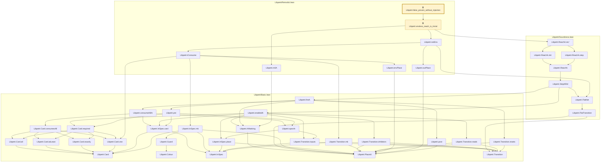
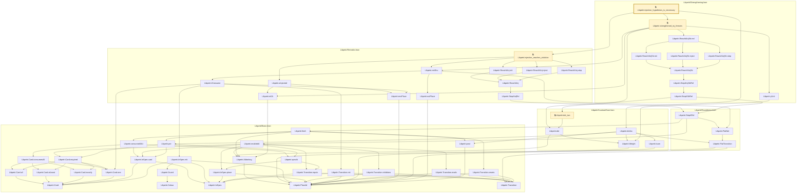
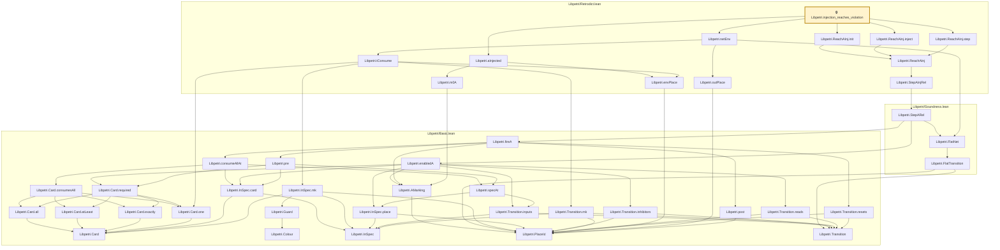
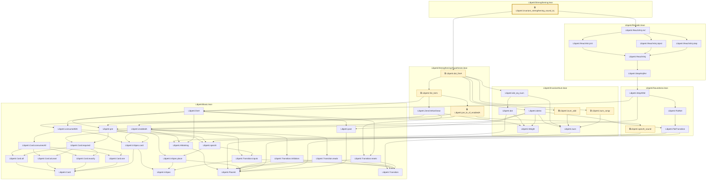
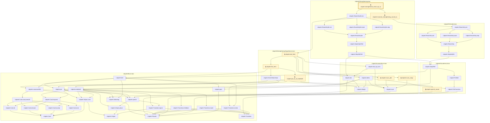

# VER-006

Generated by `scripts/proof-graph.py` from `proof-graph.json`. Do not edit.

Theorems carrying this ID:

- `Libpetri.false_proven_without_injection` (theorem, `Libpetri/Retrodict.lean:51`) 🔒 locked
- `Libpetri.injection_hypothesis_is_necessary` (theorem, `Libpetri/Strengthening.lean:313`) 🔒 locked
- `Libpetri.injection_reaches_violation` (theorem, `Libpetri/Retrodict.lean:111`) 🔒 locked
- `Libpetri.invariant_strengthening_sound_inj` (theorem, `Libpetri/Strengthening.lean:158`) 🔒 locked
- `Libpetri.strengthened_reach_eq_inj` (theorem, `Libpetri/Strengthening.lean:246`) 🔒 locked

> **Note:** the full tree has 74 nodes (limit 60), so it is drawn as one diagram per theorem (5 theorems).

### `Libpetri.false_proven_without_injection`

> Rule: this theorem's whole tree, 41 nodes.

```mermaid
flowchart TD
  subgraph g0["Libpetri/Basic.lean"]
    n0["Libpetri.AMarking"]
    n8["Libpetri.Card"]
    n9["Libpetri.Card.all"]
    n10["Libpetri.Card.atLeast"]
    n11["Libpetri.Card.consumesAll"]
    n12["Libpetri.Card.exactly"]
    n13["Libpetri.Card.one"]
    n14["Libpetri.Card.required"]
    n21["Libpetri.Colour"]
    n74["Libpetri.Guard"]
    n76["Libpetri.InSpec"]
    n77["Libpetri.InSpec.card"]
    n79["Libpetri.InSpec.mk"]
    n80["Libpetri.InSpec.place"]
    n2514["Libpetri.PlaceId"]
    n3949["Libpetri.Transition"]
    n3950["Libpetri.Transition.inhibitors"]
    n3951["Libpetri.Transition.inputs"]
    n3952["Libpetri.Transition.mk"]
    n3955["Libpetri.Transition.reads"]
    n3956["Libpetri.Transition.resets"]
    n4026["Libpetri.consumeAllAt"]
    n4078["Libpetri.enabledA"]
    n4100["Libpetri.fireA"]
    n4196["Libpetri.post"]
    n4201["Libpetri.pre"]
    n4256["Libpetri.specAt"]
  end
  subgraph g1["Libpetri/Retrodict.lean"]
    n4082["Libpetri.envPlace"]
    n4083["🔒 Libpetri.envless_reach_is_trivial"]
    n4097["🔒 Libpetri.false_proven_without_injection"]
    n4161["Libpetri.m0A"]
    n4174["Libpetri.netEnv"]
    n4181["Libpetri.outPlace"]
    n4278["Libpetri.tConsume"]
  end
  subgraph g2["Libpetri/Soundness.lean"]
    n72["Libpetri.FlatNet"]
    n73["Libpetri.FlatTransition"]
    n2662["Libpetri.ReachA"]
    n2663["Libpetri.ReachA.init"]
    n2664["Libpetri.ReachA.rec'"]
    n2665["Libpetri.ReachA.step"]
    n3930["Libpetri.StepARel"]
  end
  n0 --> n2514
  n9 --> n8
  n10 --> n8
  n11 --> n9
  n11 --> n10
  n11 --> n12
  n11 --> n13
  n12 --> n8
  n13 --> n8
  n14 --> n9
  n14 --> n10
  n14 --> n12
  n14 --> n13
  n72 --> n73
  n73 --> n2514
  n73 --> n3949
  n74 --> n21
  n77 --> n8
  n77 --> n76
  n79 --> n8
  n79 --> n74
  n79 --> n76
  n79 --> n2514
  n80 --> n76
  n80 --> n2514
  n2662 --> n3930
  n2663 --> n2662
  n2664 --> n2663
  n2664 --> n2665
  n2665 --> n2662
  n3930 --> n72
  n3930 --> n4078
  n3930 --> n4100
  n3950 --> n2514
  n3950 --> n3949
  n3951 --> n76
  n3951 --> n3949
  n3952 --> n76
  n3952 --> n2514
  n3952 --> n3949
  n3955 --> n2514
  n3955 --> n3949
  n3956 --> n2514
  n3956 --> n3949
  n4026 --> n11
  n4026 --> n77
  n4026 --> n4256
  n4078 --> n0
  n4078 --> n14
  n4078 --> n77
  n4078 --> n80
  n4078 --> n3950
  n4078 --> n3951
  n4078 --> n3955
  n4082 --> n2514
  n4083 --> n2664
  n4083 --> n4161
  n4083 --> n4174
  n4097 --> n4083
  n4100 --> n0
  n4100 --> n3956
  n4100 --> n4026
  n4100 --> n4196
  n4100 --> n4201
  n4161 --> n0
  n4174 --> n72
  n4174 --> n4181
  n4174 --> n4278
  n4181 --> n2514
  n4196 --> n2514
  n4201 --> n14
  n4201 --> n77
  n4201 --> n4256
  n4256 --> n80
  n4256 --> n3951
  n4278 --> n13
  n4278 --> n79
  n4278 --> n3952
  n4278 --> n4082
  classDef root stroke-width:3px
  classDef locked fill:#fff3cd,stroke:#b8860b
  classDef collapsed fill:#eeeeee,stroke-dasharray:4 4
  class n4097 root
  class n4083,n4097 locked
```

### `Libpetri.injection_hypothesis_is_necessary`

> Rule: this theorem's whole tree, 57 nodes.

```mermaid
flowchart TD
  subgraph g0["Libpetri/Basic.lean"]
    n0["Libpetri.AMarking"]
    n8["Libpetri.Card"]
    n9["Libpetri.Card.all"]
    n10["Libpetri.Card.atLeast"]
    n11["Libpetri.Card.consumesAll"]
    n12["Libpetri.Card.exactly"]
    n13["Libpetri.Card.one"]
    n14["Libpetri.Card.required"]
    n21["Libpetri.Colour"]
    n74["Libpetri.Guard"]
    n76["Libpetri.InSpec"]
    n77["Libpetri.InSpec.card"]
    n79["Libpetri.InSpec.mk"]
    n80["Libpetri.InSpec.place"]
    n2514["Libpetri.PlaceId"]
    n3949["Libpetri.Transition"]
    n3950["Libpetri.Transition.inhibitors"]
    n3951["Libpetri.Transition.inputs"]
    n3952["Libpetri.Transition.mk"]
    n3955["Libpetri.Transition.reads"]
    n3956["Libpetri.Transition.resets"]
    n4026["Libpetri.consumeAllAt"]
    n4078["Libpetri.enabledA"]
    n4100["Libpetri.fireA"]
    n4196["Libpetri.post"]
    n4201["Libpetri.pre"]
    n4256["Libpetri.specAt"]
  end
  subgraph g1["Libpetri/InvariantSum.lean"]
    n3966["Libpetri.Weight"]
    n4065["Libpetri.dot"]
    n4066["Libpetri.dotInc"]
    n4070["🔒 Libpetri.dot_two"]
    n4145["Libpetri.isum"]
  end
  subgraph g2["Libpetri/Retrodict.lean"]
    n2666["Libpetri.ReachAInj"]
    n2667["Libpetri.ReachAInj.init"]
    n2668["Libpetri.ReachAInj.inject"]
    n2670["Libpetri.ReachAInj.step"]
    n3927["Libpetri.StepAInjRel"]
    n3970["Libpetri.aInjected"]
    n4082["Libpetri.envPlace"]
    n4124["🔒 Libpetri.injection_reaches_violation"]
    n4161["Libpetri.m0A"]
    n4174["Libpetri.netEnv"]
    n4181["Libpetri.outPlace"]
    n4278["Libpetri.tConsume"]
  end
  subgraph g3["Libpetri/Soundness.lean"]
    n72["Libpetri.FlatNet"]
    n73["Libpetri.FlatTransition"]
    n3930["Libpetri.StepARel"]
  end
  subgraph g4["Libpetri/Strengthening.lean"]
    n2671["Libpetri.ReachAInjStr"]
    n2672["Libpetri.ReachAInjStr.init"]
    n2673["Libpetri.ReachAInjStr.inject"]
    n2674["Libpetri.ReachAInjStr.rec'"]
    n2675["Libpetri.ReachAInjStr.step"]
    n3928["Libpetri.StepAInjStrRel"]
    n3931["Libpetri.StepAStrRel"]
    n4123["🔒 Libpetri.injection_hypothesis_is_necessary"]
    n4266["🔒 Libpetri.strengthened_inj_freezes"]
    n4317["Libpetri.yUnit"]
  end
  n0 --> n2514
  n9 --> n8
  n10 --> n8
  n11 --> n9
  n11 --> n10
  n11 --> n12
  n11 --> n13
  n12 --> n8
  n13 --> n8
  n14 --> n9
  n14 --> n10
  n14 --> n12
  n14 --> n13
  n72 --> n73
  n73 --> n2514
  n73 --> n3949
  n74 --> n21
  n77 --> n8
  n77 --> n76
  n79 --> n8
  n79 --> n74
  n79 --> n76
  n79 --> n2514
  n80 --> n76
  n80 --> n2514
  n2666 --> n3927
  n2667 --> n2666
  n2668 --> n2666
  n2670 --> n2666
  n2671 --> n3928
  n2672 --> n2671
  n2673 --> n2671
  n2674 --> n2672
  n2674 --> n2673
  n2674 --> n2675
  n2675 --> n2671
  n3927 --> n3930
  n3928 --> n3931
  n3930 --> n72
  n3930 --> n4078
  n3930 --> n4100
  n3931 --> n3930
  n3931 --> n4065
  n3950 --> n2514
  n3950 --> n3949
  n3951 --> n76
  n3951 --> n3949
  n3952 --> n76
  n3952 --> n2514
  n3952 --> n3949
  n3955 --> n2514
  n3955 --> n3949
  n3956 --> n2514
  n3956 --> n3949
  n3966 --> n2514
  n3970 --> n4082
  n3970 --> n4161
  n4026 --> n11
  n4026 --> n77
  n4026 --> n4256
  n4065 --> n0
  n4065 --> n3966
  n4066 --> n73
  n4066 --> n3966
  n4066 --> n4145
  n4066 --> n4196
  n4066 --> n4201
  n4070 --> n4065
  n4078 --> n0
  n4078 --> n14
  n4078 --> n77
  n4078 --> n80
  n4078 --> n3950
  n4078 --> n3951
  n4078 --> n3955
  n4082 --> n2514
  n4100 --> n0
  n4100 --> n3956
  n4100 --> n4026
  n4100 --> n4196
  n4100 --> n4201
  n4123 --> n4066
  n4123 --> n4124
  n4123 --> n4266
  n4124 --> n2667
  n4124 --> n2668
  n4124 --> n2670
  n4124 --> n3970
  n4124 --> n4174
  n4145 --> n2514
  n4161 --> n0
  n4174 --> n72
  n4174 --> n4181
  n4174 --> n4278
  n4181 --> n2514
  n4196 --> n2514
  n4201 --> n14
  n4201 --> n77
  n4201 --> n4256
  n4256 --> n80
  n4256 --> n3951
  n4266 --> n2674
  n4266 --> n4070
  n4266 --> n4161
  n4266 --> n4174
  n4266 --> n4317
  n4278 --> n13
  n4278 --> n79
  n4278 --> n3952
  n4278 --> n4082
  n4317 --> n3966
  classDef root stroke-width:3px
  classDef locked fill:#fff3cd,stroke:#b8860b
  classDef collapsed fill:#eeeeee,stroke-dasharray:4 4
  class n4123 root
  class n4070,n4123,n4124,n4266 locked
```

### `Libpetri.injection_reaches_violation`

> Rule: this theorem's whole tree, 42 nodes.

```mermaid
flowchart TD
  subgraph g0["Libpetri/Basic.lean"]
    n0["Libpetri.AMarking"]
    n8["Libpetri.Card"]
    n9["Libpetri.Card.all"]
    n10["Libpetri.Card.atLeast"]
    n11["Libpetri.Card.consumesAll"]
    n12["Libpetri.Card.exactly"]
    n13["Libpetri.Card.one"]
    n14["Libpetri.Card.required"]
    n21["Libpetri.Colour"]
    n74["Libpetri.Guard"]
    n76["Libpetri.InSpec"]
    n77["Libpetri.InSpec.card"]
    n79["Libpetri.InSpec.mk"]
    n80["Libpetri.InSpec.place"]
    n2514["Libpetri.PlaceId"]
    n3949["Libpetri.Transition"]
    n3950["Libpetri.Transition.inhibitors"]
    n3951["Libpetri.Transition.inputs"]
    n3952["Libpetri.Transition.mk"]
    n3955["Libpetri.Transition.reads"]
    n3956["Libpetri.Transition.resets"]
    n4026["Libpetri.consumeAllAt"]
    n4078["Libpetri.enabledA"]
    n4100["Libpetri.fireA"]
    n4196["Libpetri.post"]
    n4201["Libpetri.pre"]
    n4256["Libpetri.specAt"]
  end
  subgraph g1["Libpetri/Retrodict.lean"]
    n2666["Libpetri.ReachAInj"]
    n2667["Libpetri.ReachAInj.init"]
    n2668["Libpetri.ReachAInj.inject"]
    n2670["Libpetri.ReachAInj.step"]
    n3927["Libpetri.StepAInjRel"]
    n3970["Libpetri.aInjected"]
    n4082["Libpetri.envPlace"]
    n4124["🔒 Libpetri.injection_reaches_violation"]
    n4161["Libpetri.m0A"]
    n4174["Libpetri.netEnv"]
    n4181["Libpetri.outPlace"]
    n4278["Libpetri.tConsume"]
  end
  subgraph g2["Libpetri/Soundness.lean"]
    n72["Libpetri.FlatNet"]
    n73["Libpetri.FlatTransition"]
    n3930["Libpetri.StepARel"]
  end
  n0 --> n2514
  n9 --> n8
  n10 --> n8
  n11 --> n9
  n11 --> n10
  n11 --> n12
  n11 --> n13
  n12 --> n8
  n13 --> n8
  n14 --> n9
  n14 --> n10
  n14 --> n12
  n14 --> n13
  n72 --> n73
  n73 --> n2514
  n73 --> n3949
  n74 --> n21
  n77 --> n8
  n77 --> n76
  n79 --> n8
  n79 --> n74
  n79 --> n76
  n79 --> n2514
  n80 --> n76
  n80 --> n2514
  n2666 --> n3927
  n2667 --> n2666
  n2668 --> n2666
  n2670 --> n2666
  n3927 --> n3930
  n3930 --> n72
  n3930 --> n4078
  n3930 --> n4100
  n3950 --> n2514
  n3950 --> n3949
  n3951 --> n76
  n3951 --> n3949
  n3952 --> n76
  n3952 --> n2514
  n3952 --> n3949
  n3955 --> n2514
  n3955 --> n3949
  n3956 --> n2514
  n3956 --> n3949
  n3970 --> n4082
  n3970 --> n4161
  n4026 --> n11
  n4026 --> n77
  n4026 --> n4256
  n4078 --> n0
  n4078 --> n14
  n4078 --> n77
  n4078 --> n80
  n4078 --> n3950
  n4078 --> n3951
  n4078 --> n3955
  n4082 --> n2514
  n4100 --> n0
  n4100 --> n3956
  n4100 --> n4026
  n4100 --> n4196
  n4100 --> n4201
  n4124 --> n2667
  n4124 --> n2668
  n4124 --> n2670
  n4124 --> n3970
  n4124 --> n4174
  n4161 --> n0
  n4174 --> n72
  n4174 --> n4181
  n4174 --> n4278
  n4181 --> n2514
  n4196 --> n2514
  n4201 --> n14
  n4201 --> n77
  n4201 --> n4256
  n4256 --> n80
  n4256 --> n3951
  n4278 --> n13
  n4278 --> n79
  n4278 --> n3952
  n4278 --> n4082
  classDef root stroke-width:3px
  classDef locked fill:#fff3cd,stroke:#b8860b
  classDef collapsed fill:#eeeeee,stroke-dasharray:4 4
  class n4124 root
  class n4124 locked
```

### `Libpetri.invariant_strengthening_sound_inj`

> Rule: this theorem's whole tree, 45 nodes.

```mermaid
flowchart TD
  subgraph g0["Libpetri/Basic.lean"]
    n0["Libpetri.AMarking"]
    n8["Libpetri.Card"]
    n9["Libpetri.Card.all"]
    n10["Libpetri.Card.atLeast"]
    n11["Libpetri.Card.consumesAll"]
    n12["Libpetri.Card.exactly"]
    n13["Libpetri.Card.one"]
    n14["Libpetri.Card.required"]
    n76["Libpetri.InSpec"]
    n77["Libpetri.InSpec.card"]
    n80["Libpetri.InSpec.place"]
    n2514["Libpetri.PlaceId"]
    n3949["Libpetri.Transition"]
    n3950["Libpetri.Transition.inhibitors"]
    n3951["Libpetri.Transition.inputs"]
    n3955["Libpetri.Transition.reads"]
    n3956["Libpetri.Transition.resets"]
    n4026["Libpetri.consumeAllAt"]
    n4078["Libpetri.enabledA"]
    n4100["Libpetri.fireA"]
    n4196["Libpetri.post"]
    n4201["Libpetri.pre"]
    n4256["Libpetri.specAt"]
  end
  subgraph g1["Libpetri/InvariantSum.lean"]
    n3966["Libpetri.Weight"]
    n4065["Libpetri.dot"]
    n4066["Libpetri.dotInc"]
    n4067["Libpetri.dot_eq_isum"]
    n4145["Libpetri.isum"]
    n4146["🔒 Libpetri.isum_add"]
    n4148["🔒 Libpetri.isum_congr"]
  end
  subgraph g2["Libpetri/Retrodict.lean"]
    n2666["Libpetri.ReachAInj"]
    n2667["Libpetri.ReachAInj.init"]
    n2668["Libpetri.ReachAInj.inject"]
    n2669["Libpetri.ReachAInj.rec'"]
    n2670["Libpetri.ReachAInj.step"]
    n3927["Libpetri.StepAInjRel"]
  end
  subgraph g3["Libpetri/Soundness.lean"]
    n72["Libpetri.FlatNet"]
    n73["Libpetri.FlatTransition"]
    n3930["Libpetri.StepARel"]
    n4260["🔒 Libpetri.specAt_sound"]
  end
  subgraph g4["Libpetri/Strengthening.lean"]
    n4143["🔒 Libpetri.invariant_strengthening_sound_inj"]
  end
  subgraph g5["Libpetri/Strengthening/Hypotheses.lean"]
    n3968["Libpetri.ZeroOnNonlinear"]
    n4068["🔒 Libpetri.dot_fireA"]
    n4109["🔒 Libpetri.fire_term"]
    n4206["🔒 Libpetri.pre_le_of_enabledA"]
  end
  n0 --> n2514
  n9 --> n8
  n10 --> n8
  n11 --> n9
  n11 --> n10
  n11 --> n12
  n11 --> n13
  n12 --> n8
  n13 --> n8
  n14 --> n9
  n14 --> n10
  n14 --> n12
  n14 --> n13
  n72 --> n73
  n73 --> n2514
  n73 --> n3949
  n77 --> n8
  n77 --> n76
  n80 --> n76
  n80 --> n2514
  n2666 --> n3927
  n2667 --> n2666
  n2668 --> n2666
  n2669 --> n2667
  n2669 --> n2668
  n2669 --> n2670
  n2670 --> n2666
  n3927 --> n3930
  n3930 --> n72
  n3930 --> n4078
  n3930 --> n4100
  n3950 --> n2514
  n3950 --> n3949
  n3951 --> n76
  n3951 --> n3949
  n3955 --> n2514
  n3955 --> n3949
  n3956 --> n2514
  n3956 --> n3949
  n3966 --> n2514
  n3968 --> n3956
  n3968 --> n3966
  n3968 --> n4026
  n4026 --> n11
  n4026 --> n77
  n4026 --> n4256
  n4065 --> n0
  n4065 --> n3966
  n4066 --> n73
  n4066 --> n3966
  n4066 --> n4145
  n4066 --> n4196
  n4066 --> n4201
  n4067 --> n4065
  n4067 --> n4145
  n4068 --> n4066
  n4068 --> n4067
  n4068 --> n4109
  n4068 --> n4146
  n4068 --> n4148
  n4078 --> n0
  n4078 --> n14
  n4078 --> n77
  n4078 --> n80
  n4078 --> n3950
  n4078 --> n3951
  n4078 --> n3955
  n4100 --> n0
  n4100 --> n3956
  n4100 --> n4026
  n4100 --> n4196
  n4100 --> n4201
  n4109 --> n3968
  n4109 --> n4100
  n4109 --> n4206
  n4143 --> n2669
  n4143 --> n4068
  n4145 --> n2514
  n4146 --> n4145
  n4148 --> n4145
  n4196 --> n2514
  n4201 --> n14
  n4201 --> n77
  n4201 --> n4256
  n4206 --> n4078
  n4206 --> n4201
  n4206 --> n4260
  n4256 --> n80
  n4256 --> n3951
  n4260 --> n4256
  classDef root stroke-width:3px
  classDef locked fill:#fff3cd,stroke:#b8860b
  classDef collapsed fill:#eeeeee,stroke-dasharray:4 4
  class n4143 root
  class n4068,n4109,n4143,n4146,n4148,n4206,n4260 locked
```

### `Libpetri.strengthened_reach_eq_inj`

> Rule: this theorem's whole tree, 53 nodes.

```mermaid
flowchart TD
  subgraph g0["Libpetri/Basic.lean"]
    n0["Libpetri.AMarking"]
    n8["Libpetri.Card"]
    n9["Libpetri.Card.all"]
    n10["Libpetri.Card.atLeast"]
    n11["Libpetri.Card.consumesAll"]
    n12["Libpetri.Card.exactly"]
    n13["Libpetri.Card.one"]
    n14["Libpetri.Card.required"]
    n76["Libpetri.InSpec"]
    n77["Libpetri.InSpec.card"]
    n80["Libpetri.InSpec.place"]
    n2514["Libpetri.PlaceId"]
    n3949["Libpetri.Transition"]
    n3950["Libpetri.Transition.inhibitors"]
    n3951["Libpetri.Transition.inputs"]
    n3955["Libpetri.Transition.reads"]
    n3956["Libpetri.Transition.resets"]
    n4026["Libpetri.consumeAllAt"]
    n4078["Libpetri.enabledA"]
    n4100["Libpetri.fireA"]
    n4196["Libpetri.post"]
    n4201["Libpetri.pre"]
    n4256["Libpetri.specAt"]
  end
  subgraph g1["Libpetri/InvariantSum.lean"]
    n3966["Libpetri.Weight"]
    n4065["Libpetri.dot"]
    n4066["Libpetri.dotInc"]
    n4067["Libpetri.dot_eq_isum"]
    n4145["Libpetri.isum"]
    n4146["🔒 Libpetri.isum_add"]
    n4148["🔒 Libpetri.isum_congr"]
  end
  subgraph g2["Libpetri/Retrodict.lean"]
    n2666["Libpetri.ReachAInj"]
    n2667["Libpetri.ReachAInj.init"]
    n2668["Libpetri.ReachAInj.inject"]
    n2669["Libpetri.ReachAInj.rec'"]
    n2670["Libpetri.ReachAInj.step"]
    n3927["Libpetri.StepAInjRel"]
  end
  subgraph g3["Libpetri/Soundness.lean"]
    n72["Libpetri.FlatNet"]
    n73["Libpetri.FlatTransition"]
    n3930["Libpetri.StepARel"]
    n4260["🔒 Libpetri.specAt_sound"]
  end
  subgraph g4["Libpetri/Strengthening.lean"]
    n2671["Libpetri.ReachAInjStr"]
    n2672["Libpetri.ReachAInjStr.init"]
    n2673["Libpetri.ReachAInjStr.inject"]
    n2674["Libpetri.ReachAInjStr.rec'"]
    n2675["Libpetri.ReachAInjStr.step"]
    n3928["Libpetri.StepAInjStrRel"]
    n3931["Libpetri.StepAStrRel"]
    n4143["🔒 Libpetri.invariant_strengthening_sound_inj"]
    n4268["🔒 Libpetri.strengthened_reach_eq_inj"]
  end
  subgraph g5["Libpetri/Strengthening/Hypotheses.lean"]
    n3968["Libpetri.ZeroOnNonlinear"]
    n4068["🔒 Libpetri.dot_fireA"]
    n4109["🔒 Libpetri.fire_term"]
    n4206["🔒 Libpetri.pre_le_of_enabledA"]
  end
  n0 --> n2514
  n9 --> n8
  n10 --> n8
  n11 --> n9
  n11 --> n10
  n11 --> n12
  n11 --> n13
  n12 --> n8
  n13 --> n8
  n14 --> n9
  n14 --> n10
  n14 --> n12
  n14 --> n13
  n72 --> n73
  n73 --> n2514
  n73 --> n3949
  n77 --> n8
  n77 --> n76
  n80 --> n76
  n80 --> n2514
  n2666 --> n3927
  n2667 --> n2666
  n2668 --> n2666
  n2669 --> n2667
  n2669 --> n2668
  n2669 --> n2670
  n2670 --> n2666
  n2671 --> n3928
  n2672 --> n2671
  n2673 --> n2671
  n2674 --> n2672
  n2674 --> n2673
  n2674 --> n2675
  n2675 --> n2671
  n3927 --> n3930
  n3928 --> n3931
  n3930 --> n72
  n3930 --> n4078
  n3930 --> n4100
  n3931 --> n3930
  n3931 --> n4065
  n3950 --> n2514
  n3950 --> n3949
  n3951 --> n76
  n3951 --> n3949
  n3955 --> n2514
  n3955 --> n3949
  n3956 --> n2514
  n3956 --> n3949
  n3966 --> n2514
  n3968 --> n3956
  n3968 --> n3966
  n3968 --> n4026
  n4026 --> n11
  n4026 --> n77
  n4026 --> n4256
  n4065 --> n0
  n4065 --> n3966
  n4066 --> n73
  n4066 --> n3966
  n4066 --> n4145
  n4066 --> n4196
  n4066 --> n4201
  n4067 --> n4065
  n4067 --> n4145
  n4068 --> n4066
  n4068 --> n4067
  n4068 --> n4109
  n4068 --> n4146
  n4068 --> n4148
  n4078 --> n0
  n4078 --> n14
  n4078 --> n77
  n4078 --> n80
  n4078 --> n3950
  n4078 --> n3951
  n4078 --> n3955
  n4100 --> n0
  n4100 --> n3956
  n4100 --> n4026
  n4100 --> n4196
  n4100 --> n4201
  n4109 --> n3968
  n4109 --> n4100
  n4109 --> n4206
  n4143 --> n2669
  n4143 --> n4068
  n4145 --> n2514
  n4146 --> n4145
  n4148 --> n4145
  n4196 --> n2514
  n4201 --> n14
  n4201 --> n77
  n4201 --> n4256
  n4206 --> n4078
  n4206 --> n4201
  n4206 --> n4260
  n4256 --> n80
  n4256 --> n3951
  n4260 --> n4256
  n4268 --> n2674
  n4268 --> n4143
  classDef root stroke-width:3px
  classDef locked fill:#fff3cd,stroke:#b8860b
  classDef collapsed fill:#eeeeee,stroke-dasharray:4 4
  class n4268 root
  class n4068,n4109,n4143,n4146,n4148,n4206,n4260,n4268 locked
```

Axioms used:

- `Libpetri.false_proven_without_injection`: `propext`
- `Libpetri.injection_hypothesis_is_necessary`: `Classical.choice`, `Quot.sound`, `propext`
- `Libpetri.injection_reaches_violation`: `propext`
- `Libpetri.invariant_strengthening_sound_inj`: `Classical.choice`, `Quot.sound`, `propext`
- `Libpetri.strengthened_reach_eq_inj`: `Classical.choice`, `Quot.sound`, `propext`
