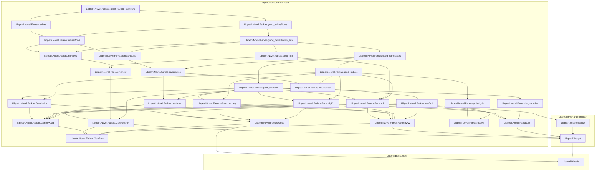

# VER-007

Generated by `scripts/proof-graph.py` from `proof-graph.json`. Do not edit.

Theorems carrying this ID:

- `Libpetri.Novel.Farkas.farkas_output_semiflow` (theorem, `Libpetri/Novel/Farkas.lean:289`)
- `Libpetri.Novel.Farkas.farkas_output_sound` (theorem, `Libpetri/Novel/Farkas.lean:334`)
- `Libpetri.semiflow_gate_is_necessary` (theorem, `Libpetri/Semiflow.lean:266`) 🔒 locked
- `Libpetri.semiflow_union_sound` (theorem, `Libpetri/Semiflow.lean:138`) 🔒 locked
- `Libpetri.semiflow_union_sound_inj` (theorem, `Libpetri/Semiflow.lean:243`) 🔒 locked
- `Libpetri.strengthening_monotone` (theorem, `Libpetri/Semiflow.lean:154`) 🔒 locked

> **Note:** the full tree has 131 nodes (limit 60), so it is drawn as one diagram per theorem (6 theorems).

### `Libpetri.Novel.Farkas.farkas_output_semiflow`

> Rule: this theorem's whole tree, 32 nodes.

### `Libpetri.Novel.Farkas.farkas_output_sound`

> Rule: this theorem's tree has 81 nodes (limit 60); every file other than its own is collapsed into one node, leaving 41.

```mermaid
flowchart TD
  subgraph g0["Libpetri/Novel/Farkas.lean"]
    n229["Libpetri.Novel.Farkas.GenRow"]
    n230["Libpetri.Novel.Farkas.GenRow.mk"]
    n231["Libpetri.Novel.Farkas.GenRow.sig"]
    n232["Libpetri.Novel.Farkas.GenRow.w"]
    n233["Libpetri.Novel.Farkas.Good"]
    n234["Libpetri.Novel.Farkas.Good.elim"]
    n235["Libpetri.Novel.Farkas.Good.mk"]
    n236["Libpetri.Novel.Farkas.Good.nonneg"]
    n237["Libpetri.Novel.Farkas.Good.sigEq"]
    n238["Libpetri.Novel.Farkas.candidates"]
    n239["Libpetri.Novel.Farkas.certificate_sound"]
    n240["Libpetri.Novel.Farkas.combine"]
    n241["Libpetri.Novel.Farkas.dotInc_eq_lin"]
    n242["Libpetri.Novel.Farkas.dotInc_zero_of_lin"]
    n243["Libpetri.Novel.Farkas.farkas"]
    n244["Libpetri.Novel.Farkas.farkasRound"]
    n245["Libpetri.Novel.Farkas.farkasRows"]
    n247["Libpetri.Novel.Farkas.farkas_output_semiflow"]
    n248["Libpetri.Novel.Farkas.farkas_output_sound"]
    n249["Libpetri.Novel.Farkas.gcdAll"]
    n250["Libpetri.Novel.Farkas.gcdAll_dvd"]
    n251["Libpetri.Novel.Farkas.good_candidates"]
    n252["Libpetri.Novel.Farkas.good_combine"]
    n253["Libpetri.Novel.Farkas.good_farkasRows"]
    n254["Libpetri.Novel.Farkas.good_farkasRows_aux"]
    n255["Libpetri.Novel.Farkas.good_init"]
    n256["Libpetri.Novel.Farkas.good_reduce"]
    n257["Libpetri.Novel.Farkas.initRow"]
    n258["Libpetri.Novel.Farkas.initRows"]
    n259["Libpetri.Novel.Farkas.isum_eq_sum"]
    n261["Libpetri.Novel.Farkas.lin"]
    n262["Libpetri.Novel.Farkas.lin_combine"]
    n263["Libpetri.Novel.Farkas.netFarkas"]
    n264["Libpetri.Novel.Farkas.reduceGcd"]
    n265["Libpetri.Novel.Farkas.rowGcd"]
  end
  c0["📁 Libpetri/Basic.lean (23 declarations, collapsed)"]
  c6["📁 Libpetri/InvariantSum.lean (9 declarations, collapsed)"]
  c30["📁 Libpetri/Soundness.lean (8 declarations, collapsed)"]
  c31["📁 Libpetri/StateEquation.lean (1 declarations, collapsed)"]
  c32["📁 Libpetri/Strengthening.lean (1 declarations, collapsed)"]
  c33["📁 Libpetri/Strengthening/Hypotheses.lean (4 declarations, collapsed)"]
  c6 --> c30
  c30 --> c0
  c31 --> c30
  c32 --> c33
  c33 --> c6
  n230 --> c6
  n230 --> n229
  n231 --> n229
  n232 --> c6
  n232 --> n229
  n233 --> c0
  n233 --> n229
  n234 --> n231
  n234 --> n233
  n235 --> n231
  n235 --> n232
  n235 --> n233
  n235 --> n261
  n236 --> n232
  n236 --> n233
  n237 --> n231
  n237 --> n232
  n237 --> n233
  n237 --> n261
  n238 --> n240
  n238 --> n264
  n239 --> c32
  n239 --> n242
  n240 --> n230
  n240 --> n231
  n240 --> n232
  n241 --> c31
  n241 --> n259
  n241 --> n261
  n242 --> n241
  n243 --> n245
  n244 --> n238
  n245 --> n244
  n245 --> n258
  n247 --> n243
  n247 --> n253
  n248 --> n239
  n248 --> n247
  n248 --> n263
  n250 --> n249
  n251 --> n238
  n251 --> n252
  n251 --> n256
  n252 --> n234
  n252 --> n235
  n252 --> n236
  n252 --> n237
  n252 --> n240
  n252 --> n262
  n253 --> n245
  n253 --> n254
  n254 --> n244
  n254 --> n251
  n254 --> n255
  n254 --> n258
  n255 --> n235
  n255 --> n257
  n256 --> n234
  n256 --> n235
  n256 --> n236
  n256 --> n237
  n256 --> n250
  n256 --> n264
  n257 --> n230
  n258 --> n257
  n259 --> c6
  n261 --> c6
  n262 --> n261
  n263 --> c31
  n263 --> n243
  n264 --> n230
  n264 --> n265
  n265 --> n231
  n265 --> n232
  n265 --> n249
  classDef root stroke-width:3px
  classDef locked fill:#fff3cd,stroke:#b8860b
  classDef collapsed fill:#eeeeee,stroke-dasharray:4 4
  class n248 root
  class c0,c6,c30,c31,c32,c33 collapsed
```

### `Libpetri.semiflow_gate_is_necessary`

> Rule: this theorem's whole tree, 52 nodes.

```mermaid
flowchart TD
  subgraph g0["Libpetri/Basic.lean"]
    n0["Libpetri.AMarking"]
    n8["Libpetri.Card"]
    n9["Libpetri.Card.all"]
    n10["Libpetri.Card.atLeast"]
    n11["Libpetri.Card.consumesAll"]
    n12["Libpetri.Card.exactly"]
    n13["Libpetri.Card.one"]
    n14["Libpetri.Card.required"]
    n21["Libpetri.Colour"]
    n74["Libpetri.Guard"]
    n76["Libpetri.InSpec"]
    n77["Libpetri.InSpec.card"]
    n79["Libpetri.InSpec.mk"]
    n80["Libpetri.InSpec.place"]
    n2374["Libpetri.PlaceId"]
    n2605["Libpetri.Transition"]
    n2606["Libpetri.Transition.inhibitors"]
    n2607["Libpetri.Transition.inputs"]
    n2608["Libpetri.Transition.mk"]
    n2611["Libpetri.Transition.reads"]
    n2612["Libpetri.Transition.resets"]
    n2682["Libpetri.consumeAllAt"]
    n2734["Libpetri.enabledA"]
    n2756["Libpetri.fireA"]
    n2852["Libpetri.post"]
    n2857["Libpetri.pre"]
    n2912["Libpetri.specAt"]
  end
  subgraph g1["Libpetri/InvariantSum.lean"]
    n2622["Libpetri.Weight"]
    n2721["Libpetri.dot"]
    n2722["Libpetri.dotInc"]
    n2726["🔒 Libpetri.dot_two"]
    n2801["Libpetri.isum"]
  end
  subgraph g2["Libpetri/Semiflow.lean"]
    n2908["🔒 Libpetri.semiflow_gate_is_necessary"]
    n2974["🔒 Libpetri.yUnit_nonneg"]
  end
  subgraph g3["Libpetri/Soundness.lean"]
    n72["Libpetri.FlatNet"]
    n73["Libpetri.FlatTransition"]
    n2522["Libpetri.ReachA"]
    n2523["Libpetri.ReachA.init"]
    n2525["Libpetri.ReachA.step"]
    n2586["Libpetri.StepARel"]
  end
  subgraph g4["Libpetri/Strengthening.lean"]
    n2541["Libpetri.ReachAStr"]
    n2542["Libpetri.ReachAStr.init"]
    n2543["Libpetri.ReachAStr.rec'"]
    n2544["Libpetri.ReachAStr.step"]
    n2587["Libpetri.StepAStrRel"]
    n2625["Libpetri.a0All"]
    n2692["🔒 Libpetri.consume_all_hypothesis_is_necessary"]
    n2693["🔒 Libpetri.consume_all_reaches_violation"]
    n2829["Libpetri.netAll"]
    n2921["🔒 Libpetri.strengthened_all_freezes"]
    n2933["Libpetri.tAll"]
    n2973["Libpetri.yUnit"]
  end
  n0 --> n2374
  n9 --> n8
  n10 --> n8
  n11 --> n9
  n11 --> n10
  n11 --> n12
  n11 --> n13
  n12 --> n8
  n13 --> n8
  n14 --> n9
  n14 --> n10
  n14 --> n12
  n14 --> n13
  n72 --> n73
  n73 --> n2374
  n73 --> n2605
  n74 --> n21
  n77 --> n8
  n77 --> n76
  n79 --> n8
  n79 --> n74
  n79 --> n76
  n79 --> n2374
  n80 --> n76
  n80 --> n2374
  n2522 --> n2586
  n2523 --> n2522
  n2525 --> n2522
  n2541 --> n2587
  n2542 --> n2541
  n2543 --> n2542
  n2543 --> n2544
  n2544 --> n2541
  n2586 --> n72
  n2586 --> n2734
  n2586 --> n2756
  n2587 --> n2586
  n2587 --> n2721
  n2606 --> n2374
  n2606 --> n2605
  n2607 --> n76
  n2607 --> n2605
  n2608 --> n76
  n2608 --> n2374
  n2608 --> n2605
  n2611 --> n2374
  n2611 --> n2605
  n2612 --> n2374
  n2612 --> n2605
  n2622 --> n2374
  n2625 --> n0
  n2682 --> n11
  n2682 --> n77
  n2682 --> n2912
  n2692 --> n2693
  n2692 --> n2722
  n2692 --> n2921
  n2693 --> n2523
  n2693 --> n2525
  n2693 --> n2625
  n2693 --> n2829
  n2721 --> n0
  n2721 --> n2622
  n2722 --> n73
  n2722 --> n2622
  n2722 --> n2801
  n2722 --> n2852
  n2722 --> n2857
  n2726 --> n2721
  n2734 --> n0
  n2734 --> n14
  n2734 --> n77
  n2734 --> n80
  n2734 --> n2606
  n2734 --> n2607
  n2734 --> n2611
  n2756 --> n0
  n2756 --> n2612
  n2756 --> n2682
  n2756 --> n2852
  n2756 --> n2857
  n2801 --> n2374
  n2829 --> n72
  n2829 --> n2933
  n2852 --> n2374
  n2857 --> n14
  n2857 --> n77
  n2857 --> n2912
  n2908 --> n2692
  n2908 --> n2974
  n2912 --> n80
  n2912 --> n2607
  n2921 --> n2543
  n2921 --> n2625
  n2921 --> n2726
  n2921 --> n2829
  n2921 --> n2973
  n2933 --> n9
  n2933 --> n79
  n2933 --> n2608
  n2973 --> n2622
  n2974 --> n2973
  classDef root stroke-width:3px
  classDef locked fill:#fff3cd,stroke:#b8860b
  classDef collapsed fill:#eeeeee,stroke-dasharray:4 4
  class n2908 root
  class n2692,n2693,n2726,n2908,n2921,n2974 locked
```

### `Libpetri.semiflow_union_sound`

> Rule: this theorem's whole tree, 55 nodes.

```mermaid
flowchart TD
  subgraph g0["Libpetri/Basic.lean"]
    n0["Libpetri.AMarking"]
    n8["Libpetri.Card"]
    n9["Libpetri.Card.all"]
    n10["Libpetri.Card.atLeast"]
    n11["Libpetri.Card.consumesAll"]
    n12["Libpetri.Card.exactly"]
    n13["Libpetri.Card.one"]
    n14["Libpetri.Card.required"]
    n76["Libpetri.InSpec"]
    n77["Libpetri.InSpec.card"]
    n80["Libpetri.InSpec.place"]
    n2374["Libpetri.PlaceId"]
    n2605["Libpetri.Transition"]
    n2606["Libpetri.Transition.inhibitors"]
    n2607["Libpetri.Transition.inputs"]
    n2611["Libpetri.Transition.reads"]
    n2612["Libpetri.Transition.resets"]
    n2682["Libpetri.consumeAllAt"]
    n2734["Libpetri.enabledA"]
    n2756["Libpetri.fireA"]
    n2852["Libpetri.post"]
    n2857["Libpetri.pre"]
    n2912["Libpetri.specAt"]
  end
  subgraph g1["Libpetri/InvariantSum.lean"]
    n2622["Libpetri.Weight"]
    n2721["Libpetri.dot"]
    n2722["Libpetri.dotInc"]
    n2723["Libpetri.dot_eq_isum"]
    n2801["Libpetri.isum"]
    n2802["🔒 Libpetri.isum_add"]
    n2804["🔒 Libpetri.isum_congr"]
  end
  subgraph g2["Libpetri/Semiflow.lean"]
    n2545["Libpetri.ReachAStrs"]
    n2546["Libpetri.ReachAStrs.init"]
    n2547["Libpetri.ReachAStrs.rec'"]
    n2548["Libpetri.ReachAStrs.step"]
    n2579["Libpetri.Semiflow"]
    n2582["Libpetri.Semiflow.toValidLaw"]
    n2588["Libpetri.StepAStrsRel"]
    n2614["Libpetri.ValidLaw"]
    n2615["Libpetri.ValidLaw.h1"]
    n2616["Libpetri.ValidLaw.h2"]
    n2909["🔒 Libpetri.semiflow_union_sound"]
    n2925["🔒 Libpetri.strengthened_reach_eq_list"]
  end
  subgraph g3["Libpetri/Soundness.lean"]
    n72["Libpetri.FlatNet"]
    n73["Libpetri.FlatTransition"]
    n2522["Libpetri.ReachA"]
    n2523["Libpetri.ReachA.init"]
    n2524["Libpetri.ReachA.rec'"]
    n2525["Libpetri.ReachA.step"]
    n2586["Libpetri.StepARel"]
    n2916["🔒 Libpetri.specAt_sound"]
  end
  subgraph g4["Libpetri/Strengthening.lean"]
    n2798["🔒 Libpetri.invariant_strengthening_sound"]
  end
  subgraph g5["Libpetri/Strengthening/Hypotheses.lean"]
    n2624["Libpetri.ZeroOnNonlinear"]
    n2724["🔒 Libpetri.dot_fireA"]
    n2765["🔒 Libpetri.fire_term"]
    n2862["🔒 Libpetri.pre_le_of_enabledA"]
  end
  n0 --> n2374
  n9 --> n8
  n10 --> n8
  n11 --> n9
  n11 --> n10
  n11 --> n12
  n11 --> n13
  n12 --> n8
  n13 --> n8
  n14 --> n9
  n14 --> n10
  n14 --> n12
  n14 --> n13
  n72 --> n73
  n73 --> n2374
  n73 --> n2605
  n77 --> n8
  n77 --> n76
  n80 --> n76
  n80 --> n2374
  n2522 --> n2586
  n2523 --> n2522
  n2524 --> n2523
  n2524 --> n2525
  n2525 --> n2522
  n2545 --> n2588
  n2546 --> n2545
  n2547 --> n2546
  n2547 --> n2548
  n2548 --> n2545
  n2579 --> n72
  n2579 --> n2622
  n2582 --> n2579
  n2582 --> n2614
  n2586 --> n72
  n2586 --> n2734
  n2586 --> n2756
  n2588 --> n2586
  n2588 --> n2721
  n2606 --> n2374
  n2606 --> n2605
  n2607 --> n76
  n2607 --> n2605
  n2611 --> n2374
  n2611 --> n2605
  n2612 --> n2374
  n2612 --> n2605
  n2614 --> n72
  n2614 --> n2622
  n2615 --> n2614
  n2615 --> n2624
  n2616 --> n2614
  n2616 --> n2722
  n2622 --> n2374
  n2624 --> n2612
  n2624 --> n2622
  n2624 --> n2682
  n2682 --> n11
  n2682 --> n77
  n2682 --> n2912
  n2721 --> n0
  n2721 --> n2622
  n2722 --> n73
  n2722 --> n2622
  n2722 --> n2801
  n2722 --> n2852
  n2722 --> n2857
  n2723 --> n2721
  n2723 --> n2801
  n2724 --> n2722
  n2724 --> n2723
  n2724 --> n2765
  n2724 --> n2802
  n2724 --> n2804
  n2734 --> n0
  n2734 --> n14
  n2734 --> n77
  n2734 --> n80
  n2734 --> n2606
  n2734 --> n2607
  n2734 --> n2611
  n2756 --> n0
  n2756 --> n2612
  n2756 --> n2682
  n2756 --> n2852
  n2756 --> n2857
  n2765 --> n2624
  n2765 --> n2756
  n2765 --> n2862
  n2798 --> n2524
  n2798 --> n2724
  n2801 --> n2374
  n2802 --> n2801
  n2804 --> n2801
  n2852 --> n2374
  n2857 --> n14
  n2857 --> n77
  n2857 --> n2912
  n2862 --> n2734
  n2862 --> n2857
  n2862 --> n2916
  n2909 --> n2582
  n2909 --> n2925
  n2912 --> n80
  n2912 --> n2607
  n2916 --> n2912
  n2925 --> n2547
  n2925 --> n2615
  n2925 --> n2616
  n2925 --> n2798
  classDef root stroke-width:3px
  classDef locked fill:#fff3cd,stroke:#b8860b
  classDef collapsed fill:#eeeeee,stroke-dasharray:4 4
  class n2909 root
  class n2724,n2765,n2798,n2802,n2804,n2862,n2909,n2916,n2925 locked
```

### `Libpetri.semiflow_union_sound_inj`

> Rule: this theorem's whole tree, 60 nodes.

```mermaid
flowchart TD
  subgraph g0["Libpetri/Basic.lean"]
    n0["Libpetri.AMarking"]
    n8["Libpetri.Card"]
    n9["Libpetri.Card.all"]
    n10["Libpetri.Card.atLeast"]
    n11["Libpetri.Card.consumesAll"]
    n12["Libpetri.Card.exactly"]
    n13["Libpetri.Card.one"]
    n14["Libpetri.Card.required"]
    n76["Libpetri.InSpec"]
    n77["Libpetri.InSpec.card"]
    n80["Libpetri.InSpec.place"]
    n2374["Libpetri.PlaceId"]
    n2605["Libpetri.Transition"]
    n2606["Libpetri.Transition.inhibitors"]
    n2607["Libpetri.Transition.inputs"]
    n2611["Libpetri.Transition.reads"]
    n2612["Libpetri.Transition.resets"]
    n2682["Libpetri.consumeAllAt"]
    n2734["Libpetri.enabledA"]
    n2756["Libpetri.fireA"]
    n2852["Libpetri.post"]
    n2857["Libpetri.pre"]
    n2912["Libpetri.specAt"]
  end
  subgraph g1["Libpetri/InvariantSum.lean"]
    n2622["Libpetri.Weight"]
    n2721["Libpetri.dot"]
    n2722["Libpetri.dotInc"]
    n2723["Libpetri.dot_eq_isum"]
    n2801["Libpetri.isum"]
    n2802["🔒 Libpetri.isum_add"]
    n2804["🔒 Libpetri.isum_congr"]
  end
  subgraph g2["Libpetri/Retrodict.lean"]
    n2526["Libpetri.ReachAInj"]
    n2527["Libpetri.ReachAInj.init"]
    n2528["Libpetri.ReachAInj.inject"]
    n2529["Libpetri.ReachAInj.rec'"]
    n2530["Libpetri.ReachAInj.step"]
    n2583["Libpetri.StepAInjRel"]
  end
  subgraph g3["Libpetri/Semiflow.lean"]
    n2536["Libpetri.ReachAInjStrs"]
    n2537["Libpetri.ReachAInjStrs.init"]
    n2538["Libpetri.ReachAInjStrs.inject"]
    n2539["Libpetri.ReachAInjStrs.rec'"]
    n2540["Libpetri.ReachAInjStrs.step"]
    n2585["Libpetri.StepAInjStrsRel"]
    n2588["Libpetri.StepAStrsRel"]
    n2614["Libpetri.ValidLaw"]
    n2615["Libpetri.ValidLaw.h1"]
    n2616["Libpetri.ValidLaw.h2"]
    n2618["Libpetri.ValidLawInj"]
    n2619["Libpetri.ValidLawInj.h3"]
    n2621["Libpetri.ValidLawInj.toValidLaw"]
    n2910["🔒 Libpetri.semiflow_union_sound_inj"]
    n2926["🔒 Libpetri.strengthened_reach_eq_list_inj"]
  end
  subgraph g4["Libpetri/Soundness.lean"]
    n72["Libpetri.FlatNet"]
    n73["Libpetri.FlatTransition"]
    n2586["Libpetri.StepARel"]
    n2916["🔒 Libpetri.specAt_sound"]
  end
  subgraph g5["Libpetri/Strengthening.lean"]
    n2799["🔒 Libpetri.invariant_strengthening_sound_inj"]
  end
  subgraph g6["Libpetri/Strengthening/Hypotheses.lean"]
    n2624["Libpetri.ZeroOnNonlinear"]
    n2724["🔒 Libpetri.dot_fireA"]
    n2765["🔒 Libpetri.fire_term"]
    n2862["🔒 Libpetri.pre_le_of_enabledA"]
  end
  n0 --> n2374
  n9 --> n8
  n10 --> n8
  n11 --> n9
  n11 --> n10
  n11 --> n12
  n11 --> n13
  n12 --> n8
  n13 --> n8
  n14 --> n9
  n14 --> n10
  n14 --> n12
  n14 --> n13
  n72 --> n73
  n73 --> n2374
  n73 --> n2605
  n77 --> n8
  n77 --> n76
  n80 --> n76
  n80 --> n2374
  n2526 --> n2583
  n2527 --> n2526
  n2528 --> n2526
  n2529 --> n2527
  n2529 --> n2528
  n2529 --> n2530
  n2530 --> n2526
  n2536 --> n2585
  n2537 --> n2536
  n2538 --> n2536
  n2539 --> n2537
  n2539 --> n2538
  n2539 --> n2540
  n2540 --> n2536
  n2583 --> n2586
  n2585 --> n2588
  n2586 --> n72
  n2586 --> n2734
  n2586 --> n2756
  n2588 --> n2586
  n2588 --> n2721
  n2606 --> n2374
  n2606 --> n2605
  n2607 --> n76
  n2607 --> n2605
  n2611 --> n2374
  n2611 --> n2605
  n2612 --> n2374
  n2612 --> n2605
  n2614 --> n72
  n2614 --> n2622
  n2615 --> n2614
  n2615 --> n2624
  n2616 --> n2614
  n2616 --> n2722
  n2618 --> n72
  n2618 --> n2622
  n2619 --> n2618
  n2621 --> n2614
  n2621 --> n2618
  n2622 --> n2374
  n2624 --> n2612
  n2624 --> n2622
  n2624 --> n2682
  n2682 --> n11
  n2682 --> n77
  n2682 --> n2912
  n2721 --> n0
  n2721 --> n2622
  n2722 --> n73
  n2722 --> n2622
  n2722 --> n2801
  n2722 --> n2852
  n2722 --> n2857
  n2723 --> n2721
  n2723 --> n2801
  n2724 --> n2722
  n2724 --> n2723
  n2724 --> n2765
  n2724 --> n2802
  n2724 --> n2804
  n2734 --> n0
  n2734 --> n14
  n2734 --> n77
  n2734 --> n80
  n2734 --> n2606
  n2734 --> n2607
  n2734 --> n2611
  n2756 --> n0
  n2756 --> n2612
  n2756 --> n2682
  n2756 --> n2852
  n2756 --> n2857
  n2765 --> n2624
  n2765 --> n2756
  n2765 --> n2862
  n2799 --> n2529
  n2799 --> n2724
  n2801 --> n2374
  n2802 --> n2801
  n2804 --> n2801
  n2852 --> n2374
  n2857 --> n14
  n2857 --> n77
  n2857 --> n2912
  n2862 --> n2734
  n2862 --> n2857
  n2862 --> n2916
  n2910 --> n2926
  n2912 --> n80
  n2912 --> n2607
  n2916 --> n2912
  n2926 --> n2539
  n2926 --> n2615
  n2926 --> n2616
  n2926 --> n2619
  n2926 --> n2621
  n2926 --> n2799
  classDef root stroke-width:3px
  classDef locked fill:#fff3cd,stroke:#b8860b
  classDef collapsed fill:#eeeeee,stroke-dasharray:4 4
  class n2910 root
  class n2724,n2765,n2799,n2802,n2804,n2862,n2910,n2916,n2926 locked
```

### `Libpetri.strengthening_monotone`

> Rule: this theorem's whole tree, 53 nodes.

```mermaid
flowchart TD
  subgraph g0["Libpetri/Basic.lean"]
    n0["Libpetri.AMarking"]
    n8["Libpetri.Card"]
    n9["Libpetri.Card.all"]
    n10["Libpetri.Card.atLeast"]
    n11["Libpetri.Card.consumesAll"]
    n12["Libpetri.Card.exactly"]
    n13["Libpetri.Card.one"]
    n14["Libpetri.Card.required"]
    n76["Libpetri.InSpec"]
    n77["Libpetri.InSpec.card"]
    n80["Libpetri.InSpec.place"]
    n2374["Libpetri.PlaceId"]
    n2605["Libpetri.Transition"]
    n2606["Libpetri.Transition.inhibitors"]
    n2607["Libpetri.Transition.inputs"]
    n2611["Libpetri.Transition.reads"]
    n2612["Libpetri.Transition.resets"]
    n2682["Libpetri.consumeAllAt"]
    n2734["Libpetri.enabledA"]
    n2756["Libpetri.fireA"]
    n2852["Libpetri.post"]
    n2857["Libpetri.pre"]
    n2912["Libpetri.specAt"]
  end
  subgraph g1["Libpetri/InvariantSum.lean"]
    n2622["Libpetri.Weight"]
    n2721["Libpetri.dot"]
    n2722["Libpetri.dotInc"]
    n2723["Libpetri.dot_eq_isum"]
    n2801["Libpetri.isum"]
    n2802["🔒 Libpetri.isum_add"]
    n2804["🔒 Libpetri.isum_congr"]
  end
  subgraph g2["Libpetri/Semiflow.lean"]
    n2545["Libpetri.ReachAStrs"]
    n2546["Libpetri.ReachAStrs.init"]
    n2547["Libpetri.ReachAStrs.rec'"]
    n2548["Libpetri.ReachAStrs.step"]
    n2588["Libpetri.StepAStrsRel"]
    n2614["Libpetri.ValidLaw"]
    n2615["Libpetri.ValidLaw.h1"]
    n2616["Libpetri.ValidLaw.h2"]
    n2925["🔒 Libpetri.strengthened_reach_eq_list"]
    n2927["🔒 Libpetri.strengthening_monotone"]
  end
  subgraph g3["Libpetri/Soundness.lean"]
    n72["Libpetri.FlatNet"]
    n73["Libpetri.FlatTransition"]
    n2522["Libpetri.ReachA"]
    n2523["Libpetri.ReachA.init"]
    n2524["Libpetri.ReachA.rec'"]
    n2525["Libpetri.ReachA.step"]
    n2586["Libpetri.StepARel"]
    n2916["🔒 Libpetri.specAt_sound"]
  end
  subgraph g4["Libpetri/Strengthening.lean"]
    n2798["🔒 Libpetri.invariant_strengthening_sound"]
  end
  subgraph g5["Libpetri/Strengthening/Hypotheses.lean"]
    n2624["Libpetri.ZeroOnNonlinear"]
    n2724["🔒 Libpetri.dot_fireA"]
    n2765["🔒 Libpetri.fire_term"]
    n2862["🔒 Libpetri.pre_le_of_enabledA"]
  end
  n0 --> n2374
  n9 --> n8
  n10 --> n8
  n11 --> n9
  n11 --> n10
  n11 --> n12
  n11 --> n13
  n12 --> n8
  n13 --> n8
  n14 --> n9
  n14 --> n10
  n14 --> n12
  n14 --> n13
  n72 --> n73
  n73 --> n2374
  n73 --> n2605
  n77 --> n8
  n77 --> n76
  n80 --> n76
  n80 --> n2374
  n2522 --> n2586
  n2523 --> n2522
  n2524 --> n2523
  n2524 --> n2525
  n2525 --> n2522
  n2545 --> n2588
  n2546 --> n2545
  n2547 --> n2546
  n2547 --> n2548
  n2548 --> n2545
  n2586 --> n72
  n2586 --> n2734
  n2586 --> n2756
  n2588 --> n2586
  n2588 --> n2721
  n2606 --> n2374
  n2606 --> n2605
  n2607 --> n76
  n2607 --> n2605
  n2611 --> n2374
  n2611 --> n2605
  n2612 --> n2374
  n2612 --> n2605
  n2614 --> n72
  n2614 --> n2622
  n2615 --> n2614
  n2615 --> n2624
  n2616 --> n2614
  n2616 --> n2722
  n2622 --> n2374
  n2624 --> n2612
  n2624 --> n2622
  n2624 --> n2682
  n2682 --> n11
  n2682 --> n77
  n2682 --> n2912
  n2721 --> n0
  n2721 --> n2622
  n2722 --> n73
  n2722 --> n2622
  n2722 --> n2801
  n2722 --> n2852
  n2722 --> n2857
  n2723 --> n2721
  n2723 --> n2801
  n2724 --> n2722
  n2724 --> n2723
  n2724 --> n2765
  n2724 --> n2802
  n2724 --> n2804
  n2734 --> n0
  n2734 --> n14
  n2734 --> n77
  n2734 --> n80
  n2734 --> n2606
  n2734 --> n2607
  n2734 --> n2611
  n2756 --> n0
  n2756 --> n2612
  n2756 --> n2682
  n2756 --> n2852
  n2756 --> n2857
  n2765 --> n2624
  n2765 --> n2756
  n2765 --> n2862
  n2798 --> n2524
  n2798 --> n2724
  n2801 --> n2374
  n2802 --> n2801
  n2804 --> n2801
  n2852 --> n2374
  n2857 --> n14
  n2857 --> n77
  n2857 --> n2912
  n2862 --> n2734
  n2862 --> n2857
  n2862 --> n2916
  n2912 --> n80
  n2912 --> n2607
  n2916 --> n2912
  n2925 --> n2547
  n2925 --> n2615
  n2925 --> n2616
  n2925 --> n2798
  n2927 --> n2925
  classDef root stroke-width:3px
  classDef locked fill:#fff3cd,stroke:#b8860b
  classDef collapsed fill:#eeeeee,stroke-dasharray:4 4
  class n2927 root
  class n2724,n2765,n2798,n2802,n2804,n2862,n2916,n2925,n2927 locked
```

Axioms used:

- `Libpetri.Novel.Farkas.farkas_output_semiflow`: `Classical.choice`, `Quot.sound`, `propext`
- `Libpetri.Novel.Farkas.farkas_output_sound`: `Classical.choice`, `Quot.sound`, `propext`
- `Libpetri.semiflow_gate_is_necessary`: `Classical.choice`, `Quot.sound`, `propext`
- `Libpetri.semiflow_union_sound`: `Classical.choice`, `Quot.sound`, `propext`
- `Libpetri.semiflow_union_sound_inj`: `Classical.choice`, `Quot.sound`, `propext`
- `Libpetri.strengthening_monotone`: `Classical.choice`, `Quot.sound`, `propext`
