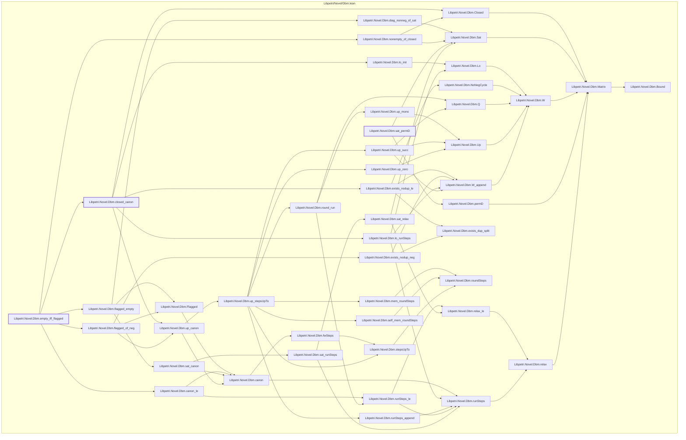

# VER-011

Generated by `scripts/proof-graph.py` from `proof-graph.json`. Do not edit.

Theorems carrying this ID:

- `Libpetri.Novel.Dbm.closed_canon` (theorem, `Libpetri/Novel/Dbm.lean:377`)
- `Libpetri.Novel.Dbm.empty_iff_flagged` (theorem, `Libpetri/Novel/Dbm.lean:424`)
- `Libpetri.Novel.Dbm.sat_permD` (theorem, `Libpetri/Novel/Dbm.lean:446`)

Axioms used:

- `Libpetri.Novel.Dbm.closed_canon`: `Classical.choice`, `Quot.sound`, `propext`
- `Libpetri.Novel.Dbm.empty_iff_flagged`: `Classical.choice`, `Quot.sound`, `propext`
- `Libpetri.Novel.Dbm.sat_permD`: `Classical.choice`, `Quot.sound`, `propext`
