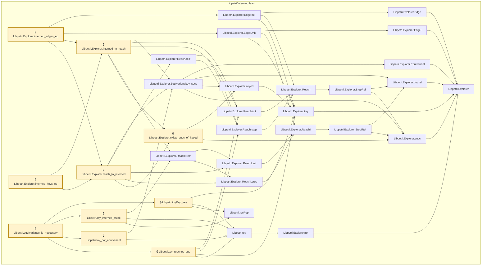

# VER-012

Generated by `scripts/proof-graph.py` from `proof-graph.json`. Do not edit.

Theorems carrying this ID:

- `Libpetri.Explorer.interned_edges_eq` (theorem, `Libpetri/Interning.lean:219`) 🔒 locked
- `Libpetri.Explorer.interned_keys_eq` (theorem, `Libpetri/Interning.lean:203`) 🔒 locked
- `Libpetri.equivariance_is_necessary` (theorem, `Libpetri/Interning.lean:302`) 🔒 locked

Axioms used:

- `Libpetri.Explorer.interned_edges_eq`: `Quot.sound`, `propext`
- `Libpetri.Explorer.interned_keys_eq`: `Quot.sound`, `propext`
- `Libpetri.equivariance_is_necessary`: `propext`
