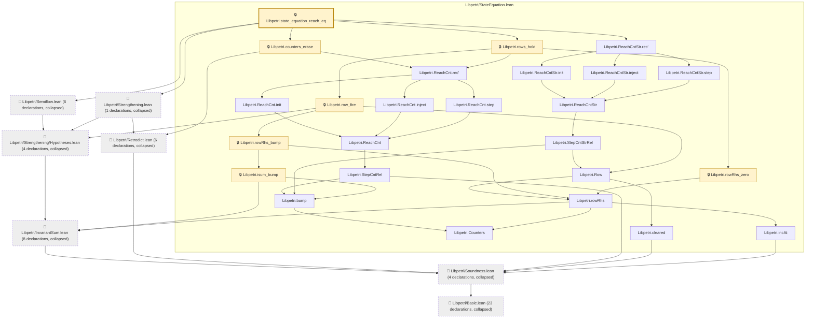

# VER-016

Generated by `scripts/proof-graph.py` from `proof-graph.json`. Do not edit.

Theorems carrying this ID:

- `Libpetri.equality_row_is_unsound_on_a_clearing_place` (theorem, `Libpetri/StateEquation.lean:311`) 🔒 locked
- `Libpetri.rows_hold` (theorem, `Libpetri/StateEquation.lean:260`) 🔒 locked
- `Libpetri.state_equation_reach_eq` (theorem, `Libpetri/StateEquation.lean:282`) 🔒 locked

> **Note:** the full tree has 85 nodes (limit 60), so it is drawn as one diagram per theorem (3 theorems).

### `Libpetri.equality_row_is_unsound_on_a_clearing_place`

> Rule: this theorem's whole tree, 55 nodes.

```mermaid
flowchart TD
  subgraph g0["Libpetri/Basic.lean"]
    n0["Libpetri.AMarking"]
    n8["Libpetri.Card"]
    n9["Libpetri.Card.all"]
    n10["Libpetri.Card.atLeast"]
    n11["Libpetri.Card.consumesAll"]
    n12["Libpetri.Card.exactly"]
    n13["Libpetri.Card.one"]
    n14["Libpetri.Card.required"]
    n21["Libpetri.Colour"]
    n74["Libpetri.Guard"]
    n76["Libpetri.InSpec"]
    n77["Libpetri.InSpec.card"]
    n79["Libpetri.InSpec.mk"]
    n80["Libpetri.InSpec.place"]
    n2374["Libpetri.PlaceId"]
    n2605["Libpetri.Transition"]
    n2606["Libpetri.Transition.inhibitors"]
    n2607["Libpetri.Transition.inputs"]
    n2608["Libpetri.Transition.mk"]
    n2611["Libpetri.Transition.reads"]
    n2612["Libpetri.Transition.resets"]
    n2682["Libpetri.consumeAllAt"]
    n2734["Libpetri.enabledA"]
    n2756["Libpetri.fireA"]
    n2852["Libpetri.post"]
    n2857["Libpetri.pre"]
    n2912["Libpetri.specAt"]
  end
  subgraph g1["Libpetri/InvariantSum.lean"]
    n2801["Libpetri.isum"]
    n2804["🔒 Libpetri.isum_congr"]
    n2806["Libpetri.isum_succ"]
  end
  subgraph g2["Libpetri/Soundness.lean"]
    n72["Libpetri.FlatNet"]
    n73["Libpetri.FlatTransition"]
    n2916["🔒 Libpetri.specAt_sound"]
  end
  subgraph g3["Libpetri/StateEquation.lean"]
    n33["Libpetri.Counters"]
    n2553["Libpetri.ReachCnt"]
    n2554["Libpetri.ReachCnt.init"]
    n2555["Libpetri.ReachCnt.inject"]
    n2556["Libpetri.ReachCnt.rec'"]
    n2557["Libpetri.ReachCnt.step"]
    n2570["Libpetri.Row"]
    n2595["Libpetri.StepCntRel"]
    n2664["Libpetri.bump"]
    n2678["Libpetri.cleared"]
    n2741["🔒 Libpetri.equality_row_is_unsound_on_a_clearing_place"]
    n2778["Libpetri.incAt"]
    n2803["🔒 Libpetri.isum_bump"]
    n2901["Libpetri.rowRhs"]
    n2902["🔒 Libpetri.rowRhs_bump"]
    n2903["🔒 Libpetri.rowRhs_zero"]
    n2904["🔒 Libpetri.row_fire"]
    n2905["🔒 Libpetri.rows_hold"]
  end
  subgraph g4["Libpetri/Strengthening.lean"]
    n2625["Libpetri.a0All"]
    n2829["Libpetri.netAll"]
    n2933["Libpetri.tAll"]
  end
  subgraph g5["Libpetri/Strengthening/Hypotheses.lean"]
    n2862["🔒 Libpetri.pre_le_of_enabledA"]
  end
  n0 --> n2374
  n9 --> n8
  n10 --> n8
  n11 --> n9
  n11 --> n10
  n11 --> n12
  n11 --> n13
  n12 --> n8
  n13 --> n8
  n14 --> n9
  n14 --> n10
  n14 --> n12
  n14 --> n13
  n72 --> n73
  n73 --> n2374
  n73 --> n2605
  n74 --> n21
  n77 --> n8
  n77 --> n76
  n79 --> n8
  n79 --> n74
  n79 --> n76
  n79 --> n2374
  n80 --> n76
  n80 --> n2374
  n2553 --> n2595
  n2554 --> n2553
  n2555 --> n2553
  n2556 --> n2554
  n2556 --> n2555
  n2556 --> n2557
  n2557 --> n2553
  n2570 --> n2678
  n2570 --> n2901
  n2595 --> n72
  n2595 --> n2664
  n2595 --> n2734
  n2595 --> n2756
  n2606 --> n2374
  n2606 --> n2605
  n2607 --> n76
  n2607 --> n2605
  n2608 --> n76
  n2608 --> n2374
  n2608 --> n2605
  n2611 --> n2374
  n2611 --> n2605
  n2612 --> n2374
  n2612 --> n2605
  n2625 --> n0
  n2664 --> n33
  n2678 --> n72
  n2678 --> n2612
  n2678 --> n2682
  n2682 --> n11
  n2682 --> n77
  n2682 --> n2912
  n2734 --> n0
  n2734 --> n14
  n2734 --> n77
  n2734 --> n80
  n2734 --> n2606
  n2734 --> n2607
  n2734 --> n2611
  n2741 --> n2625
  n2741 --> n2829
  n2741 --> n2905
  n2756 --> n0
  n2756 --> n2612
  n2756 --> n2682
  n2756 --> n2852
  n2756 --> n2857
  n2778 --> n72
  n2778 --> n2852
  n2778 --> n2857
  n2801 --> n2374
  n2803 --> n2664
  n2803 --> n2804
  n2803 --> n2806
  n2804 --> n2801
  n2806 --> n2801
  n2829 --> n72
  n2829 --> n2933
  n2852 --> n2374
  n2857 --> n14
  n2857 --> n77
  n2857 --> n2912
  n2862 --> n2734
  n2862 --> n2857
  n2862 --> n2916
  n2901 --> n0
  n2901 --> n33
  n2901 --> n2778
  n2901 --> n2801
  n2902 --> n2803
  n2902 --> n2901
  n2903 --> n2901
  n2904 --> n2570
  n2904 --> n2756
  n2904 --> n2862
  n2904 --> n2902
  n2905 --> n2556
  n2905 --> n2903
  n2905 --> n2904
  n2912 --> n80
  n2912 --> n2607
  n2916 --> n2912
  n2933 --> n9
  n2933 --> n79
  n2933 --> n2608
  classDef root stroke-width:3px
  classDef locked fill:#fff3cd,stroke:#b8860b
  classDef collapsed fill:#eeeeee,stroke-dasharray:4 4
  class n2741 root
  class n2741,n2803,n2804,n2862,n2902,n2903,n2904,n2905,n2916 locked
```

### `Libpetri.rows_hold`

> Rule: this theorem's whole tree, 47 nodes.

```mermaid
flowchart TD
  subgraph g0["Libpetri/Basic.lean"]
    n0["Libpetri.AMarking"]
    n8["Libpetri.Card"]
    n9["Libpetri.Card.all"]
    n10["Libpetri.Card.atLeast"]
    n11["Libpetri.Card.consumesAll"]
    n12["Libpetri.Card.exactly"]
    n13["Libpetri.Card.one"]
    n14["Libpetri.Card.required"]
    n76["Libpetri.InSpec"]
    n77["Libpetri.InSpec.card"]
    n80["Libpetri.InSpec.place"]
    n2374["Libpetri.PlaceId"]
    n2605["Libpetri.Transition"]
    n2606["Libpetri.Transition.inhibitors"]
    n2607["Libpetri.Transition.inputs"]
    n2611["Libpetri.Transition.reads"]
    n2612["Libpetri.Transition.resets"]
    n2682["Libpetri.consumeAllAt"]
    n2734["Libpetri.enabledA"]
    n2756["Libpetri.fireA"]
    n2852["Libpetri.post"]
    n2857["Libpetri.pre"]
    n2912["Libpetri.specAt"]
  end
  subgraph g1["Libpetri/InvariantSum.lean"]
    n2801["Libpetri.isum"]
    n2804["🔒 Libpetri.isum_congr"]
    n2806["Libpetri.isum_succ"]
  end
  subgraph g2["Libpetri/Soundness.lean"]
    n72["Libpetri.FlatNet"]
    n73["Libpetri.FlatTransition"]
    n2916["🔒 Libpetri.specAt_sound"]
  end
  subgraph g3["Libpetri/StateEquation.lean"]
    n33["Libpetri.Counters"]
    n2553["Libpetri.ReachCnt"]
    n2554["Libpetri.ReachCnt.init"]
    n2555["Libpetri.ReachCnt.inject"]
    n2556["Libpetri.ReachCnt.rec'"]
    n2557["Libpetri.ReachCnt.step"]
    n2570["Libpetri.Row"]
    n2595["Libpetri.StepCntRel"]
    n2664["Libpetri.bump"]
    n2678["Libpetri.cleared"]
    n2778["Libpetri.incAt"]
    n2803["🔒 Libpetri.isum_bump"]
    n2901["Libpetri.rowRhs"]
    n2902["🔒 Libpetri.rowRhs_bump"]
    n2903["🔒 Libpetri.rowRhs_zero"]
    n2904["🔒 Libpetri.row_fire"]
    n2905["🔒 Libpetri.rows_hold"]
  end
  subgraph g4["Libpetri/Strengthening/Hypotheses.lean"]
    n2862["🔒 Libpetri.pre_le_of_enabledA"]
  end
  n0 --> n2374
  n9 --> n8
  n10 --> n8
  n11 --> n9
  n11 --> n10
  n11 --> n12
  n11 --> n13
  n12 --> n8
  n13 --> n8
  n14 --> n9
  n14 --> n10
  n14 --> n12
  n14 --> n13
  n72 --> n73
  n73 --> n2374
  n73 --> n2605
  n77 --> n8
  n77 --> n76
  n80 --> n76
  n80 --> n2374
  n2553 --> n2595
  n2554 --> n2553
  n2555 --> n2553
  n2556 --> n2554
  n2556 --> n2555
  n2556 --> n2557
  n2557 --> n2553
  n2570 --> n2678
  n2570 --> n2901
  n2595 --> n72
  n2595 --> n2664
  n2595 --> n2734
  n2595 --> n2756
  n2606 --> n2374
  n2606 --> n2605
  n2607 --> n76
  n2607 --> n2605
  n2611 --> n2374
  n2611 --> n2605
  n2612 --> n2374
  n2612 --> n2605
  n2664 --> n33
  n2678 --> n72
  n2678 --> n2612
  n2678 --> n2682
  n2682 --> n11
  n2682 --> n77
  n2682 --> n2912
  n2734 --> n0
  n2734 --> n14
  n2734 --> n77
  n2734 --> n80
  n2734 --> n2606
  n2734 --> n2607
  n2734 --> n2611
  n2756 --> n0
  n2756 --> n2612
  n2756 --> n2682
  n2756 --> n2852
  n2756 --> n2857
  n2778 --> n72
  n2778 --> n2852
  n2778 --> n2857
  n2801 --> n2374
  n2803 --> n2664
  n2803 --> n2804
  n2803 --> n2806
  n2804 --> n2801
  n2806 --> n2801
  n2852 --> n2374
  n2857 --> n14
  n2857 --> n77
  n2857 --> n2912
  n2862 --> n2734
  n2862 --> n2857
  n2862 --> n2916
  n2901 --> n0
  n2901 --> n33
  n2901 --> n2778
  n2901 --> n2801
  n2902 --> n2803
  n2902 --> n2901
  n2903 --> n2901
  n2904 --> n2570
  n2904 --> n2756
  n2904 --> n2862
  n2904 --> n2902
  n2905 --> n2556
  n2905 --> n2903
  n2905 --> n2904
  n2912 --> n80
  n2912 --> n2607
  n2916 --> n2912
  classDef root stroke-width:3px
  classDef locked fill:#fff3cd,stroke:#b8860b
  classDef collapsed fill:#eeeeee,stroke-dasharray:4 4
  class n2905 root
  class n2803,n2804,n2862,n2902,n2903,n2904,n2905,n2916 locked
```

### `Libpetri.state_equation_reach_eq`

> Rule: this theorem's tree has 77 nodes (limit 60); every file other than its own is collapsed into one node, leaving 32.

Axioms used:

- `Libpetri.equality_row_is_unsound_on_a_clearing_place`: `Classical.choice`, `Quot.sound`, `propext`
- `Libpetri.rows_hold`: `Classical.choice`, `Quot.sound`, `propext`
- `Libpetri.state_equation_reach_eq`: `Classical.choice`, `Quot.sound`, `propext`
