# VER-017

Generated by `scripts/proof-graph.py` from `proof-graph.json`. Do not edit.

Theorems carrying this ID:

- `Libpetri.Novel.Enumeration.net_enumeration_exact` (theorem, `Libpetri/Novel/Enumeration.lean:263`)
- `Libpetri.Novel.Enumeration.run_complete_iff_reach` (theorem, `Libpetri/Novel/Enumeration.lean:185`)

```mermaid
flowchart TD
  subgraph g0["Libpetri/Basic.lean"]
    n0["Libpetri.AMarking"]
    n8["Libpetri.Card"]
    n9["Libpetri.Card.all"]
    n10["Libpetri.Card.atLeast"]
    n11["Libpetri.Card.consumesAll"]
    n12["Libpetri.Card.exactly"]
    n13["Libpetri.Card.one"]
    n14["Libpetri.Card.required"]
    n76["Libpetri.InSpec"]
    n77["Libpetri.InSpec.card"]
    n80["Libpetri.InSpec.place"]
    n294["Libpetri.PlaceId"]
    n525["Libpetri.Transition"]
    n526["Libpetri.Transition.inhibitors"]
    n527["Libpetri.Transition.inputs"]
    n531["Libpetri.Transition.reads"]
    n532["Libpetri.Transition.resets"]
    n601["Libpetri.consumeAllAt"]
    n653["Libpetri.enabledA"]
    n675["Libpetri.fireA"]
    n766["Libpetri.post"]
    n771["Libpetri.pre"]
    n824["Libpetri.specAt"]
  end
  subgraph g1["Libpetri/Novel/Enumeration.lean"]
    n209["Libpetri.Novel.Enumeration.Inv"]
    n210["Libpetri.Novel.Enumeration.Inv.closed"]
    n211["Libpetri.Novel.Enumeration.Inv.mk"]
    n212["Libpetri.Novel.Enumeration.Inv.queue_sub"]
    n213["Libpetri.Novel.Enumeration.Inv.reach"]
    n214["Libpetri.Novel.Enumeration.Reach"]
    n215["Libpetri.Novel.Enumeration.build"]
    n216["Libpetri.Novel.Enumeration.decided_exact"]
    n217["Libpetri.Novel.Enumeration.expand"]
    n218["Libpetri.Novel.Enumeration.expand_spec"]
    n219["Libpetri.Novel.Enumeration.inv_expand"]
    n220["Libpetri.Novel.Enumeration.net_enumeration_exact"]
    n221["Libpetri.Novel.Enumeration.proven"]
    n222["Libpetri.Novel.Enumeration.quiescent_iff_dead"]
    n223["Libpetri.Novel.Enumeration.reach_succNet_iff"]
    n224["Libpetri.Novel.Enumeration.run"]
    n225["Libpetri.Novel.Enumeration.run_complete_iff_reach"]
    n226["Libpetri.Novel.Enumeration.run_inv"]
    n227["Libpetri.Novel.Enumeration.succNet"]
    n228["Libpetri.Novel.Enumeration.succNet_iff_step"]
  end
  subgraph g2["Libpetri/Soundness.lean"]
    n72["Libpetri.FlatNet"]
    n73["Libpetri.FlatTransition"]
    n442["Libpetri.ReachA"]
    n506["Libpetri.StepARel"]
  end
  n0 --> n294
  n9 --> n8
  n10 --> n8
  n11 --> n9
  n11 --> n10
  n11 --> n12
  n11 --> n13
  n12 --> n8
  n13 --> n8
  n14 --> n9
  n14 --> n10
  n14 --> n12
  n14 --> n13
  n72 --> n73
  n73 --> n294
  n73 --> n525
  n77 --> n8
  n77 --> n76
  n80 --> n76
  n80 --> n294
  n210 --> n209
  n211 --> n209
  n211 --> n214
  n212 --> n209
  n213 --> n209
  n213 --> n214
  n215 --> n224
  n216 --> n221
  n216 --> n225
  n218 --> n214
  n218 --> n217
  n219 --> n210
  n219 --> n211
  n219 --> n212
  n219 --> n213
  n219 --> n218
  n220 --> n216
  n220 --> n222
  n220 --> n223
  n222 --> n227
  n223 --> n214
  n223 --> n228
  n223 --> n442
  n224 --> n217
  n225 --> n215
  n225 --> n226
  n226 --> n219
  n226 --> n224
  n227 --> n72
  n227 --> n653
  n227 --> n675
  n228 --> n227
  n228 --> n506
  n442 --> n506
  n506 --> n72
  n506 --> n653
  n506 --> n675
  n526 --> n294
  n526 --> n525
  n527 --> n76
  n527 --> n525
  n531 --> n294
  n531 --> n525
  n532 --> n294
  n532 --> n525
  n601 --> n11
  n601 --> n77
  n601 --> n824
  n653 --> n0
  n653 --> n14
  n653 --> n77
  n653 --> n80
  n653 --> n526
  n653 --> n527
  n653 --> n531
  n675 --> n0
  n675 --> n532
  n675 --> n601
  n675 --> n766
  n675 --> n771
  n766 --> n294
  n771 --> n14
  n771 --> n77
  n771 --> n824
  n824 --> n80
  n824 --> n527
  classDef root stroke-width:3px
  classDef locked fill:#fff3cd,stroke:#b8860b
  classDef collapsed fill:#eeeeee,stroke-dasharray:4 4
  class n220,n225 root
```

Axioms used:

- `Libpetri.Novel.Enumeration.net_enumeration_exact`: `Quot.sound`, `propext`
- `Libpetri.Novel.Enumeration.run_complete_iff_reach`: `Quot.sound`, `propext`
