# VER-020

Generated by `scripts/proof-graph.py` from `proof-graph.json`. Do not edit.

Theorems carrying this ID:

- `Libpetri.Novel.Commoner.commoner` (theorem, `Libpetri/Novel/Commoner.lean:188`)
- `Libpetri.Novel.Commoner.marked_trap_is_necessary` (theorem, `Libpetri/Novel/Commoner.lean:262`)
- `Libpetri.Novel.Commoner.ordinary_is_necessary` (theorem, `Libpetri/Novel/Commoner.lean:215`)

```mermaid
flowchart TD
  subgraph g0["Libpetri/Basic.lean"]
    n0["Libpetri.AMarking"]
    n8["Libpetri.Card"]
    n9["Libpetri.Card.all"]
    n10["Libpetri.Card.atLeast"]
    n11["Libpetri.Card.consumesAll"]
    n12["Libpetri.Card.exactly"]
    n13["Libpetri.Card.one"]
    n14["Libpetri.Card.required"]
    n21["Libpetri.Colour"]
    n74["Libpetri.Guard"]
    n76["Libpetri.InSpec"]
    n77["Libpetri.InSpec.card"]
    n79["Libpetri.InSpec.mk"]
    n80["Libpetri.InSpec.place"]
    n2400["Libpetri.PlaceId"]
    n2631["Libpetri.Transition"]
    n2632["Libpetri.Transition.inhibitors"]
    n2633["Libpetri.Transition.inputs"]
    n2634["Libpetri.Transition.mk"]
    n2637["Libpetri.Transition.reads"]
    n2638["Libpetri.Transition.resets"]
    n2708["Libpetri.consumeAllAt"]
    n2760["Libpetri.enabledA"]
    n2782["Libpetri.fireA"]
    n2878["Libpetri.post"]
    n2883["Libpetri.pre"]
    n2938["Libpetri.specAt"]
  end
  subgraph g1["Libpetri/Novel/Commoner.lean"]
    n156["Libpetri.Novel.Commoner.CommonerCond"]
    n157["Libpetri.Novel.Commoner.Consumes"]
    n158["Libpetri.Novel.Commoner.Dead"]
    n159["Libpetri.Novel.Commoner.InputsBelow"]
    n160["Libpetri.Novel.Commoner.Ordinary"]
    n161["Libpetri.Novel.Commoner.Siphon"]
    n162["Libpetri.Novel.Commoner.Trap"]
    n163["Libpetri.Novel.Commoner.a0Ex"]
    n164["Libpetri.Novel.Commoner.commoner"]
    n166["Libpetri.Novel.Commoner.consumes_tAB"]
    n167["Libpetri.Novel.Commoner.consumes_tBA"]
    n168["Libpetri.Novel.Commoner.dead_consumes_unmarked"]
    n169["Libpetri.Novel.Commoner.marked_trap_is_necessary"]
    n170["Libpetri.Novel.Commoner.netCyc"]
    n171["Libpetri.Novel.Commoner.netEx"]
    n172["Libpetri.Novel.Commoner.ordinary_is_necessary"]
    n173["Libpetri.Novel.Commoner.ordinary_no_drain"]
    n175["Libpetri.Novel.Commoner.tAB"]
    n176["Libpetri.Novel.Commoner.tBA"]
    n177["Libpetri.Novel.Commoner.tEx"]
    n178["Libpetri.Novel.Commoner.trap_stays_marked"]
  end
  subgraph g2["Libpetri/Soundness.lean"]
    n72["Libpetri.FlatNet"]
    n73["Libpetri.FlatTransition"]
    n2548["Libpetri.ReachA"]
    n2549["Libpetri.ReachA.init"]
    n2550["Libpetri.ReachA.rec'"]
    n2551["Libpetri.ReachA.step"]
    n2612["Libpetri.StepARel"]
    n2942["🔒 Libpetri.specAt_sound"]
  end
  n0 --> n2400
  n9 --> n8
  n10 --> n8
  n11 --> n9
  n11 --> n10
  n11 --> n12
  n11 --> n13
  n12 --> n8
  n13 --> n8
  n14 --> n9
  n14 --> n10
  n14 --> n12
  n14 --> n13
  n72 --> n73
  n73 --> n2400
  n73 --> n2631
  n74 --> n21
  n77 --> n8
  n77 --> n76
  n79 --> n8
  n79 --> n74
  n79 --> n76
  n79 --> n2400
  n80 --> n76
  n80 --> n2400
  n156 --> n0
  n156 --> n161
  n156 --> n162
  n157 --> n14
  n157 --> n77
  n157 --> n80
  n157 --> n2633
  n158 --> n72
  n158 --> n2760
  n159 --> n72
  n159 --> n80
  n159 --> n2633
  n160 --> n11
  n160 --> n14
  n160 --> n72
  n160 --> n77
  n160 --> n2632
  n160 --> n2633
  n160 --> n2637
  n160 --> n2638
  n161 --> n72
  n161 --> n157
  n162 --> n72
  n162 --> n157
  n163 --> n0
  n164 --> n156
  n164 --> n168
  n164 --> n173
  n164 --> n178
  n166 --> n157
  n166 --> n175
  n167 --> n157
  n167 --> n176
  n168 --> n157
  n168 --> n158
  n168 --> n159
  n168 --> n160
  n169 --> n158
  n169 --> n160
  n169 --> n161
  n169 --> n162
  n169 --> n166
  n169 --> n167
  n169 --> n170
  n170 --> n72
  n170 --> n175
  n170 --> n176
  n171 --> n72
  n171 --> n177
  n172 --> n156
  n172 --> n158
  n172 --> n159
  n172 --> n163
  n172 --> n171
  n173 --> n160
  n173 --> n2708
  n173 --> n2942
  n175 --> n13
  n175 --> n79
  n175 --> n2634
  n176 --> n13
  n176 --> n79
  n176 --> n2634
  n177 --> n12
  n177 --> n79
  n177 --> n2634
  n178 --> n162
  n178 --> n2550
  n178 --> n2942
  n2548 --> n2612
  n2549 --> n2548
  n2550 --> n2549
  n2550 --> n2551
  n2551 --> n2548
  n2612 --> n72
  n2612 --> n2760
  n2612 --> n2782
  n2632 --> n2400
  n2632 --> n2631
  n2633 --> n76
  n2633 --> n2631
  n2634 --> n76
  n2634 --> n2400
  n2634 --> n2631
  n2637 --> n2400
  n2637 --> n2631
  n2638 --> n2400
  n2638 --> n2631
  n2708 --> n11
  n2708 --> n77
  n2708 --> n2938
  n2760 --> n0
  n2760 --> n14
  n2760 --> n77
  n2760 --> n80
  n2760 --> n2632
  n2760 --> n2633
  n2760 --> n2637
  n2782 --> n0
  n2782 --> n2638
  n2782 --> n2708
  n2782 --> n2878
  n2782 --> n2883
  n2878 --> n2400
  n2883 --> n14
  n2883 --> n77
  n2883 --> n2938
  n2938 --> n80
  n2938 --> n2633
  n2942 --> n2938
  classDef root stroke-width:3px
  classDef locked fill:#fff3cd,stroke:#b8860b
  classDef collapsed fill:#eeeeee,stroke-dasharray:4 4
  class n164,n169,n172 root
  class n2942 locked
```

Axioms used:

- `Libpetri.Novel.Commoner.commoner`: `Classical.choice`, `Quot.sound`, `propext`
- `Libpetri.Novel.Commoner.marked_trap_is_necessary`: `propext`
- `Libpetri.Novel.Commoner.ordinary_is_necessary`: `propext`
