# VER-024

Generated by `scripts/proof-graph.py` from `proof-graph.json`. Do not edit.

Theorems carrying this ID:

- `Libpetri.Novel.Stubborn.closure_enumeration_exact_quiescence` (theorem, `Libpetri/Novel/Stubborn.lean:857`)
- `Libpetri.Novel.Stubborn.reduced_enumeration_exact_quiescence` (theorem, `Libpetri/Novel/Stubborn.lean:524`)
- `Libpetri.Novel.Stubborn.stubborn_preserves_dead` (theorem, `Libpetri/Novel/Stubborn.lean:421`)

> **Note:** the full tree has 128 nodes (limit 60), so it is drawn as one diagram per theorem (3 theorems).

### `Libpetri.Novel.Stubborn.closure_enumeration_exact_quiescence`

#### `Libpetri.Novel.Stubborn.closure_enumeration_exact_quiescence` → `Libpetri.Novel.ForwardDeposit.Deposit`

> Rule: this theorem's tree has 128 nodes, still 88 with other files collapsed, so it is split by direct dependency; this part has 3 nodes, other files collapsed.

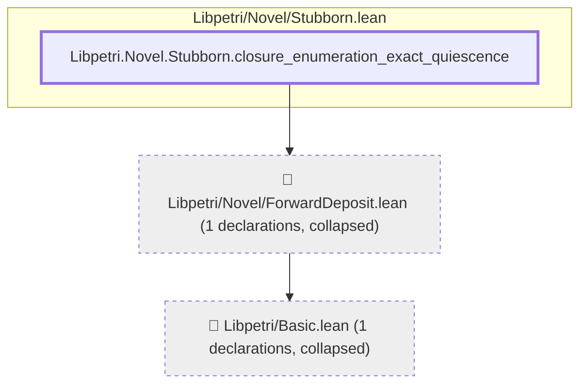
```mermaid
flowchart TD
  subgraph g0["Libpetri/Novel/Stubborn.lean"]
    n2081["Libpetri.Novel.Stubborn.closure_enumeration_exact_quiescence"]
  end
  c0["📁 Libpetri/Basic.lean (1 declarations, collapsed)"]
  c26["📁 Libpetri/Novel/ForwardDeposit.lean (1 declarations, collapsed)"]
  c26 --> c0
  n2081 --> c26
  classDef root stroke-width:3px
  classDef locked fill:#fff3cd,stroke:#b8860b
  classDef collapsed fill:#eeeeee,stroke-dasharray:4 4
  class n2081 root
  class c0,c26 collapsed
```

#### `Libpetri.Novel.Stubborn.closure_enumeration_exact_quiescence` → `Libpetri.Novel.ForwardDeposit.ReachAD`

> Rule: this theorem's tree has 128 nodes, still 88 with other files collapsed, so it is split by direct dependency; this part has 3 nodes, other files collapsed.

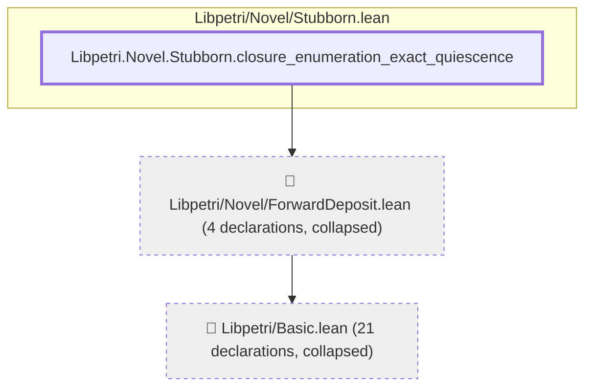
```mermaid
flowchart TD
  subgraph g0["Libpetri/Novel/Stubborn.lean"]
    n2081["Libpetri.Novel.Stubborn.closure_enumeration_exact_quiescence"]
  end
  c0["📁 Libpetri/Basic.lean (21 declarations, collapsed)"]
  c26["📁 Libpetri/Novel/ForwardDeposit.lean (4 declarations, collapsed)"]
  c26 --> c0
  n2081 --> c26
  classDef root stroke-width:3px
  classDef locked fill:#fff3cd,stroke:#b8860b
  classDef collapsed fill:#eeeeee,stroke-dasharray:4 4
  class n2081 root
  class c0,c26 collapsed
```

#### `Libpetri.Novel.Stubborn.closure_enumeration_exact_quiescence` → `Libpetri.Novel.Stubborn.Blocker`

> Rule: this theorem's tree has 128 nodes, still 88 with other files collapsed, so it is split by direct dependency; this part has 3 nodes, other files collapsed.

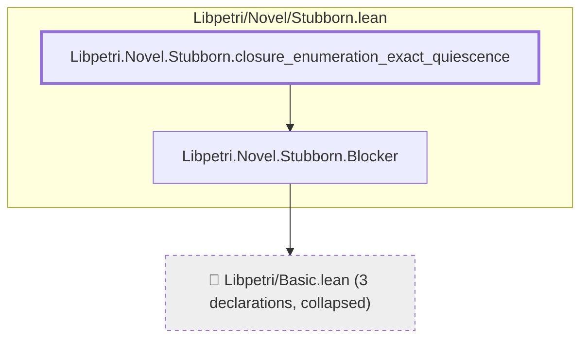
```mermaid
flowchart TD
  subgraph g0["Libpetri/Novel/Stubborn.lean"]
    n2044["Libpetri.Novel.Stubborn.Blocker"]
    n2081["Libpetri.Novel.Stubborn.closure_enumeration_exact_quiescence"]
  end
  c0["📁 Libpetri/Basic.lean (3 declarations, collapsed)"]
  n2044 --> c0
  n2081 --> n2044
  classDef root stroke-width:3px
  classDef locked fill:#fff3cd,stroke:#b8860b
  classDef collapsed fill:#eeeeee,stroke-dasharray:4 4
  class n2081 root
  class c0 collapsed
```

#### `Libpetri.Novel.Stubborn.closure_enumeration_exact_quiescence` → `Libpetri.Novel.Stubborn.BlockerSound`

> Rule: this theorem's tree has 128 nodes, still 88 with other files collapsed, so it is split by direct dependency; this part has 4 nodes, other files collapsed.

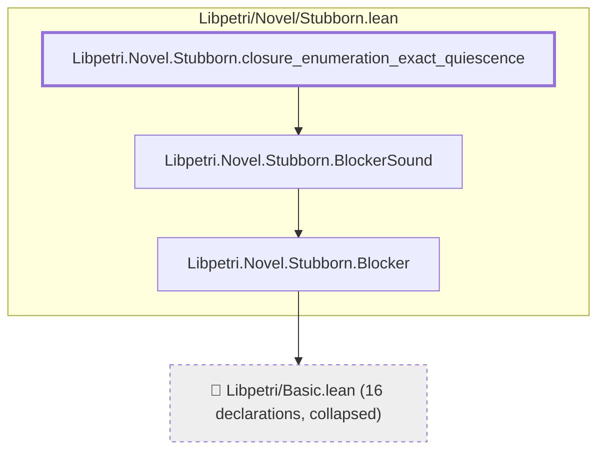
```mermaid
flowchart TD
  subgraph g0["Libpetri/Novel/Stubborn.lean"]
    n2044["Libpetri.Novel.Stubborn.Blocker"]
    n2045["Libpetri.Novel.Stubborn.BlockerSound"]
    n2081["Libpetri.Novel.Stubborn.closure_enumeration_exact_quiescence"]
  end
  c0["📁 Libpetri/Basic.lean (16 declarations, collapsed)"]
  n2044 --> c0
  n2045 --> n2044
  n2081 --> n2045
  classDef root stroke-width:3px
  classDef locked fill:#fff3cd,stroke:#b8860b
  classDef collapsed fill:#eeeeee,stroke-dasharray:4 4
  class n2081 root
  class c0 collapsed
```

#### `Libpetri.Novel.Stubborn.closure_enumeration_exact_quiescence` → `Libpetri.Novel.Stubborn.Dead`

> Rule: this theorem's tree has 128 nodes, still 88 with other files collapsed, so it is split by direct dependency; this part has 5 nodes, other files collapsed.

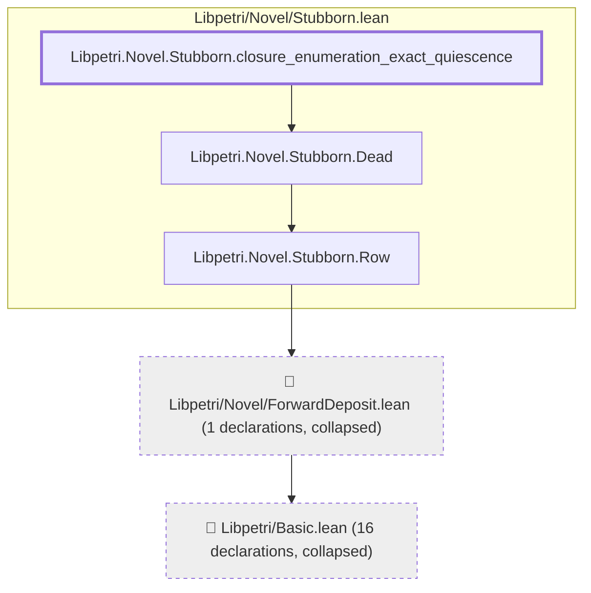
```mermaid
flowchart TD
  subgraph g0["Libpetri/Novel/Stubborn.lean"]
    n2047["Libpetri.Novel.Stubborn.Dead"]
    n2064["Libpetri.Novel.Stubborn.Row"]
    n2081["Libpetri.Novel.Stubborn.closure_enumeration_exact_quiescence"]
  end
  c0["📁 Libpetri/Basic.lean (16 declarations, collapsed)"]
  c26["📁 Libpetri/Novel/ForwardDeposit.lean (1 declarations, collapsed)"]
  c26 --> c0
  n2047 --> n2064
  n2064 --> c26
  n2081 --> n2047
  classDef root stroke-width:3px
  classDef locked fill:#fff3cd,stroke:#b8860b
  classDef collapsed fill:#eeeeee,stroke-dasharray:4 4
  class n2081 root
  class c0,c26 collapsed
```

#### `Libpetri.Novel.Stubborn.closure_enumeration_exact_quiescence` → `Libpetri.Novel.Stubborn.Row`

> Rule: this theorem's tree has 128 nodes, still 88 with other files collapsed, so it is split by direct dependency; this part has 4 nodes, other files collapsed.

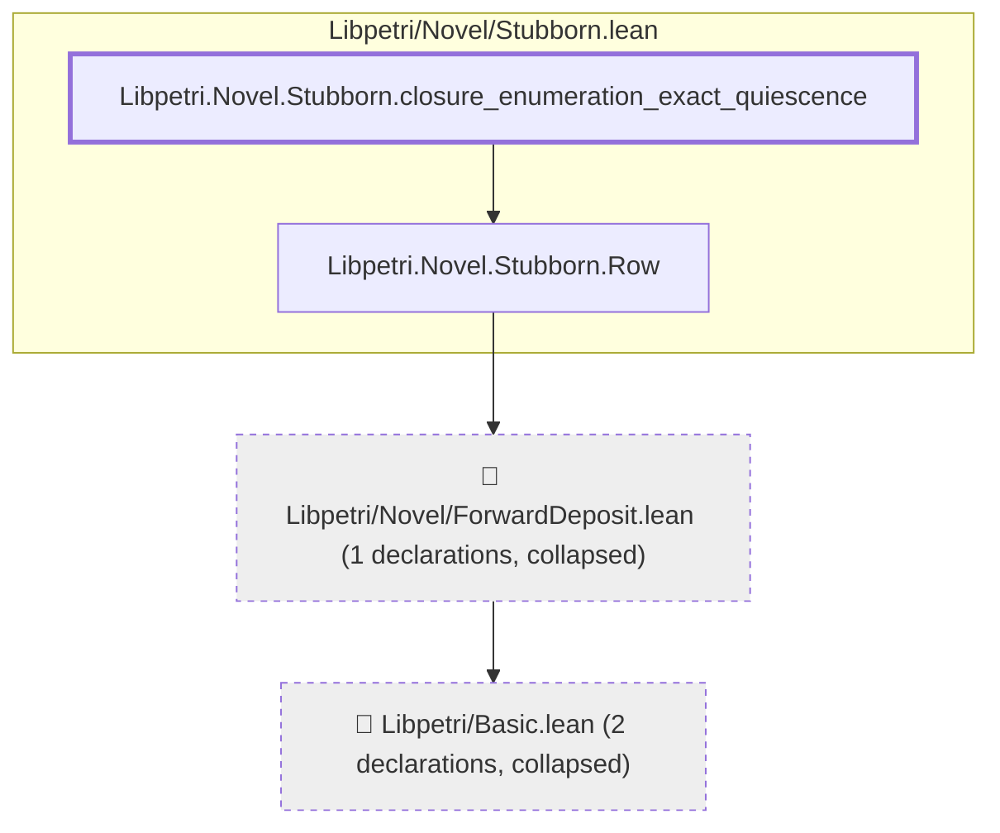
```mermaid
flowchart TD
  subgraph g0["Libpetri/Novel/Stubborn.lean"]
    n2064["Libpetri.Novel.Stubborn.Row"]
    n2081["Libpetri.Novel.Stubborn.closure_enumeration_exact_quiescence"]
  end
  c0["📁 Libpetri/Basic.lean (2 declarations, collapsed)"]
  c26["📁 Libpetri/Novel/ForwardDeposit.lean (1 declarations, collapsed)"]
  c26 --> c0
  n2064 --> c26
  n2081 --> n2064
  classDef root stroke-width:3px
  classDef locked fill:#fff3cd,stroke:#b8860b
  classDef collapsed fill:#eeeeee,stroke-dasharray:4 4
  class n2081 root
  class c0,c26 collapsed
```

#### `Libpetri.Novel.Stubborn.closure_enumeration_exact_quiescence` → `Libpetri.Novel.Stubborn.closureStub`

> Rule: this theorem's tree has 128 nodes, still 88 with other files collapsed, so it is split by direct dependency; this part has 20 nodes, other files collapsed.

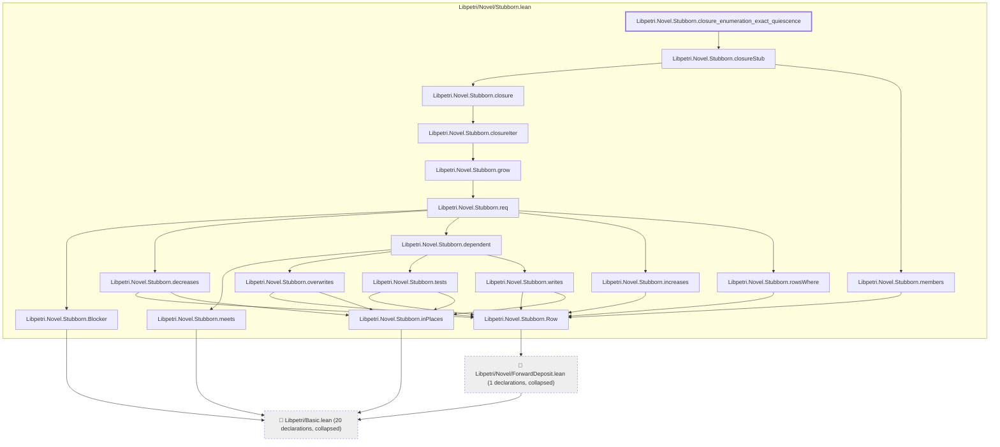
```mermaid
flowchart TD
  subgraph g0["Libpetri/Novel/Stubborn.lean"]
    n2044["Libpetri.Novel.Stubborn.Blocker"]
    n2064["Libpetri.Novel.Stubborn.Row"]
    n2075["Libpetri.Novel.Stubborn.closure"]
    n2076["Libpetri.Novel.Stubborn.closureIter"]
    n2079["Libpetri.Novel.Stubborn.closureStub"]
    n2081["Libpetri.Novel.Stubborn.closure_enumeration_exact_quiescence"]
    n2084["Libpetri.Novel.Stubborn.decreases"]
    n2085["Libpetri.Novel.Stubborn.dependent"]
    n2095["Libpetri.Novel.Stubborn.grow"]
    n2096["Libpetri.Novel.Stubborn.inPlaces"]
    n2097["Libpetri.Novel.Stubborn.increases"]
    n2106["Libpetri.Novel.Stubborn.meets"]
    n2112["Libpetri.Novel.Stubborn.members"]
    n2115["Libpetri.Novel.Stubborn.overwrites"]
    n2124["Libpetri.Novel.Stubborn.req"]
    n2125["Libpetri.Novel.Stubborn.rowsWhere"]
    n2132["Libpetri.Novel.Stubborn.tests"]
    n2133["Libpetri.Novel.Stubborn.writes"]
  end
  c0["📁 Libpetri/Basic.lean (20 declarations, collapsed)"]
  c26["📁 Libpetri/Novel/ForwardDeposit.lean (1 declarations, collapsed)"]
  c26 --> c0
  n2044 --> c0
  n2064 --> c26
  n2075 --> n2076
  n2076 --> n2095
  n2079 --> n2075
  n2079 --> n2112
  n2081 --> n2079
  n2084 --> n2064
  n2084 --> n2096
  n2085 --> n2106
  n2085 --> n2115
  n2085 --> n2132
  n2085 --> n2133
  n2095 --> n2124
  n2096 --> c0
  n2097 --> n2064
  n2106 --> c0
  n2112 --> n2064
  n2115 --> n2064
  n2115 --> n2096
  n2124 --> n2044
  n2124 --> n2084
  n2124 --> n2085
  n2124 --> n2097
  n2124 --> n2125
  n2125 --> n2064
  n2132 --> n2064
  n2132 --> n2096
  n2133 --> n2064
  n2133 --> n2096
  classDef root stroke-width:3px
  classDef locked fill:#fff3cd,stroke:#b8860b
  classDef collapsed fill:#eeeeee,stroke-dasharray:4 4
  class n2081 root
  class c0,c26 collapsed
```

#### `Libpetri.Novel.Stubborn.closure_enumeration_exact_quiescence` → `Libpetri.Novel.Stubborn.closure_family`

> Rule: this theorem's tree has 128 nodes, still 88 with other files collapsed, so it is split by direct dependency; this part has 37 nodes, other files collapsed.

```mermaid
flowchart TD
  subgraph g0["Libpetri/Novel/Stubborn.lean"]
    n2044["Libpetri.Novel.Stubborn.Blocker"]
    n2045["Libpetri.Novel.Stubborn.BlockerSound"]
    n2046["Libpetri.Novel.Stubborn.Closed"]
    n2048["Libpetri.Novel.Stubborn.Dependent"]
    n2049["Libpetri.Novel.Stubborn.IsStubborn"]
    n2053["Libpetri.Novel.Stubborn.IsStubborn.mk"]
    n2064["Libpetri.Novel.Stubborn.Row"]
    n2066["Libpetri.Novel.Stubborn.StubbornFamily"]
    n2067["Libpetri.Novel.Stubborn.StubbornFamily.mk"]
    n2070["Libpetri.Novel.Stubborn.Witness"]
    n2074["Libpetri.Novel.Stubborn.closed_stubborn"]
    n2075["Libpetri.Novel.Stubborn.closure"]
    n2076["Libpetri.Novel.Stubborn.closureIter"]
    n2077["Libpetri.Novel.Stubborn.closureIter_closed"]
    n2078["Libpetri.Novel.Stubborn.closureIter_sup"]
    n2079["Libpetri.Novel.Stubborn.closureStub"]
    n2080["Libpetri.Novel.Stubborn.closure_closed"]
    n2081["Libpetri.Novel.Stubborn.closure_enumeration_exact_quiescence"]
    n2082["Libpetri.Novel.Stubborn.closure_family"]
    n2084["Libpetri.Novel.Stubborn.decreases"]
    n2085["Libpetri.Novel.Stubborn.dependent"]
    n2095["Libpetri.Novel.Stubborn.grow"]
    n2096["Libpetri.Novel.Stubborn.inPlaces"]
    n2097["Libpetri.Novel.Stubborn.increases"]
    n2104["Libpetri.Novel.Stubborn.lt_of_mem_req"]
    n2105["Libpetri.Novel.Stubborn.lt_of_mem_rowsWhere"]
    n2106["Libpetri.Novel.Stubborn.meets"]
    n2108["Libpetri.Novel.Stubborn.mem_members"]
    n2110["Libpetri.Novel.Stubborn.mem_rowsWhere"]
    n2112["Libpetri.Novel.Stubborn.members"]
    n2115["Libpetri.Novel.Stubborn.overwrites"]
    n2124["Libpetri.Novel.Stubborn.req"]
    n2125["Libpetri.Novel.Stubborn.rowsWhere"]
    n2132["Libpetri.Novel.Stubborn.tests"]
    n2133["Libpetri.Novel.Stubborn.writes"]
  end
  c0["📁 Libpetri/Basic.lean (20 declarations, collapsed)"]
  c26["📁 Libpetri/Novel/ForwardDeposit.lean (1 declarations, collapsed)"]
  c26 --> c0
  n2044 --> c0
  n2045 --> n2044
  n2046 --> n2124
  n2048 --> n2085
  n2049 --> n2064
  n2053 --> n2048
  n2053 --> n2049
  n2053 --> n2070
  n2064 --> c26
  n2066 --> n2064
  n2067 --> n2049
  n2067 --> n2066
  n2070 --> n2084
  n2070 --> n2097
  n2074 --> n2045
  n2074 --> n2046
  n2074 --> n2053
  n2074 --> n2108
  n2074 --> n2110
  n2075 --> n2076
  n2076 --> n2095
  n2077 --> n2046
  n2077 --> n2076
  n2077 --> n2104
  n2078 --> n2076
  n2079 --> n2075
  n2079 --> n2112
  n2080 --> n2075
  n2080 --> n2077
  n2081 --> n2082
  n2082 --> n2067
  n2082 --> n2074
  n2082 --> n2078
  n2082 --> n2079
  n2082 --> n2080
  n2084 --> n2064
  n2084 --> n2096
  n2085 --> n2106
  n2085 --> n2115
  n2085 --> n2132
  n2085 --> n2133
  n2095 --> n2124
  n2096 --> c0
  n2097 --> n2064
  n2104 --> n2105
  n2104 --> n2124
  n2105 --> n2110
  n2106 --> c0
  n2108 --> n2112
  n2110 --> n2125
  n2112 --> n2064
  n2115 --> n2064
  n2115 --> n2096
  n2124 --> n2044
  n2124 --> n2084
  n2124 --> n2085
  n2124 --> n2097
  n2124 --> n2125
  n2125 --> n2064
  n2132 --> n2064
  n2132 --> n2096
  n2133 --> n2064
  n2133 --> n2096
  classDef root stroke-width:3px
  classDef locked fill:#fff3cd,stroke:#b8860b
  classDef collapsed fill:#eeeeee,stroke-dasharray:4 4
  class n2081 root
  class c0,c26 collapsed
```

#### `Libpetri.Novel.Stubborn.closure_enumeration_exact_quiescence` → `Libpetri.Novel.Stubborn.reduced_enumeration_exact_quiescence`

> Rule: this theorem's tree has 128 nodes, still 88 with other files collapsed, so it is split by direct dependency; this part has 67 nodes, other files collapsed.

```mermaid
flowchart TD
  subgraph g0["Libpetri/Novel/Stubborn.lean"]
    n2047["Libpetri.Novel.Stubborn.Dead"]
    n2048["Libpetri.Novel.Stubborn.Dependent"]
    n2049["Libpetri.Novel.Stubborn.IsStubborn"]
    n2050["Libpetri.Novel.Stubborn.IsStubborn.d1"]
    n2051["Libpetri.Novel.Stubborn.IsStubborn.d2"]
    n2052["Libpetri.Novel.Stubborn.IsStubborn.key"]
    n2054["Libpetri.Novel.Stubborn.PathAD"]
    n2055["Libpetri.Novel.Stubborn.PathAD.append"]
    n2056["Libpetri.Novel.Stubborn.PathAD.below.cons"]
    n2057["Libpetri.Novel.Stubborn.PathAD.below.nil"]
    n2058["Libpetri.Novel.Stubborn.PathAD.cons"]
    n2059["Libpetri.Novel.Stubborn.PathAD.cons_inv"]
    n2060["Libpetri.Novel.Stubborn.PathAD.mem"]
    n2061["Libpetri.Novel.Stubborn.PathAD.nil"]
    n2063["Libpetri.Novel.Stubborn.PathAD.split"]
    n2064["Libpetri.Novel.Stubborn.Row"]
    n2065["Libpetri.Novel.Stubborn.StepRed"]
    n2066["Libpetri.Novel.Stubborn.StubbornFamily"]
    n2068["Libpetri.Novel.Stubborn.StubbornFamily.stubborn"]
    n2069["Libpetri.Novel.Stubborn.StubbornFamily.sub"]
    n2070["Libpetri.Novel.Stubborn.Witness"]
    n2071["Libpetri.Novel.Stubborn.Witness.disabled"]
    n2072["Libpetri.Novel.Stubborn.Witness.step"]
    n2073["Libpetri.Novel.Stubborn.all_congr_mem"]
    n2081["Libpetri.Novel.Stubborn.closure_enumeration_exact_quiescence"]
    n2083["Libpetri.Novel.Stubborn.commute_to_front"]
    n2084["Libpetri.Novel.Stubborn.decreases"]
    n2085["Libpetri.Novel.Stubborn.dependent"]
    n2086["Libpetri.Novel.Stubborn.dependent_iff"]
    n2087["Libpetri.Novel.Stubborn.dependent_symm"]
    n2088["Libpetri.Novel.Stubborn.enabled_congr"]
    n2089["Libpetri.Novel.Stubborn.fire_additive"]
    n2090["Libpetri.Novel.Stubborn.fire_congr"]
    n2091["Libpetri.Novel.Stubborn.fire_unwritten"]
    n2094["Libpetri.Novel.Stubborn.first_split"]
    n2096["Libpetri.Novel.Stubborn.inPlaces"]
    n2097["Libpetri.Novel.Stubborn.increases"]
    n2098["Libpetri.Novel.Stubborn.indep_diamond"]
    n2099["Libpetri.Novel.Stubborn.indep_overwrites_writes"]
    n2100["Libpetri.Novel.Stubborn.indep_path_commute"]
    n2101["Libpetri.Novel.Stubborn.indep_path_preserves_enabled"]
    n2102["Libpetri.Novel.Stubborn.indep_preserves_enabled"]
    n2103["Libpetri.Novel.Stubborn.indep_writes_tests"]
    n2106["Libpetri.Novel.Stubborn.meets"]
    n2107["Libpetri.Novel.Stubborn.meets_iff"]
    n2109["Libpetri.Novel.Stubborn.mem_overwrites_of_reset"]
    n2111["Libpetri.Novel.Stubborn.mem_tests_of_in"]
    n2113["Libpetri.Novel.Stubborn.outside_cannot_disable"]
    n2114["Libpetri.Novel.Stubborn.outside_cannot_enable"]
    n2115["Libpetri.Novel.Stubborn.overwrites"]
    n2116["Libpetri.Novel.Stubborn.reachAD_path"]
    n2117["Libpetri.Novel.Stubborn.reach_succReduced_iff"]
    n2118["Libpetri.Novel.Stubborn.reducedQuiescent_iff_dead"]
    n2119["Libpetri.Novel.Stubborn.reduced_build_reach"]
    n2120["Libpetri.Novel.Stubborn.reduced_enumeration_exact_quiescence"]
    n2123["Libpetri.Novel.Stubborn.reduced_reach_sound"]
    n2126["Libpetri.Novel.Stubborn.specAt_none"]
    n2127["Libpetri.Novel.Stubborn.stepRed_stepAD"]
    n2128["Libpetri.Novel.Stubborn.stubborn_preserves_dead"]
    n2129["Libpetri.Novel.Stubborn.succReduced"]
    n2130["Libpetri.Novel.Stubborn.succReduced_iff_step"]
    n2131["Libpetri.Novel.Stubborn.succReduced_nil_iff_dead"]
    n2132["Libpetri.Novel.Stubborn.tests"]
    n2133["Libpetri.Novel.Stubborn.writes"]
  end
  c0["📁 Libpetri/Basic.lean (21 declarations, collapsed)"]
  c15["📁 Libpetri/Novel/Enumeration.lean (18 declarations, collapsed)"]
  c26["📁 Libpetri/Novel/ForwardDeposit.lean (4 declarations, collapsed)"]
  c15 --> c26
  c26 --> c0
  n2047 --> n2064
  n2048 --> n2085
  n2049 --> n2064
  n2050 --> n2048
  n2050 --> n2049
  n2051 --> n2049
  n2051 --> n2070
  n2052 --> n2049
  n2054 --> n2064
  n2055 --> n2056
  n2055 --> n2057
  n2056 --> n2058
  n2057 --> n2061
  n2058 --> n2054
  n2059 --> n2058
  n2059 --> n2061
  n2060 --> n2058
  n2060 --> n2061
  n2061 --> n2054
  n2063 --> n2058
  n2063 --> n2061
  n2064 --> c26
  n2065 --> n2064
  n2066 --> n2064
  n2068 --> n2049
  n2068 --> n2066
  n2069 --> n2066
  n2070 --> n2084
  n2070 --> n2097
  n2071 --> n2070
  n2072 --> n2070
  n2072 --> n2089
  n2081 --> n2120
  n2083 --> n2050
  n2083 --> n2060
  n2083 --> n2100
  n2083 --> n2114
  n2084 --> n2064
  n2084 --> n2096
  n2085 --> n2106
  n2085 --> n2115
  n2085 --> n2132
  n2085 --> n2133
  n2086 --> n2048
  n2086 --> n2107
  n2087 --> n2086
  n2088 --> n2073
  n2088 --> n2132
  n2089 --> n2064
  n2089 --> n2126
  n2090 --> c26
  n2091 --> n2126
  n2091 --> n2133
  n2096 --> c0
  n2097 --> n2064
  n2098 --> n2089
  n2098 --> n2090
  n2098 --> n2099
  n2098 --> n2102
  n2098 --> n2109
  n2098 --> n2111
  n2099 --> n2086
  n2100 --> n2056
  n2100 --> n2057
  n2100 --> n2098
  n2101 --> n2056
  n2101 --> n2057
  n2101 --> n2102
  n2102 --> n2087
  n2102 --> n2088
  n2102 --> n2091
  n2102 --> n2103
  n2103 --> n2086
  n2106 --> c0
  n2107 --> n2106
  n2109 --> n2115
  n2111 --> n2132
  n2113 --> n2050
  n2113 --> n2101
  n2114 --> n2051
  n2114 --> n2058
  n2114 --> n2061
  n2114 --> n2071
  n2114 --> n2072
  n2115 --> n2064
  n2115 --> n2096
  n2116 --> n2058
  n2116 --> n2061
  n2117 --> n2130
  n2118 --> n2047
  n2118 --> n2052
  n2118 --> n2065
  n2118 --> n2068
  n2118 --> n2069
  n2119 --> n2117
  n2119 --> n2123
  n2120 --> n2119
  n2120 --> n2128
  n2120 --> n2131
  n2123 --> n2127
  n2126 --> n2096
  n2127 --> n2065
  n2127 --> n2069
  n2128 --> n2047
  n2128 --> n2052
  n2128 --> n2055
  n2128 --> n2059
  n2128 --> n2063
  n2128 --> n2065
  n2128 --> n2068
  n2128 --> n2069
  n2128 --> n2083
  n2128 --> n2094
  n2128 --> n2113
  n2128 --> n2116
  n2129 --> c15
  n2129 --> n2064
  n2130 --> n2065
  n2130 --> n2129
  n2131 --> n2118
  n2131 --> n2130
  n2132 --> n2064
  n2132 --> n2096
  n2133 --> n2064
  n2133 --> n2096
  classDef root stroke-width:3px
  classDef locked fill:#fff3cd,stroke:#b8860b
  classDef collapsed fill:#eeeeee,stroke-dasharray:4 4
  class n2081 root
  class c0,c15,c26 collapsed
```

#### `Libpetri.Novel.Stubborn.closure_enumeration_exact_quiescence` → `Libpetri.Novel.Stubborn.succReduced`

> Rule: this theorem's tree has 128 nodes, still 88 with other files collapsed, so it is split by direct dependency; this part has 6 nodes, other files collapsed.

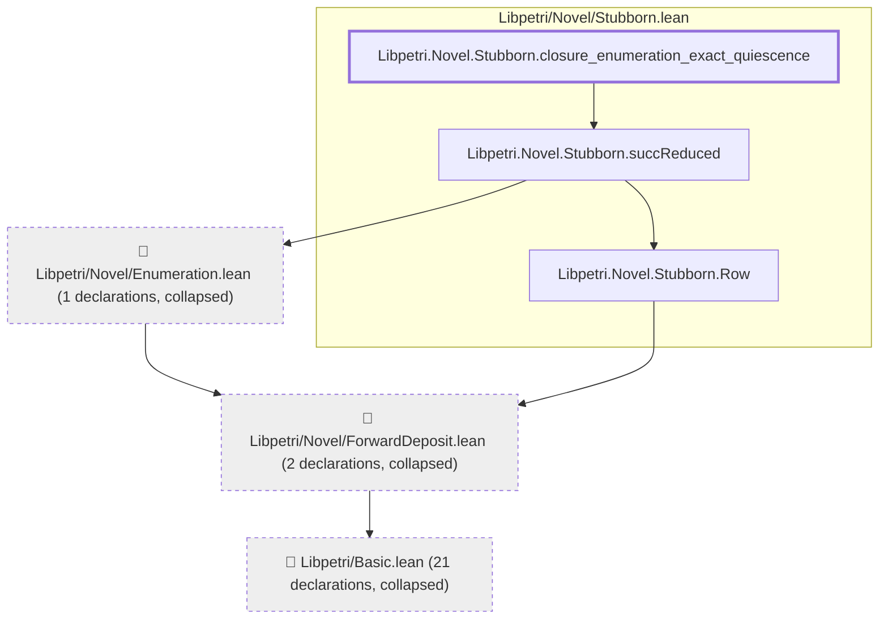
```mermaid
flowchart TD
  subgraph g0["Libpetri/Novel/Stubborn.lean"]
    n2064["Libpetri.Novel.Stubborn.Row"]
    n2081["Libpetri.Novel.Stubborn.closure_enumeration_exact_quiescence"]
    n2129["Libpetri.Novel.Stubborn.succReduced"]
  end
  c0["📁 Libpetri/Basic.lean (21 declarations, collapsed)"]
  c15["📁 Libpetri/Novel/Enumeration.lean (1 declarations, collapsed)"]
  c26["📁 Libpetri/Novel/ForwardDeposit.lean (2 declarations, collapsed)"]
  c15 --> c26
  c26 --> c0
  n2064 --> c26
  n2081 --> n2129
  n2129 --> c15
  n2129 --> n2064
  classDef root stroke-width:3px
  classDef locked fill:#fff3cd,stroke:#b8860b
  classDef collapsed fill:#eeeeee,stroke-dasharray:4 4
  class n2081 root
  class c0,c15,c26 collapsed
```

Shared leaves of `Libpetri.Novel.Stubborn.closure_enumeration_exact_quiescence` (direct dependencies too small for a diagram of their own, fewer than 3 nodes):

- `Libpetri.AMarking` (`Libpetri/Basic.lean`)
- `Libpetri.Novel.Enumeration.build` (`Libpetri/Novel/Enumeration.lean`)
- `Libpetri.Novel.Enumeration.proven` (`Libpetri/Novel/Enumeration.lean`)
- `Libpetri.Transition` (`Libpetri/Basic.lean`)
- `Libpetri.enabledA` (`Libpetri/Basic.lean`)

### `Libpetri.Novel.Stubborn.reduced_enumeration_exact_quiescence`

#### `Libpetri.Novel.Stubborn.reduced_enumeration_exact_quiescence` → `Libpetri.Novel.ForwardDeposit.ReachAD`

> Rule: this theorem's tree has 106 nodes, still 66 with other files collapsed, so it is split by direct dependency; this part has 3 nodes, other files collapsed.

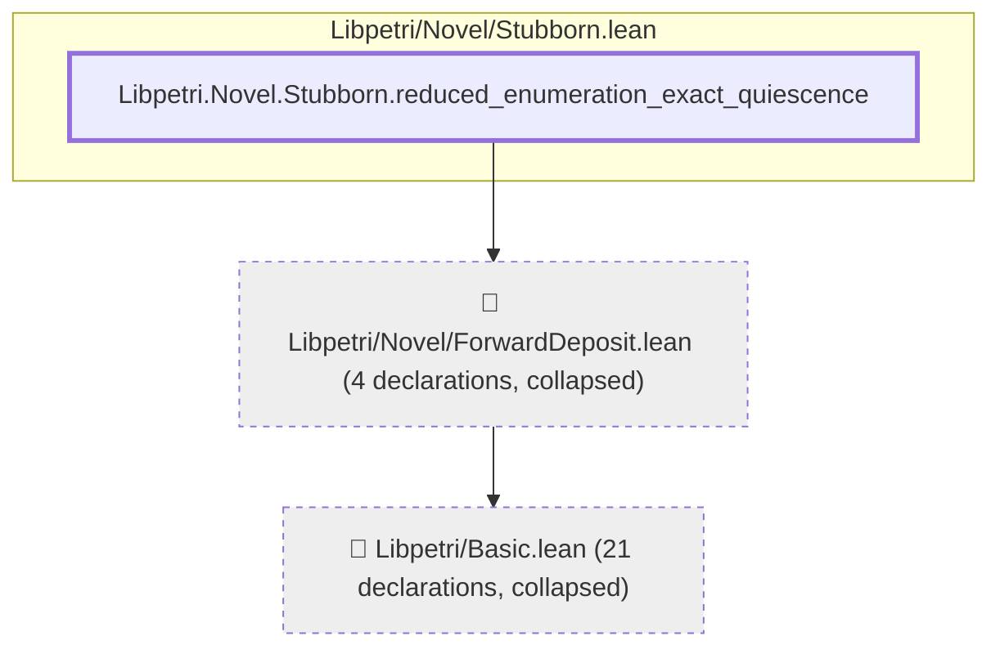
```mermaid
flowchart TD
  subgraph g0["Libpetri/Novel/Stubborn.lean"]
    n2120["Libpetri.Novel.Stubborn.reduced_enumeration_exact_quiescence"]
  end
  c0["📁 Libpetri/Basic.lean (21 declarations, collapsed)"]
  c26["📁 Libpetri/Novel/ForwardDeposit.lean (4 declarations, collapsed)"]
  c26 --> c0
  n2120 --> c26
  classDef root stroke-width:3px
  classDef locked fill:#fff3cd,stroke:#b8860b
  classDef collapsed fill:#eeeeee,stroke-dasharray:4 4
  class n2120 root
  class c0,c26 collapsed
```

#### `Libpetri.Novel.Stubborn.reduced_enumeration_exact_quiescence` → `Libpetri.Novel.Stubborn.Dead`

> Rule: this theorem's tree has 106 nodes, still 66 with other files collapsed, so it is split by direct dependency; this part has 5 nodes, other files collapsed.

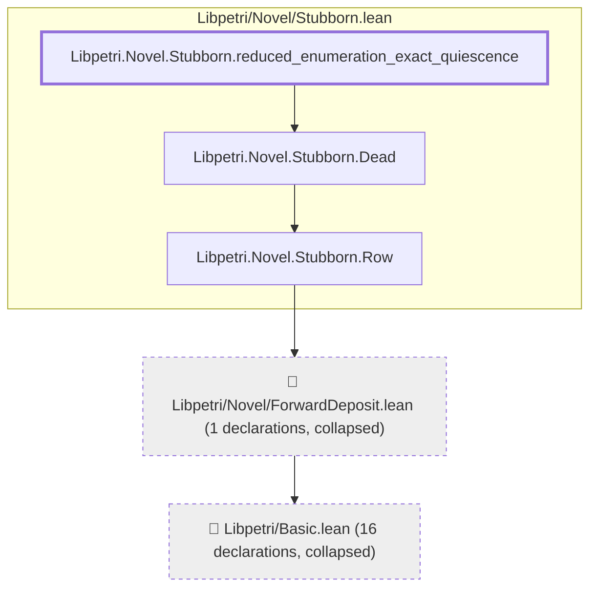
```mermaid
flowchart TD
  subgraph g0["Libpetri/Novel/Stubborn.lean"]
    n2047["Libpetri.Novel.Stubborn.Dead"]
    n2064["Libpetri.Novel.Stubborn.Row"]
    n2120["Libpetri.Novel.Stubborn.reduced_enumeration_exact_quiescence"]
  end
  c0["📁 Libpetri/Basic.lean (16 declarations, collapsed)"]
  c26["📁 Libpetri/Novel/ForwardDeposit.lean (1 declarations, collapsed)"]
  c26 --> c0
  n2047 --> n2064
  n2064 --> c26
  n2120 --> n2047
  classDef root stroke-width:3px
  classDef locked fill:#fff3cd,stroke:#b8860b
  classDef collapsed fill:#eeeeee,stroke-dasharray:4 4
  class n2120 root
  class c0,c26 collapsed
```

#### `Libpetri.Novel.Stubborn.reduced_enumeration_exact_quiescence` → `Libpetri.Novel.Stubborn.Row`

> Rule: this theorem's tree has 106 nodes, still 66 with other files collapsed, so it is split by direct dependency; this part has 4 nodes, other files collapsed.

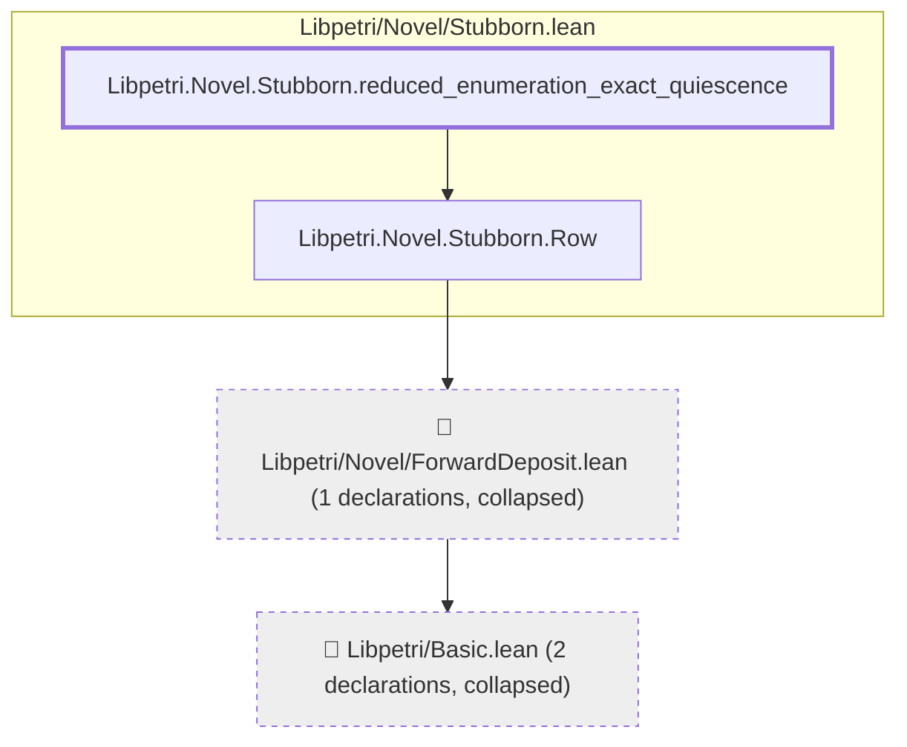
```mermaid
flowchart TD
  subgraph g0["Libpetri/Novel/Stubborn.lean"]
    n2064["Libpetri.Novel.Stubborn.Row"]
    n2120["Libpetri.Novel.Stubborn.reduced_enumeration_exact_quiescence"]
  end
  c0["📁 Libpetri/Basic.lean (2 declarations, collapsed)"]
  c26["📁 Libpetri/Novel/ForwardDeposit.lean (1 declarations, collapsed)"]
  c26 --> c0
  n2064 --> c26
  n2120 --> n2064
  classDef root stroke-width:3px
  classDef locked fill:#fff3cd,stroke:#b8860b
  classDef collapsed fill:#eeeeee,stroke-dasharray:4 4
  class n2120 root
  class c0,c26 collapsed
```

#### `Libpetri.Novel.Stubborn.reduced_enumeration_exact_quiescence` → `Libpetri.Novel.Stubborn.StepRed`

> Rule: this theorem's tree has 106 nodes, still 66 with other files collapsed, so it is split by direct dependency; this part has 5 nodes, other files collapsed.

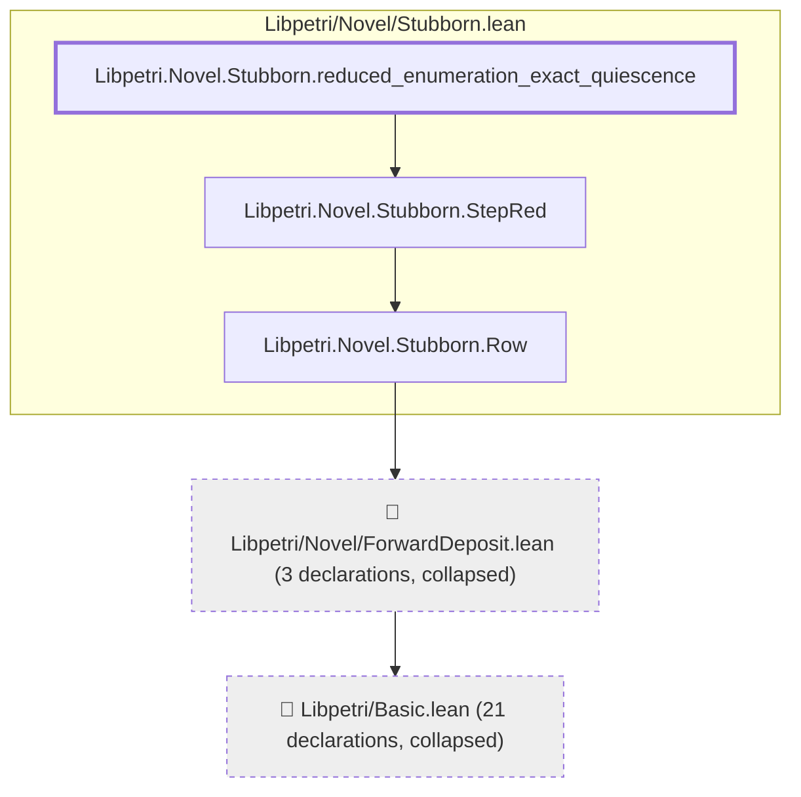
```mermaid
flowchart TD
  subgraph g0["Libpetri/Novel/Stubborn.lean"]
    n2064["Libpetri.Novel.Stubborn.Row"]
    n2065["Libpetri.Novel.Stubborn.StepRed"]
    n2120["Libpetri.Novel.Stubborn.reduced_enumeration_exact_quiescence"]
  end
  c0["📁 Libpetri/Basic.lean (21 declarations, collapsed)"]
  c26["📁 Libpetri/Novel/ForwardDeposit.lean (3 declarations, collapsed)"]
  c26 --> c0
  n2064 --> c26
  n2065 --> n2064
  n2120 --> n2065
  classDef root stroke-width:3px
  classDef locked fill:#fff3cd,stroke:#b8860b
  classDef collapsed fill:#eeeeee,stroke-dasharray:4 4
  class n2120 root
  class c0,c26 collapsed
```

#### `Libpetri.Novel.Stubborn.reduced_enumeration_exact_quiescence` → `Libpetri.Novel.Stubborn.StubbornFamily`

> Rule: this theorem's tree has 106 nodes, still 66 with other files collapsed, so it is split by direct dependency; this part has 5 nodes, other files collapsed.

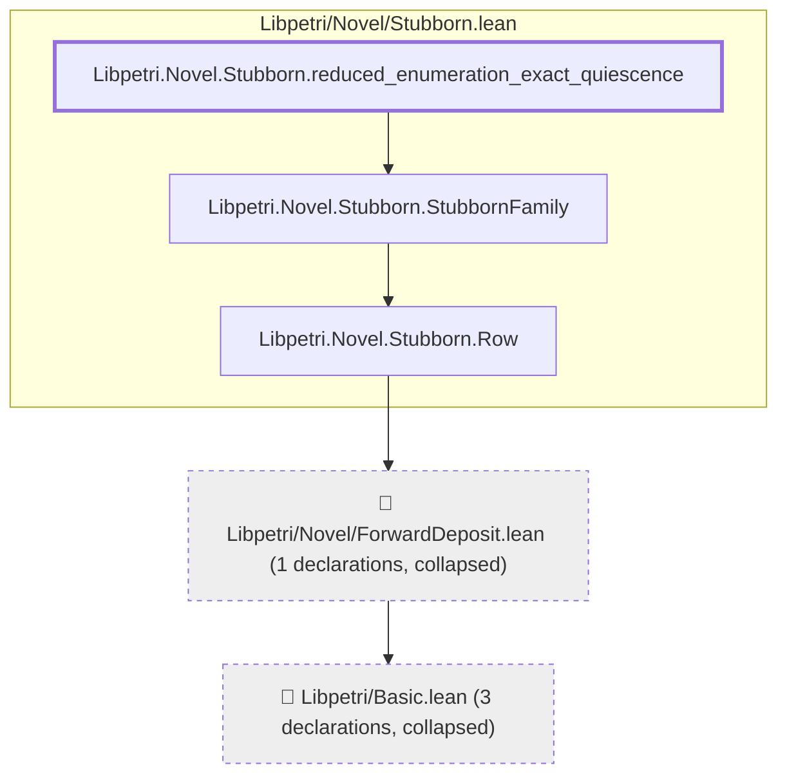
```mermaid
flowchart TD
  subgraph g0["Libpetri/Novel/Stubborn.lean"]
    n2064["Libpetri.Novel.Stubborn.Row"]
    n2066["Libpetri.Novel.Stubborn.StubbornFamily"]
    n2120["Libpetri.Novel.Stubborn.reduced_enumeration_exact_quiescence"]
  end
  c0["📁 Libpetri/Basic.lean (3 declarations, collapsed)"]
  c26["📁 Libpetri/Novel/ForwardDeposit.lean (1 declarations, collapsed)"]
  c26 --> c0
  n2064 --> c26
  n2066 --> n2064
  n2120 --> n2066
  classDef root stroke-width:3px
  classDef locked fill:#fff3cd,stroke:#b8860b
  classDef collapsed fill:#eeeeee,stroke-dasharray:4 4
  class n2120 root
  class c0,c26 collapsed
```

#### `Libpetri.Novel.Stubborn.reduced_enumeration_exact_quiescence` → `Libpetri.Novel.Stubborn.reach_succReduced_iff`

> Rule: this theorem's tree has 106 nodes, still 66 with other files collapsed, so it is split by direct dependency; this part has 9 nodes, other files collapsed.

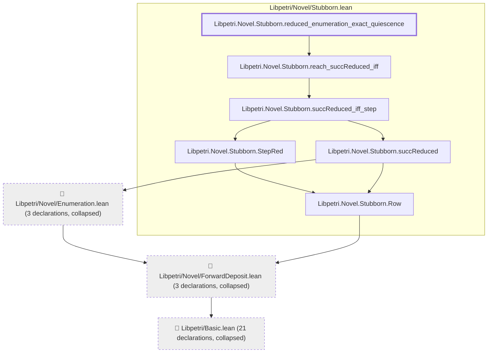
```mermaid
flowchart TD
  subgraph g0["Libpetri/Novel/Stubborn.lean"]
    n2064["Libpetri.Novel.Stubborn.Row"]
    n2065["Libpetri.Novel.Stubborn.StepRed"]
    n2117["Libpetri.Novel.Stubborn.reach_succReduced_iff"]
    n2120["Libpetri.Novel.Stubborn.reduced_enumeration_exact_quiescence"]
    n2129["Libpetri.Novel.Stubborn.succReduced"]
    n2130["Libpetri.Novel.Stubborn.succReduced_iff_step"]
  end
  c0["📁 Libpetri/Basic.lean (21 declarations, collapsed)"]
  c15["📁 Libpetri/Novel/Enumeration.lean (3 declarations, collapsed)"]
  c26["📁 Libpetri/Novel/ForwardDeposit.lean (3 declarations, collapsed)"]
  c15 --> c26
  c26 --> c0
  n2064 --> c26
  n2065 --> n2064
  n2117 --> n2130
  n2120 --> n2117
  n2129 --> c15
  n2129 --> n2064
  n2130 --> n2065
  n2130 --> n2129
  classDef root stroke-width:3px
  classDef locked fill:#fff3cd,stroke:#b8860b
  classDef collapsed fill:#eeeeee,stroke-dasharray:4 4
  class n2120 root
  class c0,c15,c26 collapsed
```

#### `Libpetri.Novel.Stubborn.reduced_enumeration_exact_quiescence` → `Libpetri.Novel.Stubborn.reduced_build_reach`

> Rule: this theorem's tree has 106 nodes, still 66 with other files collapsed, so it is split by direct dependency; this part has 14 nodes, other files collapsed.

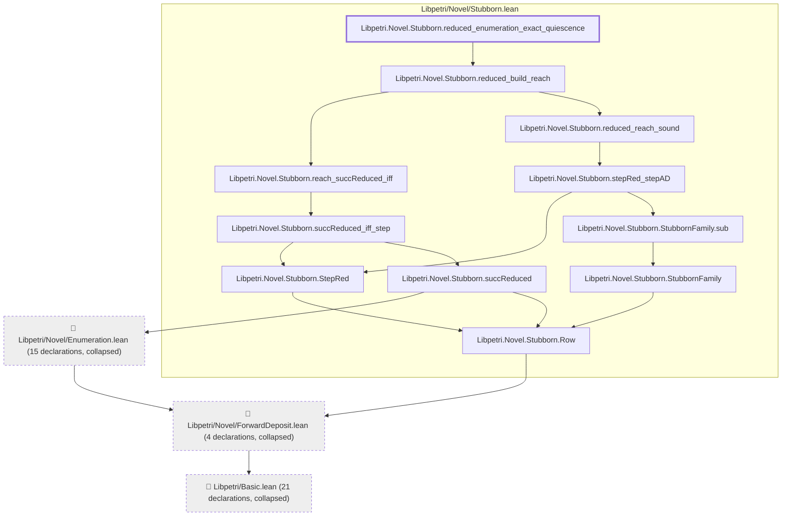
```mermaid
flowchart TD
  subgraph g0["Libpetri/Novel/Stubborn.lean"]
    n2064["Libpetri.Novel.Stubborn.Row"]
    n2065["Libpetri.Novel.Stubborn.StepRed"]
    n2066["Libpetri.Novel.Stubborn.StubbornFamily"]
    n2069["Libpetri.Novel.Stubborn.StubbornFamily.sub"]
    n2117["Libpetri.Novel.Stubborn.reach_succReduced_iff"]
    n2119["Libpetri.Novel.Stubborn.reduced_build_reach"]
    n2120["Libpetri.Novel.Stubborn.reduced_enumeration_exact_quiescence"]
    n2123["Libpetri.Novel.Stubborn.reduced_reach_sound"]
    n2127["Libpetri.Novel.Stubborn.stepRed_stepAD"]
    n2129["Libpetri.Novel.Stubborn.succReduced"]
    n2130["Libpetri.Novel.Stubborn.succReduced_iff_step"]
  end
  c0["📁 Libpetri/Basic.lean (21 declarations, collapsed)"]
  c15["📁 Libpetri/Novel/Enumeration.lean (15 declarations, collapsed)"]
  c26["📁 Libpetri/Novel/ForwardDeposit.lean (4 declarations, collapsed)"]
  c15 --> c26
  c26 --> c0
  n2064 --> c26
  n2065 --> n2064
  n2066 --> n2064
  n2069 --> n2066
  n2117 --> n2130
  n2119 --> n2117
  n2119 --> n2123
  n2120 --> n2119
  n2123 --> n2127
  n2127 --> n2065
  n2127 --> n2069
  n2129 --> c15
  n2129 --> n2064
  n2130 --> n2065
  n2130 --> n2129
  classDef root stroke-width:3px
  classDef locked fill:#fff3cd,stroke:#b8860b
  classDef collapsed fill:#eeeeee,stroke-dasharray:4 4
  class n2120 root
  class c0,c15,c26 collapsed
```

#### `Libpetri.Novel.Stubborn.reduced_enumeration_exact_quiescence` → `Libpetri.Novel.Stubborn.stubborn_preserves_dead`

> Rule: this theorem's tree has 106 nodes, still 66 with other files collapsed, so it is split by direct dependency; this part has 57 nodes, other files collapsed.

```mermaid
flowchart TD
  subgraph g0["Libpetri/Novel/Stubborn.lean"]
    n2047["Libpetri.Novel.Stubborn.Dead"]
    n2048["Libpetri.Novel.Stubborn.Dependent"]
    n2049["Libpetri.Novel.Stubborn.IsStubborn"]
    n2050["Libpetri.Novel.Stubborn.IsStubborn.d1"]
    n2051["Libpetri.Novel.Stubborn.IsStubborn.d2"]
    n2052["Libpetri.Novel.Stubborn.IsStubborn.key"]
    n2054["Libpetri.Novel.Stubborn.PathAD"]
    n2055["Libpetri.Novel.Stubborn.PathAD.append"]
    n2056["Libpetri.Novel.Stubborn.PathAD.below.cons"]
    n2057["Libpetri.Novel.Stubborn.PathAD.below.nil"]
    n2058["Libpetri.Novel.Stubborn.PathAD.cons"]
    n2059["Libpetri.Novel.Stubborn.PathAD.cons_inv"]
    n2060["Libpetri.Novel.Stubborn.PathAD.mem"]
    n2061["Libpetri.Novel.Stubborn.PathAD.nil"]
    n2063["Libpetri.Novel.Stubborn.PathAD.split"]
    n2064["Libpetri.Novel.Stubborn.Row"]
    n2065["Libpetri.Novel.Stubborn.StepRed"]
    n2066["Libpetri.Novel.Stubborn.StubbornFamily"]
    n2068["Libpetri.Novel.Stubborn.StubbornFamily.stubborn"]
    n2069["Libpetri.Novel.Stubborn.StubbornFamily.sub"]
    n2070["Libpetri.Novel.Stubborn.Witness"]
    n2071["Libpetri.Novel.Stubborn.Witness.disabled"]
    n2072["Libpetri.Novel.Stubborn.Witness.step"]
    n2073["Libpetri.Novel.Stubborn.all_congr_mem"]
    n2083["Libpetri.Novel.Stubborn.commute_to_front"]
    n2084["Libpetri.Novel.Stubborn.decreases"]
    n2085["Libpetri.Novel.Stubborn.dependent"]
    n2086["Libpetri.Novel.Stubborn.dependent_iff"]
    n2087["Libpetri.Novel.Stubborn.dependent_symm"]
    n2088["Libpetri.Novel.Stubborn.enabled_congr"]
    n2089["Libpetri.Novel.Stubborn.fire_additive"]
    n2090["Libpetri.Novel.Stubborn.fire_congr"]
    n2091["Libpetri.Novel.Stubborn.fire_unwritten"]
    n2094["Libpetri.Novel.Stubborn.first_split"]
    n2096["Libpetri.Novel.Stubborn.inPlaces"]
    n2097["Libpetri.Novel.Stubborn.increases"]
    n2098["Libpetri.Novel.Stubborn.indep_diamond"]
    n2099["Libpetri.Novel.Stubborn.indep_overwrites_writes"]
    n2100["Libpetri.Novel.Stubborn.indep_path_commute"]
    n2101["Libpetri.Novel.Stubborn.indep_path_preserves_enabled"]
    n2102["Libpetri.Novel.Stubborn.indep_preserves_enabled"]
    n2103["Libpetri.Novel.Stubborn.indep_writes_tests"]
    n2106["Libpetri.Novel.Stubborn.meets"]
    n2107["Libpetri.Novel.Stubborn.meets_iff"]
    n2109["Libpetri.Novel.Stubborn.mem_overwrites_of_reset"]
    n2111["Libpetri.Novel.Stubborn.mem_tests_of_in"]
    n2113["Libpetri.Novel.Stubborn.outside_cannot_disable"]
    n2114["Libpetri.Novel.Stubborn.outside_cannot_enable"]
    n2115["Libpetri.Novel.Stubborn.overwrites"]
    n2116["Libpetri.Novel.Stubborn.reachAD_path"]
    n2120["Libpetri.Novel.Stubborn.reduced_enumeration_exact_quiescence"]
    n2126["Libpetri.Novel.Stubborn.specAt_none"]
    n2128["Libpetri.Novel.Stubborn.stubborn_preserves_dead"]
    n2132["Libpetri.Novel.Stubborn.tests"]
    n2133["Libpetri.Novel.Stubborn.writes"]
  end
  c0["📁 Libpetri/Basic.lean (21 declarations, collapsed)"]
  c26["📁 Libpetri/Novel/ForwardDeposit.lean (4 declarations, collapsed)"]
  c26 --> c0
  n2047 --> n2064
  n2048 --> n2085
  n2049 --> n2064
  n2050 --> n2048
  n2050 --> n2049
  n2051 --> n2049
  n2051 --> n2070
  n2052 --> n2049
  n2054 --> n2064
  n2055 --> n2056
  n2055 --> n2057
  n2056 --> n2058
  n2057 --> n2061
  n2058 --> n2054
  n2059 --> n2058
  n2059 --> n2061
  n2060 --> n2058
  n2060 --> n2061
  n2061 --> n2054
  n2063 --> n2058
  n2063 --> n2061
  n2064 --> c26
  n2065 --> n2064
  n2066 --> n2064
  n2068 --> n2049
  n2068 --> n2066
  n2069 --> n2066
  n2070 --> n2084
  n2070 --> n2097
  n2071 --> n2070
  n2072 --> n2070
  n2072 --> n2089
  n2083 --> n2050
  n2083 --> n2060
  n2083 --> n2100
  n2083 --> n2114
  n2084 --> n2064
  n2084 --> n2096
  n2085 --> n2106
  n2085 --> n2115
  n2085 --> n2132
  n2085 --> n2133
  n2086 --> n2048
  n2086 --> n2107
  n2087 --> n2086
  n2088 --> n2073
  n2088 --> n2132
  n2089 --> n2064
  n2089 --> n2126
  n2090 --> c26
  n2091 --> n2126
  n2091 --> n2133
  n2096 --> c0
  n2097 --> n2064
  n2098 --> n2089
  n2098 --> n2090
  n2098 --> n2099
  n2098 --> n2102
  n2098 --> n2109
  n2098 --> n2111
  n2099 --> n2086
  n2100 --> n2056
  n2100 --> n2057
  n2100 --> n2098
  n2101 --> n2056
  n2101 --> n2057
  n2101 --> n2102
  n2102 --> n2087
  n2102 --> n2088
  n2102 --> n2091
  n2102 --> n2103
  n2103 --> n2086
  n2106 --> c0
  n2107 --> n2106
  n2109 --> n2115
  n2111 --> n2132
  n2113 --> n2050
  n2113 --> n2101
  n2114 --> n2051
  n2114 --> n2058
  n2114 --> n2061
  n2114 --> n2071
  n2114 --> n2072
  n2115 --> n2064
  n2115 --> n2096
  n2116 --> n2058
  n2116 --> n2061
  n2120 --> n2128
  n2126 --> n2096
  n2128 --> n2047
  n2128 --> n2052
  n2128 --> n2055
  n2128 --> n2059
  n2128 --> n2063
  n2128 --> n2065
  n2128 --> n2068
  n2128 --> n2069
  n2128 --> n2083
  n2128 --> n2094
  n2128 --> n2113
  n2128 --> n2116
  n2132 --> n2064
  n2132 --> n2096
  n2133 --> n2064
  n2133 --> n2096
  classDef root stroke-width:3px
  classDef locked fill:#fff3cd,stroke:#b8860b
  classDef collapsed fill:#eeeeee,stroke-dasharray:4 4
  class n2120 root
  class c0,c26 collapsed
```

#### `Libpetri.Novel.Stubborn.reduced_enumeration_exact_quiescence` → `Libpetri.Novel.Stubborn.succReduced`

> Rule: this theorem's tree has 106 nodes, still 66 with other files collapsed, so it is split by direct dependency; this part has 6 nodes, other files collapsed.

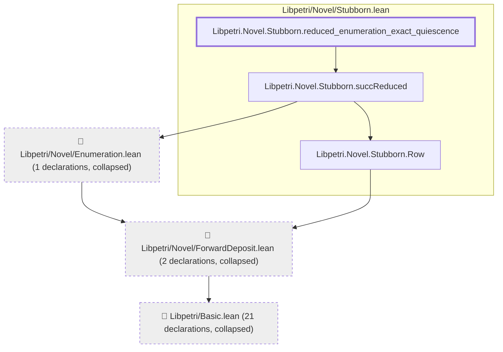
```mermaid
flowchart TD
  subgraph g0["Libpetri/Novel/Stubborn.lean"]
    n2064["Libpetri.Novel.Stubborn.Row"]
    n2120["Libpetri.Novel.Stubborn.reduced_enumeration_exact_quiescence"]
    n2129["Libpetri.Novel.Stubborn.succReduced"]
  end
  c0["📁 Libpetri/Basic.lean (21 declarations, collapsed)"]
  c15["📁 Libpetri/Novel/Enumeration.lean (1 declarations, collapsed)"]
  c26["📁 Libpetri/Novel/ForwardDeposit.lean (2 declarations, collapsed)"]
  c15 --> c26
  c26 --> c0
  n2064 --> c26
  n2120 --> n2129
  n2129 --> c15
  n2129 --> n2064
  classDef root stroke-width:3px
  classDef locked fill:#fff3cd,stroke:#b8860b
  classDef collapsed fill:#eeeeee,stroke-dasharray:4 4
  class n2120 root
  class c0,c15,c26 collapsed
```

#### `Libpetri.Novel.Stubborn.reduced_enumeration_exact_quiescence` → `Libpetri.Novel.Stubborn.succReduced_nil_iff_dead`

> Rule: this theorem's tree has 106 nodes, still 66 with other files collapsed, so it is split by direct dependency; this part has 16 nodes, other files collapsed.

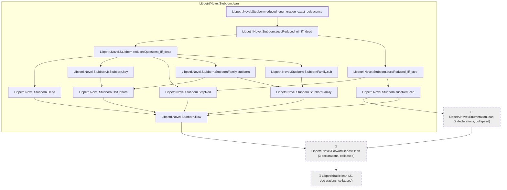
```mermaid
flowchart TD
  subgraph g0["Libpetri/Novel/Stubborn.lean"]
    n2047["Libpetri.Novel.Stubborn.Dead"]
    n2049["Libpetri.Novel.Stubborn.IsStubborn"]
    n2052["Libpetri.Novel.Stubborn.IsStubborn.key"]
    n2064["Libpetri.Novel.Stubborn.Row"]
    n2065["Libpetri.Novel.Stubborn.StepRed"]
    n2066["Libpetri.Novel.Stubborn.StubbornFamily"]
    n2068["Libpetri.Novel.Stubborn.StubbornFamily.stubborn"]
    n2069["Libpetri.Novel.Stubborn.StubbornFamily.sub"]
    n2118["Libpetri.Novel.Stubborn.reducedQuiescent_iff_dead"]
    n2120["Libpetri.Novel.Stubborn.reduced_enumeration_exact_quiescence"]
    n2129["Libpetri.Novel.Stubborn.succReduced"]
    n2130["Libpetri.Novel.Stubborn.succReduced_iff_step"]
    n2131["Libpetri.Novel.Stubborn.succReduced_nil_iff_dead"]
  end
  c0["📁 Libpetri/Basic.lean (21 declarations, collapsed)"]
  c15["📁 Libpetri/Novel/Enumeration.lean (2 declarations, collapsed)"]
  c26["📁 Libpetri/Novel/ForwardDeposit.lean (3 declarations, collapsed)"]
  c15 --> c26
  c26 --> c0
  n2047 --> n2064
  n2049 --> n2064
  n2052 --> n2049
  n2064 --> c26
  n2065 --> n2064
  n2066 --> n2064
  n2068 --> n2049
  n2068 --> n2066
  n2069 --> n2066
  n2118 --> n2047
  n2118 --> n2052
  n2118 --> n2065
  n2118 --> n2068
  n2118 --> n2069
  n2120 --> n2131
  n2129 --> c15
  n2129 --> n2064
  n2130 --> n2065
  n2130 --> n2129
  n2131 --> n2118
  n2131 --> n2130
  classDef root stroke-width:3px
  classDef locked fill:#fff3cd,stroke:#b8860b
  classDef collapsed fill:#eeeeee,stroke-dasharray:4 4
  class n2120 root
  class c0,c15,c26 collapsed
```

Shared leaves of `Libpetri.Novel.Stubborn.reduced_enumeration_exact_quiescence` (direct dependencies too small for a diagram of their own, fewer than 3 nodes):

- `Libpetri.AMarking` (`Libpetri/Basic.lean`)
- `Libpetri.Novel.Enumeration.Reach` (`Libpetri/Novel/Enumeration.lean`)
- `Libpetri.Novel.Enumeration.build` (`Libpetri/Novel/Enumeration.lean`)
- `Libpetri.Novel.Enumeration.proven` (`Libpetri/Novel/Enumeration.lean`)
- `Libpetri.Novel.Enumeration.run_complete_iff_reach` (`Libpetri/Novel/Enumeration.lean`)

### `Libpetri.Novel.Stubborn.stubborn_preserves_dead`

> Rule: this theorem's tree has 79 nodes (limit 60); every file other than its own is collapsed into one node, leaving 56.

```mermaid
flowchart TD
  subgraph g0["Libpetri/Novel/Stubborn.lean"]
    n2047["Libpetri.Novel.Stubborn.Dead"]
    n2048["Libpetri.Novel.Stubborn.Dependent"]
    n2049["Libpetri.Novel.Stubborn.IsStubborn"]
    n2050["Libpetri.Novel.Stubborn.IsStubborn.d1"]
    n2051["Libpetri.Novel.Stubborn.IsStubborn.d2"]
    n2052["Libpetri.Novel.Stubborn.IsStubborn.key"]
    n2054["Libpetri.Novel.Stubborn.PathAD"]
    n2055["Libpetri.Novel.Stubborn.PathAD.append"]
    n2056["Libpetri.Novel.Stubborn.PathAD.below.cons"]
    n2057["Libpetri.Novel.Stubborn.PathAD.below.nil"]
    n2058["Libpetri.Novel.Stubborn.PathAD.cons"]
    n2059["Libpetri.Novel.Stubborn.PathAD.cons_inv"]
    n2060["Libpetri.Novel.Stubborn.PathAD.mem"]
    n2061["Libpetri.Novel.Stubborn.PathAD.nil"]
    n2063["Libpetri.Novel.Stubborn.PathAD.split"]
    n2064["Libpetri.Novel.Stubborn.Row"]
    n2065["Libpetri.Novel.Stubborn.StepRed"]
    n2066["Libpetri.Novel.Stubborn.StubbornFamily"]
    n2068["Libpetri.Novel.Stubborn.StubbornFamily.stubborn"]
    n2069["Libpetri.Novel.Stubborn.StubbornFamily.sub"]
    n2070["Libpetri.Novel.Stubborn.Witness"]
    n2071["Libpetri.Novel.Stubborn.Witness.disabled"]
    n2072["Libpetri.Novel.Stubborn.Witness.step"]
    n2073["Libpetri.Novel.Stubborn.all_congr_mem"]
    n2083["Libpetri.Novel.Stubborn.commute_to_front"]
    n2084["Libpetri.Novel.Stubborn.decreases"]
    n2085["Libpetri.Novel.Stubborn.dependent"]
    n2086["Libpetri.Novel.Stubborn.dependent_iff"]
    n2087["Libpetri.Novel.Stubborn.dependent_symm"]
    n2088["Libpetri.Novel.Stubborn.enabled_congr"]
    n2089["Libpetri.Novel.Stubborn.fire_additive"]
    n2090["Libpetri.Novel.Stubborn.fire_congr"]
    n2091["Libpetri.Novel.Stubborn.fire_unwritten"]
    n2094["Libpetri.Novel.Stubborn.first_split"]
    n2096["Libpetri.Novel.Stubborn.inPlaces"]
    n2097["Libpetri.Novel.Stubborn.increases"]
    n2098["Libpetri.Novel.Stubborn.indep_diamond"]
    n2099["Libpetri.Novel.Stubborn.indep_overwrites_writes"]
    n2100["Libpetri.Novel.Stubborn.indep_path_commute"]
    n2101["Libpetri.Novel.Stubborn.indep_path_preserves_enabled"]
    n2102["Libpetri.Novel.Stubborn.indep_preserves_enabled"]
    n2103["Libpetri.Novel.Stubborn.indep_writes_tests"]
    n2106["Libpetri.Novel.Stubborn.meets"]
    n2107["Libpetri.Novel.Stubborn.meets_iff"]
    n2109["Libpetri.Novel.Stubborn.mem_overwrites_of_reset"]
    n2111["Libpetri.Novel.Stubborn.mem_tests_of_in"]
    n2113["Libpetri.Novel.Stubborn.outside_cannot_disable"]
    n2114["Libpetri.Novel.Stubborn.outside_cannot_enable"]
    n2115["Libpetri.Novel.Stubborn.overwrites"]
    n2116["Libpetri.Novel.Stubborn.reachAD_path"]
    n2126["Libpetri.Novel.Stubborn.specAt_none"]
    n2128["Libpetri.Novel.Stubborn.stubborn_preserves_dead"]
    n2132["Libpetri.Novel.Stubborn.tests"]
    n2133["Libpetri.Novel.Stubborn.writes"]
  end
  c0["📁 Libpetri/Basic.lean (21 declarations, collapsed)"]
  c26["📁 Libpetri/Novel/ForwardDeposit.lean (4 declarations, collapsed)"]
  c26 --> c0
  n2047 --> n2064
  n2048 --> n2085
  n2049 --> n2064
  n2050 --> n2048
  n2050 --> n2049
  n2051 --> n2049
  n2051 --> n2070
  n2052 --> n2049
  n2054 --> n2064
  n2055 --> n2056
  n2055 --> n2057
  n2056 --> n2058
  n2057 --> n2061
  n2058 --> n2054
  n2059 --> n2058
  n2059 --> n2061
  n2060 --> n2058
  n2060 --> n2061
  n2061 --> n2054
  n2063 --> n2058
  n2063 --> n2061
  n2064 --> c26
  n2065 --> n2064
  n2066 --> n2064
  n2068 --> n2049
  n2068 --> n2066
  n2069 --> n2066
  n2070 --> n2084
  n2070 --> n2097
  n2071 --> n2070
  n2072 --> n2070
  n2072 --> n2089
  n2083 --> n2050
  n2083 --> n2060
  n2083 --> n2100
  n2083 --> n2114
  n2084 --> n2064
  n2084 --> n2096
  n2085 --> n2106
  n2085 --> n2115
  n2085 --> n2132
  n2085 --> n2133
  n2086 --> n2048
  n2086 --> n2107
  n2087 --> n2086
  n2088 --> n2073
  n2088 --> n2132
  n2089 --> n2064
  n2089 --> n2126
  n2090 --> c26
  n2091 --> n2126
  n2091 --> n2133
  n2096 --> c0
  n2097 --> n2064
  n2098 --> n2089
  n2098 --> n2090
  n2098 --> n2099
  n2098 --> n2102
  n2098 --> n2109
  n2098 --> n2111
  n2099 --> n2086
  n2100 --> n2056
  n2100 --> n2057
  n2100 --> n2098
  n2101 --> n2056
  n2101 --> n2057
  n2101 --> n2102
  n2102 --> n2087
  n2102 --> n2088
  n2102 --> n2091
  n2102 --> n2103
  n2103 --> n2086
  n2106 --> c0
  n2107 --> n2106
  n2109 --> n2115
  n2111 --> n2132
  n2113 --> n2050
  n2113 --> n2101
  n2114 --> n2051
  n2114 --> n2058
  n2114 --> n2061
  n2114 --> n2071
  n2114 --> n2072
  n2115 --> n2064
  n2115 --> n2096
  n2116 --> n2058
  n2116 --> n2061
  n2126 --> n2096
  n2128 --> n2047
  n2128 --> n2052
  n2128 --> n2055
  n2128 --> n2059
  n2128 --> n2063
  n2128 --> n2065
  n2128 --> n2068
  n2128 --> n2069
  n2128 --> n2083
  n2128 --> n2094
  n2128 --> n2113
  n2128 --> n2116
  n2132 --> n2064
  n2132 --> n2096
  n2133 --> n2064
  n2133 --> n2096
  classDef root stroke-width:3px
  classDef locked fill:#fff3cd,stroke:#b8860b
  classDef collapsed fill:#eeeeee,stroke-dasharray:4 4
  class n2128 root
  class c0,c26 collapsed
```

Axioms used:

- `Libpetri.Novel.Stubborn.closure_enumeration_exact_quiescence`: `Classical.choice`, `Quot.sound`, `propext`
- `Libpetri.Novel.Stubborn.reduced_enumeration_exact_quiescence`: `Classical.choice`, `Quot.sound`, `propext`
- `Libpetri.Novel.Stubborn.stubborn_preserves_dead`: `Classical.choice`, `Quot.sound`, `propext`
