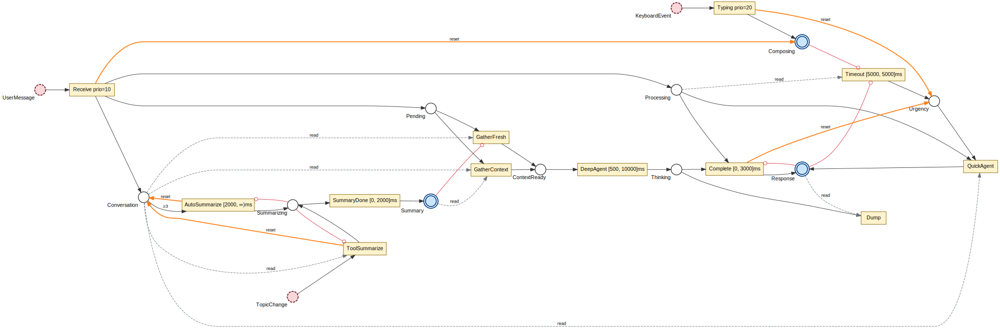

# libpetri — Coloured Time Petri Net Engine

A high-performance [Coloured Time Petri Net](https://en.wikipedia.org/wiki/Petri_net) engine with formal verification support.

## Example: LLM Agent Pipeline

An agent orchestration net with coloured tokens (`String` messages + `()` control
signals), environment places for keyboard events, and an urgency control mechanism:

```rust
use libpetri::*;

// Coloured places — String messages, () control signals
let user_input    = EnvironmentPlace::<String>::new("UserInput");  // keyboard events
let pending       = Place::<String>::new("Pending");               // message awaiting agent
let conversation  = Place::<String>::new("Conversation");          // history (accumulates)
let urgency       = Place::<()>::new("Urgency");                   // urgency control signal
let thinking      = Place::<String>::new("Thinking");              // deep analysis in progress
let response      = Place::<String>::new("Response");              // agent output
let summarize_cmd = EnvironmentPlace::<()>::new("SummarizeCmd");   // "summarize" trigger
let summary       = Place::<String>::new("Summary");               // conversation summary

// Receive: keyboard input → AND-fork into processing queue + conversation history
let receive = Transition::builder("Receive")
    .input(one(&user_input))
    .output(and(vec![out_place(&pending), out_place(&conversation)]))
    .timing(immediate())
    .priority(10)
    .action(fork())
    .build();

// DeepAgent: slow, thorough analysis — blocked when urgent
let deep_agent = Transition::builder("DeepAgent")
    .input(one(&pending))
    .read(read(&conversation))         // read arc: context without consuming
    .inhibitor(inhibitor(&urgency))    // inhibitor: blocked when urgent
    .output(out_place(&thinking))
    .timing(window(500, 5000))
    .action(async_action(|mut ctx| async move {
        let msg: std::sync::Arc<String> = ctx.input("Pending")?;
        // ... deep analysis with full conversation context
        ctx.output("Thinking", format!("{msg} [analyzed]"))?;
        Ok(ctx)
    }))
    .build();

// QuickAgent: fast reply — fires only when urgency present (consumes it)
let quick_agent = Transition::builder("QuickAgent")
    .input(one(&pending))
    .input(one(&urgency))              // consumes urgency signal
    .read(read(&conversation))
    .output(out_place(&response))
    .timing(immediate())
    .action(fork())
    .build();

// Complete: deep analysis finishes — clears any stale urgency via reset arc
let complete = Transition::builder("Complete")
    .input(one(&thinking))
    .reset(reset(&urgency))            // reset arc: clears all urgency tokens
    .output(out_place(&response))
    .timing(deadline(3000))
    .action(fork())
    .build();

// Summarize: external "summarize" command — reads full conversation context
let summarize = Transition::builder("Summarize")
    .input(one(&summarize_cmd))
    .read(read(&conversation))
    .output(out_place(&summary))
    .timing(delayed(1000))
    .action(fork())
    .build();

// Watchdog: produces urgency after 10s inactivity — self-inhibits (fires at most once)
let watchdog = Transition::builder("Watchdog")
    .read(read(&conversation))
    .inhibitor(inhibitor(&urgency))
    .output(out_place(&urgency))
    .timing(exact(10000))
    .action(fork())
    .build();

let net = PetriNet::builder("AgentPipeline")
    .transition(receive)
    .transition(deep_agent)
    .transition(quick_agent)
    .transition(complete)
    .transition(summarize)
    .transition(watchdog)
    .build();
```

<p align="center">
  
</p>

All five arc types (input, output, **read**, **inhibitor**, **reset**), all five timing
modes (immediate, window, deadline, delayed, exact), environment places, priority
scheduling, AND-fork, and coloured tokens.

## Crate Structure

| Crate | Description |
|-------|-------------|
| **libpetri-core** | Places, tokens, transitions, timing, arc types, actions |
| **libpetri-event** | Event store for recording execution events |
| **libpetri-runtime** | Bitmap-based executor (sync + async via `tokio` feature) |
| **libpetri-export** | DOT/Graphviz export pipeline |
| **libpetri-verification** | Formal verification (P-invariants, state class graphs, SMT) |
| **libpetri-debug** | WebSocket debug protocol for live net inspection |
| **libpetri-docgen** | Build-script helper for generating Petri net SVGs in rustdoc |

## Executors

- **BitmapNetExecutor** — General-purpose, bitmap-based enablement checks
- **PrecompiledNetExecutor** — High-performance alternative with ring buffers, opcode dispatch, and two-level summary bitmaps (~3.8x faster on large nets)

## Feature Flags

| Feature | Effect |
|---------|--------|
| `tokio` | Enables `run_async()` on both executors |
| `z3` | Enables SMT-based IC3/PDR model checking |
| `debug` | Enables the WebSocket debug protocol module |

## License

Apache-2.0
